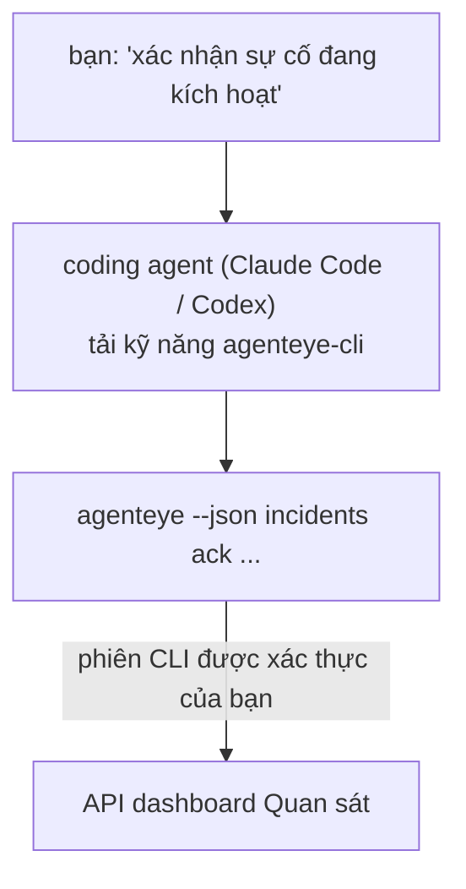

---
---
title: "Kỹ năng CLI Agent Quan sát Failproof AI"
description: "Hỏi coding agent của bạn \"có gì bị hỏng hôm nay không?\" và để nó trả lời từ dữ liệu Quan sát Failproof AI trực tiếp, không cần nhớ các lệnh."
---


Hỏi coding agent của bạn *"có gì bị hỏng hôm nay không?"* và để nó trả lời từ dữ liệu Quan sát Failproof AI trực tiếp, không cần nhớ các lệnh. **Kỹ năng CLI Quan sát Failproof AI** (`agenteye-cli`) là một *Agent Skill*: một thư mục nhỏ chứa các hướng dẫn mà coding agent như Claude Code hoặc Codex có thể tải theo yêu cầu. Nó dạy agent cách vận hành deployment Quan sát của bạn thông qua [`agenteye` CLI](/vi/agenteye/cli) từ các yêu cầu bằng tiếng Anh như *"cấp cho CI một khoá chỉ có thể push event"* hoặc *"xác nhận sự cố đang kích hoạt và gán cho tôi."*

Đây **không** phải là một dịch vụ hay một file nhị phân riêng biệt; không có gì để triển khai. Nó chạy trên CLI mà bạn đã cài đặt: agent sẽ gọi `agenteye --json …`, phân tích cú pháp JSON sạch sẽ, và trả lời bạn bằng văn bản. Mọi thứ nó có thể làm, bạn cũng có thể làm bằng cách gõ cùng các lệnh đó.

---

## Nó liên quan như thế nào đến các giao diện Quan sát Failproof AI khác

Quan sát Failproof AI cung cấp cho bạn bốn cách để truy cập cùng một dữ liệu và điều khiển. Chúng bổ sung cho nhau:

| Giao diện | Nó là gì | Chạy ở đâu | Sử dụng khi |
|---|---|---|---|
| **[CLI](/vi/agenteye/cli)** | Tham chiếu lệnh/cờ cho `agenteye` | Terminal của bạn | Bạn muốn chạy hoặc tạo kịch bản cho một lệnh cụ thể |
| **[CLI recipes](/vi/agenteye/cli-recipes)** | Các mẫu `jq`/pipeline sao chép dán | Terminal / script của bạn | Bạn đang tích hợp CLI vào automation |
| **CLI skill** (tài liệu này) | Một cửa ngôn ngữ tự nhiên trên CLI | Coding agent của bạn, trên trạm làm việc | Bạn muốn *chỉ cần hỏi* và để agent chọn lệnh |
| **[Evaluator skill](/vi/agenteye/evaluator-skill)** | Một kỹ năng anh em thiết kế và xây dựng dịch vụ chấm điểm của bạn | Coding agent của bạn, trên trạm làm việc | Bạn muốn *tạo* điểm đánh giá thay vì đọc chúng |
| **[Python SDK skill](/vi/agenteye/python-sdk-skill)** | Một kỹ năng anh em mà cung cấp cho agent của bạn khả năng phát ra telemetry | Coding agent của bạn, trên trạm làm việc | Bạn muốn agent của bạn *tạo* các sự kiện mà kỹ năng này đọc |
| **[In-dashboard AI assistant](/vi/agenteye/assistant)** | Một trò chuyện được nhúng trong dashboard | Phía máy chủ (trong dashboard) | Bạn muốn Q&A trong dashboard trên dữ liệu của bạn |

Kỹ năng này không có quyền riêng của nó; nó chỉ biến những lời nói của bạn thành các lệnh CLI chạy dưới danh tính của bạn:



### so với in-dashboard AI assistant: một sự phân biệt quan trọng

Đây là hai công cụ khác nhau với bán kính ảnh hưởng rất khác nhau:

- **In-dashboard AI assistant** ([AI assistant](/vi/agenteye/assistant)) là một trò chuyện được nhúng trong dashboard, được hỗ trợ bởi dịch vụ agent. Nó **chỉ đọc cộng với việc sáng tác được phê duyệt**: nó có thể soạn thảo các truy vấn đã lưu và dashboard, nhưng mỗi lần ghi sẽ tạm dừng để chờ lần nhấp phê duyệt rõ ràng của bạn, và nó không bao giờ xoá. Nó được bảo vệ bởi quyền `agent:use` và chỉ thấy dữ liệu cho tổ chức bạn đang xem.
- **CLI skill** chạy trên *trạm làm việc của bạn* bên trong *coding agent của bạn* và điều khiển `agenteye` CLI dưới danh tính **của bạn**. Nó có thể thực hiện **toàn bộ bề mặt của CLI, bao gồm các thay đổi** (tạo/xoay vòng/vô hiệu hoá khóa API, thay đổi cài đặt tổ chức, giải quyết sự cố, xoá truy vấn đã lưu), chỉ giới hạn bởi quyền của đăng nhập CLI của bạn. Hãy coi nó chính xác như bạn sẽ xử lý việc chạy những lệnh đó bằng tay.

---

## Điều kiện tiên quyết

1. **`agenteye` CLI đã cài đặt** và trên `PATH` (xem [CLI](/vi/agenteye/cli) reference: `pipx install agenteye`).
2. **URL dashboard của bạn** đã được đặt (`AGENTEYE_DASHBOARD_URL`, hoặc agent truyền `--base-url`).
3. **Phiên đã đăng nhập**: chạy `agenteye login` trước tiên. Kỹ năng **không thể** hoàn thành đăng nhập mã một lần được gửi qua email cho bạn; nó sẽ bảo bạn chạy `agenteye login` nếu phiên bị mất hoặc hết hạn (mã thoát CLI `4`).

---

## Nơi lấy nó

Kỹ năng này được công bố trong bộ sưu tập kỹ năng công cộng của Failproof AI:

**[github.com/FailproofAI/skills](https://github.com/FailproofAI/skills)** → [`skills/agenteye-cli/`](https://github.com/FailproofAI/skills/tree/main/skills/agenteye-cli)

Không có gì bị khóa — kho lưu trữ là công cộng và kỹ năng không cần bất kỳ thông tin xác thực nào của riêng nó, vì nó chỉ điều khiển **công cộng** `agenteye` CLI với *dashboard* của bạn, sử dụng phiên *bạn* đã đăng nhập. Bạn không cần phải yêu cầu ai cả.

Lưu ý nó được gửi dưới dạng thư mục riêng của nó và **không** nằm bên trong gói `pipx install agenteye`, vì vậy đừng tìm nó ở đó.

## Cài đặt kỹ năng

Con đường nhanh nhất là [`skills`](https://skills.sh) CLI, cái mà tìm nạp thư mục và đặt nó nơi agent của bạn tìm kiếm:

```bash
# Claude Code, dự án này chỉ
npx skills add FailproofAI/skills --skill agenteye-cli -a claude-code

# mỗi dự án (cài đặt vào ~/.claude/skills/)
npx skills add FailproofAI/skills --skill agenteye-cli -a claude-code -g --copy

# Codex thay vào đó
npx skills add FailproofAI/skills --skill agenteye-cli -a codex
```

Sau đó quản lý nó như bất kỳ kỹ năng nào khác:

```bash
npx skills list -a claude-code      # cái gì được cài đặt
npx skills update agenteye-cli      # kéo phiên bản mới nhất
npx skills remove agenteye-cli      # xoá nó
```

Thích cài đặt bằng tay? Một Agent Skill chỉ là một thư mục chứa `SKILL.md` (cộng với các tham chiếu tùy chọn), vì vậy sao chép cũng hoạt động:

- **Claude Code**: đặt thư mục `agenteye-cli/` trong `~/.claude/skills/` (mỗi dự án) hoặc `<your-repo>/.claude/skills/` (chỉ kho lưu trữ đó). Claude Code tự động phát hiện nó — xác minh bằng danh sách `/skills`, hoặc chỉ cần hỏi một câu hỏi phù hợp với mô tả của nó.
- **Codex (OpenAI)**: Codex đọc `SKILL.md` giống nhau. `agents/openai.yaml` đi kèm đặt `allow_implicit_invocation: true`, vì vậy Codex tự động chọn kỹ năng khi tác vụ phù hợp; nếu không, gọi nó rõ ràng dưới dạng `$agenteye-cli`.

---

## Bảo mật: các thay đổi KHÔNG nhắc khi agent chạy CLI

> **Cảnh báo:** Đọc điều này trước khi để phép agent thay đổi.

`agenteye` CLI bình thường hỏi *"bạn có chắc chắn không?"* trước khi thực hiện một hành động phá huỷ. Nó **tự động bỏ qua xác nhận đó bất cứ khi nào nó không được gắn vào terminal (chính xác là cách coding agent chạy nó), và `--json` cũng bỏ qua nó.** Vì vậy lời nhắc an toàn sẽ **không** kích hoạt cho agent.

Kỹ năng được viết để bù đắp: nó được hướng dẫn để nêu ra lệnh chính xác mà nó sẽ chạy và nhận được **OK rõ ràng của bạn trước bất kỳ thay đổi trạng thái nào**. Giữ kỷ luật đó. Khi bạn điều khiển Quan sát Failproof AI thông qua agent, *bạn* là bước xác nhận. Các lệnh thay đổi trạng thái để theo dõi:

- `keys create` / `update` / `disable` / `regenerate`
- `users create` / `update` / `disable` / `enable`
- `settings set`
- `alerts create` / `update` / `delete` / `test`
- các lệnh ghi `incidents`: `ack` / `assign` / `resolve` / `open` / `comment-add` / `comment-delete` / `subscribe` / `unsubscribe`
- `query create` / `update` / `delete`
- `agent rename` / `delete`
- `orgs switch`

Mọi thứ dưới **Observe** (`events`, `sessions`, `evals`, `errors`, `list`, `whoami`, `orgs list/current/perms`) chỉ đọc và không thay đổi gì.

Vì agent hoạt động dưới danh tính **của bạn**, nó chỉ có thể làm những gì mà đăng nhập của bạn được phép làm; quyền được giải quyết **cho mỗi tổ chức** (xem [API keys](/vi/agenteye/api-keys)). Một lệnh mà bạn không có quyền cho nó sẽ trả về mã thoát `5` với quyền chính xác được đặt tên, vì vậy agent có thể bảo bạn chính xác những gì để yêu cầu quản trị viên thay vì thất bại một cách không rõ ràng.

---

## Bạn có thể hỏi nó cái gì

Đây là cách một vòng lặp thực tế trông như thế nào, một đọc, sau đó một thay đổi chờ OK của bạn:

```text
bạn   ▸ Có gì bị hỏng trong ngày qua không?

agent ▸ Chạy: agenteye --json errors --since 24h --aggregate
        3 loại lỗi trong 24 giờ qua. Cái lớn nhất là TimeoutError
        (18 lần, tất cả trên checkout-agent), sau đó RateLimited (5).
        Muốn xem các phiên bị lỗi cho TimeoutError không?

bạn   ▸ Cấp cho CI một khoá chỉ có thể push event.

agent ▸ Điều này tạo một khóa API. Tôi sẽ chạy:
          agenteye keys create ci --add events:add
        OK để tiếp tục?

bạn   ▸ có

agent ▸ Xong. Khóa "ci" được tạo chỉ với events:add.
        Bí mật được hiển thị chỉ một lần, vì vậy lưu trữ nó ngay bây giờ. Tôi không thể in lại nó.
```

Kỹ năng ánh xạ từng ý định bằng tiếng Anh đến lệnh `agenteye` phù hợp, khám phá các giá trị hợp lệ trước tiên (`list <kind>`, `whoami`) vì vậy nó không phải đoán, và nêu ra lệnh chính xác trước bất kỳ thay đổi nào. Thêm nhiều ví dụ:

- *"Có gì bị hỏng / thất bại trong 24 giờ qua không?"* → `errors --since 24h --aggregate`, sau đó phân tích.
- *"Tại sao phiên `run-001` lại thất bại?"* → `events --session-id run-001 --all` + `evals --session-id run-001`.
- *"Chất lượng đang xu hướng như thế nào trong tuần này?"* → `evals --aggregate --since 7d`, sau đó đào sâu vào các bài chạy có điểm thấp.
- *"Cấp cho CI một khoá chỉ có thể push event."* → `keys create ci --add events:add` (nó nêu lệnh, sau đó tạo nó và ghi lại bí mật một lần).
- *"Ai có quyền truy cập? Làm cho Dana chỉ đọc."* → `users list` → `users update dana@… --permission-set read-only` (sau khi xác nhận với bạn).
- *"Xác nhận sự cố đang kích hoạt và gán cho tôi."* → `incidents list --state firing` → `incidents ack <id>` / `incidents assign <id> you@…`.

Để biết các lệnh chính xác, cờ, và hình dạng JSON đằng sau những điều này, xem [CLI](/vi/agenteye/cli) reference và [CLI recipes cho agent](/vi/agenteye/cli-recipes).

---

## Các bước tiếp theo

- **[CLI](/vi/agenteye/cli)**: tham chiếu lệnh và cờ đầy đủ cho `agenteye`.
- **[CLI recipes cho agent](/vi/agenteye/cli-recipes)**: sao chép dán các mẫu `jq` và xử lý mã thoát.
- **[Evaluator agent skill](/vi/agenteye/evaluator-skill)**: kỹ năng anh em, dành cho xây dựng evaluator có điểm mà `agenteye evals` đọc.
- **[Python SDK agent skill](/vi/agenteye/python-sdk-skill)**: kỹ năng anh em, dành cho cung cấp cho agent khả năng phát ra telemetry mà `agenteye` đọc.
- **[AI assistant](/vi/agenteye/assistant)**: trợ lý trong dashboard (không nên nhầm lẫn với kỹ năng terminal này).
- **[API keys](/vi/agenteye/api-keys)**: mô hình quyền cho mỗi tổ chức giới hạn những gì kỹ năng có thể làm.