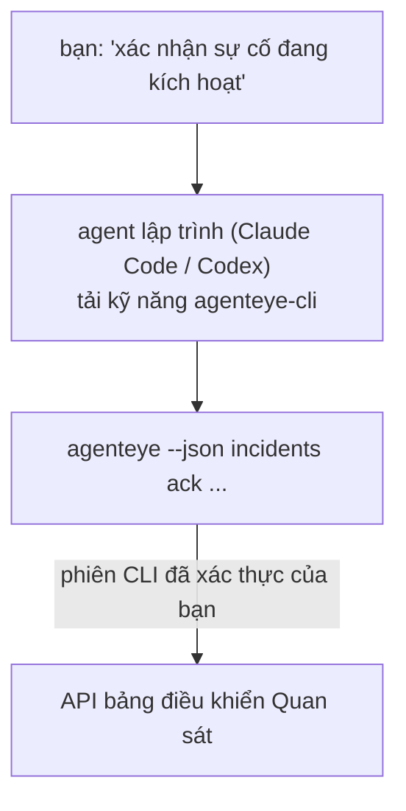

---
---
title: "Kỹ năng CLI Agent Quan sát Failproof AI"
description: "Hỏi agent lập trình của bạn \"có gì bị hỏng hôm nay không?\" và để nó trả lời từ dữ liệu Quan sát Failproof AI trực tiếp của bạn, mà không cần nhớ các lệnh."
---


Hỏi agent lập trình của bạn *"có gì bị hỏng hôm nay không?"* và để nó trả lời từ dữ liệu Quan sát Failproof AI trực tiếp của bạn, mà không cần nhớ các lệnh. **Kỹ năng CLI Quan sát Failproof AI** (`agenteye-cli`) là một *Agent Skill*: một thư mục nhỏ chứa các hướng dẫn mà agent lập trình như Claude Code hoặc Codex có thể tải khi cần. Nó dạy agent cách hoạt động với triển khai Quan sát của bạn thông qua [`agenteye` CLI](/vi/agenteye/cli) từ các yêu cầu bằng tiếng Anh bình thường như *"tạo khóa cho CI chỉ có thể đẩy sự kiện"* hoặc *"xác nhận sự cố đang kích hoạt và gán cho tôi."*

Nó **không phải** là một dịch vụ hoặc một tệp nhị phân riêng biệt; không có gì để triển khai. Nó chạy trên CLI mà bạn đã cài đặt: agent gọi đến `agenteye --json …`, phân tích cú pháp JSON sạch sẽ, và trả lời bạn bằng văn bản. Mọi thứ nó có thể làm, bạn có thể tự làm bằng cách gõ các lệnh tương tự.

---

## Mối quan hệ với các giao diện Quan sát Failproof AI khác

Failproof AI Observability cung cấp cho bạn bốn cách để tiếp cận cùng một dữ liệu và điều khiển. Chúng bổ sung cho nhau:

| Giao diện | Nó là gì | Chạy ở đâu | Sử dụng khi |
|---|---|---|---|
| **[CLI](/vi/agenteye/cli)** | Tham chiếu lệnh/cờ cho `agenteye` | Terminal của bạn | Bạn muốn chạy hoặc viết kịch bản một lệnh cụ thể |
| **[Công thức CLI](/vi/agenteye/cli-recipes)** | Các mẫu `jq`/đường dẫn sao chép dán | Terminal / kịch bản của bạn | Bạn đang kết nối CLI vào tự động hóa |
| **Kỹ năng CLI** (tài liệu này) | Cửa ngôn ngữ tự nhiên trên CLI | Agent lập trình của bạn, trên máy trạm của bạn | Bạn muốn *chỉ cần hỏi* và để agent chọn lệnh |
| **[Kỹ năng Evaluator](/vi/agenteye/evaluator-skill)** | Một kỹ năng anh em thiết kế và xây dựng dịch vụ ghi điểm của bạn | Agent lập trình của bạn, trên máy trạm của bạn | Bạn muốn *tạo* điểm đánh giá thay vì đọc chúng |
| **[Kỹ năng Python SDK](/vi/agenteye/python-sdk-skill)** | Một kỹ năng anh em để agent phát hành telemetry | Agent lập trình của bạn, trên máy trạm của bạn | Bạn muốn agent của bạn *tạo* các sự kiện mà kỹ năng này đọc |
| **[Trợ lý AI trong bảng điều khiển](/vi/agenteye/assistant)** | Một cuộc trò chuyện nhúng trong bảng điều khiển | Phía máy chủ (trong bảng điều khiển) | Bạn muốn Q&A trong bảng điều khiển trên dữ liệu của bạn |

Bản thân kỹ năng không có đặc quyền riêng; nó chỉ chuyển các từ của bạn thành các cuộc gọi CLI chạy dưới tên bạn:



### so với trợ lý AI trong bảng điều khiển: một sự phân biệt quan trọng

Đây là hai công cụ khác nhau với tầm ảnh hưởng rất khác nhau:

- **Trợ lý AI trong bảng điều khiển** ([AI assistant](/vi/agenteye/assistant)) là một cuộc trò chuyện nhúng trong bảng điều khiển, được hỗ trợ bởi dịch vụ agent. Nó **chỉ đọc cộng với tác giả có cấp phép**: nó có thể soạn thảo các truy vấn và bảng điều khiển đã lưu, nhưng mọi thao tác ghi đều tạm dừng để bạn phê duyệt rõ ràng, và nó không bao giờ xóa. Nó được kiểm soát bằng quyền `agent:use` và chỉ khi nào cũng chỉ nhìn thấy dữ liệu cho tổ chức bạn đang xem.
- **Kỹ năng CLI** chạy trên *máy trạm của bạn* bên trong *agent lập trình của bạn* và điều khiển `agenteye` CLI như **bạn**. Nó có thể thực hiện **toàn bộ bề mặt của CLI, bao gồm các thay đổi** (tạo/xoay/vô hiệu hóa khóa API, thay đổi cài đặt tổ chức, giải quyết sự cố, xóa truy vấn đã lưu), giới hạn chỉ bởi các quyền của đăng nhập CLI của bạn. Hãy xử lý nó chính xác như cách bạn sẽ xử lý khi chạy các lệnh đó bằng tay.

---

## Điều kiện tiên quyết

1. **`agenteye` CLI đã cài đặt** và trên `PATH` (xem tham chiếu [CLI](/vi/agenteye/cli): `pipx install agenteye`).
2. **URL bảng điều khiển của bạn** đã được đặt (`AGENTEYE_DASHBOARD_URL`, hoặc agent truyền `--base-url`).
3. **Phiên đăng nhập**: tự chạy `agenteye login` trước. Kỹ năng **không thể** hoàn thành đăng nhập mã một lần được gửi qua email cho bạn; nó sẽ bảo bạn chạy `agenteye login` nếu phiên bị mất hoặc hết hạn (mã thoát CLI `4`).

---

## Nơi lấy nó

Kỹ năng được công bố trong bộ sưu tập kỹ năng công khai của Failproof AI:

**[github.com/FailproofAI/skills](https://github.com/FailproofAI/skills)** → [`skills/agenteye-cli/`](https://github.com/FailproofAI/skills/tree/main/skills/agenteye-cli)

Không có gì bị giới hạn về nó — kho lưu trữ là công khai và kỹ năng không cần bất kỳ thông tin xác thực riêng nào, bởi vì nó chỉ điều khiển CLI `agenteye` **công khai** với bảng điều khiển *của bạn*, sử dụng phiên *mà bạn* đã đăng nhập. Bạn không cần phải yêu cầu ai cấp nó.

Lưu ý rằng nó được gửi dưới dạng thư mục riêng và **không** nằm trong gói `pipx install agenteye`, vì vậy đừng tìm kiếm nó ở đó.

## Cài đặt kỹ năng

Đường dẫn nhanh nhất là CLI [`skills`](https://skills.sh), lấy thư mục và đặt nó nơi agent của bạn tìm kiếm:

```bash
# Claude Code, chỉ dự án này
npx skills add FailproofAI/skills --skill agenteye-cli -a claude-code

# mọi dự án (cài đặt vào ~/.claude/skills/)
npx skills add FailproofAI/skills --skill agenteye-cli -a claude-code -g --copy

# Codex thay vào đó
npx skills add FailproofAI/skills --skill agenteye-cli -a codex
```

Sau đó quản lý nó như bất kỳ kỹ năng nào khác:

```bash
npx skills list -a claude-code      # những gì đã cài đặt
npx skills update agenteye-cli      # kéo phiên bản mới nhất
npx skills remove agenteye-cli      # xóa nó
```

Thích cài đặt bằng tay? Một Agent Skill chỉ là một thư mục chứa `SKILL.md` (cộng với các tham chiếu tùy chọn), vì vậy sao chép nó cũng hoạt động:

- **Claude Code**: đặt thư mục `agenteye-cli/` trong `~/.claude/skills/` (mọi dự án) hoặc `<your-repo>/.claude/skills/` (chỉ dự án đó). Claude Code tự động khám phá nó — xác minh với danh sách `/skills`, hoặc chỉ cần đặt câu hỏi phù hợp với mô tả của nó.
- **Codex (OpenAI)**: Codex đọc `SKILL.md` giống nhau. `agents/openai.yaml` đi kèm đặt `allow_implicit_invocation: true`, vì vậy Codex tự động chọn kỹ năng khi tác vụ phù hợp; nếu không, gọi nó rõ ràng là `$agenteye-cli`.

---

## An toàn: các thay đổi KHÔNG nhắc khi agent chạy CLI

> **Cảnh báo:** Đọc phần này trước khi để agent thực hiện các thay đổi.

CLI `agenteye` thường hỏi *"bạn có chắc chắn không?"* trước một hành động phá hoại. Nó **tự động bỏ qua xác nhận đó bất cứ khi nào nó không được kết nối với thiết bị đầu cuối (đó chính xác là cách agent chạy nó), và `--json` cũng bỏ qua nó.** Vì vậy, lời nhắc bảo vệ sẽ **không** kích hoạt cho agent.

Kỹ năng được viết để bù đắp: nó được hướng dẫn để nêu ra lệnh chính xác mà nó sẽ chạy và nhận **OK rõ ràng từ bạn trước bất kỳ thay đổi trạng thái nào**. Giữ kỷ luật đó. Khi bạn điều khiển Failproof AI Observability thông qua agent, *bạn* là bước xác nhận. Các lệnh thay đổi trạng thái cần xem:

- `keys create` / `update` / `disable` / `regenerate`
- `users create` / `update` / `disable` / `enable`
- `settings set`
- `alerts create` / `update` / `delete` / `test`
- các lệnh ghi của `incidents`: `ack` / `assign` / `resolve` / `open` / `comment-add` / `comment-delete` / `subscribe` / `unsubscribe`
- `query create` / `update` / `delete`
- `agent rename` / `delete`
- `orgs switch`

Mọi thứ dưới **Quan sát** (`events`, `sessions`, `evals`, `errors`, `list`, `whoami`, `orgs list/current/perms`) chỉ đọc và không thay đổi gì.

Vì agent hoạt động như **bạn**, nó chỉ có thể làm những gì đăng nhập của bạn được phép làm; quyền được giải quyết **theo tổ chức** (xem [Khóa API](/vi/agenteye/api-keys)). Một lệnh mà bạn không có quyền trả về mã thoát `5` với quyền chính xác được đặt tên, vì vậy agent có thể cho bạn biết chính xác những gì cần yêu cầu từ quản trị viên thay vì thất bại một cách mờ ám.

---

## Những gì bạn có thể hỏi

Đây là cách một vòng lặp thực tế trông như thế nào, đọc trước, sau đó là một thay đổi chờ OK của bạn:

```text
bạn   ▸ Có gì bị hỏng trong ngày qua không?

agent ▸ Chạy: agenteye --json errors --since 24h --aggregate
        3 loại lỗi trong 24 giờ qua. Lớn nhất là TimeoutError
        (18 lần, tất cả trên checkout-agent), sau đó RateLimited (5).
        Bạn có muốn biết các phiên bị hỏng cho TimeoutError không?

bạn   ▸ Tạo khóa cho CI chỉ có thể đẩy sự kiện.

agent ▸ Điều này tạo một khóa API. Tôi sẽ chạy:
          agenteye keys create ci --add events:add
        OK để tiếp tục?

bạn   ▸ có

agent ▸ Hoàn thành. Khóa "ci" được tạo với chỉ events:add.
        Bí mật chỉ hiển thị một lần, vì vậy hãy lưu trữ nó bây giờ. Tôi không thể in lại nó.
```

Kỹ năng ánh xạ mỗi ý định bằng ngôn ngữ tự nhiên tới lệnh `agenteye` phù hợp, khám phá các giá trị hợp lệ trước (`list <kind>`, `whoami`) vì vậy nó không đoán, và nêu lệnh chính xác trước bất kỳ thay đổi nào. Thêm ví dụ:

- *"Có gì bị hỏng / thất bại trong 24 giờ qua không?"* → `errors --since 24h --aggregate`, sau đó là một bảng phân tích.
- *"Tại sao phiên `run-001` thất bại?"* → `events --session-id run-001 --all` + `evals --session-id run-001`.
- *"Chất lượng đang xu hướng như thế nào tuần này?"* → `evals --aggregate --since 7d`, sau đó đi sâu vào các lần chạy có điểm thấp.
- *"Tạo khóa cho CI chỉ có thể đẩy sự kiện."* → `keys create ci --add events:add` (nó nêu ra lệnh, sau đó tạo nó và nắm bí mật một lần).
- *"Ai có quyền truy cập? Làm cho Dana chỉ đọc."* → `users list` → `users update dana@… --permission-set read-only` (sau khi xác nhận với bạn).
- *"Xác nhận sự cố đang kích hoạt và gán cho tôi."* → `incidents list --state firing` → `incidents ack <id>` / `incidents assign <id> you@…`.

Để biết các lệnh, cờ và hình dạng JSON chính xác đằng sau những điều này, xem tham chiếu [CLI](/vi/agenteye/cli) và [Công thức CLI cho agent](/vi/agenteye/cli-recipes).

---

## Bước tiếp theo

- **[CLI](/vi/agenteye/cli)**: tham chiếu lệnh và cờ đầy đủ cho `agenteye`.
- **[Công thức CLI cho agent](/vi/agenteye/cli-recipes)**: các mẫu `jq` sao chép dán và xử lý mã thoát.
- **[Kỹ năng agent Evaluator](/vi/agenteye/evaluator-skill)**: kỹ năng anh em, để xây dựng evaluator mà `agenteye evals` đọc.
- **[Kỹ năng agent Python SDK](/vi/agenteye/python-sdk-skill)**: kỹ năng anh em, để agent công cụ phát hành telemetry mà `agenteye` đọc.
- **[Trợ lý AI](/vi/agenteye/assistant)**: trợ lý trong bảng điều khiển (không nên nhầm lẫn với kỹ năng terminal này).
- **[Khóa API](/vi/agenteye/api-keys)**: mô hình quyền theo tổ chức giới hạn những gì kỹ năng có thể làm.