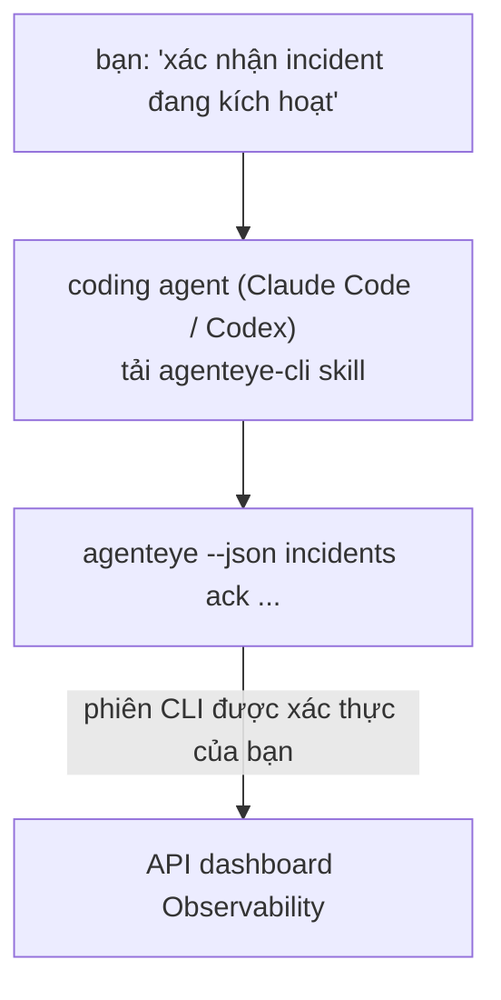

Hỏi coding agent của bạn *"có cái gì bị hỏng hôm nay không?"* và để nó trả lời từ dữ liệu Failproof AI Observability trực tiếp, mà không cần nhớ lệnh. **Kỹ năng CLI Failproof AI Observability** (`agenteye-cli`) là một *Agent Skill*: một thư mục nhỏ chứa các hướng dẫn mà một coding agent như Claude Code hoặc Codex có thể tải theo yêu cầu. Nó dạy cho agent cách vận hành triển khai Observability của bạn thông qua [`agenteye` CLI](/vi/agenteye/cli) từ các yêu cầu bằng tiếng Anh thường ngày như *"cấp cho CI một khóa chỉ có thể push events"* hoặc *"xác nhận incident đang kích hoạt và gán cho tôi."*

Nó **không phải** là một dịch vụ hay một binary riêng; không có gì để triển khai. Nó chạy trên CLI bạn đã cài đặt: agent gọi ra `agenteye --json …`, phân tích JSON sạch sẽ, và trả lời bạn bằng văn bản. Mọi thứ nó có thể làm, bạn đều có thể tự làm bằng cách gõ những lệnh tương tự.

---

## Nó liên quan như thế nào đến các giao diện Failproof AI Observability khác

Failproof AI Observability cung cấp cho bạn bốn cách để truy cập cùng một dữ liệu và điều khiển. Chúng bổ sung cho nhau:

| Giao diện | Nó là gì | Chạy ở đâu | Dùng khi nào |
|---|---|---|---|
| **[CLI](/vi/agenteye/cli)** | Tham chiếu lệnh/cờ cho `agenteye` | Terminal của bạn | Bạn muốn chạy hoặc viết script cho một lệnh cụ thể |
| **[CLI recipes](/vi/agenteye/cli-recipes)** | Các mẫu `jq`/pipeline sẵn sàng copy-paste | Terminal / scripts của bạn | Bạn đang tích hợp CLI vào tự động hóa |
| **CLI skill** (tài liệu này) | Một lối vào bằng ngôn ngữ tự nhiên cho CLI | Coding agent của bạn, trên máy trạm | Bạn muốn *chỉ cần hỏi* và để agent chọn lệnh |
| **[Evaluator skill](/vi/agenteye/evaluator-skill)** | Một kỹ năng anh chị em thiết kế và xây dựng dịch vụ scoring của bạn | Coding agent của bạn, trên máy trạm | Bạn muốn *tạo* điểm đánh giá thay vì đọc chúng |
| **[Python SDK skill](/vi/agenteye/python-sdk-skill)** | Một kỹ năng anh chị em để nhân tố hóa agent của bạn để nó phát ra telemetry | Coding agent của bạn, trên máy trạm | Bạn muốn agent của bạn *tạo* các sự kiện mà skill này đọc |
| **[AI assistant trong dashboard](/vi/agenteye/assistant)** | Một chat nhúng trong dashboard | Phía máy chủ (trong dashboard) | Bạn muốn Q&A trong dashboard trên dữ liệu của bạn |

Skill itseft không có đặc quyền riêng; nó chỉ chuyển đổi lời của bạn thành các lệnh CLI chạy dưới quyền của bạn:



### so với AI assistant trong dashboard: một điểm phân biệt quan trọng

Đây là hai công cụ khác nhau với phạm vi tác động rất khác:

- **AI assistant trong dashboard** ([AI assistant](/vi/agenteye/assistant)) là một chat nhúng trong dashboard, hỗ trợ bởi dịch vụ agent. Nó **chỉ đọc cộng với tác giả được chấp thuận**: nó có thể soạn thảo các truy vấn đã lưu và dashboard, nhưng mọi bản ghi đều tạm dừng để chờ click-approval rõ ràng của bạn, và nó không bao giờ xóa. Nó được chỉnh sửa bởi quyền `agent:use` và chỉ khi nào cũng chỉ nhìn thấy dữ liệu cho tổ chức bạn đang xem.
- **CLI skill** chạy trên *máy trạm của bạn* bên trong *coding agent của bạn* và điều khiển `agenteye` CLI dưới quyền của **bạn**. Nó có thể thực hiện **toàn bộ bề mặt CLI, bao gồm các mutation** (tạo/xoay vòng/vô hiệu hóa khóa API, thay đổi cài đặt tổ chức, giải quyết incident, xóa truy vấn đã lưu), chỉ bị giới hạn bởi các quyền của đăng nhập CLI của bạn. Hãy coi nó chính xác như cách bạn sẽ chạy những lệnh đó bằng tay.

---

## Điều kiện tiên quyết

1. **`agenteye` CLI đã cài đặt** và trên `PATH` (xem tham chiếu [CLI](/vi/agenteye/cli): `pipx install agenteye`).
2. **URL dashboard của bạn đã được đặt** (`AGENTEYE_DASHBOARD_URL`, hoặc agent truyền `--base-url`).
3. **Một phiên đã đăng nhập**: trước tiên chạy `agenteye login` bạn. Skill **không thể** hoàn thành đăng nhập mã một lần được gửi qua email cho bạn; nó sẽ yêu cầu bạn chạy `agenteye login` nếu phiên bị thiếu hoặc hết hạn (mã thoát CLI `4`).

---

## Nơi lấy nó

Skill được xuất bản trong bộ sưu tập kỹ năng công khai của Failproof AI:

**[github.com/FailproofAI/skills](https://github.com/FailproofAI/skills)** → [`skills/agenteye-cli/`](https://github.com/FailproofAI/skills/tree/main/skills/agenteye-cli)

Không có gì bị chặn — kho lưu trữ là công khai và skill không cần bất kỳ thông tin xác thực nào của riêng nó, bởi vì nó chỉ điều khiển **công khai** `agenteye` CLI đối với *dashboard của bạn*, sử dụng phiên *bạn* đã đăng nhập. Bạn không cần phải hỏi ai.

Lưu ý nó được gửi dưới dạng thư mục của riêng nó và **không** nằm bên trong gói `pipx install agenteye`, vì vậy đừng tìm kiếm nó ở đó.

## Cài đặt skill

Con đường nhanh nhất là CLI [`skills`](https://skills.sh), nó tìm nạp thư mục và thả nó nơi agent của bạn tìm kiếm:

```bash
# Claude Code, chỉ dự án này
npx skills add FailproofAI/skills --skill agenteye-cli -a claude-code

# mọi dự án (cài đặt vào ~/.claude/skills/)
npx skills add FailproofAI/skills --skill agenteye-cli -a claude-code -g --copy

# Codex thay thế
npx skills add FailproofAI/skills --skill agenteye-cli -a codex
```

Sau đó quản lý nó như bất kỳ skill nào khác:

```bash
npx skills list -a claude-code      # cái gì được cài đặt
npx skills update agenteye-cli      # pull phiên bản mới nhất
npx skills remove agenteye-cli      # xóa nó
```

Thích cài đặt bằng tay? Một Agent Skill chỉ là một thư mục chứa `SKILL.md` (cộng với tài liệu tham khảo tùy chọn), vì vậy sao chép nó cũng hoạt động:

- **Claude Code**: đặt thư mục `agenteye-cli/` vào `~/.claude/skills/` (mọi dự án) hoặc `<your-repo>/.claude/skills/` (chỉ kho lưu trữ đó). Claude Code tự động khám phá nó — xác minh bằng danh sách `/skills`, hoặc chỉ cần hỏi một câu hỏi phù hợp với mô tả của nó.
- **Codex (OpenAI)**: Codex đọc cùng một `SKILL.md`. `agents/openai.yaml` được bao gồm đặt `allow_implicit_invocation: true`, vì vậy Codex tự động chọn skill khi một tác vụ phù hợp; nếu không hãy gọi nó rõ ràng là `$agenteye-cli`.

---

## Bảo mật: mutation KHÔNG yêu cầu xác nhận khi một agent chạy CLI

> **Cảnh báo:** Đọc điều này trước khi để một agent thực hiện thay đổi.

CLI `agenteye` thường hỏi *"bạn có chắc không?"* trước một hành động phá hủy. Nó **tự động bỏ qua xác nhận đó bất cứ khi nào nó không được gắn vào terminal (đó chính xác là cách một coding agent chạy nó), và `--json` cũng bỏ qua nó.** Vì vậy lời nhắc bảo mật sẽ **không** kích hoạt cho agent.

Skill được viết để bù đắp: nó được hướng dẫn để phát biểu lệnh chính xác mà nó sẽ chạy và nhận được **OK rõ ràng của bạn trước bất kỳ thay đổi trạng thái nào**. Giữ kỷ luật đó. Khi bạn điều khiển Failproof AI Observability thông qua một agent, *bạn* là bước xác nhận. Các lệnh thay đổi trạng thái cần xem:

- `keys create` / `update` / `disable` / `regenerate`
- `users create` / `update` / `disable` / `enable`
- `settings set`
- `alerts create` / `update` / `delete` / `test`
- các subcommand `incidents` ghi: `ack` / `assign` / `resolve` / `open` / `comment-add` / `comment-delete` / `subscribe` / `unsubscribe`
- `query create` / `update` / `delete`
- `agent rename` / `delete`
- `orgs switch`

Mọi thứ dưới **Observe** (`events`, `sessions`, `evals`, `errors`, `list`, `whoami`, `orgs list/current/perms`) chỉ đọc và không thay đổi gì.

Bởi vì agent hoạt động dưới quyền của **bạn**, nó chỉ có thể làm những gì đăng nhập của bạn được phép; các quyền được giải quyết **trên mỗi tổ chức** (xem [API keys](/vi/agenteye/api-keys)). Một lệnh bạn không có quyền trả về mã thoát `5` kèm quyền chính xác được đặt tên, vì vậy agent có thể cho bạn biết chính xác những gì cần hỏi admin thay vì thất bại một cách mơ hồ.

---

## Bạn có thể hỏi nó những gì

Đây là một vòng lặp thực tế, đọc, sau đó thay đổi mà chờ OK của bạn:

```text
bạn   ▸ Có cái gì bị hỏng trong ngày qua không?

agent ▸ Chạy: agenteye --json errors --since 24h --aggregate
        3 kiểu lỗi trong 24h qua. Cái lớn nhất là TimeoutError
        (18 lần hit, tất cả trên checkout-agent), sau đó RateLimited (5).
        Muốn các session fail cho TimeoutError không?

bạn   ▸ Cấp cho CI một khóa chỉ có thể push events.

agent ▸ Cái này tạo một API key. Tôi sẽ chạy:
          agenteye keys create ci --add events:add
        OK để tiếp tục?

bạn   ▸ yes

agent ▸ Xong. Key "ci" được tạo chỉ có events:add.
        Secret chỉ được hiển thị một lần, hãy lưu trữ nó ngay bây giờ. Tôi không thể in lại.
```

Skill ánh xạ mỗi ý định bằng ngôn ngữ tự nhiên sang lệnh `agenteye` phù hợp, khám phá giá trị hợp lệ trước (`list <kind>`, `whoami`) vì vậy nó không đoán, và phát biểu lệnh chính xác trước bất kỳ thay đổi nào. Nhiều ví dụ hơn:

- *"Có cái gì bị hỏng / fail trong 24 giờ qua không?"* → `errors --since 24h --aggregate`, sau đó chi tiết.
- *"Tại sao session `run-001` fail?"* → `events --session-id run-001 --all` + `evals --session-id run-001`.
- *"Chất lượng đang xu hướng như thế nào tuần này?"* → `evals --aggregate --since 7d`, sau đó đi sâu vào các lần chạy có điểm thấp.
- *"Cấp cho CI một khóa chỉ có thể push events."* → `keys create ci --add events:add` (nó phát biểu lệnh, sau đó tạo nó và nắm bắt bí mật một lần).
- *"Ai có quyền truy cập? Làm cho Dana chỉ đọc."* → `users list` → `users update dana@… --permission-set read-only` (sau khi xác nhận với bạn).
- *"Xác nhận incident đang kích hoạt và gán cho tôi."* → `incidents list --state firing` → `incidents ack <id>` / `incidents assign <id> you@…`.

Để xem các lệnh, cờ, và hình dạng JSON đằng sau những cái này, xem tham chiếu [CLI](/vi/agenteye/cli) và [CLI recipes cho agent](/vi/agenteye/cli-recipes).

---

## Bước tiếp theo

- **[CLI](/vi/agenteye/cli)**: tham chiếu lệnh và cờ đầy đủ cho `agenteye`.
- **[CLI recipes cho agent](/vi/agenteye/cli-recipes)**: các mẫu `jq` copy-paste và xử lý mã thoát.
- **[Evaluator agent skill](/vi/agenteye/evaluator-skill)**: skill anh chị em, để xây dựng evaluator mà điểm của nó `agenteye evals` đọc.
- **[Python SDK agent skill](/vi/agenteye/python-sdk-skill)**: skill anh chị em, để nhân tố hóa agent để nó phát ra telemetry mà `agenteye` đọc.
- **[AI assistant](/vi/agenteye/assistant)**: assistant trong dashboard (không nên nhầm lẫn với skill terminal này).
- **[API keys](/vi/agenteye/api-keys)**: mô hình quyền trên mỗi tổ chức giới hạn những gì skill có thể làm.