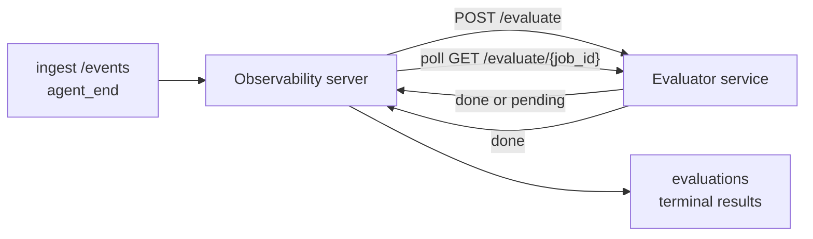

Failproof AI Observability có thể tự động chấm điểm mỗi lần chạy agent hoàn thành để đánh giá chất lượng: bạn cung cấp một dịch vụ chấm điểm nhỏ, và Observability sẽ xử lý phần còn lại. Sử dụng nó để theo dõi các yếu tố bạn quan tâm (hữu ích, hiệu quả công cụ, độ chính xác, an toàn; bạn lựa chọn), phát hiện các vấn đề suy giảm sớm và so sánh các agent hoặc môi trường một cách nhanh chóng. Chấm điểm là tùy chọn: quy trình không thực hiện bất kỳ điều gì cho đến khi bạn đặt `EVALUATOR_ENDPOINT` trên máy chủ.

> **Lưu ý:** Bạn xác định các chiều chấm điểm. Trình đánh giá của bạn có thể trả về bất kỳ khóa số nào; Observability lưu trữ, theo dõi xu hướng và hiển thị bất cứ gì bạn gửi lại.

## Tổng quan

1. **Viết một trình chấm điểm.** Thiết lập một dịch vụ HTTP nhỏ đọc phiên bản ghi và trả về điểm số. Observability cung cấp tham chiếu hoạt động mà bạn có thể sao chép. Xem [Viết một trình đánh giá với SDK](#writing-an-evaluator-with-the-sdk).
2. **Trỏ Observability đến nó.** Đặt `EVALUATOR_ENDPOINT` (và một `EVALUATOR_TOKEN` được chia sẻ) trên quy trình máy chủ.
3. **Theo dõi điểm số.** Mỗi phiên hoàn thành được chấm điểm tự động; kết quả xuất hiện trên trang chi tiết phiên, lưới phiên và bảng điều khiển đã lưu.


*Sau khi cấu hình trình đánh giá, mỗi lần chạy hoàn thành được chấm điểm và kết quả xuất hiện ở cột bên phải của phiên: bản tóm tắt ở trên, sau đó là thanh điểm theo chiều với giải thích.*

---

## Cách hoạt động



Khi SDK Observability phát ra sự kiện `agent_end` cho một phiên, máy chủ lên lịch một đánh giá. Sau đó, nó POSTs toàn bộ phiên bản ghi sự kiện đến dịch vụ trình đánh giá của bạn, có thể:

- **Trả về kết quả nội tuyến** với `{"status":"done", "scores":{...}, "reasoning":{...}, "summary":"..."}`. Kết quả được thêm vào dòng thời gian đánh giá của phiên. `reasoning` và `summary` là tùy chọn.
- **Trì hoãn** với `{"status":"pending", "job_id":"abc-123"}`. Observability sau đó gọi `GET {EVALUATOR_ENDPOINT}/evaluate/abc-123` cho đến khi trình đánh giá của bạn trả về `{"status":"done", ...}` hoặc `{"status":"error", "error":"..."}`.

  Tần suất thăm dò là theo công việc: phản hồi `pending` có thể bao gồm `next_poll_secs` để ghi đè; nếu không Observability sử dụng giá trị `default_poll_interval_secs` từ `GET /config`; nếu không máy chủ quay lại `EVALUATOR_POLLING_INTERVAL_SECS` (mặc định 10s). Tất cả các giá trị được giới hạn ở [1s, 1h].

Các phiên không bao giờ phát ra `agent_end` (ví dụ, quá trình agent bị sự cố) cũng có thể được nhặt lên: `GET /config` của trình đánh giá có thể trả về `{"inactivity_timeout_secs": 1800}`, và Observability sẽ đánh giá bất kỳ phiên nào không hoạt động trong thời gian đó. Đặt trường thành `null` hoặc bỏ qua nó để tắt lựa chọn dự phòng này.

Quy trình hoàn toàn không hoạt động khi `EVALUATOR_ENDPOINT` không được đặt.

Một phiên có thể tích lũy **nhiều đánh giá cuối cùng theo thời gian**: mỗi sự kiện `agent_end` (và mỗi lần đánh giá lại thủ công từ bảng điều khiển) thêm một hàng đánh giá tươi. Đây là cách được hỗ trợ để đánh giá một cuộc trò chuyện được tiếp tục: người dùng kết thúc agent, quay lại sau, gửi thêm sự kiện, kết thúc agent lần nữa, và đánh giá thứ hai chạy so với phiên bản ghi đầy đủ được cập nhật. Bảng điều khiển hiển thị đánh giá gần đây nhất là tiêu đề và các đánh giá trước đó dưới dạng dòng thời gian có thể gập lại. Khi một đánh giá đang chạy cho một phiên, các sự kiện `agent_end` bổ sung cho phiên đó bị bỏ qua; sự kiện tiếp theo sau khi đánh giá đang chạy hoàn thành sẽ xếp hàng đợi một đánh giá tươi như bình thường.

Lựa chọn dự phòng không hoạt động sẽ tái kích hoạt trên các phiên được tiếp tục: nếu các sự kiện mới đến sau khi đánh giá cuối cùng trước đó và phiên sau đó không hoạt động quá `inactivity_timeout_secs`, một đánh giá tươi sẽ được xếp hàng đợi.

Các lỗi tạm thời (5xx, 429, hết thời gian chờ, lỗi mạng) được thử lại với lùi mũ theo `EVALUATOR_MAX_ATTEMPTS`; phản hồi 4xx là cuối cùng. Observability an toàn khi chạy với nhiều instances máy chủ được mở rộng theo chiều ngang; công việc được phân vùng để phiên tương tự không bao giờ được gửi hai lần đồng thời.

---

## Hợp đồng HTTP

Mỗi tuyến đường được xác thực sử dụng **xác thực mã thông báo người mang**. Cùng một giá trị phải được cấu hình ở cả hai bên:

- Máy chủ Observability: biến env `EVALUATOR_TOKEN`
- Dịch vụ trình đánh giá: được cấu hình theo cách tương tự (SDK `agenteye-evaluator` đọc `EVALUATOR_TOKEN` theo quy ước)

Nếu `EVALUATOR_TOKEN` không được đặt, máy chủ không gửi tiêu đề `Authorization`; trình đánh giá có thể chấp nhận các yêu cầu ẩn danh, điều này tốt cho mạng chỉ dành cho nội bộ nhưng không được khuyến khích trên internet công cộng.

### Các tuyến đường trình đánh giá phải cung cấp

| Tuyến đường | Phần thân / tham số | Phản hồi |
|---|---|---|
| `GET /health` | không | `{"status":"ok"}` (mở, không xác thực) |
| `GET /config` | không | `{"inactivity_timeout_secs": <int> \| null, "default_poll_interval_secs": <int> \| omitted}` |
| `POST /evaluate` | `EvalRequest` JSON | `{"status":"done", ...}` hoặc `{"status":"pending", "job_id":"..."}` |
| `GET /evaluate/{id}` | không | hình dạng phản hồi giống như `/evaluate` |

### Phần thân `EvalRequest` được gửi bởi máy chủ

```json
{
  "schema_version": "1",
  "session_id":     "session-abc123",
  "agent_id":       "planner",
  "environment":    "production",
  "started_at":     "2026-05-10T12:00:00Z",
  "ended_at":       "2026-05-10T12:05:00Z",
  "events": [
    { "id": 1234, "ts": "...", "event_type": "agent_start", "payload": { ... } },
    ...
  ]
}
```

### Hình dạng phản hồi

**Đồng bộ (hoàn thành):**

```json
{
  "status": "done",
  "scores": { "helpfulness": 0.85, "tool_efficiency": 0.6 },
  "reasoning": {
    "helpfulness": "answered the question directly with citations",
    "tool_efficiency": "called list_files three times when one would have done"
  },
  "summary": "strong answer quality, weak tool selection"
}
```

`reasoning` (bản đồ biện minh theo điểm số) và `summary` (một câu chuyện đoạn duy nhất) đều là tùy chọn. Các khóa trong `reasoning` phải phản ánh các khóa trong `scores`; bảng điều khiển hiển thị mỗi mục nội tuyến dưới thanh điểm của nó. Các trình đánh giá cũ chỉ trả về `scores` tiếp tục hoạt động không thay đổi; `reasoning` và `summary` đơn giản là đọc là null và các affordances UI tương ứng bị bỏ qua.

**Không đồng bộ (trì hoãn):**

```json
{ "status": "pending", "job_id": "abc-123", "next_poll_secs": 30 }
```

`next_poll_secs` là tùy chọn; nếu bỏ qua máy chủ quay lại `default_poll_interval_secs` của trình đánh giá từ `/config`, sau đó đến biến env `EVALUATOR_POLLING_INTERVAL_SECS` của chính nó.

**Lỗi cuối cùng phía trình đánh giá:**

```json
{ "status": "error", "error": "model service unavailable" }
```

Máy chủ coi bất kỳ phần thân 2xx nào khác là lỗi giao thức và ghi lại một `error` cuối cùng cho phiên.

---

## Viết một trình đánh giá với SDK

Bạn không phải triển khai hợp đồng HTTP bằng tay. Gói Python `agenteye-evaluator` cung cấp cho bạn một trình bao bọc FastAPI được nhập để xử lý xác thực, định tuyến và các hình dạng yêu cầu/phản hồi cho bạn.

Failproof AI Observability cũng cung cấp một **trình đánh giá tham chiếu hoạt động** chấm `helpfulness`, `tool_efficiency` và `factuality` từ hình dạng phiên bản ghi. Sao chép nó như một điểm khởi đầu và thay thế logic của riêng bạn: một trình xét xử LLM, một công cụ quy tắc, bất cứ gì phù hợp với thanh chất lượng của bạn.

Trình đánh giá tối thiểu khả thi:

```python
import os
from agenteye_evaluator import Evaluator, EvalRequest, EvalResponse

app = Evaluator(token=os.environ["EVALUATOR_TOKEN"])

@app.evaluator
def run(req: EvalRequest) -> EvalResponse:
    # Inspect req.events (the full session transcript) and return scores.
    tool_calls = sum(1 for e in req.events if e.event_type == "tool_use")
    return EvalResponse(
        scores={"tool_calls": float(tool_calls)},
        reasoning={"tool_calls": f"{tool_calls} tool invocations in the transcript"},
        summary="tight tool loop" if tool_calls < 5 else "agent looped on tools",
    )
```

Instance `app` chạy dưới bất kỳ máy chủ ASGI nào, vì vậy `uvicorn module:app` khởi động nó.

Đối với các trình đánh giá cần trì hoãn công việc tốn kém, hãy trả về `JobPending` thay thế và đăng ký trình xử lý `@app.job_lookup`; máy chủ Observability thăm dò `GET /evaluate/{job_id}` cho đến khi bạn trả về trạng thái cuối cùng hoặc giới hạn `EVALUATOR_MAX_POLL_DURATION_SECS` (mặc định 1 h) đã trôi qua.

Tham chiếu API đầy đủ, mẫu không đồng bộ và lược đồ sự kiện được ghi chép trong README của SDK `agenteye-evaluator`.

---

## Chạy trình đánh giá của bạn

Trình đánh giá là **dịch vụ của bạn** — Failproof AI Observability không cung cấp trình đánh giá mặc định, vì vậy bạn xây dựng và chạy nó ở bất kỳ nơi bạn chạy các dịch vụ của riêng bạn. Nó chạy dưới bất kỳ máy chủ ASGI nào (ví dụ `uvicorn my_evaluator:app`); phục vụ các tuyến đường `/health`, `/config` và `/evaluate` từ [hợp đồng HTTP](#http-contract), sau đó trỏ máy chủ đến nó (xem [Cấu hình máy chủ](#configuring-the-server)).

Khi trình đánh giá có thể truy cập được, `GET /health` trả về `{"status":"ok"}`. Sau khi agent chạy từ đầu đến cuối, `GET /evaluations` trên máy chủ trả về một hàng có `status: "done"` và điểm số mà trình đánh giá của bạn tạo ra.

---

## Cấu hình máy chủ

Đặt trên quy trình máy chủ:

| Biến Env | Ý nghĩa |
|---|---|
| `EVALUATOR_ENDPOINT` | URL cơ sở của trình đánh giá của bạn (`http://evaluator:9000`). Không được đặt = quy trình bị tắt. |
| `EVALUATOR_TOKEN` | Mã thông báo người mang. Phải bằng giá trị mà dịch vụ trình đánh giá được cấu hình. |
| `EVALUATOR_WORKERS` | Công việc nhân viên trên mỗi instance máy chủ (mặc định 2). |
| `EVALUATOR_CLAIM_BATCH` | Hàng được yêu cầu trên mỗi bước nhân viên (mặc định 4). Các lô được xử lý **đồng thời**; đồng thời hiệu dụng trên điểm cuối trình đánh giá của bạn là `EVALUATOR_WORKERS × EVALUATOR_CLAIM_BATCH`. |
| `EVALUATOR_POLL_IDLE_SECS` | Nhân viên ngủ bao lâu giữa các lần cố gắng gửi khi không có đánh giá do (mặc định 2s). |
| `EVALUATOR_POLLING_INTERVAL_SECS` | Lựa chọn dự phòng cuối cùng cho tần suất `GET /evaluate/{id}` khi `next_poll_secs` theo phản hồi và `default_poll_interval_secs` của trình đánh giá không được đặt (mặc định 10s). |
| `EVALUATOR_REQUEST_TIMEOUT_MS` | Hết thời gian chờ mỗi yêu cầu (mặc định 30000). |
| `EVALUATOR_MAX_ATTEMPTS` | Sau kết quả này nhiều lỗi tạm thời được ghi lại dưới dạng `error` cuối cùng (mặc định 5). |
| `EVALUATOR_CONFIG_REFRESH_SECS` | Tần suất `GET /config` (mặc định 300). |
| `EVALUATOR_MAX_POLL_DURATION_SECS` | Thời gian tường tối đa một phiên có thể ở trong hàng đợi thăm dò trước khi nó được chấm dứt là `timeout` (mặc định 3600s). Bảo vệ chống lại trình đánh giá luôn trả về `pending` mãi mãi. |

Để bật chấm điểm tự động, hãy đặt cả `EVALUATOR_ENDPOINT` và `EVALUATOR_TOKEN` trên máy chủ, sau đó khởi động lại nó để nhận được thay đổi. Với `EVALUATOR_ENDPOINT` không được đặt, quy trình vẫn là no-op.

Các nút điều chỉnh ở trên là tùy chọn; chỉ đặt các biến môi trường tương ứng trên máy chủ nếu bạn cần ghi đè các mặc định.

---

## Tham chiếu API

| Phương thức | Đường dẫn | Quyền bắt buộc | Mục đích |
|---|---|---|---|
| `GET` | `/evaluations` | `evaluations:read` | Kết quả cuối cùng truy vấn. Hỗ trợ `session_id`, `agent_id`, `environment`, `status` (`done`/`error`/`timeout`), `ts_from`, `ts_to`, `cursor`, `limit`, `score_filters`, `latest_per_session`. `limit` mặc định là 50 và được giới hạn ở 200 (lưu ý điều này khác với `/events`, được giới hạn ở 1000). `environment` chấp nhận danh sách được phân tách bằng dấu phẩy (ví dụ `environment=prod,staging`); các giá trị duy nhất vẫn hoạt động. Với `latest_per_session=true` phản hồi chứa tối đa một hàng trên mỗi `session_id` (gần đây nhất theo `completed_at`) được sử dụng bởi trang danh sách phiên để gập dòng thời gian đánh giá của phiên thành tiêu đề hiện tại của nó. Mặc định là false (trả về lịch sử đầy đủ). |
| `GET` | `/evaluations/aggregate` | `evaluations:read` | Sức khỏe đánh giá được tổng hợp cho một lát cắt được lọc: tổng số lượng, phân tích hoàn thành/lỗi/hết thời gian, thống kê theo khóa điểm số (đếm/trung bình/tối thiểu/tối đa/p50 trên các khóa `scores` tùy ý) và dòng thời gian gộp theo thời gian. Chấp nhận **các tham số bộ lọc giống như `/evaluations`** cộng với `featured_keys` (CSV của khóa điểm số để theo dõi xu hướng) và `latest_per_session`. Cơ năng tính năng Dashboards; các chỉ số chính xác trên toàn bộ tập hợp phù hợp, không được lấy mẫu. |
| `GET` | `/evaluations/environments` | `evaluations:read` | Giá trị môi trường riêng biệt từ bảng `evaluations`. Được sử dụng để điền các menu thả xuống bộ lọc được xác định phạm vi để đánh giá dữ liệu có thể đọc được. |
| `GET` | `/evaluation-jobs` | `evaluations:read` | Khả năng hiển thị các đánh giá đang hoạt động. Lọc theo `status` (`pending`/`polling`). |
| `GET` | `/events` | `events:read` | Truyền các sự kiện thô của phiên. Hỗ trợ `session_id`, `agent_id`, `event_type` (CSV), `environment` (CSV), `ts_from`, `ts_to`, `cursor`, `limit` và `order`. `order` là `desc` (mới nhất-đầu tiên, mặc định) hoặc `asc` (cũ nhất-đầu tiên); giá trị không được nhận dạng quay lại `desc`. Phân trang con trỏ thông qua `next_cursor` của phản hồi (một id sự kiện): chuyển nó lại làm `cursor` để nhận trang tiếp theo; với `asc` trang tiếp theo là các sự kiện sau id đó, với `desc` các sự kiện trước đó. `limit` mặc định là 50 và được giới hạn ở 1000. |
| `GET` | `/sessions/:session_id/export` | `events:read` | Trả về phần thân JSON chính xác mà trình đánh giá sẽ nhận được cho phiên này, được phục vụ dưới dạng tệp đính kèm có thể tải xuống có tên `session-<id>.json`. Hữu ích để phát lại các phiên sản xuất thông qua `agenteye-evaluator` để kiểm tra ngoại tuyến. Các byte giống hệt với những gì quy trình trình đánh giá gửi. |
| `POST` | `/sessions/:session_id/re-evaluate` | `evaluations:trigger` | Xếp hàng đợi một đánh giá tươi cho một phiên; chạy cho dù có đánh giá trước đó hay không. Kết quả mới được **thêm vào** dòng thời gian đánh giá của phiên thay vì ghi đè lên kết quả trước đó, vì vậy các điểm số trước vẫn có thể nhìn thấy dưới dạng lịch sử. Trả về `202` khi xếp hàng đợi, `404` cho một phiên không rõ, `409` nếu một đánh giá đã đang hoạt động. Sử dụng sau khi triển khai trình đánh giá mới hoặc cho các phiên không bao giờ phát ra `agent_end`. |

### Lọc theo phạm vi điểm số: `score_filters`

`GET /evaluations` chấp nhận một tham số `score_filters` tùy chọn giới hạn kết quả theo giá trị số bên trong đối tượng `scores`. Tham số là danh sách được phân tách bằng dấu phẩy của các mục `key:min..max`; có thể bỏ qua cả hai giới hạn. Nhiều mục kết hợp với AND logic. Hàng nơi khóa đặt tên vắng mặt hoặc không phải số được loại trừ. Yêu cầu có thể mang tối đa 20 mục bộ lọc; vượt quá giá trị đó trả về HTTP 400.

Ví dụ:
```text
# helpfulness in [0.5, 0.8]
GET /evaluations?score_filters=helpfulness:0.5..0.8

# tool_efficiency at most 0.3 (no lower bound)
GET /evaluations?score_filters=tool_efficiency:..0.3

# helpfulness >= 0.5 AND factuality >= 0.9
GET /evaluations?score_filters=helpfulness:0.5..,factuality:0.9..
```

Mỗi đối tượng phản hồi `/evaluations` có các trường này:

| Trường | Loại | Ghi chú |
|---|---|---|
| `evaluation_id` | chuỗi (UUID) | Định danh chính tắc cho đánh giá cuối cùng này. Mỗi đánh giá cuối cùng nhận được một UUID mới; một phiên duy nhất có thể giữ nhiều. |
| `id` | chuỗi (UUID) | Bí danh tương thích ngược mang cùng giá trị với `evaluation_id`. |
| `session_id` | chuỗi | Phiên mà đánh giá này chạy. Một phiên có thể có nhiều đánh giá trong dòng thời gian. |
| `agent_id` | chuỗi | Định danh agent tạo ra phiên. |
| `environment` | chuỗi | Nhãn môi trường được sao chép từ phiên. |
| `status` | enum | Một trong `"done"`, `"error"`, `"timeout"`. |
| `scores` | đối tượng \| null | Điểm số được trả về bởi trình đánh giá của bạn. |
| `reasoning` | đối tượng \| null | Bản đồ biện minh theo điểm số tùy chọn được trả về bởi trình đánh giá của bạn. Các khóa thường phản ánh những khóa trong `scores`. Bảng điều khiển hiển thị mỗi mục dưới thanh điểm của nó. |
| `summary` | chuỗi \| null | Tóm tắt đoạn một toàn cầu tùy chọn được trả về bởi trình đánh giá của bạn. Bảng điều khiển hiển thị điều này ở trên phần phân tích theo điểm số như tiêu đề của đánh giá. |
| `error` | chuỗi \| null | Được điền vào `"error"` / `"timeout"` chỉ. |
| `attempt_count` | số nguyên | Số lần cố gắng gửi (≥ 1). |
| `duration_ms` | số nguyên \| null | Thời lượng của nỗ lực cuối cùng. |
| `completed_at` | chuỗi (ISO 8601 UTC) | Khi kết quả cuối cùng được ghi lại. Kết quả được sắp xếp theo `completed_at` (mới nhất trước). |
| `created_at` | chuỗi (ISO 8601 UTC) | Mang cùng dấu thời gian với `completed_at` (ngữ nghĩa viết một lần). |

---

## Quyền hạn

| Quyền hạn | Cấp phép |
|---|---|
| `evaluations:read` | Liệt kê kết quả đánh giá, xem điểm số trong bảng điều khiển và tải các chỉ số sức khỏe của bảng điều khiển. |
| `evaluations:trigger` | Xếp hàng đợi một đánh giá thủ công cho một phiên thông qua `POST /sessions/:session_id/re-evaluate` hoặc nút đánh giá lại của bảng điều khiển. |
| `dashboards:read` | Xem bảng điều khiển đã lưu (cũng cần `evaluations:read` để tải các chỉ số của họ). |
| `dashboards:write` | Tạo và chỉnh sửa bảng điều khiển. |
| `dashboards:delete` | Xóa bảng điều khiển. |

Quản trị viên bootstrap (`ADMIN_KEY`, `ADMIN_EMAIL`) tự động nhận được những điều này.

---

## Xem kết quả

- **`/sessions/<id>`**: dòng thời gian sự kiện + cột bên phải hiển thị điểm số của phiên và bất kỳ lỗi nào từ nỗ lực gửi. Nếu khóa của bạn có `evaluations:trigger`, nút **đánh giá lại** sẽ xuất hiện bên cạnh nút xuất, hữu ích cho các phiên không bao giờ phát ra `agent_end` hoặc để làm mới điểm số sau khi triển khai trình đánh giá mới. Bảng điều khiển thăm dò kết quả mới và cập nhật cột bên phải khi nó đáp ứng.
- **`/sessions`**: lưới phiên có thể lọc; cột điểm số hiển thị trạng thái đánh giá và điểm số của mỗi phiên một cách nhanh chóng.
- **`/dashboards`**: chế độ xem sức khỏe đánh giá đã lưu (xem [Bảng điều khiển](#dashboards) dưới đây).


*Lưới phiên hiển thị trạng thái đánh giá và điểm số của mỗi lần chạy một cách nhanh chóng; các huy hiệu đỏ/hổ phách/xanh làm cho điểm số thấp nổi bật.*

---

## Bảng điều khiển

Trang **Bảng điều khiển** (`/dashboards`) cho phép bạn lưu một kết hợp các bộ lọc đánh giá dưới dạng chế độ xem có tên, có thể tái sử dụng và theo dõi cách lát cắt của các đánh giá đó hoạt động một cách nhanh chóng. Bảng điều khiển được **chia sẻ trên toàn bộ tổ chức của bạn**; mọi người có `dashboards:read` nhìn thấy cùng một tập hợp.

Mỗi bảng điều khiển ghim:

- **Bộ lọc**: các điều khiển giống như trang phiên: môi trường, trạng thái, agent, cửa sổ thời gian lăn và bộ lọc phạm vi điểm số (`key:min..max`).
- **Cấu hình hiển thị**: các khóa điểm số nào để tính năng, ngưỡng sức khỏe xanh/hổ phách/đỏ, bảng nào để hiển thị và có gập lại để đánh giá gần đây nhất trên mỗi phiên hay không.

Mỗi thẻ hiển thị số phiên phù hợp, phân tích hoàn thành/lỗi/hết thời gian, trung bình của mỗi điểm số được tính năng và biểu đồ xu hướng nhỏ. Mở bảng điều khiển hiển thị các bảng toàn kích thước; **"mở trong phiên"** thả bạn vào trang phiên được lọc sẵn để chính xác lát cắt đó. Các chỉ số được tính toán phía máy chủ trên toàn bộ tập hợp phù hợp (thông qua `GET /evaluations/aggregate`), vì vậy các số chính xác hơn là được lấy mẫu.


**Quyền hạn:** xem cần cả `dashboards:read` và `evaluations:read`; tạo và chỉnh sửa cần `dashboards:write`; xóa cần `dashboards:delete`. Quản trị viên bootstrap nhận tất cả những điều này tự động.

---

## Xử lý sự cố

**Các phiên tồn tại nhưng không có đánh giá nào được tạo.** Xác nhận `EVALUATOR_ENDPOINT` được đặt trên quy trình máy chủ, máy chủ và trình đánh giá chia sẻ giá trị `EVALUATOR_TOKEN` giống nhau và điểm cuối `/health` của trình đánh giá có thể truy cập được từ máy chủ. Với `EVALUATOR_ENDPOINT` không được đặt, quy trình là no-op.

**Các đánh giá đang hoạt động chồng chất.** Truy vấn `GET /evaluation-jobs` để xem hàng đợi đang hoạt động. Kiểm tra `attempt_count`, `next_attempt_at` và `last_error` trên mỗi hàng. Nguyên nhân thường gặp: dịch vụ trình đánh giá không thể truy cập hoặc trả về 5xx (thử lại với lùi), `EVALUATOR_TOKEN` sai (401 là cuối cùng) hoặc trình đánh giá không đồng bộ trả về `pending` vô thời hạn (xem bên dưới).

**Các phiên đã hoàn thành nhưng không có đánh giá cuối cùng.** Truy vấn `GET /evaluation-jobs?status=polling`; kết quả có thể vẫn đang hoạt động. Nếu công việc bị kẹt trong `pending`, máy chủ đang gặp khó khăn khi truy cập trình đánh giá; kiểm tra rằng trình đánh giá đang chạy và `EVALUATOR_TOKEN` khớp.

**`HTTP 401 from evaluator: invalid bearer token`.** `EVALUATOR_TOKEN` trên máy chủ không khớp với giá trị mà dịch vụ trình đánh giá được cấu hình. Chúng phải giống hệt nhau.

**Trình đánh giá không đồng bộ trả về `pending` mãi mãi.** Máy chủ thăm dò `GET /evaluate/{job_id}` cho đến khi trình đánh giá trả về `done` hoặc `error`, hoặc cho đến khi `EVALUATOR_MAX_POLL_DURATION_SECS` (mặc định 1 h) đã trôi qua. Sau khi giới hạn, đánh giá được ghi lại là `timeout` và được loại bỏ khỏi hàng đợi đang hoạt động. Nâng `EVALUATOR_MAX_POLL_DURATION_SECS` nếu trình đánh giá của bạn hợp pháp cần lâu hơn mặc định.

---

## Bước tiếp theo

- [Kỹ năng agent đánh giá](/vi/agenteye/evaluator-skill): có một agent mã hóa thiết kế các chiều của bạn so với các phiên thực và xây dựng dịch vụ này cho bạn.
- [SDK Python](/vi/agenteye/python-sdk): phát ra các sự kiện `agent_end` kích hoạt chấm điểm.
- [Khóa API](/vi/agenteye/api-keys): quyền `evaluations:read` và `evaluations:trigger`.
- [Kiểm tra](/vi/agenteye/audits): tính năng chất lượng tự động khác của Observability, để xem xét dựa trên chính sách.