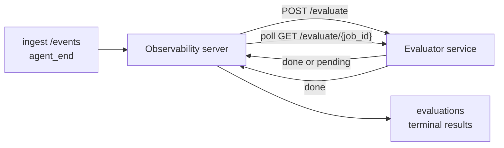

Failproof AI Observability có thể tự động chấm điểm mọi lần chạy agent hoàn thành về chất lượng: bạn cung cấp một dịch vụ chấm điểm nhỏ, và Observability sẽ xử lý phần còn lại. Sử dụng nó để theo dõi các yếu tố bạn quan tâm (độ hữu ích, hiệu quả công cụ, tính chính xác, an toàn; bạn chọn), phát hiện các suy thoái sớm và so sánh các agent hoặc môi trường một cách nhanh chóng. Chấm điểm là tùy chọn: đường dẫn không làm gì cho đến khi bạn đặt `EVALUATOR_ENDPOINT` trên máy chủ.

> **Lưu ý:** Bạn xác định các chiều độc lập chấm điểm. Bộ đánh giá của bạn có thể trả về bất kỳ khóa số nào mà nó thích; Observability lưu trữ, theo dõi xu hướng và hiển thị bất cứ thứ gì bạn gửi lại.

## Tổng quan

1. **Viết một bộ chấm điểm.** Tạo một dịch vụ HTTP nhỏ đọc bản ghi phiên và trả về điểm số. Observability cung cấp một tài liệu tham khảo hoạt động mà bạn có thể sao chép. Xem [Viết bộ đánh giá bằng SDK](#writing-an-evaluator-with-the-sdk).
2. **Trỏ Observability tới nó.** Đặt `EVALUATOR_ENDPOINT` (và một `EVALUATOR_TOKEN` được chia sẻ) trên quy trình máy chủ.
3. **Xem các điểm số xuất hiện.** Mỗi phiên hoàn thành được chấm điểm tự động; kết quả xuất hiện trên trang chi tiết phiên, lưới phiên và bảng điều khiển đã lưu.


*Sau khi bộ đánh giá được cấu hình, mỗi lần chạy hoàn thành được chấm điểm và kết quả xuất hiện ở rìa bên phải của phiên: bản tóm tắt ở trên cùng, sau đó là thanh điểm số theo chiều với lý do.*

---

## Cách hoạt động



Khi SDK Observability phát hành sự kiện `agent_end` cho một phiên, máy chủ lên lịch một đánh giá. Sau đó, nó gửi bản ghi sự kiện đầy đủ tới dịch vụ đánh giá của bạn, cái có thể:

- **Trả về kết quả theo cách nội tuyến** với `{"status":"done", "scores":{...}, "reasoning":{...}, "summary":"..."}`. Kết quả được thêm vào dòng thời gian đánh giá của phiên. `reasoning` và `summary` là tùy chọn.
- **Trì hoãn** với `{"status":"pending", "job_id":"abc-123"}`. Observability sau đó gọi `GET {EVALUATOR_ENDPOINT}/evaluate/abc-123` cho đến khi bộ đánh giá của bạn trả về `{"status":"done", ...}` hoặc `{"status":"error", "error":"..."}`.

  Tần suất thăm dò là mỗi công việc: phản hồi `pending` có thể bao gồm `next_poll_secs` để ghi đè; nếu không Observability sử dụng giá trị `default_poll_interval_secs` từ `GET /config`; nếu không máy chủ quay lại `EVALUATOR_POLLING_INTERVAL_SECS` (mặc định 10 giây). Tất cả các giá trị được giới hạn trong [1 giây, 1 giờ].

Các phiên không bao giờ phát hành `agent_end` (ví dụ: quy trình agent bị sự cố) cũng có thể được chọn: `/config` của bộ đánh giá có thể trả về `{"inactivity_timeout_secs": 1800}`, và Observability sẽ đánh giá bất kỳ phiên nào đã không hoạt động trong thời gian đó. Đặt trường thành `null` hoặc bỏ qua nó để tắt fallback này.

Đường dẫn hoàn toàn vô hoạt động khi `EVALUATOR_ENDPOINT` không được đặt.

Một phiên có thể tích lũy **nhiều đánh giá cuối cùng theo thời gian**: mỗi sự kiện `agent_end` (và mỗi lần đánh giá lại thủ công từ bảng điều khiển) thêm một hàng đánh giá mới. Đây là cách được hỗ trợ để đánh giá một cuộc trò chuyện được tiếp tục: người dùng kết thúc agent, quay lại sau, gửi thêm sự kiện, kết thúc agent lần nữa và đánh giá thứ hai chạy so với bản ghi đầy đủ đã cập nhật. Bảng điều khiển hiển thị đánh giá gần đây nhất làm tiêu đề và các đánh giá trước đó làm dòng thời gian có thể thu gọn. Trong khi một đánh giá đang chạy cho một phiên, các sự kiện `agent_end` bổ sung cho phiên đó bị bỏ qua; cái tiếp theo sau khi đánh giá đang chạy hoàn thành sẽ xếp hàng một đánh giá mới như bình thường.

Fallback bất hoạt động tái hoạt động trên các phiên được tiếp tục: nếu sự kiện mới đến sau một đánh giá cuối cùng trước đó và phiên sau đó không hoạt động quá `inactivity_timeout_secs`, một đánh giá mới được xếp hàng.

Các lỗi tạm thời (5xx, 429, timeout, lỗi mạng) được thử lại với backoff hàm mũ lên đến `EVALUATOR_MAX_ATTEMPTS`; phản hồi 4xx là cuối cùng. Observability an toàn để chạy với nhiều phiên bản máy chủ được mở rộng theo chiều ngang; công việc được phân vùng để phiên tương tự không bao giờ được gửi hai lần đồng thời.

---

## Hợp đồng HTTP

Mọi tuyến được xác thực sử dụng **xác thực bearer token**. Cùng một giá trị phải được cấu hình ở cả hai bên:

- Máy chủ Observability: biến env `EVALUATOR_TOKEN`
- Dịch vụ đánh giá: được cấu hình theo cách tương tự (SDK `agenteye-evaluator` đọc `EVALUATOR_TOKEN` theo quy ước)

Nếu `EVALUATOR_TOKEN` không được đặt, máy chủ không gửi header `Authorization`; bộ đánh giá sau đó có thể chấp nhận các yêu cầu ẩn danh, điều đó ổn cho một mạng chỉ nội bộ nhưng không được khuyến khích trên internet công cộng.

### Tuyến bộ đánh giá phải cung cấp

| Tuyến | Thân/tham số | Phản hồi |
|---|---|---|
| `GET /health` | không | `{"status":"ok"}` (mở, không xác thực) |
| `GET /config` | không | `{"inactivity_timeout_secs": <int> \| null, "default_poll_interval_secs": <int> \| omitted}` |
| `POST /evaluate` | JSON `EvalRequest` | `{"status":"done", ...}` hoặc `{"status":"pending", "job_id":"..."}` |
| `GET /evaluate/{id}` | không | hình dạng phản hồi giống như `/evaluate` |

### Thân yêu cầu `EvalRequest` được gửi bởi máy chủ

```json
{
  "schema_version": "1",
  "session_id":     "session-abc123",
  "agent_id":       "planner",
  "environment":    "production",
  "started_at":     "2026-05-10T12:00:00Z",
  "ended_at":       "2026-05-10T12:05:00Z",
  "events": [
    { "id": 1234, "ts": "...", "event_type": "agent_start", "payload": { ... } },
    ...
  ]
}
```

### Hình dạng phản hồi

**Đồng bộ (hoàn thành):**

```json
{
  "status": "done",
  "scores": { "helpfulness": 0.85, "tool_efficiency": 0.6 },
  "reasoning": {
    "helpfulness": "answered the question directly with citations",
    "tool_efficiency": "called list_files three times when one would have done"
  },
  "summary": "strong answer quality, weak tool selection"
}
```

`reasoning` (bản đồ lý do cho mỗi điểm) và `summary` (tường trình chung một đoạn) đều là tùy chọn. Các khóa trong `reasoning` phải phản chiếu các khóa trong `scores`; bảng điều khiển hiển thị mỗi mục theo kiểu nội tuyến dưới thanh điểm của nó. Các bộ đánh giá cũ chỉ trả về `scores` tiếp tục hoạt động không thay đổi; `reasoning` và `summary` đơn giản là đọc là null và các affordance UI tương ứng bị bỏ qua.

**Không đồng bộ (trì hoãn):**

```json
{ "status": "pending", "job_id": "abc-123", "next_poll_secs": 30 }
```

`next_poll_secs` là tùy chọn; nếu bỏ qua máy chủ quay lại `default_poll_interval_secs` của bộ đánh giá từ `/config`, sau đó để biến env `EVALUATOR_POLLING_INTERVAL_SECS` của riêng nó.

**Lỗi cuối cùng phía bộ đánh giá:**

```json
{ "status": "error", "error": "model service unavailable" }
```

Máy chủ coi bất kỳ thân 2xx khác là lỗi giao thức và ghi lại `error` cuối cùng cho phiên.

---

## Viết bộ đánh giá bằng SDK

Bạn không phải thực hiện hợp đồng HTTP bằng tay. Gói Python `agenteye-evaluator` cung cấp cho bạn một trình bao FastAPI được gõ chặt xử lý xác thực, định tuyến và các hình dạng yêu cầu/phản hồi cho bạn.

Failproof AI Observability cũng cung cấp **một bộ đánh giá tham khảo hoạt động** chấm điểm `helpfulness`, `tool_efficiency` và `factuality` từ hình dạng của bản ghi. Sao chép nó làm điểm bắt đầu và thay thế logic của riêng bạn: một thẩm phán LLM, một công cụ quy tắc, bất cứ thứ gì phù hợp với thanh chất lượng của bạn.

Bộ đánh giá tối thiểu:

```python
import os
from agenteye_evaluator import Evaluator, EvalRequest, EvalResponse

app = Evaluator(token=os.environ["EVALUATOR_TOKEN"])

@app.evaluator
def run(req: EvalRequest) -> EvalResponse:
    # Inspect req.events (the full session transcript) and return scores.
    tool_calls = sum(1 for e in req.events if e.event_type == "tool_use")
    return EvalResponse(
        scores={"tool_calls": float(tool_calls)},
        reasoning={"tool_calls": f"{tool_calls} tool invocations in the transcript"},
        summary="tight tool loop" if tool_calls < 5 else "agent looped on tools",
    )
```

Phiên bản `app` chạy dưới bất kỳ máy chủ ASGI nào, vì vậy `uvicorn module:app` bắt đầu nó.

Đối với các bộ đánh giá cần trì hoãn công việc tốn kém, trả về `JobPending` thay vào đó và đăng ký trình xử lý `@app.job_lookup`; máy chủ Observability thăm dò `GET /evaluate/{job_id}` cho đến khi bạn trả về trạng thái cuối cùng hoặc giới hạn `EVALUATOR_MAX_POLL_DURATION_SECS` (mặc định 1 giờ) vượt quá.

Tài liệu tham khảo API đầy đủ, mô hình không đồng bộ và lược đồ sự kiện được ghi trong README của SDK `agenteye-evaluator`.

---

## Chạy bộ đánh giá của bạn

Bộ đánh giá là **dịch vụ của bạn** — Failproof AI Observability không cung cấp bộ đánh giá mặc định, vì vậy bạn xây dựng và chạy nó ở bất kỳ nơi bạn chạy các dịch vụ của riêng bạn. Nó chạy dưới bất kỳ máy chủ ASGI nào (ví dụ `uvicorn my_evaluator:app`); cung cấp các tuyến `/health`, `/config` và `/evaluate` từ [hợp đồng HTTP](#http-contract), sau đó trỏ máy chủ tới nó (xem [Cấu hình máy chủ](#configuring-the-server)).

Sau khi bộ đánh giá có thể tiếp cận, `GET /health` trả về `{"status":"ok"}`. Sau khi agent chạy từ đầu đến cuối, `GET /evaluations` trên máy chủ trả về một hàng có `status: "done"` và các điểm số mà bộ đánh giá của bạn tạo ra.

---

## Cấu hình máy chủ

Đặt trên quy trình máy chủ:

| Biến Env | Ý nghĩa |
|---|---|
| `EVALUATOR_ENDPOINT` | URL cơ sở của bộ đánh giá của bạn (`http://evaluator:9000`). Không được đặt = đường dẫn tắt. |
| `EVALUATOR_TOKEN` | Token người mang. Phải bằng giá trị dịch vụ đánh giá được cấu hình với. |
| `EVALUATOR_WORKERS` | Tác vụ công nhân trên mỗi phiên bản máy chủ (mặc định 2). |
| `EVALUATOR_CLAIM_BATCH` | Hàng được yêu cầu cho mỗi đánh dấu công nhân (mặc định 4). Các lô được xử lý **đồng thời**; đồng thời hiệu quả trên điểm cuối đánh giá của bạn là `EVALUATOR_WORKERS × EVALUATOR_CLAIM_BATCH`. |
| `EVALUATOR_POLL_IDLE_SECS` | Công nhân ngủ bao lâu giữa các nỗ lực gửi khi không có đánh giá nào được xếp lịch (mặc định 2 giây). |
| `EVALUATOR_POLLING_INTERVAL_SECS` | Fallback cuối cùng cho tần suất `GET /evaluate/{id}` khi cả `next_poll_secs` theo mỗi phản hồi lẫn `default_poll_interval_secs` của bộ đánh giá không được đặt (mặc định 10 giây). |
| `EVALUATOR_REQUEST_TIMEOUT_MS` | Timeout cho mỗi yêu cầu (mặc định 30000). |
| `EVALUATOR_MAX_ATTEMPTS` | Sau nhiều lỗi tạm thời này, kết quả được ghi lại là `error` cuối cùng (mặc định 5). |
| `EVALUATOR_CONFIG_REFRESH_SECS` | Tần suất `GET /config` (mặc định 300). |
| `EVALUATOR_MAX_POLL_DURATION_SECS` | Thời gian đồng hồ tối đa một phiên có thể ở trong hàng đợi thăm dò trước khi nó bị chấm dứt là `timeout` (mặc định 3600 giây). Bảo vệ chống lại một bộ đánh giá tiếp tục trả về `pending` mãi mãi. |

Để bật chấm điểm tự động, đặt cả `EVALUATOR_ENDPOINT` và `EVALUATOR_TOKEN` trên máy chủ, sau đó khởi động lại để áp dụng thay đổi. Với `EVALUATOR_ENDPOINT` không được đặt đường dẫn vẫn là vô hoạt động.

Các nút điều chỉnh ở trên là tùy chọn; chỉ đặt các biến env tương ứng trên máy chủ nếu bạn cần ghi đè các giá trị mặc định.

---

## Tài liệu tham khảo API

| Phương pháp | Đường dẫn | Quyền bắt buộc | Mục đích |
|---|---|---|---|
| `GET` | `/evaluations` | `evaluations:read` | Truy vấn kết quả cuối cùng. Hỗ trợ `session_id`, `agent_id`, `environment`, `status` (`done`/`error`/`timeout`), `ts_from`, `ts_to`, `cursor`, `limit`, `score_filters`, `latest_per_session`. `limit` mặc định là 50 và được giới hạn ở 200 (lưu ý điều này khác với `/events`, giới hạn ở 1000). `environment` chấp nhận danh sách được phân tách bằng dấu phẩy (ví dụ `environment=prod,staging`); các giá trị duy nhất vẫn hoạt động. Với `latest_per_session=true` phản hồi chứa nhiều nhất một hàng trên `session_id` (gần đây nhất theo `completed_at`) được sử dụng bởi trang danh sách phiên để thu gọn dòng thời gian đánh giá của phiên thành tiêu đề hiện tại của nó. Mặc định là false (trả về toàn bộ lịch sử). |
| `GET` | `/evaluations/aggregate` | `evaluations:read` | Sức khỏe đánh giá được tóm tắt cho một lát cắt được lọc: tổng số, phân tích done/error/timeout, thống kê mỗi khóa điểm (count/avg/min/max/p50 trên các khóa `scores` tùy ý) và dòng thời gian được ghép theo thời gian. Chấp nhận **các tham số bộ lọc giống như `/evaluations`** cộng với `featured_keys` (CSV của các khóa điểm để theo dõi xu hướng) và `latest_per_session`. Hỗ trợ tính năng Bảng điều khiển; các số liệu chính xác trên toàn bộ tập hợp phù hợp, không được lấy mẫu. |
| `GET` | `/evaluations/environments` | `evaluations:read` | Các giá trị môi trường riên biệt từ bảng `evaluations`. Được sử dụng để điền các trình đơn bộ lọc được xác định phạm vi cho dữ liệu có thể đọc được bằng đánh giá. |
| `GET` | `/evaluation-jobs` | `evaluations:read` | Khả năng nhìn vào các đánh giá đang bay. Lọc theo `status` (`pending`/`polling`). |
| `GET` | `/events` | `events:read` | Luồng các sự kiện thô của phiên. Hỗ trợ `session_id`, `agent_id`, `event_type` (CSV), `environment` (CSV), `ts_from`, `ts_to`, `cursor`, `limit` và `order`. `order` là `desc` (mới nhất trước, mặc định) hoặc `asc` (cũ nhất trước); một giá trị không được nhận dạng sẽ quay lại `desc`. Con trỏ-phân trang thông qua `next_cursor` của phản hồi (một id sự kiện): chuyển nó lại làm `cursor` để nhận trang tiếp theo; với `asc` trang tiếp theo là các sự kiện sau id đó, với `desc` các sự kiện trước nó. `limit` mặc định là 50 và được giới hạn ở 1000. |
| `GET` | `/sessions/:session_id/export` | `events:read` | Trả về chính xác thân JSON mà bộ đánh giá sẽ nhận cho phiên này, được cung cấp như một tệp đính kèm có thể tải xuống được đặt tên `session-<id>.json`. Hữu ích để phát lại các phiên sản xuất thông qua `agenteye-evaluator` để kiểm tra ngoại tuyến. Các byte giống hệt những gì đường dẫn đánh giá gửi. |
| `POST` | `/sessions/:session_id/re-evaluate` | `evaluations:trigger` | Xếp hàng một đánh giá mới cho một phiên; chạy cho dù đánh giá trước đó có tồn tại hay không. Kết quả mới được **thêm vào** dòng thời gian đánh giá của phiên thay vì ghi đè kết quả trước đó, vì vậy các điểm trước đó vẫn hiển thị dưới dạng lịch sử. Trả về `202` khi xếp hàng, `404` cho phiên không xác định, `409` nếu đánh giá đã đang bay. Sử dụng điều này sau khi triển khai một bộ đánh giá mới hoặc cho các phiên không bao giờ phát hành `agent_end`. |

### Lọc theo phạm vi điểm: `score_filters`

`GET /evaluations` chấp nhận tham số `score_filters` tùy chọn thu hẹp kết quả theo các giá trị số bên trong đối tượng `scores`. Tham số là danh sách được phân tách bằng dấu phẩy của các mục `key:min..max`; có thể bỏ qua bất kỳ ràng buộc nào. Các mục múp kết hợp với AND logic. Các hàng trong đó khóa được đặt tên vắng mặt hoặc không phải số được loại trừ. Một yêu cầu có thể mang tối đa 20 mục bộ lọc; vượt quá trả về HTTP 400.

Ví dụ:
```text
# helpfulness in [0.5, 0.8]
GET /evaluations?score_filters=helpfulness:0.5..0.8

# tool_efficiency at most 0.3 (no lower bound)
GET /evaluations?score_filters=tool_efficiency:..0.3

# helpfulness >= 0.5 AND factuality >= 0.9
GET /evaluations?score_filters=helpfulness:0.5..,factuality:0.9..
```

Mỗi đối tượng phản hồi `/evaluations` có các trường này:

| Trường | Kiểu | Ghi chú |
|---|---|---|
| `evaluation_id` | chuỗi (UUID) | Định danh chính tắc cho đánh giá cuối cùng này. Mỗi đánh giá cuối cùng nhận một UUID mới; một phiên duy nhất có thể giữ nhiều. |
| `id` | chuỗi (UUID) | Bí danh tương thích ngược mang cùng giá trị với `evaluation_id`. |
| `session_id` | chuỗi | Phiên mà đánh giá này chạy lại. Một phiên có thể có nhiều đánh giá trong dòng thời gian. |
| `agent_id` | chuỗi | Xác định agent đã tạo ra phiên. |
| `environment` | chuỗi | Nhãn môi trường được sao chép từ phiên. |
| `status` | enum | Một trong `"done"`, `"error"`, `"timeout"`. |
| `scores` | đối tượng \| null | Điểm được trả về bởi bộ đánh giá của bạn. |
| `reasoning` | đối tượng \| null | Bản đồ lý do tùy chọn mỗi điểm được trả về bởi bộ đánh giá của bạn. Các khóa thường phản chiếu những khóa trong `scores`. Bảng điều khiển hiển thị mỗi mục dưới thanh điểm của nó. |
| `summary` | chuỗi \| null | Thuyết minh một đoạn tổng thể tùy chọn được trả về bởi bộ đánh giá của bạn. Bảng điều khiển hiển thị điều này ở trên phần phân tích mỗi điểm làm tiêu đề của đánh giá. |
| `error` | chuỗi \| null | Dân số trên `"error"` / `"timeout"` chỉ. |
| `attempt_count` | số nguyên | Số lần cố gắng gửi (≥ 1). |
| `duration_ms` | số nguyên \| null | Thời lượng của nỗ lực cuối cùng. |
| `completed_at` | chuỗi (ISO 8601 UTC) | Khi kết quả cuối cùng được ghi lại. Kết quả được sắp xếp theo `completed_at` (mới nhất trước). |
| `created_at` | chuỗi (ISO 8601 UTC) | Mang cùng dấu thời gian như `completed_at` (ngữ nghĩa ghi một lần). |

---

## Quyền

| Quyền | Cấp |
|---|---|
| `evaluations:read` | Liệt kê kết quả đánh giá, xem điểm trong bảng điều khiển và tải các số liệu sức khỏe bảng điều khiển. |
| `evaluations:trigger` | Xếp hàng một đánh giá thủ công cho một phiên thông qua `POST /sessions/:session_id/re-evaluate` hoặc nút đánh giá lại của bảng điều khiển. |
| `dashboards:read` | Xem bảng điều khiển đã lưu (cũng cần `evaluations:read` để tải các số liệu của họ). |
| `dashboards:write` | Tạo và chỉnh sửa bảng điều khiển. |
| `dashboards:delete` | Xóa bảng điều khiển. |

Admin bootstrap (`ADMIN_KEY`, `ADMIN_EMAIL`) tự động nhận những cái này.

---

## Xem kết quả

- **`/sessions/<id>`**: dòng thời gian sự kiện + rìa bên phải hiển thị các điểm của phiên và bất kỳ lỗi nào từ nỗ lực gửi. Nếu khóa của bạn có `evaluations:trigger`, một nút **đánh giá lại** xuất hiện bên cạnh nút xuất, hữu ích cho các phiên không bao giờ phát hành `agent_end` hoặc để làm mới điểm sau khi triển khai một bộ đánh giá mới. Bảng điều khiển thăm dò kết quả mới và cập nhật rìa bên phải khi nó xuất hiện.
- **`/sessions`**: lưới phiên có thể lọc; cột điểm số hiển thị trạng thái đánh giá và điểm của mỗi phiên một cách nhanh chóng.
- **`/dashboards`**: chế độ xem sức khỏe đánh giá đã lưu (xem [Bảng điều khiển](#dashboards) dưới đây).


*Lưới phiên hiển thị trạng thái đánh giá và điểm của mỗi lần chạy một cách nhanh chóng; huy hiệu đỏ/hổ phách/xanh lá cây làm cho điểm thấp nổi bật.*

---

## Bảng điều khiển

Trang **Bảng điều khiển** (`/dashboards`) cho phép bạn lưu một kết hợp các bộ lọc đánh giá làm chế độ xem được đặt tên, có thể sử dụng lại và xem cách một lát cắt đánh giá hoạt động một cách nhanh chóng. Bảng điều khiển **được chia sẻ trên toàn bộ tổ chức của bạn**; mọi người có `dashboards:read` thấy cùng một bộ.

Mỗi bảng điều khiển ghim:

- **Bộ lọc**: các điều khiển giống như trên trang phiên: môi trường, trạng thái, agent, cửa sổ thời gian lăn và bộ lọc phạm vi điểm (`key:min..max`).
- **Cấu hình hiển thị**: các khóa điểm nào để nổi bật, ngưỡng sức khỏe xanh/hổ phách/đỏ, bảng nào hiển thị và liệu có thu gọn đánh giá mới nhất trên mỗi phiên hay không.

Mỗi thẻ hiển thị số lượng phiên phù hợp, phân tích done/error/timeout, trung bình của mỗi điểm nổi bật và một sparkline xu hướng nhỏ. Mở bảng điều khiển hiển thị các bảng có kích thước đầy đủ; **mở ở phiên** đặt bạn vào trang phiên được lọc trước chính xác vào lát cắt đó. Số liệu được tính toán phía máy chủ trên toàn bộ tập hợp phù hợp (thông qua `GET /evaluations/aggregate`), vì vậy các số chính xác hơn là được lấy mẫu.


**Quyền:** xem cần cả `dashboards:read` và `evaluations:read`; tạo và chỉnh sửa cần `dashboards:write`; xóa cần `dashboards:delete`. Admin bootstrap tự động nhận tất cả những cái này.

---

## Khắc phục sự cố

**Phiên tồn tại nhưng không có đánh giá nào được tạo.** Xác nhận `EVALUATOR_ENDPOINT` được đặt trên quy trình máy chủ, máy chủ và bộ đánh giá chia sẻ cùng một giá trị `EVALUATOR_TOKEN` và điểm cuối `/health` của bộ đánh giá có thể tiếp cận được từ máy chủ. Với `EVALUATOR_ENDPOINT` không được đặt đường dẫn là vô hoạt động.

**Đánh giá đang bay chồng chất.** Truy vấn `GET /evaluation-jobs` để xem hàng đợi đang bay. Kiểm tra `attempt_count`, `next_attempt_at` và `last_error` trên mỗi hàng. Nguyên nhân phổ biến: dịch vụ đánh giá không thể tiếp cận hoặc trả về 5xx (thử lại với backoff), `EVALUATOR_TOKEN` sai (401 là cuối cùng) hoặc một bộ đánh giá không đồng bộ trả về `pending` vô thời hạn (xem dưới đây).

**Phiên đã hoàn thành nhưng không có đánh giá cuối cùng.** Truy vấn `GET /evaluation-jobs?status=polling`; kết quả vẫn có thể đang bay. Nếu công việc bị kẹt trong `pending`, máy chủ đang gặp sự cố tiếp cận bộ đánh giá; kiểm tra xem bộ đánh giá có lên hay không và `EVALUATOR_TOKEN` khớp.

**`HTTP 401 từ bộ đánh giá: bearer token không hợp lệ`.** `EVALUATOR_TOKEN` trên máy chủ không khớp với giá trị dịch vụ đánh giá được cấu hình với. Chúng phải giống hệt nhau.

**Bộ đánh giá không đồng bộ trả về `pending` mãi mãi.** Máy chủ thăm dò `GET /evaluate/{job_id}` cho đến khi bộ đánh giá trả về `done` hoặc `error` hoặc cho đến khi `EVALUATOR_MAX_POLL_DURATION_SECS` (mặc định 1 giờ) vượt quá. Sau giới hạn đánh giá được ghi lại là `timeout` và loại bỏ khỏi hàng đợi đang bay. Tăng `EVALUATOR_MAX_POLL_DURATION_SECS` nếu bộ đánh giá của bạn hợp pháp cần lâu hơn mặc định.

---

## Các bước tiếp theo

- [Kỹ năng agent đánh giá](/vi/agenteye/evaluator-skill): có một agent mã hóa thiết kế các chiều của bạn so với các phiên thực và xây dựng dịch vụ này cho bạn.
- [SDK Python](/vi/agenteye/python-sdk): phát hành các sự kiện `agent_end` kích hoạt chấm điểm.
- [Khóa API](/vi/agenteye/api-keys): các quyền `evaluations:read` và `evaluations:trigger`.
- [Kiểm toán](/vi/agenteye/audits): tính năng chất lượng tự động khác của Observability, để xem xét dựa trên chính sách.