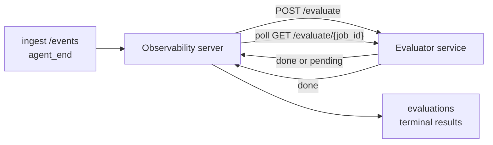

Failproof AI Observability có thể tự động chấm điểm mỗi lần chạy agent hoàn thành về chất lượng: bạn cung cấp một dịch vụ chấm điểm nhỏ, và Observability sẽ xử lý phần còn lại. Sử dụng nó để theo dõi các chiều độ mà bạn quan tâm (tính hữu ích, hiệu quả công cụ, tính xác thực, an toàn; bạn chọn), phát hiện hồi quy sớm và so sánh các agent hoặc môi trường một cách nhanh chóng. Chấm điểm là tùy chọn: quy trình không hoạt động cho đến khi bạn đặt `EVALUATOR_ENDPOINT` trên máy chủ.

> **Ghi chú:** Bạn xác định các chiều độ chấm điểm. Evaluator của bạn có thể trả về bất kỳ khóa số nào; Observability lưu trữ, theo dõi xu hướng và hiển thị bất kỳ thứ gì bạn gửi lại.

## Tổng quan

1. **Viết một trình chấm điểm.** Thiết lập một dịch vụ HTTP nhỏ đọc bảng điểm phiên và trả về điểm số. Observability có kèm một tài liệu tham khảo hoạt động mà bạn có thể sao chép. Xem [Viết một evaluator với SDK](#writing-an-evaluator-with-the-sdk).
2. **Chỉ Observability đến nó.** Đặt `EVALUATOR_ENDPOINT` (và một `EVALUATOR_TOKEN` dùng chung) trên quá trình máy chủ.
3. **Theo dõi các điểm số.** Mỗi phiên hoàn thành được chấm điểm tự động; kết quả sẽ xuất hiện trên trang chi tiết phiên, lưới phiên và bảng điều khiển đã lưu.


*Khi một evaluator được cấu hình, mỗi lần chạy hoàn thành sẽ được chấm điểm và kết quả sẽ xuất hiện trong thanh bên phải của phiên: bản tóm tắt ở trên, sau đó là thanh điểm số theo chiều độ với lý do.*

---

## Cách hoạt động



Khi SDK Observability phát ra sự kiện `agent_end` cho một phiên, máy chủ sẽ lên lịch đánh giá. Sau đó, nó POSTs toàn bộ bảng điểm sự kiện cho dịch vụ evaluator của bạn, có thể:

- **Trả về kết quả ngay lập tức** với `{"status":"done", "scores":{...}, "reasoning":{...}, "summary":"..."}`. Kết quả được thêm vào dòng thời gian đánh giá của phiên. `reasoning` và `summary` là tùy chọn.
- **Hoãn lại** với `{"status":"pending", "job_id":"abc-123"}`. Observability sau đó gọi `GET {EVALUATOR_ENDPOINT}/evaluate/abc-123` cho đến khi evaluator của bạn trả về `{"status":"done", ...}` hoặc `{"status":"error", "error":"..."}`.

  Tần suất khảo sát là theo công việc: một phản hồi `pending` có thể bao gồm `next_poll_secs` để ghi đè; nếu không, Observability sử dụng giá trị `default_poll_interval_secs` từ `GET /config`; nếu không, máy chủ quay lại `EVALUATOR_POLLING_INTERVAL_SECS` (mặc định 10 giây). Tất cả các giá trị đều được giới hạn trong [1s, 1h].

Các phiên không bao giờ phát ra `agent_end` (ví dụ: quá trình agent bị sập) cũng có thể được nhận diện: `GET /config` của evaluator có thể trả về `{"inactivity_timeout_secs": 1800}`, và Observability sẽ đánh giá bất kỳ phiên nào không hoạt động lâu hơn thời gian đó. Đặt trường thành `null` hoặc bỏ qua nó để vô hiệu hóa phương án dự phòng này.

Quy trình hoàn toàn không hoạt động khi `EVALUATOR_ENDPOINT` không được đặt.

Một phiên có thể tích lũy **nhiều đánh giá terminal theo thời gian**: mỗi sự kiện `agent_end` (và mỗi lần đánh giá lại thủ công từ bảng điều khiển) sẽ thêm một hàng đánh giá mới. Đây là cách được hỗ trợ để đánh giá một cuộc trò chuyện được tiếp tục: người dùng kết thúc một agent, quay lại sau, gửi thêm sự kiện, kết thúc agent lần nữa, và một đánh giá thứ hai chạy dựa trên toàn bộ bảng điểm được cập nhật. Bảng điều khiển hiển thị đánh giá gần đây nhất là tiêu đề và các đánh giá trước đó dưới dạng dòng thời gian có thể thu gọn. Khi một đánh giá đang chạy cho một phiên, các sự kiện `agent_end` bổ sung cho phiên đó sẽ bị bỏ qua; cái tiếp theo sau khi đánh giá đang chạy hoàn thành sẽ xếp hàng một đánh giá mới như bình thường.

Phương án dự phòng không hoạt động cũng tái hoạt động trên các phiên được tiếp tục: nếu các sự kiện mới đến sau một đánh giá terminal trước đó và phiên sau đó không hoạt động quá `inactivity_timeout_secs`, một đánh giá mới sẽ được xếp hàng.

Các lỗi tạm thời (5xx, 429, timeout, lỗi mạng) sẽ được thử lại với backoff theo cấp số nhân lên đến `EVALUATOR_MAX_ATTEMPTS`; phản hồi 4xx là terminal. Observability an toàn để chạy với nhiều phiên bản máy chủ được mở rộng theo chiều ngang; công việc được phân vùng để phiên đó không bao giờ được gửi đi hai lần đồng thời.

---

## Hợp đồng HTTP

Mỗi tuyến xác thực sử dụng **xác thực token bearer**. Cùng một giá trị phải được cấu hình ở cả hai bên:

- Máy chủ Observability: biến môi trường `EVALUATOR_TOKEN`
- Dịch vụ Evaluator: được cấu hình theo cách tương tự (SDK `agenteye-evaluator` đọc `EVALUATOR_TOKEN` theo quy ước)

Nếu `EVALUATOR_TOKEN` không được đặt, máy chủ không gửi header `Authorization`; evaluator có thể chấp nhận các yêu cầu ẩn danh, điều này tốt cho một mạng chỉ dùng nội bộ nhưng không được khuyến khích trên internet công cộng.

### Các tuyến mà evaluator phải phục vụ

| Tuyến | Nội dung / tham số | Phản hồi |
|---|---|---|
| `GET /health` | không có | `{"status":"ok"}` (mở, không xác thực) |
| `GET /config` | không có | `{"inactivity_timeout_secs": <int> \| null, "default_poll_interval_secs": <int> \| omitted}` |
| `POST /evaluate` | JSON `EvalRequest` | `{"status":"done", ...}` hoặc `{"status":"pending", "job_id":"..."}` |
| `GET /evaluate/{id}` | không có | cùng hình dạng phản hồi như `/evaluate` |

### Nội dung `EvalRequest` được gửi bởi máy chủ

```json
{
  "schema_version": "1",
  "session_id":     "session-abc123",
  "agent_id":       "planner",
  "environment":    "production",
  "started_at":     "2026-05-10T12:00:00Z",
  "ended_at":       "2026-05-10T12:05:00Z",
  "events": [
    { "id": 1234, "ts": "...", "event_type": "agent_start", "payload": { ... } },
    ...
  ]
}
```

### Hình dạng phản hồi

**Đồng bộ (done):**

```json
{
  "status": "done",
  "scores": { "helpfulness": 0.85, "tool_efficiency": 0.6 },
  "reasoning": {
    "helpfulness": "answered the question directly with citations",
    "tool_efficiency": "called list_files three times when one would have done"
  },
  "summary": "strong answer quality, weak tool selection"
}
```

`reasoning` (bản đồ lý do cho mỗi điểm số) và `summary` (một câu chuyện một đoạn tổng thể) đều là tùy chọn. Các khóa trong `reasoning` phải phản ánh các khóa trong `scores`; bảng điều khiển hiển thị mỗi mục trực tuyến bên dưới thanh điểm số của nó. Các evaluator cũ chỉ trả về `scores` tiếp tục hoạt động không thay đổi; `reasoning` và `summary` chỉ đọc là null và các affordance UI tương ứng bị bỏ qua.

**Bất đồng bộ (hoãn lại):**

```json
{ "status": "pending", "job_id": "abc-123", "next_poll_secs": 30 }
```

`next_poll_secs` là tùy chọn; nếu bỏ qua, máy chủ quay lại `default_poll_interval_secs` của evaluator từ `/config`, sau đó đến biến môi trường `EVALUATOR_POLLING_INTERVAL_SECS` của nó.

**Lỗi phía evaluator terminal:**

```json
{ "status": "error", "error": "model service unavailable" }
```

Máy chủ coi bất kỳ nội dung 2xx khác là lỗi giao thức và ghi lại một `error` terminal cho phiên.

---

## Viết một evaluator với SDK

Bạn không phải thực hiện hợp đồng HTTP bằng tay. Gói Python `agenteye-evaluator` cung cấp cho bạn một wrapper FastAPI được gõ xử lý xác thực, định tuyến và các hình dạng yêu cầu/phản hồi cho bạn.

Failproof AI Observability cũng có kèm **một evaluator tài liệu tham khảo hoạt động** chấm điểm `helpfulness`, `tool_efficiency` và `factuality` từ hình dạng của bảng điểm. Sao chép nó làm điểm bắt đầu và thay thế logic của riêng bạn: một bộ phán xử LLM, một công cụ quy tắc, bất cứ thứ gì phù hợp với thanh chất lượng của bạn.

Evaluator tối thiểu:

```python
import os
from agenteye_evaluator import Evaluator, EvalRequest, EvalResponse

app = Evaluator(token=os.environ["EVALUATOR_TOKEN"])

@app.evaluator
def run(req: EvalRequest) -> EvalResponse:
    # Inspect req.events (the full session transcript) and return scores.
    tool_calls = sum(1 for e in req.events if e.event_type == "tool_use")
    return EvalResponse(
        scores={"tool_calls": float(tool_calls)},
        reasoning={"tool_calls": f"{tool_calls} tool invocations in the transcript"},
        summary="tight tool loop" if tool_calls < 5 else "agent looped on tools",
    )
```

Phiên bản `app` chạy dưới bất kỳ máy chủ ASGI nào, vì vậy `uvicorn module:app` khởi động nó.

Đối với các evaluator cần hoãn lại công việc tốn kém, trả về `JobPending` thay thế và đăng ký một trình xử lý `@app.job_lookup`; máy chủ Observability sẽ khảo sát `GET /evaluate/{job_id}` cho đến khi bạn trả về một trạng thái terminal hoặc hạn mức `EVALUATOR_MAX_POLL_DURATION_SECS` (mặc định 1 h) kết thúc.

Tài liệu tham khảo API đầy đủ, mẫu bất đồng bộ và lược đồ sự kiện được ghi lại trong README của SDK `agenteye-evaluator`.

---

## Chạy evaluator của bạn

Evaluator là **dịch vụ của bạn** — Failproof AI Observability không có kèm một evaluator mặc định, vì vậy bạn xây dựng và chạy nó ở bất cứ nơi bạn chạy các dịch vụ của riêng bạn. Nó chạy dưới bất kỳ máy chủ ASGI nào (ví dụ `uvicorn my_evaluator:app`); phục vụ các tuyến `/health`, `/config` và `/evaluate` từ [hợp đồng HTTP](#http-contract), sau đó chỉ máy chủ đến nó (xem [Cấu hình máy chủ](#configuring-the-server)).

Khi evaluator có thể truy cập được, `GET /health` trả về `{"status":"ok"}`. Sau khi agent chạy từ đầu đến cuối, `GET /evaluations` trên máy chủ trả về một hàng với `status: "done"` và các điểm số mà evaluator của bạn tạo ra.

---

## Cấu hình máy chủ

Đặt trên quá trình máy chủ:

| Biến môi trường | Ý nghĩa |
|---|---|
| `EVALUATOR_ENDPOINT` | URL cơ sở của evaluator của bạn (`http://evaluator:9000`). Không đặt = quy trình bị vô hiệu hóa. |
| `EVALUATOR_TOKEN` | Token bearer. Phải bằng giá trị mà dịch vụ evaluator được cấu hình với. |
| `EVALUATOR_WORKERS` | Công việc worker cho mỗi phiên bản máy chủ (mặc định 2). |
| `EVALUATOR_CLAIM_BATCH` | Hàng được yêu cầu cho mỗi nhịp worker (mặc định 4). Các lô được xử lý **đồng thời**; đồng thời hiệu quả trên điểm cuối evaluator của bạn là `EVALUATOR_WORKERS × EVALUATOR_CLAIM_BATCH`. |
| `EVALUATOR_POLL_IDLE_SECS` | Worker ngủ bao lâu giữa các nỗ lực gửi khi không có đánh giá nào đến hạn (mặc định 2s). |
| `EVALUATOR_POLLING_INTERVAL_SECS` | Phương án dự phòng cuối cùng cho tần suất `GET /evaluate/{id}` khi không có `next_poll_secs` cho mỗi phản hồi cũng không có `default_poll_interval_secs` của evaluator được đặt (mặc định 10s). |
| `EVALUATOR_REQUEST_TIMEOUT_MS` | Timeout cho mỗi yêu cầu (mặc định 30000). |
| `EVALUATOR_MAX_ATTEMPTS` | Sau nhiều lỗi tạm thời này, kết quả được ghi lại dưới dạng `error` terminal (mặc định 5). |
| `EVALUATOR_CONFIG_REFRESH_SECS` | Tần suất `GET /config` (mặc định 300). |
| `EVALUATOR_MAX_POLL_DURATION_SECS` | Thời gian wallclock tối đa một phiên có thể ở trong hàng đợi khảo sát trước khi nó bị chấm dứt dưới dạng `timeout` (mặc định 3600s). Bảo vệ chống lại một evaluator tiếp tục trả về `pending` mãi mãi. |

Để bật chấm điểm tự động, hãy đặt cả `EVALUATOR_ENDPOINT` và `EVALUATOR_TOKEN` trên máy chủ, sau đó khởi động lại để áp dụng thay đổi. Với `EVALUATOR_ENDPOINT` không được đặt, quy trình vẫn là một no-op.

Các nút điều chỉnh trên là tùy chọn; chỉ đặt các biến môi trường tương ứng trên máy chủ nếu bạn cần ghi đè các mặc định.

---

## Tài liệu tham khảo API

| Phương pháp | Đường dẫn | Quyền bắt buộc | Mục đích |
|---|---|---|---|
| `GET` | `/evaluations` | `evaluations:read` | Truy vấn kết quả terminal. Hỗ trợ `session_id`, `agent_id`, `environment`, `status` (`done`/`error`/`timeout`), `ts_from`, `ts_to`, `cursor`, `limit`, `score_filters`, `latest_per_session`. `limit` mặc định là 50 và được capped ở 200 (lưu ý điều này khác với `/events`, được capped ở 1000). `environment` chấp nhận danh sách được phân tách bằng dấu phẩy (ví dụ `environment=prod,staging`); các giá trị đơn vẫn hoạt động. Với `latest_per_session=true`, phản hồi chứa tối đa một hàng cho mỗi `session_id` (gần đây nhất theo `completed_at`) được sử dụng bởi trang danh sách phiên để thu gọn dòng thời gian đánh giá của một phiên thành tiêu đề hiện tại của nó. Mặc định là false (trả về toàn bộ lịch sử). |
| `GET` | `/evaluations/aggregate` | `evaluations:read` | Đánh giá sức khỏe cuộn lên cho một lát cắt được lọc: tổng số lượng, tổng hợp done/error/timeout, thống kê cho mỗi khóa điểm số (count/avg/min/max/p50 trên các khóa `scores` tùy ý) và dòng thời gian được chia thành từng thùng. Chấp nhận **các tham số bộ lọc giống như `/evaluations`** cộng với `featured_keys` (CSV của các khóa điểm số để theo dõi xu hướng) và `latest_per_session`. Cấp quyền cho tính năng Bảng điều khiển; các chỉ số chính xác trên toàn bộ tập hợp phù hợp, không được lấy mẫu. |
| `GET` | `/evaluations/environments` | `evaluations:read` | Giá trị môi trường khác nhau từ bảng `evaluations`. Được sử dụng để điền các dropdown bộ lọc được xác định phạm vi đến dữ liệu có thể đọc đánh giá. |
| `GET` | `/evaluation-jobs` | `evaluations:read` | Khả năng hiển thị vào các đánh giá đang hoạt động. Lọc theo `status` (`pending`/`polling`). |
| `GET` | `/events` | `events:read` | Truyền phát các sự kiện thô của phiên. Hỗ trợ `session_id`, `agent_id`, `event_type` (CSV), `environment` (CSV), `ts_from`, `ts_to`, `cursor`, `limit` và `order`. `order` là `desc` (mới nhất trước, mặc định) hoặc `asc` (cũ nhất trước); một giá trị không được công nhận sẽ quay lại `desc`. Phân trang con trỏ thông qua `next_cursor` của phản hồi (một id sự kiện): chuyển nó lại dưới dạng `cursor` để có trang tiếp theo; với `asc`, trang tiếp theo là các sự kiện sau id đó, với `desc` là các sự kiện trước nó. `limit` mặc định là 50 và được capped ở 1000. |
| `GET` | `/sessions/:session_id/export` | `events:read` | Trả về nội dung JSON chính xác mà evaluator sẽ nhận cho phiên này, được phục vụ dưới dạng tệp đính kèm có thể tải xuống có tên `session-<id>.json`. Hữu ích để phát lại các phiên sản xuất thông qua `agenteye-evaluator` để kiểm tra ngoại tuyến. Các byte giống hệt với những gì quy trình evaluator gửi. |
| `POST` | `/sessions/:session_id/re-evaluate` | `evaluations:trigger` | Xếp hàng một đánh giá mới cho một phiên; chạy cho dù có hay không có đánh giá trước đó. Kết quả mới được **thêm vào** dòng thời gian đánh giá của phiên thay vì ghi đè cái trước đó, vì vậy các điểm số trước đó vẫn hiển thị dưới dạng lịch sử. Trả về `202` khi xếp hàng, `404` cho một phiên không xác định, `409` nếu một đánh giá đã đang hoạt động. Sử dụng sau khi triển khai một evaluator mới hoặc cho các phiên không bao giờ phát ra `agent_end`. |

### Lọc theo phạm vi điểm số: `score_filters`

`GET /evaluations` chấp nhận một tham số `score_filters` tùy chọn làm hẹp kết quả theo các giá trị số bên trong đối tượng `scores`. Tham số là danh sách được phân tách bằng dấu phẩy gồm các mục `key:min..max`; bất kỳ ràng buộc nào cũng có thể bị bỏ qua. Nhiều mục kết hợp với AND logic. Các hàng trong đó khóa được đặt tên vắng mặt hoặc không phải số được loại trừ. Một yêu cầu có thể mang tối đa 20 mục bộ lọc; vượt quá điều đó sẽ trả về HTTP 400.

Ví dụ:
```text
# helpfulness in [0.5, 0.8]
GET /evaluations?score_filters=helpfulness:0.5..0.8

# tool_efficiency at most 0.3 (no lower bound)
GET /evaluations?score_filters=tool_efficiency:..0.3

# helpfulness >= 0.5 AND factuality >= 0.9
GET /evaluations?score_filters=helpfulness:0.5..,factuality:0.9..
```

Mỗi đối tượng phản hồi `/evaluations` có các trường này:

| Trường | Loại | Ghi chú |
|---|---|---|
| `evaluation_id` | string (UUID) | Định danh kính để sử dụng cho đánh giá terminal này. Mỗi đánh giá terminal nhận một UUID mới; một phiên duy nhất có thể chứa nhiều. |
| `id` | string (UUID) | Bí danh khả năng tương thích ngược mang cùng giá trị như `evaluation_id`. |
| `session_id` | string | Phiên mà đánh giá này chạy lại. Một phiên có thể có nhiều đánh giá trong dòng thời gian. |
| `agent_id` | string | Xác định agent tạo ra phiên. |
| `environment` | string | Nhãn môi trường được sao chép từ phiên. |
| `status` | enum | Một trong `"done"`, `"error"`, `"timeout"`. |
| `scores` | object \| null | Điểm số được trả về bởi evaluator của bạn. |
| `reasoning` | object \| null | Bản đồ lý do cho mỗi điểm số tùy chọn được trả về bởi evaluator của bạn. Các khóa thường phản ánh những khóa trong `scores`. Bảng điều khiển hiển thị mỗi mục dưới thanh điểm số của nó. |
| `summary` | string \| null | Câu chuyện một đoạn tổng thể tùy chọn được trả về bởi evaluator của bạn. Bảng điều khiển hiển thị điều này ở trên tổng hợp mỗi điểm số dưới dạng tiêu đề của đánh giá. |
| `error` | string \| null | Được điền chỉ trên `"error"` / `"timeout"`. |
| `attempt_count` | integer | Số lần nỗ lực gửi (≥ 1). |
| `duration_ms` | integer \| null | Thời lượng của nỗ lực cuối cùng. |
| `completed_at` | string (ISO 8601 UTC) | Khi kết quả terminal được ghi lại. Kết quả được sắp xếp theo `completed_at` (mới nhất trước). |
| `created_at` | string (ISO 8601 UTC) | Mang cùng dấu thời gian với `completed_at` (ngữ nghĩa chỉ ghi một lần). |

---

## Quyền

| Quyền | Cấp quyền |
|---|---|
| `evaluations:read` | Liệt kê kết quả đánh giá, xem điểm số trong bảng điều khiển và tải các chỉ số sức khỏe bảng điều khiển. |
| `evaluations:trigger` | Xếp hàng thủ công một đánh giá cho một phiên qua `POST /sessions/:session_id/re-evaluate` hoặc nút đánh giá lại của bảng điều khiển. |
| `dashboards:read` | Xem các bảng điều khiển đã lưu (cũng cần `evaluations:read` để tải các chỉ số của chúng). |
| `dashboards:write` | Tạo và chỉnh sửa bảng điều khiển. |
| `dashboards:delete` | Xóa bảng điều khiển. |

Bootstrap admin (`ADMIN_KEY`, `ADMIN_EMAIL`) tự động nhận các quyền này.

---

## Xem kết quả

- **`/sessions/<id>`**: dòng thời gian sự kiện + một thanh bên phải hiển thị điểm số của phiên và bất kỳ lỗi nào từ nỗ lực gửi. Nếu khóa của bạn có `evaluations:trigger`, một nút **đánh giá lại** sẽ xuất hiện bên cạnh nút xuất, hữu ích cho các phiên không bao giờ phát ra `agent_end` hoặc để làm mới điểm số sau khi triển khai một evaluator mới. Bảng điều khiển sẽ khảo sát kết quả mới và cập nhật thanh bên phải khi nó đến.
- **`/sessions`**: lưới phiên có thể lọc; cột điểm số hiển thị trạng thái đánh giá và điểm số của mỗi phiên một cách nhanh chóng.
- **`/dashboards`**: chế độ xem sức khỏe đánh giá đã lưu (xem [Bảng điều khiển](#dashboards) bên dưới).


*Lưới phiên hiển thị trạng thái đánh giá và điểm số của mỗi lần chạy một cách nhanh chóng; huy hiệu đỏ/hổ phách/xanh làm cho điểm số thấp nổi bật.*

---

## Bảng điều khiển

Trang **Bảng điều khiển** (`/dashboards`) cho phép bạn lưu một sự kết hợp các bộ lọc đánh giá dưới dạng chế độ xem có tên, có thể tái sử dụng và theo dõi cách lát cắt đó của các đánh giá đang hoạt động một cách nhanh chóng. Bảng điều khiển được **chia sẻ trên toàn bộ tổ chức của bạn**; mọi người có `dashboards:read` đều thấy cùng một bộ.

Mỗi bảng điều khiển ghim:

- **Bộ lọc**: các điều khiển tương tự như trang phiên: môi trường, trạng thái, agent, một cửa sổ thời gian lăn và bộ lọc phạm vi điểm số (`key:min..max`).
- **Cấu hình hiển thị**: các khóa điểm số nào sẽ được đặc trưng, các ngưỡng sức khỏe xanh/hổ phách/đỏ, bảng nào sẽ hiển thị và có nên thu gọn thành đánh giá mới nhất cho mỗi phiên hay không.

Mỗi thẻ hiển thị số lượng phiên khớp, tổng hợp done/error/timeout, trung bình của mỗi điểm số được đặc trưng và một sparkline xu hướng nhỏ. Mở bảng điều khiển sẽ hiển thị các bảng toàn kích thước; **mở trong phiên** sẽ đưa bạn đến trang phiên được lọc trước để chính xác lát cắt đó. Các chỉ số được tính toán phía máy chủ trên toàn bộ tập hợp phù hợp (qua `GET /evaluations/aggregate`), vì vậy các số chính xác hơn là được lấy mẫu.


**Quyền:** xem cần cả `dashboards:read` và `evaluations:read`; tạo và chỉnh sửa cần `dashboards:write`; xóa cần `dashboards:delete`. Bootstrap admin nhận tất cả những quyền này tự động.

---

## Khắc phục sự cố

**Các phiên tồn tại nhưng không có đánh giá nào được tạo.** Xác nhận `EVALUATOR_ENDPOINT` được đặt trên quá trình máy chủ, rằng máy chủ và evaluator chia sẻ cùng một giá trị `EVALUATOR_TOKEN` và rằng điểm cuối `/health` của evaluator có thể truy cập được từ máy chủ. Với `EVALUATOR_ENDPOINT` không được đặt, quy trình là một no-op.

**Các đánh giá đang hoạt động tích tụ.** Truy vấn `GET /evaluation-jobs` để xem hàng đợi đang hoạt động. Kiểm tra `attempt_count`, `next_attempt_at` và `last_error` trên mỗi hàng. Nguyên nhân thường gặp: dịch vụ evaluator không thể truy cập hoặc trả về 5xx (được thử lại với backoff), `EVALUATOR_TOKEN` sai (401 là terminal) hoặc một evaluator bất đồng bộ trả về `pending` vô hạn (xem bên dưới).

**Các phiên hoàn thành nhưng không có đánh giá terminal.** Truy vấn `GET /evaluation-jobs?status=polling`; kết quả có thể vẫn đang hoạt động. Nếu một công việc bị kẹt trong `pending`, máy chủ đang gặp sự cố khi truy cập evaluator; kiểm tra xem evaluator có hoạt động không và `EVALUATOR_TOKEN` có khớp hay không.

**`HTTP 401 từ evaluator: invalid bearer token`.** `EVALUATOR_TOKEN` trên máy chủ không khớp với giá trị mà dịch vụ evaluator được cấu hình. Chúng phải giống hệt nhau.

**Evaluator bất đồng bộ trả về `pending` mãi mãi.** Máy chủ sẽ khảo sát `GET /evaluate/{job_id}` cho đến khi evaluator trả về `done` hoặc `error`, hoặc cho đến khi `EVALUATOR_MAX_POLL_DURATION_SECS` (mặc định 1 h) hết hạn. Sau hạn mức, đánh giá được ghi lại dưới dạng `timeout` và bị xóa khỏi hàng đợi đang hoạt động. Tăng `EVALUATOR_MAX_POLL_DURATION_SECS` nếu evaluator của bạn hợp pháp cần lâu hơn mặc định.

---

## Bước tiếp theo

- [Kỹ năng evaluator agent](/vi/agenteye/evaluator-skill): để một agent viết mã thiết kế các chiều độ của bạn dựa trên các phiên thực tế và xây dựng dịch vụ này cho bạn.
- [SDK Python](/vi/agenteye/python-sdk): phát ra các sự kiện `agent_end` kích hoạt chấm điểm.
- [Khóa API](/vi/agenteye/api-keys): các quyền `evaluations:read` và `evaluations:trigger`.
- [Kiểm toán](/vi/agenteye/audits): tính năng chất lượng tự động khác của Observability, để xem xét dựa trên chính sách.