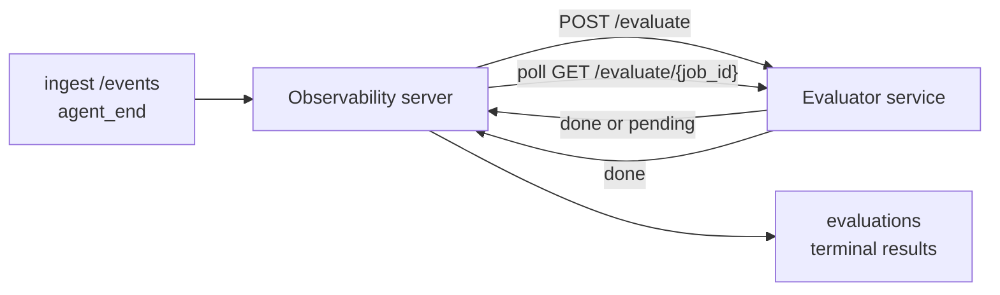

Failproof AI Observability có thể tự động chấm điểm từng agent run hoàn thành nhằm đánh giá chất lượng: bạn cung cấp một dịch vụ chấm điểm nhỏ, và Observability sẽ xử lý phần còn lại. Sử dụng nó để theo dõi các khía cạnh bạn quan tâm (tính hữu ích, hiệu quả công cụ, tính chính xác, an toàn; bạn lựa chọn), phát hiện các lỗi sớm và so sánh các agent hoặc môi trường một cách nhanh chóng. Chấm điểm là tùy chọn: đường dẫn sẽ không thực hiện gì cho đến khi bạn đặt `EVALUATOR_ENDPOINT` trên máy chủ.

> **Lưu ý:** Bạn xác định các khía cạnh chấm điểm. Bộ đánh giá của bạn có thể trả về bất kỳ khóa số nào; Observability sẽ lưu trữ, theo dõi xu hướng và hiển thị bất cứ thứ gì bạn gửi trở lại.

## Tóm tắt nhanh

1. **Viết một bộ chấm điểm.** Thiết lập một dịch vụ HTTP nhỏ đọc bản ghi phiên làm việc và trả về các điểm số. Observability cung cấp một tài liệu tham khảo hoạt động mà bạn có thể sao chép. Xem [Viết một bộ đánh giá với SDK](#writing-an-evaluator-with-the-sdk).
2. **Chỉ cho Observability biết địa chỉ của nó.** Đặt `EVALUATOR_ENDPOINT` (và một `EVALUATOR_TOKEN` được chia sẻ) trên quy trình máy chủ.
3. **Xem các điểm số được ghi lại.** Mỗi phiên hoàn thành được chấm điểm tự động; kết quả xuất hiện trên trang chi tiết phiên, lưới phiên và bảng điều khiển đã lưu.


*Khi một bộ đánh giá được cấu hình, mỗi lần chạy hoàn thành sẽ được chấm điểm và kết quả xuất hiện ở thanh bên phải của phiên: bản tóm tắt ở trên, sau đó là các thanh điểm số theo chiều với giải thích.*

---

## Cách hoạt động



Khi Failproof AI Observability SDK phát ra một sự kiện `agent_end` cho một phiên, máy chủ sẽ lên lịch đánh giá. Sau đó, nó gửi toàn bộ bản ghi sự kiện đến dịch vụ bộ đánh giá của bạn, dịch vụ này có thể:

- **Trả về kết quả ngay lập tức** với `{"status":"done", "scores":{...}, "reasoning":{...}, "summary":"..."}`. Kết quả được thêm vào dòng thời gian đánh giá của phiên. `reasoning` và `summary` là tùy chọn.
- **Hoãn lại** với `{"status":"pending", "job_id":"abc-123"}`. Observability sau đó gọi `GET {EVALUATOR_ENDPOINT}/evaluate/abc-123` cho đến khi bộ đánh giá của bạn trả về `{"status":"done", ...}` hoặc `{"status":"error", "error":"..."}`.

  Tần suất thăm dò được tính theo từng công việc: một phản hồi `pending` có thể bao gồm `next_poll_secs` để ghi đè; nếu không, Observability sử dụng giá trị `default_poll_interval_secs` từ `GET /config`; nếu không, máy chủ quay lại `EVALUATOR_POLLING_INTERVAL_SECS` (mặc định 10s). Tất cả giá trị được giới hạn trong [1s, 1h].

Các phiên không bao giờ phát ra `agent_end` (ví dụ, một quy trình agent bị sập) cũng có thể được chọn: `GET /config` của bộ đánh giá có thể trả về `{"inactivity_timeout_secs": 1800}`, và Observability sẽ đánh giá bất kỳ phiên nào đã không hoạt động trong thời gian đó. Đặt trường thành `null` hoặc bỏ qua nó để vô hiệu hóa phương pháp dự phòng này.

Đường dẫn là hoàn toàn no-op khi `EVALUATOR_ENDPOINT` không được đặt.

Một phiên có thể tích lũy **nhiều đánh giá cuối cùng theo thời gian**: mỗi sự kiện `agent_end` (và mỗi lần đánh giá lại thручного từ bảng điều khiển) thêm một hàng đánh giá mới. Đây là cách được hỗ trợ để đánh giá một cuộc trò chuyện được tiếp tục: người dùng kết thúc agent, quay lại sau, gửi thêm sự kiện, kết thúc agent lần nữa, và một đánh giá thứ hai chạy dựa trên toàn bộ bản ghi đã cập nhật. Bảng điều khiển hiển thị đánh giá gần đây nhất làm tiêu đề và các đánh giá trước đó dưới dạng dòng thời gian có thể thu gọn. Trong khi một đánh giá đang chạy cho một phiên, các sự kiện `agent_end` bổ sung cho phiên đó sẽ bị bỏ qua; sự kiện tiếp theo sau khi đánh giá đang chạy hoàn thành sẽ xếp hàng một đánh giá mới như bình thường.

Phương pháp dự phòng không hoạt động cũng tái kích hoạt trên các phiên được tiếp tục: nếu các sự kiện mới đến sau một đánh giá cuối cùng trước đó và phiên sau đó không hoạt động vượt quá `inactivity_timeout_secs`, một đánh giá mới sẽ được xếp hàng.

Các lỗi tạm thời (5xx, 429, timeouts, lỗi mạng) sẽ được thử lại với backoff lũy thừa cho đến `EVALUATOR_MAX_ATTEMPTS`; các phản hồi 4xx là cuối cùng. Observability có thể chạy an toàn với nhiều phiên bản máy chủ được mở rộng theo chiều ngang; công việc được phân chia sao cho cùng một phiên không bao giờ được gửi hai lần đồng thời.

---

## Hợp đồng HTTP

Mỗi tuyến đường được xác thực sử dụng **xác thực bearer token**. Giá trị tương tự phải được cấu hình ở cả hai bên:

- Máy chủ Observability: biến môi trường `EVALUATOR_TOKEN`
- Dịch vụ bộ đánh giá: được cấu hình theo cách tương tự (SDK `agenteye-evaluator` đọc `EVALUATOR_TOKEN` theo quy ước)

Nếu `EVALUATOR_TOKEN` không được đặt, máy chủ không gửi tiêu đề `Authorization`; bộ đánh giá có thể chấp nhận các yêu cầu ẩn danh, điều này tốt cho một mạng chỉ dùng nội bộ nhưng không nên dùng trên internet công cộng.

### Tuyến đường mà bộ đánh giá phải cung cấp

| Tuyến đường | Thân / tham số | Phản hồi |
|---|---|---|
| `GET /health` | không có | `{"status":"ok"}` (công khai, không xác thực) |
| `GET /config` | không có | `{"inactivity_timeout_secs": <int> \| null, "default_poll_interval_secs": <int> \| omitted}` |
| `POST /evaluate` | JSON `EvalRequest` | `{"status":"done", ...}` hoặc `{"status":"pending", "job_id":"..."}` |
| `GET /evaluate/{id}` | không có | hình dạng phản hồi giống như `/evaluate` |

### Thân bộ `EvalRequest` được gửi bởi máy chủ

```json
{
  "schema_version": "1",
  "session_id":     "session-abc123",
  "agent_id":       "planner",
  "environment":    "production",
  "started_at":     "2026-05-10T12:00:00Z",
  "ended_at":       "2026-05-10T12:05:00Z",
  "events": [
    { "id": 1234, "ts": "...", "event_type": "agent_start", "payload": { ... } },
    ...
  ]
}
```

### Hình dạng phản hồi

**Đồng bộ (xong):**

```json
{
  "status": "done",
  "scores": { "helpfulness": 0.85, "tool_efficiency": 0.6 },
  "reasoning": {
    "helpfulness": "answered the question directly with citations",
    "tool_efficiency": "called list_files three times when one would have done"
  },
  "summary": "strong answer quality, weak tool selection"
}
```

`reasoning` (bản đồ biện minh theo từng điểm) và `summary` (câu chuyện tổng thể một đoạn) đều là tùy chọn. Các khóa trong `reasoning` phải phản ánh các khóa trong `scores`; bảng điều khiển hiển thị mỗi mục nội tuyến dưới thanh điểm của nó. Các bộ đánh giá cũ chỉ trả về `scores` vẫn tiếp tục hoạt động không thay đổi; `reasoning` và `summary` đơn giản đọc dưới dạng null và các chức năng giao diện tương ứng bị bỏ qua.

**Không đồng bộ (hoãn lại):**

```json
{ "status": "pending", "job_id": "abc-123", "next_poll_secs": 30 }
```

`next_poll_secs` là tùy chọn; nếu bỏ qua, máy chủ sẽ quay lại `default_poll_interval_secs` của bộ đánh giá từ `/config`, sau đó đến biến môi trường `EVALUATOR_POLLING_INTERVAL_SECS` của nó.

**Lỗi bên phía bộ đánh giá cuối cùng:**

```json
{ "status": "error", "error": "model service unavailable" }
```

Máy chủ coi bất kỳ thân 2xx nào khác là lỗi giao thức và ghi lại lỗi cuối cùng cho phiên.

---

## Viết một bộ đánh giá với SDK

Bạn không phải triển khai hợp đồng HTTP bằng tay. Gói Python `agenteye-evaluator` cung cấp cho bạn một wrapper FastAPI được gõ xử lý xác thực, định tuyến và các hình dạng yêu cầu/phản hồi cho bạn.

Failproof AI Observability cũng cung cấp **một bộ đánh giá tham khảo hoạt động** chấm điểm `helpfulness`, `tool_efficiency` và `factuality` từ hình dạng của bản ghi. Sao chép nó như một điểm khởi đầu và hoán đổi logic của riêng bạn: một bộ phán xử LLM, một động cơ quy tắc, bất cứ thứ gì phù hợp với tiêu chuẩn chất lượng của bạn.

Bộ đánh giá tối thiểu khả thi:

```python
import os
from agenteye_evaluator import Evaluator, EvalRequest, EvalResponse

app = Evaluator(token=os.environ["EVALUATOR_TOKEN"])

@app.evaluator
def run(req: EvalRequest) -> EvalResponse:
    # Inspect req.events (the full session transcript) and return scores.
    tool_calls = sum(1 for e in req.events if e.event_type == "tool_use")
    return EvalResponse(
        scores={"tool_calls": float(tool_calls)},
        reasoning={"tool_calls": f"{tool_calls} tool invocations in the transcript"},
        summary="tight tool loop" if tool_calls < 5 else "agent looped on tools",
    )
```

Phiên bản `app` chạy dưới bất kỳ máy chủ ASGI nào, vì vậy `uvicorn module:app` khởi động nó.

Đối với các bộ đánh giá cần hoãn công việc tốn kém, trả về `JobPending` thay thế và đăng ký trình xử lý `@app.job_lookup`; máy chủ Observability thăm dò `GET /evaluate/{job_id}` cho đến khi bạn trả về trạng thái cuối cùng hoặc giới hạn `EVALUATOR_MAX_POLL_DURATION_SECS` (mặc định 1 h) trôi qua.

Tài liệu tham khảo API đầy đủ, mô hình không đồng bộ và lược đồ sự kiện được ghi lại trong README của SDK `agenteye-evaluator`.

---

## Chạy bộ đánh giá của bạn

Bộ đánh giá là **dịch vụ của bạn** — Failproof AI Observability không cung cấp bộ đánh giá mặc định, vì vậy bạn xây dựng và chạy nó ở bất cứ nơi nào bạn chạy các dịch vụ của riêng bạn. Nó chạy dưới bất kỳ máy chủ ASGI nào (ví dụ `uvicorn my_evaluator:app`); cung cấp các tuyến `/health`, `/config` và `/evaluate` từ [hợp đồng HTTP](#http-contract), sau đó chỉ máy chủ đến nó (xem [Cấu hình máy chủ](#configuring-the-server)).

Khi bộ đánh giá có thể truy cập được, `GET /health` trả về `{"status":"ok"}`. Sau khi agent chạy end-to-end, `GET /evaluations` trên máy chủ trả về một hàng với `status: "done"` và các điểm mà bộ đánh giá của bạn tạo ra.

---

## Cấu hình máy chủ

Đặt trên quy trình máy chủ:

| Biến môi trường | Ý nghĩa |
|---|---|
| `EVALUATOR_ENDPOINT` | URL cơ sở của bộ đánh giá của bạn (`http://evaluator:9000`). Không được đặt = đường dẫn bị vô hiệu hóa. |
| `EVALUATOR_TOKEN` | Bearer token. Phải bằng giá trị mà dịch vụ bộ đánh giá được cấu hình. |
| `EVALUATOR_WORKERS` | Tác vụ công nhân trên mỗi phiên bản máy chủ (mặc định 2). |
| `EVALUATOR_CLAIM_BATCH` | Hàng được yêu cầu trên mỗi tick của công nhân (mặc định 4). Các lô được xử lý **đồng thời**; tính đồng thời hiệu quả trên điểm cuối bộ đánh giá của bạn là `EVALUATOR_WORKERS × EVALUATOR_CLAIM_BATCH`. |
| `EVALUATOR_POLL_IDLE_SECS` | Một công nhân ngủ bao lâu giữa các nỗ lực gửi khi không có đánh giá nào đến hạn (mặc định 2s). |
| `EVALUATOR_POLLING_INTERVAL_SECS` | Fallback cuối cùng cho tần suất `GET /evaluate/{id}` khi không có `next_poll_secs` theo phản hồi cũng không có `default_poll_interval_secs` của bộ đánh giá được đặt (mặc định 10s). |
| `EVALUATOR_REQUEST_TIMEOUT_MS` | Timeout theo yêu cầu (mặc định 30000). |
| `EVALUATOR_MAX_ATTEMPTS` | Sau nhiều lần thất bại tạm thời, kết quả được ghi lại dưới dạng lỗi cuối cùng `error` (mặc định 5). |
| `EVALUATOR_CONFIG_REFRESH_SECS` | Tần suất `GET /config` (mặc định 300). |
| `EVALUATOR_MAX_POLL_DURATION_SECS` | Thời gian wallclock tối đa một phiên có thể ở trong hàng thăm dò trước khi bị chấm dứt dưới dạng `timeout` (mặc định 3600s). Bảo vệ chống lại bộ đánh giá không ngừng trả về `pending`. |

Để bật chấm điểm tự động, đặt cả `EVALUATOR_ENDPOINT` và `EVALUATOR_TOKEN` trên máy chủ, sau đó khởi động lại nó để áp dụng thay đổi. Với `EVALUATOR_ENDPOINT` không được đặt, đường dẫn vẫn là một no-op.

Các nút điều chỉnh trên là tùy chọn; chỉ đặt các biến môi trường tương ứng trên máy chủ nếu bạn cần ghi đè các giá trị mặc định.

---

## Tham chiếu API

| Phương pháp | Đường dẫn | Quyền bắt buộc | Mục đích |
|---|---|---|---|
| `GET` | `/evaluations` | `evaluations:read` | Kết quả cuối cùng truy vấn. Hỗ trợ `session_id`, `agent_id`, `environment`, `status` (`done`/`error`/`timeout`), `ts_from`, `ts_to`, `cursor`, `limit`, `score_filters`, `latest_per_session`. `limit` mặc định là 50 và được giới hạn ở 200 (lưu ý điều này khác với `/events`, giới hạn ở 1000). `environment` chấp nhận danh sách được phân tách bằng dấu phẩy (ví dụ `environment=prod,staging`); các giá trị duy nhất vẫn hoạt động. Với `latest_per_session=true`, phản hồi chứa tối đa một hàng trên mỗi `session_id` (gần đây nhất theo `completed_at`) được sử dụng bởi trang danh sách phiên để thu gọn dòng thời gian đánh giá của một phiên thành tiêu đề hiện tại của nó. Mặc định là false (trả về toàn bộ lịch sử). |
| `GET` | `/evaluations/aggregate` | `evaluations:read` | Sức khỏe eval được tổng hợp cho một lát được lọc: tổng số, phân tích done/error/timeout, thống kê theo khóa điểm (số/trung bình/tối thiểu/tối đa/p50 trên các khóa `scores` tùy ý) và dòng thời gian được phân nhóm theo thời gian. Chấp nhận **các tham số bộ lọc giống như `/evaluations`** cộng với `featured_keys` (CSV của các khóa điểm để theo dõi xu hướng) và `latest_per_session`. Cung cấp năng lượng cho tính năng Bảng điều khiển; các chỉ số chính xác trên toàn bộ tập hợp phù hợp, không được lấy mẫu. |
| `GET` | `/evaluations/environments` | `evaluations:read` | Các giá trị môi trường riêng biệt từ bảng `evaluations`. Được sử dụng để điền các danh sách thả xuống bộ lọc có phạm vi đến dữ liệu có thể đọc được đánh giá. |
| `GET` | `/evaluation-jobs` | `evaluations:read` | Khả năng hiển thị vào các đánh giá đang chuyển hướng. Bộ lọc theo `status` (`pending`/`polling`). |
| `GET` | `/events` | `events:read` | Phát trực tuyến các sự kiện thô của phiên. Hỗ trợ `session_id`, `agent_id`, `event_type` (CSV), `environment` (CSV), `ts_from`, `ts_to`, `cursor`, `limit` và `order`. `order` là `desc` (mới nhất trước, mặc định) hoặc `asc` (cũ nhất trước); một giá trị không được nhận dạng quay lại `desc`. Phân trang con trỏ thông qua `next_cursor` của phản hồi (một id sự kiện): chuyển nó trở lại dưới dạng `cursor` để lấy trang tiếp theo; với `asc`, trang tiếp theo là các sự kiện sau id đó, với `desc` là các sự kiện trước nó. `limit` mặc định là 50 và được giới hạn ở 1000. |
| `GET` | `/sessions/:session_id/export` | `events:read` | Trả về thân JSON chính xác mà bộ đánh giá sẽ nhận được cho phiên này, được cung cấp dưới dạng tệp đính kèm có thể tải xuống có tên `session-<id>.json`. Hữu ích để phát lại các phiên sản xuất thông qua `agenteye-evaluator` để kiểm tra ngoại tuyến. Các byte giống hệt với những gì đường dẫn bộ đánh giá gửi. |
| `POST` | `/sessions/:session_id/re-evaluate` | `evaluations:trigger` | Xếp hàng đánh giá mới cho một phiên; chạy cho dù đánh giá trước đó có tồn tại hay không. Kết quả mới **được thêm vào** dòng thời gian đánh giá của phiên thay vì ghi đè cái trước đó, vì vậy các điểm trước đó vẫn hiển thị dưới dạng lịch sử. Trả về `202` khi xếp hàng, `404` cho phiên không xác định, `409` nếu đánh giá đang chuyển hướng. Sử dụng sau khi triển khai bộ đánh giá mới hoặc cho các phiên không bao giờ phát ra `agent_end`. |

### Lọc theo phạm vi điểm: `score_filters`

`GET /evaluations` chấp nhận tham số `score_filters` tùy chọn làm hẹp kết quả theo các giá trị số bên trong đối tượng `scores`. Tham số là danh sách được phân tách bằng dấu phẩy của các mục `key:min..max`; bất kỳ ràng buộc nào cũng có thể bị bỏ qua. Nhiều mục kết hợp với AND logic. Các hàng trong đó khóa được đặt tên không có hoặc không phải số được loại trừ. Một yêu cầu có thể mang tối đa 20 mục bộ lọc; vượt quá điều đó trả về HTTP 400.

Ví dụ:
```text
# helpfulness in [0.5, 0.8]
GET /evaluations?score_filters=helpfulness:0.5..0.8

# tool_efficiency at most 0.3 (no lower bound)
GET /evaluations?score_filters=tool_efficiency:..0.3

# helpfulness >= 0.5 AND factuality >= 0.9
GET /evaluations?score_filters=helpfulness:0.5..,factuality:0.9..
```

Mỗi đối tượng phản hồi `/evaluations` có các trường này:

| Trường | Loại | Ghi chú |
|---|---|---|
| `evaluation_id` | string (UUID) | Định danh chính tắc cho đánh giá cuối cùng này. Mỗi đánh giá cuối cùng nhận được UUID mới; một phiên duy nhất có thể giữ nhiều. |
| `id` | string (UUID) | Bí danh tương thích ngược mang giá trị giống như `evaluation_id`. |
| `session_id` | string | Phiên mà đánh giá này chạy lại. Một phiên có thể có nhiều đánh giá trong dòng thời gian. |
| `agent_id` | string | Xác định agent tạo ra phiên. |
| `environment` | string | Nhãn môi trường được sao chép từ phiên. |
| `status` | enum | Một trong `"done"`, `"error"`, `"timeout"`. |
| `scores` | object \| null | Điểm trả về bởi bộ đánh giá của bạn. |
| `reasoning` | object \| null | Bản đồ biện minh theo từng điểm tùy chọn được trả về bởi bộ đánh giá của bạn. Các khóa thường phản ánh những khóa trong `scores`. Bảng điều khiển hiển thị mỗi mục dưới thanh điểm của nó. |
| `summary` | string \| null | Câu chuyện tổng thể tùy chọn một đoạn được trả về bởi bộ đánh giá của bạn. Bảng điều khiển hiển thị điều này ở trên phần tách điểm từng chiều dưới dạng tiêu đề của đánh giá. |
| `error` | string \| null | Chỉ được điền khi `"error"` / `"timeout"`. |
| `attempt_count` | integer | Số nỗ lực gửi (≥ 1). |
| `duration_ms` | integer \| null | Thời lượng của nỗ lực cuối cùng. |
| `completed_at` | string (ISO 8601 UTC) | Khi kết quả cuối cùng được ghi lại. Kết quả được sắp xếp theo `completed_at` (mới nhất trước). |
| `created_at` | string (ISO 8601 UTC) | Mang dấu thời gian giống với `completed_at` (ngữ nghĩa ghi một lần). |

---

## Quyền

| Quyền | Cấp phép |
|---|---|
| `evaluations:read` | Liệt kê kết quả đánh giá, xem điểm trong bảng điều khiển và tải các chỉ số sức khỏe bảng điều khiển. |
| `evaluations:trigger` | Xếp hàng đánh giá thủ công cho một phiên thông qua `POST /sessions/:session_id/re-evaluate` hoặc nút đánh giá lại của bảng điều khiển. |
| `dashboards:read` | Xem các bảng điều khiển được lưu (cũng cần `evaluations:read` để tải các chỉ số của họ). |
| `dashboards:write` | Tạo và chỉnh sửa bảng điều khiển. |
| `dashboards:delete` | Xóa bảng điều khiển. |

Admin bootstrap (`ADMIN_KEY`, `ADMIN_EMAIL`) tự động nhận được những cái này.

---

## Xem kết quả

- **`/sessions/<id>`**: dòng thời gian sự kiện + thanh bên phải hiển thị các điểm của phiên và bất kỳ lỗi nào từ nỗ lực gửi. Nếu khóa của bạn có `evaluations:trigger`, nút **đánh giá lại** xuất hiện bên cạnh nút xuất, hữu ích cho các phiên không bao giờ phát ra `agent_end` hoặc để làm mới các điểm sau khi triển khai bộ đánh giá mới. Bảng điều khiển thăm dò kết quả mới và cập nhật thanh bên phải khi nó đến.
- **`/sessions`**: lưới phiên có thể lọc; cột điểm hiển thị trạng thái đánh giá và điểm của mỗi phiên trong nháy mắt.
- **`/dashboards`**: chế độ xem sức khỏe eval được lưu (xem [Bảng điều khiển](#dashboards) bên dưới).


*Lưới phiên hiển thị trạng thái đánh giá và điểm của mỗi lần chạy trong nháy mắt; huy hiệu đỏ/hổi phách/xanh lá làm cho điểm thấp nổi lên.*

---

## Bảng điều khiển

Trang **Bảng điều khiển** (`/dashboards`) cho phép bạn lưu một sự kết hợp các bộ lọc đánh giá dưới dạng chế độ xem có tên, có thể sử dụng lại và xem cách tiết kiệm đánh giá đó đang diễn ra trong nháy mắt. Bảng điều khiển được **chia sẻ trên toàn bộ tổ chức của bạn**; mọi người có `dashboards:read` thấy cùng một bộ.

Mỗi bảng điều khiển ghim:

- **Bộ lọc**: các điều khiển giống như trang phiên: môi trường, trạng thái, agent, một cửa sổ thời gian lăn, và bộ lọc phạm vi điểm (`key:min..max`).
- **Cấu hình hiển thị**: các khóa điểm nào để nổi bật, ngưỡng sức khỏe xanh lá/hổi phách/đỏ, bảng nào để hiển thị và liệu có nên thu gọn thành đánh giá mới nhất trên mỗi phiên.

Mỗi thẻ hiển thị số lượng phiên phù hợp, phân tích done/error/timeout, trung bình của mỗi điểm nổi bật và một sparkline xu hướng nhỏ. Mở bảng điều khiển hiển thị các bảng kích thước đầy đủ; **mở trong phiên** thả bạn vào trang phiên được lọc trước chính xác vào tiết kiệm đó. Các chỉ số được tính toán phía máy chủ trên toàn bộ tập hợp phù hợp (thông qua `GET /evaluations/aggregate`), vì vậy các số chính xác thay vì được lấy mẫu.


**Quyền:** xem cần cả `dashboards:read` và `evaluations:read`; tạo và chỉnh sửa cần `dashboards:write`; xóa cần `dashboards:delete`. Admin bootstrap nhận tất cả những cái này tự động.

---

## Khắc phục sự cố

**Phiên tồn tại nhưng không có đánh giá nào được tạo.** Xác nhận `EVALUATOR_ENDPOINT` được đặt trên quy trình máy chủ, máy chủ và bộ đánh giá chia sẻ giá trị `EVALUATOR_TOKEN` tương tự và điểm cuối `/health` của bộ đánh giá có thể truy cập được từ máy chủ. Với `EVALUATOR_ENDPOINT` không được đặt, đường dẫn là một no-op.

**Các đánh giá đang chuyển hướng chất thêm.** Truy vấn `GET /evaluation-jobs` để xem hàng đợi đang chuyển hướng. Kiểm tra `attempt_count`, `next_attempt_at` và `last_error` trên mỗi hàng. Nguyên nhân thường gặp: dịch vụ bộ đánh giá không thể truy cập hoặc trả về 5xx (thử lại với backoff), `EVALUATOR_TOKEN` sai (401 là cuối cùng) hoặc bộ đánh giá không đồng bộ trả về `pending` vĩnh viễn (xem bên dưới).

**Phiên hoàn thành nhưng không có đánh giá cuối cùng.** Truy vấn `GET /evaluation-jobs?status=polling`; kết quả có thể vẫn đang chuyển hướng. Nếu công việc bị kẹt trong `pending`, máy chủ đang gặp khó khăn khi tiếp cận bộ đánh giá; kiểm tra rằng bộ đánh giá đang chạy và `EVALUATOR_TOKEN` khớp.

**`HTTP 401 từ bộ đánh giá: bearer token không hợp lệ`.** `EVALUATOR_TOKEN` trên máy chủ không khớp với giá trị dịch vụ bộ đánh giá được cấu hình. Chúng phải giống hệt nhau.

**Bộ đánh giá không đồng bộ trả về `pending` mãi mãi.** Máy chủ thăm dò `GET /evaluate/{job_id}` cho đến khi bộ đánh giá trả về `done` hoặc `error` hoặc cho đến khi `EVALUATOR_MAX_POLL_DURATION_SECS` (mặc định 1 h) trôi qua. Sau khi vượt giới hạn, đánh giá được ghi lại dưới dạng `timeout` và loại bỏ khỏi hàng đợi đang chuyển hướng. Tăng `EVALUATOR_MAX_POLL_DURATION_SECS` nếu bộ đánh giá của bạn hợp pháp cần lâu hơn mặc định.

---

## Các bước tiếp theo

- [Kỹ năng agent đánh giá](/vi/agenteye/evaluator-skill): có agent viết mã thiết kế các thứ nguyên của bạn dựa trên các phiên thực tế và xây dựng dịch vụ này cho bạn.
- [Python SDK](/vi/agenteye/python-sdk): phát ra các sự kiện `agent_end` kích hoạt chấm điểm.
- [Khóa API](/vi/agenteye/api-keys): quyền `evaluations:read` và `evaluations:trigger`.
- [Kiểm tra](/vi/agenteye/audits): tính năng chất lượng tự động khác của Observability, để xem xét dựa trên chính sách.