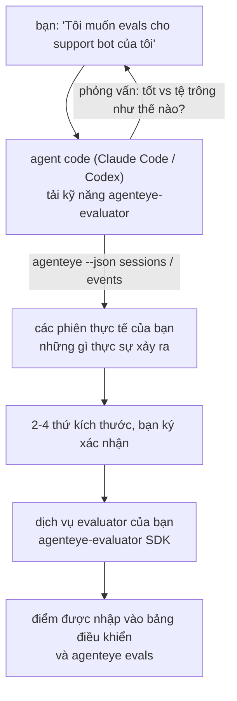

Từ *"Tôi nghĩ agent của chúng tôi đôi khi không hoạt động tốt"* đến một dịch vụ chấm điểm đã triển khai, với agent code của bạn vừa quyết định vừa xây dựng. **Kỹ năng đánh giá Failproof AI Observability** (`agenteye-evaluator`) là một *Agent Skill*: một thư mục nhỏ chứa các hướng dẫn mà một agent code như Claude Code hoặc Codex có thể tải theo yêu cầu. Nó dạy agent cách xác định những thứ kích thước chất lượng nào đáng theo dõi cho *agent của bạn*, sau đó viết, kiểm tra và triển khai [dịch vụ evaluator](/vi/agenteye/evaluation-suite) mà chấm điểm chúng.

Nó **không phải** là một scorer được lưu trữ, một registry bạn tải lên, hay một hệ thống plugin. Evaluator của bạn vẫn là dịch vụ HTTP riêng của bạn trên cơ sở hạ tầng riêng của bạn, chính xác như được mô tả trong hướng dẫn [bộ đánh giá](/vi/agenteye/evaluation-suite). Kỹ năng chỉ dạy agent cách xây dựng nó tốt, vì vậy mọi thứ nó làm, bạn cũng có thể tự làm bằng cách viết cùng một đoạn code.

---

## Phần khó là quyết định những gì cần chấm điểm

Bề mặt SDK rất nhỏ — một decorator và hai mô hình — và một agent có thể viết đó chỉ từ [hợp đồng](/vi/agenteye/evaluation-suite#http-contract) mà thôi. Đó không phải nơi evaluator thất bại. Chúng thất bại vì chấm điểm những thứ sai, và một evaluator chấm điểm sai thứ gì đó còn tồi tệ hơn không có: nó tạo ra một bảng điều khiển mà mọi người học cách bỏ qua.

Vì vậy, hầu hết kỹ năng là phần trước khi bất kỳ code nào tồn tại. Nó có agent phỏng vấn bạn (*"mô tả một lần chạy diễn ra tốt; giờ thì một lần diễn ra tệ"*), sau đó kéo các phiên thực tế của bạn thông qua [`agenteye` CLI](/vi/agenteye/cli) và đọc chúng từ đầu đến cuối. Hai nửa này thường không đồng ý, và khoảng cách chính là điểm: những gì bạn định đo lường so với những gì bản ghi của bạn thực sự có thể hỗ trợ. Một thứ kích thước chỉ tồn tại nếu nó **có thể tính toán được** từ các sự kiện và **phân biệt được** — nếu nó chấm 0.9 trên cả lần chạy tốt và lần chạy tệ của bạn, nó không dạy gì và bị cắt bỏ.

Những gì quay lại là một đề xuất 2-4 thứ kích thước kèm theo lý do, để bạn ký xác nhận trước khi viết một dòng code nào.



---

## Nó liên quan đến những phần đánh giá khác như thế nào

Bốn tài liệu bao gồm chấm điểm, và chúng bàn giao cho nhau theo thứ tự:

| Trang | Đó là gì | Sử dụng khi |
|---|---|---|
| **[Evaluations](/vi/agenteye/evaluations)** | Tính năng: điểm trên lưới phiên, bảng điều khiển, đánh giá lại | Bạn muốn biết chấm điểm tự động mang lại gì |
| **[Bộ đánh giá](/vi/agenteye/evaluation-suite)** | Hợp đồng HTTP, SDK, biến môi trường máy chủ | Bạn đang triển khai hoặc gỡ lỗi evaluator một mình |
| **Kỹ năng Evaluator** (tài liệu này) | Một cửa trước ngôn ngữ tự nhiên để thiết kế *và* xây dựng scorer | Bạn muốn đi từ "Tôi muốn evals" đến một dịch vụ đang chạy |
| **[Kỹ năng CLI](/vi/agenteye/cli-skill)** | Một cửa trước ngôn ngữ tự nhiên trên CLI `agenteye` | Bạn muốn *đọc* những điểm bạn đã có |
| **[Kỹ năng Python SDK](/vi/agenteye/python-sdk-skill)** | Một cửa trước ngôn ngữ tự nhiên về việc instrumentation agent của bạn | Agent của bạn chưa phát ra phiên — không có gì để chấm |

### so với kỹ năng CLI: xây dựng so với đọc

Hai kỹ năng được thiết kế cố ý không trùng lặp, và cài đặt cả hai là cấu hình bình thường — agent chọn giữa chúng dựa trên những gì bạn hỏi:

- **`agenteye-evaluator`** (tài liệu này) xây dựng thứ *tạo ra* điểm. Công việc của nó kết thúc khi điểm được nhập lần đầu tiên.
- **[`agenteye-cli`](/vi/agenteye/cli-skill)** đọc điểm đã tồn tại (`agenteye evals`). *"Chất lượng có giảm tuần này không?"* là câu hỏi của nó, không phải của kỹ năng này.

---

## Yêu cầu trước

1. **`agenteye` CLI được cài đặt và đã đăng nhập** (`pipx install agenteye`, sau đó `agenteye login`). Kỹ năng dựa vào nó hai lần: để kéo các phiên thực tế nó thiết kế, và để xác nhận điểm của bạn được nhập ở cuối. Lần đăng nhập của bạn cần `events:read`, cộng với `evaluations:read` để kiểm tra cuối cùng đó. Như với kỹ năng CLI, nó **không thể** hoàn thành lần đăng nhập mã một lần qua email cho bạn.
2. **Một nơi để evaluator tồn tại.** Nó được xây dựng thành một image và chạy như một dịch vụ chạy lâu dài, vì vậy nó cần một kho thực tế, không phải một tệp scratch. Evaluator thường sống trong kho của riêng chúng, tách rời khỏi agent được chấm — kỹ năng tìm kiếm một cái hiện có và hỏi trước khi scaffolding một cái mới.
3. **Bánh xe SDK `agenteye-evaluator`** — đọc phần tiếp theo trước khi agent của bạn bắt đầu nhập các lệnh `pip`.

---

## Nơi để lấy nó

Kỹ năng được công bố trong bộ sưu tập kỹ năng công khai của Failproof AI:

**[github.com/FailproofAI/skills](https://github.com/FailproofAI/skills)** → [`skills/agenteye-evaluator/`](https://github.com/FailproofAI/skills/tree/main/skills/agenteye-evaluator)

Kho lưu trữ là công khai và kỹ năng không cần bất kỳ thông tin xác thực nào của riêng nó — nó chỉ điều khiển CLI `agenteye` với phiên *bạn* đã đăng nhập, và viết code trong *kho của bạn*. Lưu ý rằng nó được xuất hành như một thư mục riêng của nó và **không** nằm trong gói `pipx install agenteye`, vì vậy không tìm nó ở đó.

## Cài đặt kỹ năng

Con đường nhanh nhất là CLI [`skills`](https://skills.sh), nó lấy thư mục và đặt nó nơi agent của bạn tìm kiếm:

```bash
# Claude Code, chỉ dự án này
npx skills add FailproofAI/skills --skill agenteye-evaluator -a claude-code

# mọi dự án (cài đặt vào ~/.claude/skills/)
npx skills add FailproofAI/skills --skill agenteye-evaluator -a claude-code -g --copy

# Codex thay vào đó
npx skills add FailproofAI/skills --skill agenteye-evaluator -a codex
```

Sau đó quản lý nó như bất kỳ kỹ năng nào khác:

```bash
npx skills list -a claude-code           # cái nào được cài
npx skills update agenteye-evaluator     # kéo phiên bản mới nhất
npx skills remove agenteye-evaluator     # gỡ nó
```

Thích cài đặt bằng tay? Một Agent Skill chỉ là một thư mục chứa một `SKILL.md` (cộng với các tham chiếu tùy chọn), vì vậy sao chép nó cũng hoạt động:

- **Claude Code**: đặt thư mục `agenteye-evaluator/` trong `~/.claude/skills/` (mọi dự án) hoặc `<kho-của-bạn>/.claude/skills/` (chỉ kho đó). Claude Code tự động phát hiện nó — xác minh bằng danh sách `/skills`, hoặc chỉ hỏi về evals.
- **Codex (OpenAI)**: Codex đọc cùng `SKILL.md`. `agents/openai.yaml` đi kèm đặt `allow_implicit_invocation: true`, vì vậy Codex tự động chọn kỹ năng khi một tác vụ khớp; nếu không thì gọi nó một cách rõ ràng như `$agenteye-evaluator`.

---

## SDK không có trên public PyPI

> **Cảnh báo:** Đọc điều này trước khi để một agent cài đặt SDK.

Kỹ năng là công khai; SDK nó điều khiển không phải. `agenteye-evaluator` chỉ được xuất hành như một artifact phát hành riêng, và không giống `agenteye`, tên **không được yêu cầu trên public PyPI** — vì vậy một `pip install agenteye-evaluator` trần có thể kéo gói của người lạ vào dịch vụ đọc bản ghi sản xuất của bạn. Đó là một vấn đề chuỗi cung ứng, không phải một lỗi đánh máy.

Kỹ năng biết điều này và hoạt động xuống một thang máy cài đặt thay vào đó, dừng ở bậc đầu tiên áp dụng: nguồn monorepo nếu bạn ở trong kho AgentEye, nếu không thì bánh xe phát hành riêng từ GitHub Releases (cần truy cập), và nếu không thể truy cập được cả hai thì nó **dừng lại và yêu cầu bạn liên hệ với liên hệ Failproof AI của bạn để lấy bánh xe** thay vì tự tìm cách.

Vì vậy, nếu agent của bạn đề xuất một `pip install agenteye-evaluator` trần từ public PyPI, đó là dấu hiệu cho thấy kỹ năng không bao giờ tải. Dừng lại ở đó và kiểm tra nó được cài đặt.

---

## Bạn có thể hỏi nó gì

Một vòng lặp thực tế bắt đầu với một yêu cầu mơ hồ và kết thúc với một thiết kế được ký xác nhận, không phải với code:

```text
bạn   ▸ Tôi muốn evals cho support bot của chúng tôi. Tôi nghĩ đôi khi nó không tốt.

agent ▸ Trước khi tôi viết bất kỳ thứ gì: mô tả một lần chạy diễn ra tốt,
        và một lần diễn ra tệ.

bạn   ▸ Tốt: nó trả lời từ tài liệu. Tệ: nó bịa chuyện,
        hoặc từ bỏ và nói "liên hệ bộ phận hỗ trợ".

agent ▸ Đang chạy: agenteye --json sessions --status error --since 7d
        Đọc 5 phiên, bao gồm hai cái bạn gọi là tệ.

        Những từ của bạn nói về tính xác thực và sự từ chối. Bản ghi đồng ý
        về sự từ chối (2 của 5 kết thúc bằng một chuyến tay đến hỗ trợ,
        và nó rõ ràng trong model_response.content), nhưng tính xác thực
        cần một sự thật cơ bản mà sự kiện của bạn không mang.

        Vì vậy tôi sẽ chấm ba điều:
          - deflection      quy tắc, rẻ, tách hai lần chạy của bạn
          - tool_efficiency quy tắc, bắt lại vòng lặp retry trong run-004
          - groundedness    LLM judge: mọi yêu sách trong tài liệu nó lấy có đúng không?

        "factuality" sẽ cần sự thật cơ bản mà chúng tôi không có; groundedness
        là thứ gần nhất mà bản ghi của bạn thực sự có thể hỗ trợ.
        OK với ba cái tên đó? Đổi tên sau này sẽ chia nhỏ lịch sử.

bạn   ▸ vâng

agent ▸ Không có evaluator trong kho này. Tôi có nên scaffolding một ở đây không, hoặc
        bạn có một ở chỗ khác?
```

Từ đó nó viết những thứ kích thước dựa trên quy tắc trước tiên (miễn phí, tức thì, xác định), kiểm tra chúng dựa trên một phiên bắt được thực tế bao gồm những cái trống và không bao giờ hoàn thành khiến evaluator ngây thơ bị sập, và chỉ tiếp cận một LLM judge trên thứ kích thước chủ quan. Nó biết những giới hạn của [dispatcher](/vi/agenteye/evaluation-suite#configuring-the-server) — một timeout yêu cầu 30 giây và 8 lệnh gọi đồng thời trên toàn bộ triển khai — vì vậy nếu judge không sẽ thích hợp một cách đáng tin cậy, nó đi không đồng bộ với `JobPending` thay vì để judge bị hủy và thử lại năm lần với chi phí năm lần.

Sau đó nó triển khai, đặt hai biến môi trường máy chủ, và xác nhận bằng `agenteye --json evals --session-id <id>` rằng điểm thực sự được nhập. Điểm được nhập là bằng chứng duy nhất.

---

## Những gì cần lưu ý

- **Tên thứ kích thước gần như vĩnh viễn.** Khóa điểm là các chuỗi tùy ý và xu hướng nền tảng bất kỳ thứ gì bạn gửi, có nghĩa là không có gì hạ lưu sửa một lựa chọn xấu. Đổi tên sau này và lịch sử chia tách: các phiên cũ giữ khóa cũ và xu hướng bị gãy. Đây là lý do tại sao kỹ năng có được ký xác nhận rõ ràng trước khi viết code — hãy coi lời nhắc đó một cách nghiêm túc.
- **Fixture là bản ghi sản xuất thực tế.** Thiết kế dựa trên các phiên thực tế có nghĩa là kéo chúng vào đĩa, và chúng có thể chứa dữ liệu khách hàng. Kỹ năng hỏi trước khi commit chúng vào git; nếu nghi ngờ, giữ `fixtures/` ra khỏi kho và có mỗi nhà phát triển kéo của riêng họ.
- **Agent viết và triển khai một dịch vụ đọc mọi bản ghi.** Nó hoạt động như bạn, được giới hạn bởi quyền đăng nhập CLI của bạn, nhưng xem xét evaluator như bất kỳ code nào khác sử dụng dữ liệu sản xuất.

---

## Bước tiếp theo

- **[Bộ đánh giá](/vi/agenteye/evaluation-suite)**: hợp đồng HTTP, SDK, và biến môi trường máy chủ mà kỹ năng cấu hình.
- **[Evaluations](/vi/agenteye/evaluations)**: nơi điểm xuất hiện một khi chúng được nhập.
- **[Kỹ năng CLI](/vi/agenteye/cli-skill)**: kỹ năng anh em, để đọc kết quả thay vì xây dựng scorer.
- **[CLI](/vi/agenteye/cli)**: tham chiếu lệnh phía sau dữ liệu phiên mà kỹ năng thiết kế.