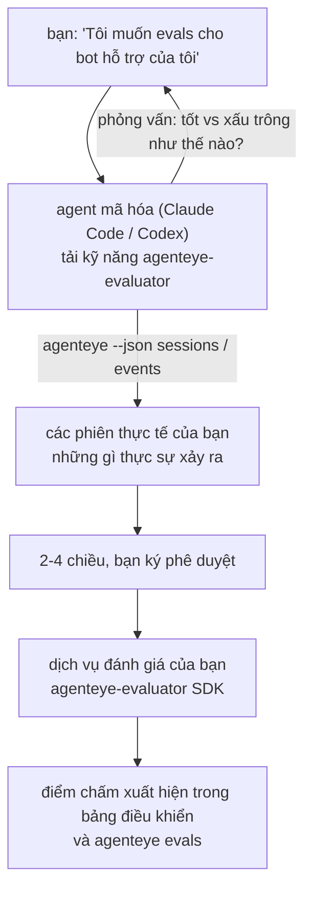

Từ *"Tôi nghĩ agent của chúng ta đôi khi có vấn đề"* đến một dịch vụ chấm điểm được triển khai, với agent mã hóa của bạn thực hiện cả việc quyết định và xây dựng. **Kỹ năng đánh giá quan sát Failproof AI** (`agenteye-evaluator`) là một *Agent Skill*: một thư mục nhỏ chứa các hướng dẫn mà một agent mã hóa như Claude Code hoặc Codex tải khi cần. Nó dạy agent cách xác định những chiều kích chất lượng nào đáng theo dõi cho *agent* của bạn, sau đó viết, kiểm tra và triển khai [dịch vụ đánh giá](/vi/agenteye/evaluation-suite) để chấm điểm chúng.

Đây **không phải** là một trình chấm điểm được lưu trữ, một sổ đăng ký bạn tải lên, hoặc một hệ thống plugin. Trình đánh giá của bạn vẫn là dịch vụ HTTP của riêng bạn trên cơ sở hạ tầng của bạn, chính xác như được mô tả trong hướng dẫn [Evaluation suite](/vi/agenteye/evaluation-suite). Kỹ năng chỉ dạy agent của bạn cách xây dựng nó tốt, vì vậy mọi thứ nó làm, bạn cũng có thể tự làm bằng cách viết cùng một mã.

---

## Phần khó là quyết định những gì cần chấm điểm

Bề mặt SDK nhỏ — một decorator và hai mô hình — và một agent có thể viết điều đó từ [hợp đồng](/vi/agenteye/evaluation-suite#http-contract) một mình. Đó không phải là nơi các trình đánh giá thất bại. Chúng thất bại vì chúng chấm điểm những thứ sai, và một trình đánh giá chấm điểm những thứ sai còn tệ hơn không có: nó tạo ra một bảng điều khiển mà mọi người học cách bỏ qua.

Vì vậy, phần lớn kỹ năng là phần trước khi bất kỳ mã nào tồn tại. Nó có agent phỏng vấn bạn (*"mô tả một lần chạy diễn ra tốt; giờ là một lần diễn ra tệ"*), sau đó kéo các phiên thực tế của bạn qua [`agenteye` CLI](/vi/agenteye/cli) và đọc chúng từ đầu đến cuối. Hai nửa này thường không đồng ý, và khoảng cách là điểm quan trọng: những gì bạn dự định đo lường so với những gì các bảng ghi của bạn có thể thực sự hỗ trợ. Một chiều chỉ tồn tại nếu nó **có thể tính toán được** từ các sự kiện và **phân biệt được** — nếu nó chấm 0.9 trên cả lần chạy tốt và lần chạy tệ của bạn, nó không dạy gì cả và bị cắt bỏ.

Những gì quay trở lại là một đề xuất 2-4 chiều kèm theo lý do, để bạn ký phê duyệt trước khi viết một dòng mã nào.



---

## Nó liên quan như thế nào đến các phần đánh giá khác

Bốn tài liệu bao gồm chấm điểm, và chúng bàn giao cho nhau theo thứ tự:

| Trang | Nó là gì | Hãy tìm đến nó khi |
|---|---|---|
| **[Evaluations](/vi/agenteye/evaluations)** | Tính năng: điểm trên lưới phiên, bảng điều khiển, đánh giá lại | Bạn muốn biết chấm điểm tự động mang lại gì |
| **[Evaluation suite](/vi/agenteye/evaluation-suite)** | Hợp đồng HTTP, SDK, các biến env máy chủ | Bạn đang triển khai hoặc gỡ lỗi trình đánh giá tự mình |
| **Evaluator skill** (tài liệu này) | Cửa trước ngôn ngữ tự nhiên để thiết kế *và* xây dựng trình chấm điểm | Bạn muốn đi từ "Tôi muốn evals" đến một dịch vụ chạy |
| **[CLI skill](/vi/agenteye/cli-skill)** | Cửa trước ngôn ngữ tự nhiên trên `agenteye` CLI | Bạn muốn *đọc* các điểm bạn đã có |
| **[Python SDK skill](/vi/agenteye/python-sdk-skill)** | Cửa trước ngôn ngữ tự nhiên về instrumenting agent của bạn | Agent của bạn chưa phát hành phiên — không có gì để chấm điểm |

### so với CLI skill: xây dựng versus đọc

Hai kỹ năng được cố ý không trùng lặp, và cài đặt cả hai là thiết lập bình thường — agent chọn giữa chúng dựa trên những gì bạn yêu cầu:

- **`agenteye-evaluator`** (tài liệu này) xây dựng thứ *tạo ra* điểm. Công việc của nó kết thúc khi điểm xuất hiện lần đầu tiên.
- **[`agenteye-cli`](/vi/agenteye/cli-skill)** đọc điểm đã tồn tại (`agenteye evals`). *"Chất lượng có giảm tuần này không?"* là câu hỏi của nó, không phải của kỹ năng này.

---

## Điều kiện tiên quyết

1. **`agenteye` CLI được cài đặt và đăng nhập** (`pipx install agenteye`, sau đó `agenteye login`). Kỹ năng dựa trên nó hai lần: để kéo các phiên thực tế nó thiết kế, và để xác nhận điểm của bạn được đưa ra vào cuối. Đăng nhập của bạn cần `events:read`, cộng với `evaluations:read` cho kiểm tra cuối cùng đó. Giống như CLI skill, nó **không thể** hoàn thành đăng nhập mã một lần được gửi qua email cho bạn.
2. **Nơi cho trình đánh giá sống.** Nó được xây dựng thành một hình ảnh và chạy như một dịch vụ chạy lâu dài, vì vậy nó cần một repo thực, không phải một tập tin tạm thời. Các trình đánh giá thường sống trong repo riêng của chúng, tách biệt với agent được chấm điểm — kỹ năng tìm kiếm một repo hiện có và hỏi trước khi khởi tạo một repo mới.
3. **Bánh xe SDK `agenteye-evaluator`** — đọc phần tiếp theo trước khi agent bắt đầu gõ các lệnh `pip`.

---

## Nơi để lấy nó

Kỹ năng được xuất bản trong bộ sưu tập kỹ năng công cộng của Failproof AI:

**[github.com/FailproofAI/skills](https://github.com/FailproofAI/skills)** → [`skills/agenteye-evaluator/`](https://github.com/FailproofAI/skills/tree/main/skills/agenteye-evaluator)

Kho lưu trữ là công cộng và kỹ năng không cần bất kỳ thông tin đăng nhập nào của riêng nó — nó chỉ điều khiển CLI `agenteye` với phiên *mà bạn* đã đăng nhập, và viết mã trong *repo* của bạn. Lưu ý nó được gửi dưới dạng thư mục riêng của nó và **không** nằm trong gói `pipx install agenteye`, vì vậy đừng tìm kiếm nó ở đó.

## Cài đặt kỹ năng

Đường dẫn nhanh nhất là CLI [`skills`](https://skills.sh), nó lấy thư mục và đặt nó nơi agent của bạn tìm kiếm:

```bash
# Claude Code, chỉ dự án này
npx skills add FailproofAI/skills --skill agenteye-evaluator -a claude-code

# mọi dự án (cài đặt đến ~/.claude/skills/)
npx skills add FailproofAI/skills --skill agenteye-evaluator -a claude-code -g --copy

# Codex thay vào đó
npx skills add FailproofAI/skills --skill agenteye-evaluator -a codex
```

Sau đó quản lý nó như bất kỳ kỹ năng nào khác:

```bash
npx skills list -a claude-code           # cái gì được cài đặt
npx skills update agenteye-evaluator     # kéo phiên bản mới nhất
npx skills remove agenteye-evaluator     # xóa nó
```

Thích cài đặt bằng tay? An Agent Skill chỉ là một thư mục chứa `SKILL.md` (cộng với các tham chiếu tùy chọn), vì vậy sao chép nó cũng hoạt động:

- **Claude Code**: đặt thư mục `agenteye-evaluator/` trong `~/.claude/skills/` (mọi dự án) hoặc `<your-repo>/.claude/skills/` (chỉ repo đó). Claude Code tự động phát hiện nó — xác minh bằng danh sách `/skills`, hoặc chỉ cần yêu cầu evals.
- **Codex (OpenAI)**: Codex đọc cùng `SKILL.md`. `agents/openai.yaml` được đóng gói thiết lập `allow_implicit_invocation: true`, vì vậy Codex tự động chọn kỹ năng khi một tác vụ phù hợp; nếu không, gọi nó một cách rõ ràng là `$agenteye-evaluator`.

---

## SDK không nằm trên PyPI công cộng

> **Warning:** Đọc điều này trước khi để agent cài đặt SDK.

Kỹ năng là công cộng; SDK nó điều khiển không phải. `agenteye-evaluator` chỉ được gửi dưới dạng artefact phát hành riêng, và không giống như `agenteye`, tên **không được đặt quyền sở hữu trên PyPI công cộng** — vì vậy một bare `pip install agenteye-evaluator` có thể kéo gói của người lạ vào dịch vụ đọc bảng ghi sản xuất của bạn. Đó là một vấn đề chuỗi cung ứng, không phải một lỗi đánh máy.

Kỹ năng biết điều này và hoạt động xuống một thang cài đặt thay vào đó, dừng lại ở bậc đầu tiên áp dụng: nguồn monorepo nếu bạn bên trong repo AgentEye, nếu không là bánh xe phát hành riêng từ GitHub Releases (cần quyền truy cập), và nếu không thể truy cập cái nào nó **dừng lại và bảo bạn liên hệ với người liên hệ Failproof AI của bạn để lấy bánh xe** thay vì tự do.

Vì vậy, nếu agent của bạn đề xuất một bare `pip install agenteye-evaluator` từ PyPI công cộng, đó là dấu hiệu kỹ năng không bao giờ được tải. Dừng lại ở đó và kiểm tra xem nó có được cài đặt không.

---

## Bạn có thể yêu cầu nó những gì

Một vòng truyền thực tế bắt đầu với một yêu cầu mơ hồ và kết thúc bằng một thiết kế được ký phê duyệt, không phải mã:

```text
bạn  ▸ Tôi muốn evals cho bot hỗ trợ của chúng tôi. Tôi nghĩ đôi khi nó có vấn đề.

agent ▸ Trước khi tôi viết bất cứ thứ gì: mô tả một lần chạy diễn ra tốt,
        và một lần diễn ra tệ.

bạn  ▸ Tốt: nó trả lời từ tài liệu. Tệ: nó bịa, hoặc từ bỏ và nói
        "liên hệ hỗ trợ".

agent ▸ Chạy: agenteye --json sessions --status error --since 7d
        Đọc 5 phiên, bao gồm hai phiên bạn gọi là tệ.

        Lời của bạn nói về độ trung thực và chuyển hướng. Các bảng ghi
        đồng ý về chuyển hướng (2 của 5 kết thúc bằng bàn giao hỗ trợ,
        và nó rõ ràng trong model_response.content), nhưng độ trung thực
        cần một sự thật mà các sự kiện của bạn không mang.

        Vì vậy tôi sẽ chấm ba thứ:
          - deflection      quy tắc, rẻ, phân biệt hai lần chạy của bạn
          - tool_efficiency quy tắc, bắt vòng lặp thử lại trong run-004
          - groundedness    LLM judge: mọi tuyên bố có trong tài liệu nó lấy được không?

        "factuality" sẽ cần sự thật mà chúng ta không có; groundedness
        là điều gần nhất các bảng ghi của bạn thực sự có thể hỗ trợ.
        Được không với ba tên đó? Đổi tên sau sẽ chia tách lịch sử.

bạn  ▸ được

agent ▸ Không có trình đánh giá trong repo này. Tôi nên khởi tạo một ở đây,
        hay bạn có một nơi khác?
```

Từ đó, nó viết các chiều dựa trên quy tắc đầu tiên (miễn phí, tức thì, xác định), kiểm tra chúng so với một phiên được ghi lại thực tế bao gồm những phiên trống và không bao giờ hoàn thành làm hỏng các trình đánh giá ngây thơ, và chỉ hướng đến một LLM judge trên chiều chủ quan. Nó biết [giới hạn của dispatcher](/vi/agenteye/evaluation-suite#configuring-the-server) — hết thời gian yêu cầu 30 giây và 8 cuộc gọi đồng thời trên toàn bộ triển khai — vì vậy nếu judge không thể đáp ứng một cách đáng tin cây, nó đi không đồng bộ với `JobPending` thay vì để judge của bạn bị hủy và thử lại năm lần với chi phí gấp năm lần.

Sau đó, nó triển khai, thiết lập hai biến env máy chủ, và xác nhận bằng `agenteye --json evals --session-id <id>` rằng điểm thực sự được đưa ra. Điểm được đưa ra là bằng chứng duy nhất.

---

## Những gì cần chú ý

- **Tên chiều gần như vĩnh viễn.** Các khóa điểm là chuỗi tùy ý và nền tảng xu hướng bất cứ thứ gì bạn gửi, có nghĩa là không gì hạ lưu sửa một lựa chọn xấu. Đổi tên sau và lịch sử chia tách: các phiên cũ giữ khóa cũ và xu hướng ngắt. Đây là lý do kỹ năng lấy ký hiệu phê duyệt rõ ràng trước khi viết mã — hãy coi trọng lời nhắc đó.
- **Fixtures là các bảng ghi sản xuất thực tế.** Thiết kế dựa trên các phiên thực tế có nghĩa là kéo chúng đến ổ đĩa, và chúng có thể chứa dữ liệu khách hàng. Kỹ năng hỏi trước khi cam kết chúng vào git; nếu không chắc chắn, giữ `fixtures/` ngoài repo và để mỗi nhà phát triển kéo riêng của họ.
- **Agent viết và triển khai một dịch vụ đọc mọi bảng ghi.** Nó hoạt động như bạn, giới hạn bởi các quyền đăng nhập CLI của bạn, nhưng hãy xem xét trình đánh giá như bất kỳ mã nào khác chạm vào dữ liệu sản xuất.

---

## Bước tiếp theo

- **[Evaluation suite](/vi/agenteye/evaluation-suite)**: hợp đồng HTTP, SDK, và các biến env máy chủ mà kỹ năng cấu hình.
- **[Evaluations](/vi/agenteye/evaluations)**: nơi điểm xuất hiện khi chúng được đưa ra.
- **[CLI skill](/vi/agenteye/cli-skill)**: kỹ năng anh chị em, để đọc kết quả thay vì xây dựng trình chấm điểm.
- **[CLI](/vi/agenteye/cli)**: tham chiếu lệnh đằng sau dữ liệu phiên mà kỹ năng thiết kế.