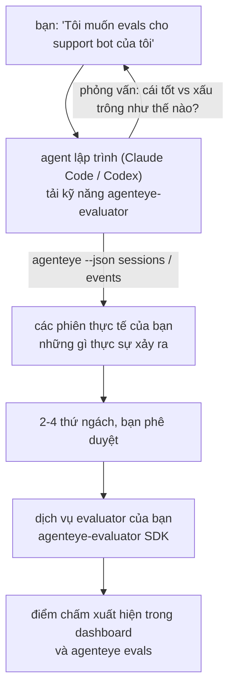

Từ *"Tôi nghĩ agent của chúng tôi đôi khi không tốt"* đến một dịch vụ chấm điểm được triển khai, với agent lập trình của bạn vừa quyết định vừa xây dựng. **Kỹ năng Failproof AI Observability evaluator** (`agenteye-evaluator`) là một *Agent Skill*: một thư mục nhỏ chứa các hướng dẫn mà một agent lập trình như Claude Code hoặc Codex có thể tải theo yêu cầu. Nó dạy cho agent cách xác định những thứ ngách chất lượng nào có giá trị theo dõi cho *agent của bạn*, sau đó viết, kiểm tra và triển khai [dịch vụ evaluator](/vi/agenteye/evaluation-suite) để chấm điểm chúng.

Đây **không** phải là một người chấm điểm được lưu trữ, một bộ đăng ký bạn tải lên, hoặc một hệ thống plugin. Evaluator của bạn vẫn là dịch vụ HTTP riêng của bạn trên cơ sở hạ tầng riêng của bạn, chính xác như được mô tả trong hướng dẫn [Evaluation suite](/vi/agenteye/evaluation-suite). Kỹ năng chỉ dạy agent của bạn cách xây dựng nó tốt, vì vậy mọi thứ nó làm, bạn cũng có thể tự làm bằng cách viết cùng một mã.

---

## Phần khó là quyết định những gì cần chấm điểm

Bề mặt SDK rất nhỏ — một decorator và hai model — và một agent có thể viết được từ [hợp đồng](/vi/agenteye/evaluation-suite#http-contract) một mình. Đó không phải là chỗ mà những evaluator thất bại. Chúng thất bại vì chúng chấm điểm những thứ sai, và một evaluator chấm điểm những thứ sai còn tệ hơn không có: nó tạo ra một dashboard mà mọi người học cách bỏ qua.

Vì vậy phần lớn kỹ năng là phần trước khi bất kỳ mã nào tồn tại. Nó có agent phỏng vấn bạn (*"mô tả một lần chạy tốt; bây giờ một cái xấu"*), sau đó kéo các phiên thực tế của bạn qua [`agenteye` CLI](/vi/agenteye/cli) và đọc chúng từ đầu đến cuối. Hai nửa này thường không đồng ý, và khoảng cách là điểm: những gì bạn dự định đo lường so với những gì mà các bảng ghi của bạn thực sự có thể hỗ trợ. Một thứ ngách chỉ tồn tại nếu nó **có thể tính toán được** từ các sự kiện và **phân biệt được** — nếu nó chấm 0,9 trên cả lần chạy tốt và xấu của bạn, nó không dạy gì cả và bị cắt.

Những gì quay trở lại là một đề xuất 2-4 thứ ngách với lý do kèm theo, để bạn phê duyệt trước khi viết một dòng code.



---

## Nó liên quan như thế nào đến các phần đánh giá khác

Bốn tài liệu bao gồm chấm điểm, và chúng chuyển giao cho nhau theo thứ tự:

| Trang | Đó là gì | Sử dụng khi |
|---|---|---|
| **[Evaluations](/vi/agenteye/evaluations)** | Tính năng: điểm trên lưới phiên, dashboard, đánh giá lại | Bạn muốn biết điều gì mà chấm điểm tự động mang lại |
| **[Evaluation suite](/vi/agenteye/evaluation-suite)** | Hợp đồng HTTP, SDK, các biến môi trường máy chủ | Bạn đang triển khai hoặc gỡ lỗi evaluator của riêng bạn |
| **Evaluator skill** (tài liệu này) | Một cửa trước ngôn ngữ tự nhiên về thiết kế *và* xây dựng người chấm điểm | Bạn muốn đi từ "Tôi muốn evals" đến một dịch vụ chạy |
| **[CLI skill](/vi/agenteye/cli-skill)** | Một cửa trước ngôn ngữ tự nhiên trên CLI `agenteye` | Bạn muốn *đọc* những điểm bạn đã có |
| **[Python SDK skill](/vi/agenteye/python-sdk-skill)** | Một cửa trước ngôn ngữ tự nhiên về cấu hình agent của bạn | Agent của bạn chưa phát hành phiên — không có gì để chấm điểm |

### so với CLI skill: xây dựng so với đọc

Hai kỹ năng này được thiết kế cố ý không trùng lặp, và cài đặt cả hai là thiết lập bình thường — agent chọn giữa chúng dựa trên những gì bạn yêu cầu:

- **`agenteye-evaluator`** (tài liệu này) xây dựng thứ *tạo ra* điểm. Công việc của nó kết thúc khi điểm chấm xuất hiện lần đầu tiên.
- **[`agenteye-cli`](/vi/agenteye/cli-skill)** đọc các điểm đã tồn tại (`agenteye evals`). *"Chất lượng có giảm tuần này không?"* là câu hỏi của nó, không phải của kỹ năng này.

---

## Điều kiện tiên quyết

1. **`agenteye` CLI được cài đặt và đăng nhập** (`pipx install agenteye`, sau đó `agenteye login`). Kỹ năng dựa vào nó hai lần: để kéo các phiên thực tế mà nó thiết kế chống lại, và để xác nhận điểm của bạn chấp hành khi kết thúc. Đăng nhập của bạn cần `events:read`, cộng với `evaluations:read` cho lần kiểm tra cuối cùng đó. Như với CLI skill, nó **không thể** hoàn thành đăng nhập mã một lần gửi qua email cho bạn.
2. **Nơi cho evaluator sống.** Nó được xây dựng thành một image và chạy như một dịch vụ chạy dài hạn, vì vậy nó cần một repo thực sự, không phải tệp tạm thời. Các evaluator thường sống trong repo của riêng chúng, tách biệt từ agent được chấm điểm — kỹ năng tìm kiếm một cái hiện có và hỏi trước khi xây dựng scaffolding cái mới.
3. **Bánh xe SDK `agenteye-evaluator`** — hãy đọc phần tiếp theo trước khi agent của bạn bắt đầu gõ các lệnh `pip`.

---

## Nơi lấy nó

Kỹ năng được công bố trong bộ sưu tập kỹ năng công khai của Failproof AI:

**[github.com/FailproofAI/skills](https://github.com/FailproofAI/skills)** → [`skills/agenteye-evaluator/`](https://github.com/FailproofAI/skills/tree/main/skills/agenteye-evaluator)

Kho lưu trữ là công khai và kỹ năng không cần bất kỳ thông tin xác thực riêng — nó chỉ điều khiển CLI `agenteye` với phiên *bạn* đã đăng nhập, và viết code trong *repo của bạn*. Lưu ý rằng nó được phát hành dưới dạng thư mục riêng của nó và **không** nằm trong gói `pipx install agenteye`, vì vậy đừng tìm nó ở đó.

## Cài đặt kỹ năng

Con đường nhanh nhất là [`skills`](https://skills.sh) CLI, lấy thư mục và thả nó nơi agent của bạn tìm kiếm:

```bash
# Claude Code, chỉ dự án này
npx skills add FailproofAI/skills --skill agenteye-evaluator -a claude-code

# mọi dự án (cài đặt vào ~/.claude/skills/)
npx skills add FailproofAI/skills --skill agenteye-evaluator -a claude-code -g --copy

# Codex thay thế
npx skills add FailproofAI/skills --skill agenteye-evaluator -a codex
```

Sau đó quản lý nó như bất kỳ kỹ năng khác:

```bash
npx skills list -a claude-code           # những gì được cài đặt
npx skills update agenteye-evaluator     # kéo phiên bản mới nhất
npx skills remove agenteye-evaluator     # gỡ bỏ nó
```

Thích cài đặt bằng tay? Một Agent Skill chỉ là một thư mục chứa `SKILL.md` (cộng với các tham chiếu tùy chọn), vì vậy sao chép nó cũng hoạt động:

- **Claude Code**: đặt thư mục `agenteye-evaluator/` trong `~/.claude/skills/` (mọi dự án) hoặc `<your-repo>/.claude/skills/` (chỉ repo đó). Claude Code tự động phát hiện — xác minh với danh sách `/skills`, hoặc chỉ cần yêu cầu evals.
- **Codex (OpenAI)**: Codex đọc cùng `SKILL.md`. `agents/openai.yaml` được gói kèm đặt `allow_implicit_invocation: true`, vì vậy Codex tự động chọn kỹ năng khi một tác vụ phù hợp; nếu không, gọi nó rõ ràng là `$agenteye-evaluator`.

---

## SDK không nằm trên PyPI công khai

> **Cảnh báo:** Đọc điều này trước khi để agent cài đặt SDK.

Kỹ năng là công khai; SDK nó điều khiển không phải. `agenteye-evaluator` chỉ được phát hành dưới dạng tạo phẩm phát hành riêng, và không giống như `agenteye`, tên **không được yêu cầu trên PyPI công khai** — vì vậy một `pip install agenteye-evaluator` trần có thể kéo gói của người lạ vào dịch vụ đọc bản ghi sản xuất của bạn. Đó là một vấn đề chuỗi cung cấp, không phải một lỗi đánh máy.

Kỹ năng biết điều này và hoạt động xuống một thang cài đặt, dừng lại ở bậc đầu tiên áp dụng: nguồn monorepo nếu bạn ở trong repo AgentEye, nếu không thì bánh xe phát hành riêng từ GitHub Releases (cần truy cập), và nếu không thể tiếp cận được cái nào thì nó **dừng lại và bảo bạn hỏi liên hệ Failproof AI của bạn về bánh xe** thay vì tức thì.

Vì vậy nếu agent của bạn đề xuất một `pip install agenteye-evaluator` trần từ PyPI công khai, đó là dấu hiệu cho thấy kỹ năng không bao giờ được tải. Dừng lại ở đó và kiểm tra xem nó có được cài đặt không.

---

## Những gì bạn có thể yêu cầu nó

Một vòng chuyến thực tế bắt đầu với một yêu cầu mơ hồ và kết thúc bằng một thiết kế được ký phê duyệt, không phải với mã:

```text
bạn   ▸ Tôi muốn evals cho support bot của chúng tôi. Tôi nghĩ nó đôi khi không tốt.

agent ▸ Trước khi tôi viết bất cứ điều gì: mô tả một lần chạy tốt,
        và một lần xấu.

bạn   ▸ Tốt: nó trả lời từ các tài liệu. Xấu: nó bịa chuyện,
        hoặc từ bỏ và nói "liên hệ hỗ trợ".

agent ▸ Chạy: agenteye --json sessions --status error --since 7d
        Đọc 5 phiên, bao gồm hai bạn gọi là xấu.

        Lời của bạn nói tính xác thực và chuyển hướng. Các bản ghi
        đồng ý về chuyển hướng (2 trong 5 kết thúc bằng trao đổi hỗ trợ,
        và nó rõ ràng trong model_response.content), nhưng tính xác thực
        cần một sự thật mặt đất mà sự kiện của bạn không mang theo.

        Vì vậy tôi sẽ chấm điểm ba thứ:
          - chuyển hướng      quy tắc, rẻ, phân tách hai lần chạy của bạn
          - hiệu quả_công cụ  quy tắc, bắt vòng lặp thử lại trong lần chạy-004
          - có căn cứ         thẩm phán LLM: là mọi khiếu nại trong tài liệu nó lấy ra?

        "tính xác thực" sẽ cần sự thật mặt đất mà chúng ta không có; có căn cứ
        là thứ gần nhất mà bảng ghi của bạn thực sự có thể hỗ trợ.
        Được không ba tên đó? Đổi tên sau sẽ tách lịch sử.

bạn   ▸ được

agent ▸ Không có evaluator trong repo này. Tôi nên xây dựng scaffolding
        cái ở đây, hay bạn có cái khác ở nơi khác?
```

Từ đó nó viết các thứ ngách dựa trên quy tắc trước (miễn phí, tức thì, xác định), kiểm tra chúng chống lại một phiên thực tế được chụp bao gồm cái trống và không bao giờ hoàn thành khiến các evaluator ngây thơ sập, và chỉ tiếp cận một thẩm phán LLM trên thứ ngách chủ quan. Nó biết [các giới hạn của dispatcher](/vi/agenteye/evaluation-suite#configuring-the-server) — timeout yêu cầu 30s và 8 lệnh gọi đồng thời trên toàn bộ triển khai — vì vậy nếu thẩm phán sẽ không vừa một cách đáng tin cậy, nó sẽ đi không đồng bộ với `JobPending` thay vì để thẩm phán của bạn bị hủy và thử lại năm lần với chi phí năm lần.

Sau đó nó triển khai, đặt hai biến môi trường máy chủ, và xác nhận bằng `agenteye --json evals --session-id <id>` rằng điểm thực sự chấp hành. Điểm chấp hành là bằng chứng duy nhất.

---

## Những gì cần xem

- **Tên thứ ngách gần như là vĩnh viễn.** Khóa chấm điểm là các chuỗi tùy ý và nền tảng xu hướng bất kỳ cái gì bạn gửi, có nghĩa là không có gì hạ lưu sửa một lựa chọn xấu. Đổi tên sau và lịch sử sẽ chia cắt: các phiên cũ giữ khóa cũ và xu hướng bị phá vỡ. Đây là lý do tại sao kỹ năng nhận được phê duyệt rõ ràng trước khi viết mã — lấy dấu nhắc đó nghiêm túc.
- **Fixture là các bản ghi sản xuất thực tế.** Thiết kế chống lại các phiên thực tế có nghĩa là kéo chúng xuống đĩa, và chúng có thể chứa dữ liệu khách hàng. Kỹ năng hỏi trước khi commit chúng vào git; nếu có nghi ngờ, giữ `fixtures/` ngoài repo và để mỗi nhà phát triển kéo của họ.
- **Agent viết và triển khai một dịch vụ đọc mọi bản ghi.** Nó hoạt động như bạn, bị giới hạn bởi quyền của đăng nhập CLI của bạn, nhưng hãy xem xét evaluator như bất kỳ mã nào khác chạm vào dữ liệu sản xuất.

---

## Bước tiếp theo

- **[Evaluation suite](/vi/agenteye/evaluation-suite)**: hợp đồng HTTP, SDK, và biến môi trường máy chủ mà kỹ năng cấu hình.
- **[Evaluations](/vi/agenteye/evaluations)**: nơi điểm xuất hiện khi chúng chấp hành.
- **[CLI skill](/vi/agenteye/cli-skill)**: kỹ năng anh em, để đọc kết quả thay vì xây dựng người chấm điểm.
- **[CLI](/vi/agenteye/cli)**: tham chiếu lệnh đằng sau dữ liệu phiên mà kỹ năng thiết kế chống lại.