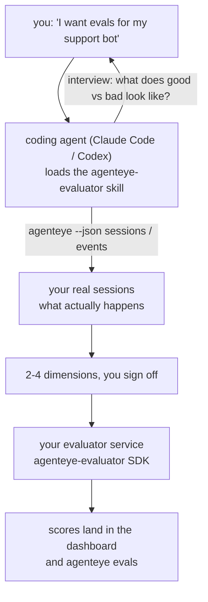

Từ *"Tôi nghĩ agent của chúng tôi đôi khi có vấn đề"* đến một dịch vụ scoring được triển khai, với agent lập trình của bạn thực hiện cả quyết định lẫn xây dựng. **Kỹ năng Failproof AI Observability evaluator** (`agenteye-evaluator`) là một *Agent Skill*: một thư mục nhỏ chứa các hướng dẫn mà một agent lập trình như Claude Code hoặc Codex có thể tải khi cần. Nó dạy agent cách xác định những chiều độ chất lượng nào đáng theo dõi cho *agent của bạn*, sau đó viết, kiểm tra và triển khai [dịch vụ evaluator](/vi/agenteye/evaluation-suite) để chấm điểm chúng.

Nó **không phải** là một scorer được lưu trữ, một registry mà bạn tải lên, hoặc một hệ thống plugin. Evaluator của bạn vẫn là dịch vụ HTTP riêng của bạn trên cơ sở hạ tầng của riêng bạn, chính xác như được mô tả trong hướng dẫn [Evaluation suite](/vi/agenteye/evaluation-suite). Kỹ năng này chỉ dạy agent cách xây dựng nó tốt, vì vậy mọi thứ nó làm, bạn cũng có thể tự làm bằng cách viết mã tương tự.

---

## Phần khó là quyết định cái gì cần chấm điểm

Bề mặt SDK rất nhỏ — một decorator và hai mô hình — và agent có thể viết điều đó chỉ từ [hợp đồng](/vi/agenteye/evaluation-suite#http-contract) một mình. Đó không phải là nơi evaluator thất bại. Chúng thất bại vì chúng chấm điểm những thứ sai, và một evaluator chấm điểm sai là tồi tệ hơn không có: nó tạo ra một dashboard mà mọi người học cách bỏ qua.

Vì vậy phần lớn kỹ năng này là phần trước khi bất kỳ mã nào tồn tại. Nó khiến agent phỏng vấn bạn (*"mô tả một lần chạy diễn ra tốt; bây giờ một lần diễn ra tồi"*), sau đó lấy phiên làm việc thực tế của bạn thông qua [`agenteye` CLI](/vi/agenteye/cli) và đọc chúng từ đầu đến cuối. Hai phần này thường không đồng ý, và khoảng cách là điểm mấu chốt: những gì bạn dự định đo lường so với những gì các bảng ghi của bạn thực sự có thể hỗ trợ. Một chiều chỉ tồn tại nếu nó **có thể tính toán** từ các sự kiện và **phân biệt** — nếu nó chấm điểm 0,9 trên cả lần chạy tốt và lần chạy xấu của bạn, nó không dạy gì được và bị loại bỏ.

Những gì trở lại là một đề xuất gồm 2-4 chiều kèm theo lý luận, để bạn ký duyệt trước khi viết bất kỳ dòng nào.



---

## Nó liên quan đến các phần đánh giá khác như thế nào

Bốn tài liệu bao gồm chấm điểm, và chúng chuyển giao cho nhau lần lượt:

| Trang | Nó là gì | Sử dụng khi |
|---|---|---|
| **[Evaluations](/vi/agenteye/evaluations)** | Tính năng: điểm trên lưới phiên, dashboard, đánh giá lại | Bạn muốn biết chấm điểm tự động có thể mang lại gì |
| **[Evaluation suite](/vi/agenteye/evaluation-suite)** | Hợp đồng HTTP, SDK, biến môi trường máy chủ | Bạn đang triển khai hoặc gỡ lỗi evaluator |
| **Kỹ năng Evaluator** (tài liệu này) | Cửa trước ngôn ngữ tự nhiên để thiết kế *và* xây dựng scorer | Bạn muốn từ "Tôi muốn evals" đến một dịch vụ chạy |
| **[CLI skill](/vi/agenteye/cli-skill)** | Cửa trước ngôn ngữ tự nhiên trên CLI `agenteye` | Bạn muốn *đọc* điểm bạn đã có |
| **[Python SDK skill](/vi/agenteye/python-sdk-skill)** | Cửa trước ngôn ngữ tự nhiên trên việc đo lường agent của bạn | Agent của bạn chưa phát hành phiên — không có gì để chấm điểm |

### so với CLI skill: xây dựng so với đọc

Hai kỹ năng này cố tình không trùng lặp, và cài đặt cả hai là thiết lập bình thường — agent chọn giữa chúng dựa trên những gì bạn yêu cầu:

- **`agenteye-evaluator`** (tài liệu này) xây dựng thứ *tạo ra* điểm. Công việc của nó kết thúc khi điểm đầu tiên được cấp.
- **[`agenteye-cli`](/vi/agenteye/cli-skill)** đọc điểm đã tồn tại (`agenteye evals`). *"Chất lượng có giảm tuần này không?"* là câu hỏi của nó, không phải của kỹ năng này.

---

## Điều kiện tiên quyết

1. **`agenteye` CLI được cài đặt và đăng nhập** (`pipx install agenteye`, rồi `agenteye login`). Kỹ năng dựa vào nó hai lần: để lấy các phiên thực tế mà nó thiết kế, và để xác nhận điểm của bạn đã được cấp ở cuối. Đăng nhập của bạn cần `events:read`, cộng với `evaluations:read` cho kiểm tra cuối cùng đó. Như với CLI skill, nó **không thể** hoàn thành đăng nhập mã một lần qua email cho bạn.
2. **Một nơi cho evaluator tồn tại.** Nó được xây dựng thành một image và chạy như một dịch vụ chạy dài hạn, vì vậy nó cần một repo thực tế, không phải một tệp tạm thời. Evaluator thường sống trong repo riêng của chúng, tách rời khỏi agent đang được chấm điểm — kỹ năng tìm kiếm một repo hiện có và hỏi trước khi tạo một repo mới.
3. **Bánh xe SDK `agenteye-evaluator`** — đọc phần tiếp theo trước khi agent bắt đầu gõ lệnh `pip`.

---

## Nơi để có được nó

Kỹ năng được xuất bản trong bộ sưu tập kỹ năng công khai của Failproof AI:

**[github.com/FailproofAI/skills](https://github.com/FailproofAI/skills)** → [`skills/agenteye-evaluator/`](https://github.com/FailproofAI/skills/tree/main/skills/agenteye-evaluator)

Kho lưu trữ là công khai và kỹ năng không cần bất kỳ thông tin xác thực nào của riêng nó — nó chỉ điều khiển CLI `agenteye` với phiên *mà bạn* đã đăng nhập, và viết mã trong *repo của bạn*. Lưu ý rằng nó được gửi như một thư mục riêng của nó và **không** bên trong gói `pipx install agenteye`, vì vậy đừng tìm kiếm nó ở đó.

## Cài đặt kỹ năng

Đường dẫn nhanh nhất là CLI [`skills`](https://skills.sh), nó tìm nạp thư mục và thả nó vào nơi agent tìm kiếm:

```bash
# Claude Code, chỉ dự án này
npx skills add FailproofAI/skills --skill agenteye-evaluator -a claude-code

# mọi dự án (cài đặt vào ~/.claude/skills/)
npx skills add FailproofAI/skills --skill agenteye-evaluator -a claude-code -g --copy

# Codex thay vào đó
npx skills add FailproofAI/skills --skill agenteye-evaluator -a codex
```

Sau đó quản lý nó như bất kỳ kỹ năng nào khác:

```bash
npx skills list -a claude-code           # cái gì được cài đặt
npx skills update agenteye-evaluator     # kéo phiên bản mới nhất
npx skills remove agenteye-evaluator     # loại bỏ nó
```

Thích cài đặt bằng tay? Một Agent Skill chỉ là một thư mục chứa `SKILL.md` (cộng với tài liệu tham khảo tùy chọn), vì vậy sao chép nó cũng hoạt động:

- **Claude Code**: đặt thư mục `agenteye-evaluator/` vào `~/.claude/skills/` (mọi dự án) hoặc `<your-repo>/.claude/skills/` (chỉ repo đó). Claude Code tự động phát hiện nó — xác minh với danh sách `/skills`, hoặc chỉ cần hỏi về evals.
- **Codex (OpenAI)**: Codex đọc cùng `SKILL.md`. `agents/openai.yaml` được đóng gói thiết lập `allow_implicit_invocation: true`, vì vậy Codex tự động chọn kỹ năng khi một tác vụ khớp; nếu không, gọi nó rõ ràng dưới dạng `$agenteye-evaluator`.

---

## SDK không có trên PyPI công khai

> **Cảnh báo:** Đọc điều này trước khi để agent cài đặt SDK.

Kỹ năng là công khai; SDK nó điều khiển thì không. `agenteye-evaluator` được gửi chỉ như một artefakt phát hành riêng, và không giống như `agenteye`, tên **không được yêu cầu trên PyPI công khai** — vì vậy một `pip install agenteye-evaluator` trần có thể kéo gói của người lạ vào dịch vụ đọc bảng ghi phiên sản xuất của bạn. Đó là một vấn đề chuỗi cung ứng, không phải một lỗi đánh máy.

Kỹ năng biết điều này và hoạt động xuống một bậc thang cài đặt thay vào đó, dừng ở bậc đầu tiên áp dụng: nguồn monorepo nếu bạn ở trong repo AgentEye, nếu không thì bánh xe phát hành riêng từ GitHub Releases (cần truy cập), và nếu không thể tiếp cận được thì nó **dừng lại và bảo bạn hỏi liên hệ Failproof AI của bạn về bánh xe** thay vì tạo ra.

Vì vậy nếu agent của bạn đề xuất một `pip install agenteye-evaluator` trần từ PyPI công khai, đó là dấu hiệu rằng kỹ năng không bao giờ tải. Dừng lại ở đó và kiểm tra xem nó có được cài đặt không.

---

## Những gì bạn có thể yêu cầu nó

Một vòng truy cập thực tế bắt đầu với một yêu cầu mơ hồ và kết thúc với một thiết kế được ký duyệt, không phải với mã:

```text
bạn   ▸ Tôi muốn evals cho support bot của chúng tôi. Tôi nghĩ nó đôi khi có vấn đề.

agent ▸ Trước khi tôi viết bất cứ điều gì: mô tả một lần chạy diễn ra tốt,
        và một lần diễn ra tồi.

bạn   ▸ Tốt: nó trả lời từ tài liệu. Tồi: nó bịa đặt,
        hoặc từ bỏ và nói "liên hệ hỗ trợ".

agent ▸ Chạy: agenteye --json sessions --status error --since 7d
        Đọc 5 phiên, bao gồm hai cái bạn gọi là tồi.

        Từ của bạn nói tính xác thực và hành động tránh né. Bảng ghi
        đồng ý về tránh né (2 trong 5 kết thúc bằng chuyển giao hỗ trợ,
        và nó rõ ràng trong model_response.content), nhưng tính xác thực
        cần một sự thật mặt đất mà sự kiện của bạn không mang theo.

        Vì vậy tôi sẽ chấm điểm ba điều:
          - deflection      quy tắc, rẻ, tách hai lần chạy của bạn
          - tool_efficiency quy tắc, bắt được vòng lặp thử lại trong run-004
          - groundedness    LLM judge: mọi khiếu nại có trong tài liệu nó truy xuất không?

        "factuality" sẽ cần sự thật mặt đất mà chúng tôi không có; groundedness
        là thứ gần nhất mà bảng ghi của bạn thực sự có thể hỗ trợ.
        Được không với ba tên đó? Đổi tên sau sẽ chia lịch sử.

bạn   ▸ được

agent ▸ Không có evaluator trong repo này. Tôi có nên tạo cơ sở ở đây không, hay
        bạn có một nơi khác?
```

Từ đó nó viết các chiều dựa trên quy tắc trước tiên (miễn phí, tức thì, xác định), kiểm tra chúng dựa trên phiên được ghi lại thực tế bao gồm các phiên trống và chưa hoàn thành gây ra crash cho các evaluator ngây thơ, và chỉ đến LLM judge về chiều chủ quan. Nó biết [giới hạn của dispatcher](/vi/agenteye/evaluation-suite#configuring-the-server) — timeout yêu cầu 30 giây và 8 cuộc gọi đồng thời triển khai rộng — vì vậy nếu judge không thể fit một cách đáng tin cậy, nó sẽ đi không đồng bộ với `JobPending` thay vì để judge bị hủy và thử lại năm lần với chi phí gấp năm lần.

Sau đó nó triển khai, đặt hai biến môi trường máy chủ, và xác nhận với `agenteye --json evals --session-id <id>` rằng điểm thực sự đã được cấp. Điểm đã được cấp là bằng chứng duy nhất.

---

## Những gì cần chú ý

- **Tên chiều gần như vĩnh viễn.** Khóa điểm là chuỗi tùy ý và nền tảng theo xu hướng bất kỳ thứ gì bạn gửi, điều này có nghĩa là không có gì hạ lưu sửa lựa chọn xấu. Đổi tên sau và lịch sử chia rẽ: các phiên cũ giữ khóa cũ và xu hướng bị hỏng. Đây là lý do tại sao kỹ năng nhận được ký duyệt rõ ràng trước khi viết mã — hãy coi bối cảnh đó là nghiêm túc.
- **Fixtures là bảng ghi phiên sản xuất thực tế.** Thiết kế dựa trên phiên thực tế có nghĩa là kéo chúng vào đĩa, và chúng có thể chứa dữ liệu khách hàng. Kỹ năng hỏi trước khi cam kết chúng với git; nếu không chắc, giữ `fixtures/` ngoài repo và có mỗi nhà phát triển kéo riêng của họ.
- **Agent viết và triển khai một dịch vụ đọc mọi bảng ghi.** Nó hoạt động như bạn, được ràng buộc bởi quyền của đăng nhập CLI của bạn, nhưng xem xét evaluator như bất kỳ mã nào khác chạm vào dữ liệu sản xuất.

---

## Các bước tiếp theo

- **[Evaluation suite](/vi/agenteye/evaluation-suite)**: hợp đồng HTTP, SDK, và biến môi trường máy chủ mà kỹ năng cấu hình.
- **[Evaluations](/vi/agenteye/evaluations)**: nơi điểm xuất hiện sau khi chúng được cấp.
- **[CLI skill](/vi/agenteye/cli-skill)**: kỹ năng anh em, để đọc kết quả chứ không phải xây dựng scorer.
- **[CLI](/vi/agenteye/cli)**: tham chiếu lệnh đằng sau dữ liệu phiên mà kỹ năng thiết kế.