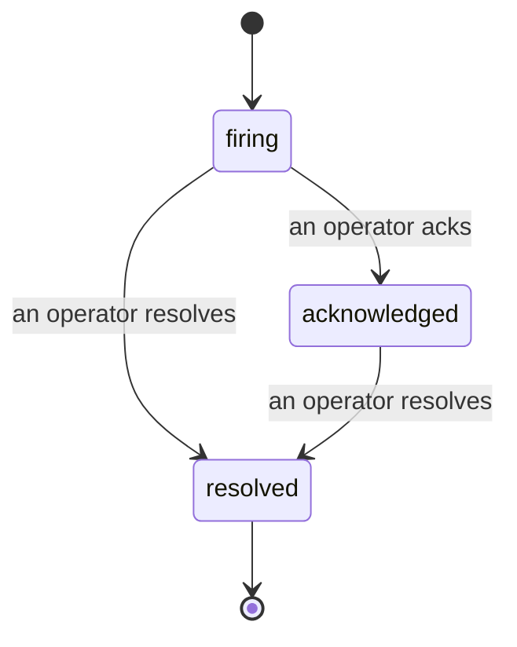

Khi cảnh báo phát động, câu hỏi đầu tiên luôn là "ai đang xử lý nó?" Sự cố trả lời câu hỏi đó: ngay khi có điều gì đó vi phạm, mọi người đều có thể thấy sự cố đã mở, ai sở hữu nó và chính xác những gì đã xảy ra cho đến nay, với hồ sơ được ghi chú rõ ràng mà bạn có thể đưa thẳng cho cuộc phân tích hậu sự cố.

*Hộp inbox nhóm các sự cố mở theo trạng thái và lọc theo mức độ nghiêm trọng và người được chỉ định, vì vậy bạn thấy những gì cần con người xử lý ngay bây giờ.*

## Biết ai đang xử lý, ngay một cái nhìn

Không còn "ai đó có đang nhìn vào cái này không?" trong một chuỗi trò chuyện. Vi phạm sẽ tự động mở một sự cố và thả nó vào hộp inbox chung, được nhóm theo trạng thái. Xác nhận nó và tên bạn được ghi lên nó, vì vậy phần còn lại của nhóm biết nó đã được xử lý. Xác nhận được chia sẻ: nhiều nhà điều hành có thể xác nhận cùng một sự cố và mỗi cái được ghi lại riêng, vì vậy một phòng chiến đầy đủ được hiển thị theo tên thay vì xung đột lẫn nhau. Chỉ định một chủ sở hữu để sàng lọc và lọc hộp inbox theo mức độ nghiêm trọng hoặc người được chỉ định để cắt giảm đến những gì của bạn.

## Toàn bộ câu chuyện, trong một dòng thời gian

Khi sự cố kết thúc, bạn đã có bản viết. Mở bất kỳ sự cố nào và bạn sẽ nhận được bằng chứng vi phạm, những người được chỉ định và người theo dõi của nó, một chuỗi nhận xét để phối hợp tại chỗ và một dòng thời gian hoạt động chỉ nối thêm.

*Mọi thứ đã xảy ra, theo thứ tự, mỗi dòng được ký bởi bất cứ ai làm điều đó.*

Mọi hành động (mở, xác nhận, giải quyết, v.v.) được viết vào dòng thời gian đó và không bao giờ bị chỉnh sửa. Mỗi mục được ghi chú: cho nhà điều hành đã thực hiện nó, theo email, hoặc để **automated** cho bất cứ điều gì Failproof AI Observability tự làm, chẳng hạn như mở sự cố khi xảy ra vi phạm. Không có gì ẩn danh và không có gì bị mất, vì vậy cuộc phân tích hậu sự cố hầu như tự viết được.

## Cách một sự cố di chuyển

- **Mở (phát động):** vi phạm mở sự cố và thông báo các kênh của bạn một lần. Các vi phạm lặp lại gộp vào cùng một sự cố và làm mới bằng chứng của nó thay vì thông báo cho bạn liên tiếp.
- **Đã xác nhận:** một nhà điều hành nhận nó. Nó ở trạng thái mở, và các vi phạm sau này cập nhật bằng chứng một cách yên tĩnh.
- **Đã giải quyết:** một nhà điều hành đóng nó. Giải quyết tự động khi điều kiện được giải quyết là được lên kế hoạch nhưng chưa được bật, vì vậy một sự cố ở trạng thái mở cho đến khi một người giải quyết nó, điều này giữ mọi người trung thực về những gì thực sự đã được giải quyết. Một sự cố mới có thể mở trên cùng một cảnh báo sau đó.

Một cảnh báo chứa tối đa một sự cố mở cùng một lúc, vì vậy một quy tắc dao động không thể chôn bạn trong các bản sao. Bạn cũng có thể mở một sự cố theo cách thủ công: một sự cố độc lập cho điều gì đó mà không có cảnh báo nào bắt được, hoặc một sự cố được gắn vào một cảnh báo hiện có, nếu bạn có `incidents:write`.

## Nơi tìm thấy nó

Sự cố nằm tại `/<org-slug>/incidents`. Xem cần **`incidents:read`**; mở một sự cố thủ công cần **`incidents:write`**; xác nhận, chỉ định, bình luận và giải quyết cần **`incidents:ack`**. Các khóa cũ hơn được cấp `alerts:ack` đã loại bỏ tiếp tục hoạt động, vì nó được công nhận là `incidents:ack`, vì vậy vòng xoay on-call của bạn không cần cấp lại.

## Liên quan

- [Cảnh báo](/vi/agenteye/alerts): các quy tắc mở các sự cố này khi ngưỡng bị vi phạm.
- [Theo dõi lỗi](/vi/agenteye/error-tracking): xem mỗi lỗi ở một nơi và nâng cao một thành cảnh báo.
- [Kiểm toán](/vi/agenteye/audits): nhà phân tích được lên kế hoạch tìm các lỗi mà không có quy tắc nào được theo dõi.