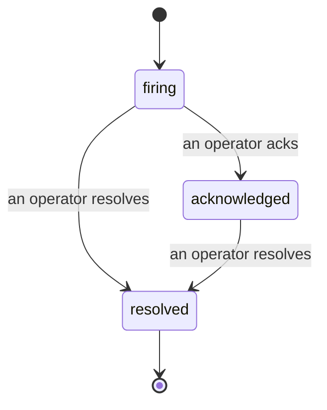

Khi cảnh báo phát động, câu hỏi đầu tiên luôn là "ai đang xử lý?" Sự cố trả lời điều đó: vào thời điểm có vi phạm, mọi người có thể thấy sự cố đang mở, ai là người chịu trách nhiệm, và chính xác những gì đã xảy ra cho đến nay, với một bản ghi rõ ràng và có ghi nhận mà bạn có thể gửi trực tiếp cho cuộc họp sau sự cố.

*Hộp thư nhóm các sự cố mở theo trạng thái và lọc theo mức độ nghiêm trọng và người được giao việc, để bạn thấy những gì cần con người xử lý ngay bây giờ.*

## Biết ai đang xử lý, một cách nhanh chóng

Không còn "có ai đang xem cái này không?" trong các luồng trò chuyện. Vi phạm mở một sự cố tự động và đưa nó vào hộp thư chung, nhóm theo trạng thái. Xác nhận nó và tên của bạn sẽ được ghi lại, để phần còn lại của nhóm biết nó đã được xử lý. Xác nhận được chia sẻ: nhiều nhà điều hành có thể xác nhận cùng một sự cố và mỗi người được ghi lại riêng biệt, vì vậy một phòng chiến đấu toàn bộ sẽ xuất hiện theo tên thay vì gây trở ngại cho nhau. Giao cho một người chủ sở hữu để phân loại, và lọc hộp thư theo mức độ nghiêm trọng hoặc người được giao việc để thu hẹp xuống những gì của bạn.

## Toàn bộ câu chuyện, trong một dòng thời gian

Khi sự cố kết thúc, bạn đã có bản viết. Mở bất kỳ sự cố nào và bạn sẽ nhận được bằng chứng vi phạm, những người được giao việc và những người theo dõi của nó, một luồng bình luận để phối hợp tại chỗ, và một dòng thời gian hoạt động chỉ được thêm vào.

*Mọi thứ đã xảy ra, theo thứ tự, mỗi dòng được ký bởi bất cứ ai đã làm điều đó.*

Mỗi hành động (mở, xác nhận, giải quyết, v.v.) được ghi vào dòng thời gian đó và không bao giờ được chỉnh sửa. Mỗi mục được ghi nhận: cho toán tử người điều hành nó, theo email, hoặc **automated** cho bất cứ điều gì Failproof AI Observability đã làm tự động, như mở sự cố trên vi phạm. Không có gì ẩn danh và không có gì bị mất, vì vậy cuộc họp sau sự cố tự viết ra.

## Sự cố diễn tiến như thế nào

- **Mở (đang phát):** vi phạm mở sự cố và gửi trang cho các kênh của bạn một lần. Các vi phạm lặp lại gập vào cùng một sự cố và làm mới bằng chứng của nó thay vì gửi trang cho bạn lại lần nữa.
- **Đã xác nhận:** một nhà điều hành nhận nó. Nó vẫn mở, và các vi phạm sau này cập nhật bằng chứng một cách yên tĩnh.
- **Đã giải quyết:** một nhà điều hành đóng nó. Giải quyết tự động khi điều kiện xóa đi đã được lên kế hoạch nhưng chưa được kích hoạt, vì vậy sự cố vẫn mở cho đến khi con người giải quyết nó, điều này giữ mọi người trung thực về những gì thực sự đã xóa. Một sự cố mới có thể mở trên cùng một cảnh báo sau này.

Một cảnh báo chứa tối đa một sự cố mở tại một thời điểm, vì vậy một quy tắc nhấp nháy không thể chôn bạn trong các bản sao. Bạn cũng có thể mở một sự cố bằng tay: một sự cố độc lập cho thứ gì đó không có cảnh báo bắt được, hoặc một sự cố được đính kèm vào một cảnh báo hiện có, nếu bạn có `incidents:write`.

## Nơi tìm nó

Sự cố nằm tại `/<org-slug>/incidents`. Xem cần **`incidents:read`**; mở một sự cố thủ công cần **`incidents:write`**; xác nhận, giao việc, bình luận, và giải quyết cần **`incidents:ack`**. Các khóa cũ hơn cấp `alerts:ack` đã loại bỏ tiếp tục hoạt động, vì nó được công nhận là `incidents:ack`, vì vậy vòng xoay on-call của bạn không cần tái phát hành.

## Liên quan

- [Cảnh báo](/vi/agenteye/alerts): các quy tắc mở những sự cố này khi ngưỡng bị vi phạm.
- [Theo dõi lỗi](/vi/agenteye/error-tracking): xem mọi lỗi ở một nơi và nâng cao một trong số đó thành cảnh báo.
- [Kiểm toán](/vi/agenteye/audits): nhà phân tích được lên lịch tìm thấy các lỗi không có quy tắc nào đang theo dõi.