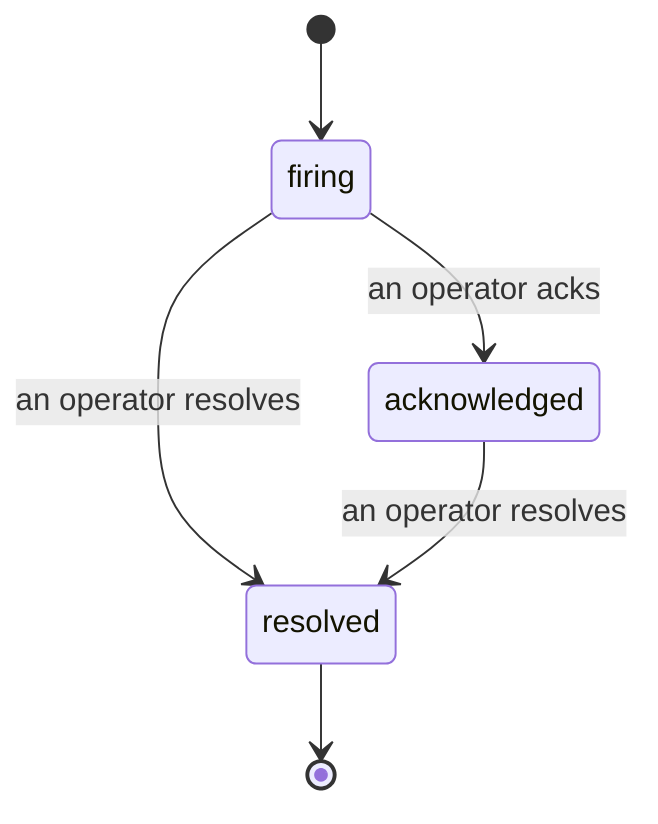

Khi một cảnh báo phát động, câu hỏi đầu tiên luôn là "ai đang xử lý?" Sự cố trả lời: ngay khi có vi phạm, mọi người có thể thấy sự cố đã mở, ai sở hữu nó và chính xác những gì đã xảy ra cho đến now, với một bản ghi sạch sẽ, có ghi nhận mà bạn có thể chuyển trực tiếp cho cuộc họp sau sự cố.

*Hộp thư nhóm các sự cố mở theo trạng thái và lọc theo mức độ nghiêm trọng và người được giao nhiệm vụ, vì vậy bạn thấy những gì cần sự chú ý của con người ngay bây giờ.*

## Biết ai đang xử lý, một cách nhanh chóng

Không còn "ai đó đang xử lý cái này không?" trong một luồng chat. Vi phạm sẽ tự động mở một sự cố và đặt nó vào hộp thư dùng chung, được nhóm theo trạng thái. Xác nhận nó và tên của bạn sẽ được ghi lên, vì vậy phần còn lại của nhóm biết nó đã được xử lý. Xác nhận được chia sẻ: nhiều nhân viên vận hành có thể xác nhận cùng một sự cố và mỗi cái được ghi lại riêng, vì vậy một phòng chiến đầy đủ sẽ hiển thị theo tên thay vì xung đột lẫn nhau. Gán một chủ sở hữu để phân loại và lọc hộp thư theo mức độ nghiêm trọng hoặc người được giao nhiệm vụ để giảm nó xuống thành những gì là của bạn.

## Toàn bộ câu chuyện, trên một dòng thời gian

Khi sự cố kết thúc, bạn đã có bản báo cáo. Mở bất kỳ sự cố nào và bạn sẽ nhận được bằng chứng vi phạm, những người được giao nhiệm vụ và người đăng ký của nó, một luồng bình luận để phối hợp tại chỗ và một dòng thời gian hoạt động chỉ được nối thêm.

*Tất cả những gì đã xảy ra, theo thứ tự, mỗi dòng được ký bởi bất kỳ ai đã làm điều đó.*

Mọi hành động (mở, xác nhận, giải quyết, v.v.) được ghi vào dòng thời gian đó và không bao giờ được chỉnh sửa. Mỗi mục được ghi nhận: cho nhân viên vận hành đã thực hiện nó, bằng email hoặc cho **automated** cho bất kỳ điều gì Failproof AI Observability tự làm, chẳng hạn như mở sự cố theo vi phạm. Không có gì ẩn danh và không có gì bị mất, vì vậy cuộc họp sau sự cố hơi viết chính nó.

## Cách một sự cố di chuyển

- **Mở (firing):** vi phạm mở sự cố và phát trang vào các kênh của bạn một lần. Các vi phạm lặp lại được gộp vào cùng một sự cố và làm mới bằng chứng của nó thay vì phát trang cho bạn lại và lại.
- **Xác nhận (acknowledged):** một nhân viên vận hành nhặt nó lên. Nó vẫn mở và các vi phạm sau này cập nhật bằng chứng một cách im lặng.
- **Giải quyết (resolved):** một nhân viên vận hành đóng nó. Giải quyết tự động khi điều kiện xóa sẽ được lên kế hoạch nhưng chưa được bật, vì vậy một sự cố vẫn mở cho đến khi con người giải quyết nó, điều này giữ mọi người trung thực về những gì thực sự đã xóa. Một sự cố mới có thể mở trên cùng một cảnh báo sau này.

Một cảnh báo chỉ chứa nhiều nhất một sự cố mở cùng một lúc, vì vậy quy tắc lập lại không thể chôn bạn trong các bản sao. Bạn cũng có thể mở một sự cố bằng tay: một sự cố độc lập cho một cái gì đó không cảnh báo nào bắt được, hoặc một sự cố gắn vào một cảnh báo hiện có, nếu bạn có `incidents:write`.

## Nơi tìm thấy nó

Sự cố nằm tại `/<org-slug>/incidents`. Xem cần **`incidents:read`**; mở một sự cố thủ công cần **`incidents:write`**; xác nhận, gán, bình luận và giải quyết cần **`incidents:ack`**. Các khóa cũ hơn được cấp **`alerts:ack`** đã được xóa vẫn hoạt động, vì nó được xem như `incidents:ack`, vì vậy vòng xoay trực không cần phát hành lại.

## Liên quan

- [Cảnh báo](/vi/agenteye/alerts): các quy tắc mở các sự cố này khi một ngưỡng bị vi phạm.
- [Theo dõi lỗi](/vi/agenteye/error-tracking): xem mọi lỗi ở một nơi và thúc đẩy một cái thành một cảnh báo.
- [Kiểm toán](/vi/agenteye/audits): nhà phân tích được lên kế hoạch tìm thấy các lỗi không có quy tắc nào đang theo dõi.