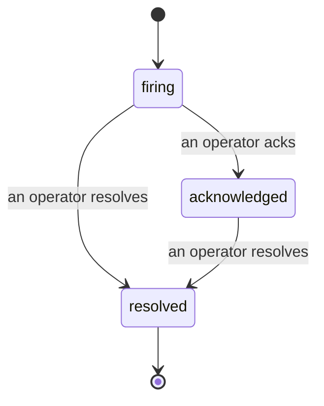

Khi một cảnh báo phát động, câu hỏi đầu tiên luôn là "ai đang xử lý?". Sự cố trả lời nó: ngay khi có vi phạm, mọi người có thể thấy sự cố đã mở, ai sở hữu nó và chính xác những gì đã xảy ra cho đến nay, với hồ sơ sạch sẽ được ghi nhận mà bạn có thể chuyển thẳng đến phân tích hậu sự cố.

*Hộp inbox nhóm các sự cố mở theo trạng thái và lọc theo mức độ nghiêm trọng và người được gán, vì vậy bạn thấy những gì cần sự can thiệp của con người ngay bây giờ.*

## Biết ai đang xử lý, ngay lập tức

Không còn "có ai đang xem cái này không?" trong một luồng trò chuyện. Vi phạm mở một sự cố tự động và đưa nó vào hộp inbox chung, được nhóm theo trạng thái. Xác nhận nó và tên của bạn sẽ ghi trên đó, vì vậy phần còn lại của đội biết rằng nó đã được xử lý. Xác nhận được chia sẻ: nhiều nhà khai thác có thể xác nhận cùng một sự cố và mỗi cái được ghi lại riêng, vì vậy một phòng chiến đấu đầy đủ sẽ hiển thị theo tên thay vì gây cản trở cho nhau. Gán một chủ sở hữu để phân loại và lọc hộp inbox theo mức độ nghiêm trọng hoặc người được gán để giảm xuống những gì là của bạn.

## Toàn bộ câu chuyện, trên một dòng thời gian

Khi sự cố kết thúc, bạn đã có bài viết. Mở bất kỳ sự cố nào và bạn sẽ nhận được bằng chứng vi phạm, những người được gán và người đăng ký của nó, một luồng bình luận để phối hợp tại chỗ và một dòng thời gian hoạt động chỉ thêm.

*Mọi thứ đã xảy ra, theo thứ tự, mỗi dòng được ký bởi bất cứ ai đã làm nó.*

Mọi hành động (mở, xác nhận, giải quyết, v.v.) được ghi vào dòng thời gian đó và không bao giờ bị chỉnh sửa. Mỗi mục được ghi nhận: cho nhà khai thác đã thực hiện, theo email, hoặc để **tự động hóa** cho bất cứ điều gì Failproof AI Observability đã làm của riêng nó, như mở sự cố khi có vi phạm. Không có gì ẩn danh và không có gì bị mất, vì vậy phân tích hậu sự cố về cơ bản tự viết.

## Sự cố di chuyển như thế nào

- **Mở (đang hoạt động):** vi phạm mở sự cố và trang kênh của bạn một lần. Các vi phạm lặp lại gấp vào cùng một sự cố và làm mới bằng chứng của nó thay vì trang cho bạn một lần nữa.
- **Đã xác nhận:** một nhà khai thác nhặt nó lên. Nó vẫn mở và các vi phạm sau sẽ cập nhật bằng chứng một cách yên tĩnh.
- **Đã giải quyết:** một nhà khai thác đóng nó lại. Giải quyết tự động khi điều kiện được xóa sẽ được lên kế hoạch nhưng chưa được bật, vì vậy sự cố vẫn mở cho đến khi con người giải quyết nó, điều này giữ mọi người trung thực về những gì thực sự đã được xóa. Một sự cố mới có thể mở trên cùng một cảnh báo sau đó.

Một cảnh báo giữ tối đa một sự cố mở tại một thời điểm, vì vậy một quy tắc rung lắc không thể chôn bạn trong các bản sao. Bạn cũng có thể mở một sự cố bằng tay: một sự cố độc lập cho một cái gì đó mà không có cảnh báo bắt, hoặc một cái được gắn vào một cảnh báo hiện có, nếu bạn có `incidents:write`.

## Tìm nó ở đâu

Sự cố nằm tại `/<org-slug>/incidents`. Xem cần **`incidents:read`**; mở một sự cố thủ công cần **`incidents:write`**; xác nhận, gán, bình luận và giải quyết cần **`incidents:ack`**. Các khóa cũ hơn được cấp `alerts:ack` đã ngừng hoạt động tiếp tục hoạt động vì nó được tôn trọng là `incidents:ack`, vì vậy vòng quay on-call của bạn không cần phát hành lại.

## Liên quan

- [Cảnh báo](/vi/agenteye/alerts): các quy tắc mở các sự cố này khi ngưỡng bị vi phạm.
- [Theo dõi lỗi](/vi/agenteye/error-tracking): xem mọi lỗi ở một nơi và quảng bá một thành cảnh báo.
- [Kiểm toán](/vi/agenteye/audits): nhà phân tích được lên kế hoạch tìm thấy các lỗi không có quy tắc nào đang xem.