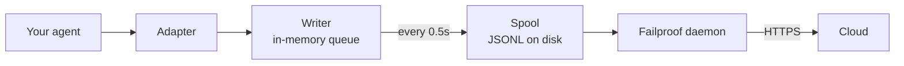

Đối với một agent mà bạn tự viết, hoặc một framework mà Failproof AI không có adapter cho. Không có gì phải công cụ hóa: bạn phát ra các sự kiện.

Đây là cùng một API mà bốn adapter framework gọi bên dưới. Chúng là các bảng dịch của nó.

## Cài đặt

```bash
pip install failproofai-sdk
```

Không có thêm gì, và không có phụ thuộc.

## Công cụ hóa

```python
import failproofai_sdk

failproofai_sdk.configure(environment="production")

with failproofai_sdk.session():                 # one run
    with failproofai_sdk.agent("planner"):      # one unit of work
        with failproofai_sdk.tool_call("search", input={"q": q}) as t:
            t.output = search(q)                # one tool call
```

Đọc từ trên xuống dưới và nó nói những gì nó có nghĩa:

| Bao nó trong | Để nói |
| --- | --- |
| `session()` | Những sự kiện này thuộc về cùng một lần chạy |
| `agent()` | Có cái gì đó đang làm việc — đặt tên cho nó bằng tên mà bạn sẽ nhận ra trong danh sách |
| `tool_call()` | Đây là một công cụ, và đây là những gì nó trả về |

Và những gì mỗi cái thực sự phát ra:

| Phạm vi | Phát ra | Mục đích |
| --- | --- | --- |
| `session()` | Không có gì | Liên kết một session id, nhóm một lần chạy |
| `agent()` | `agent_start`, `agent_end` | Dấu ngoặc một đơn vị công việc |
| `tool_call()` | `tool_use`, `tool_result` | Dấu ngoặc một công cụ và đo lường nó |

Mọi thứ bên trong có thể bỏ qua `session_id` và `agent_id`. Các phạm vi liên kết danh tính trên các biến ngữ cảnh và mỗi lệnh gọi sự kiện đọc lại nó, vì vậy bạn không bao giờ phải điều phối các id thông qua các hàm của bạn.

Cả ba đều hoạt động dưới `async with` cũng như `with`.

Lồng các agent xây dựng cây. `parent_id` và độ sâu được tính từ ngăn xếp:

```python
with failproofai_sdk.session():
    with failproofai_sdk.agent("supervisor"):
        with failproofai_sdk.agent("researcher"):    # parent_id = "supervisor"
            ...
```

## Cách một phạm vi đóng lại

`agent()` xử lý ngoại lệ cho bạn:

| Những gì xảy ra | Sự kiện | Kết quả |
| --- | --- | --- |
| Không có gì được nâng lên | `agent_end` | `success` |
| `Exception` | `error`, sau đó `agent_end` | `failed` |
| `KeyboardInterrupt`, `SystemExit` | `error`, sau đó `agent_end` | `failed` |
| `CancelledError`, `GeneratorExit` | chỉ `agent_end` | `cancelled` |

Lỗi được phát ra trước `agent_end`, bởi vì bảng điều khiển đóng span tại `agent_end` và bất cứ điều gì sau đó được quy cho không có gì. Hủy bỏ không phải là thất bại, vì vậy các lần chạy bị hủy không làm ô nhiễm bề mặt lỗi. Ngoại lệ luôn được nâng lại: một phạm vi không bao giờ nuốt chửng.

## Các phương thức sự kiện

Mười năm phương thức trong sáu gia đình. Hầu hết đều đi thành cặp — bạn phát ra phần mở, sau đó là phần đóng, và SDK đo khoảng thời gian giữa chúng.

| Gia đình | Mở | Đóng | Độc lập |
| --- | --- | --- | --- |
| **Agents** | `agent_start` | `agent_end` | — |
| | `agent_pause` | `agent_resume` | — |
| **Models** | `model_request` | `model_response` | — |
| **Tools** | `tool_use` | `tool_result` | — |
| **Hooks** | `hook_triggered` | `hook_completed` | — |
| **Humans** | `human_wait` | `human_input` | `human_pause`, `human_interrupt` |
| **Failures** | — | — | `error` |

<Tip>
  Ưu tiên các phạm vi — `agent()` và `tool_call()` — ở bất kỳ nơi nào chúng phù hợp. Chúng đảm bảo sự kiện đóng ngay cả khi phần nội dung tăng. Chuyển đến các phương thức này trực tiếp khi luồng điều khiển của bạn không lồng nhau, chẳng hạn như lệnh gọi mô hình bên trong một trợ giúp.
</Tip>

<CodeGroup>
```python Agents
failproofai_sdk.event.agent_start(agent_id="planner", goal="find the cheapest flight")
failproofai_sdk.event.agent_end(agent_id="planner", outcome="success", summary="...")
failproofai_sdk.event.agent_pause(pause_id="p1", reason="awaiting approval")
failproofai_sdk.event.agent_resume(pause_id="p1")
```

```python Models
failproofai_sdk.event.model_request(
    model="gpt-4o-mini",
    messages=[{"role": "user", "content": "..."}],
    request_id="req-1",
)
failproofai_sdk.event.model_response(
    model="gpt-4o-mini",
    content="...",
    input_tokens=139,
    output_tokens=21,
    request_id="req-1",
    duration_ms=5202,
)
```

```python Tools
failproofai_sdk.event.tool_use(tool_name="search", tool_call_id="c1", input={"q": "..."})
failproofai_sdk.event.tool_result(tool_name="search", tool_call_id="c1", output="...")
```

```python Hooks
failproofai_sdk.event.hook_triggered(hook_name="retrieve", hook_id="h1", trigger_event="node")
failproofai_sdk.event.hook_completed(hook_name="retrieve", hook_id="h1", outcome="success")
```

```python Humans
failproofai_sdk.event.human_wait(input_id="i1", prompt="Approve?", options=["yes", "no"])
failproofai_sdk.event.human_input(input_id="i1", response="yes")
failproofai_sdk.event.human_pause(reason="operator paused the run", user_id="dana")
failproofai_sdk.event.human_interrupt(reason="operator stopped the run", at_step="step_3")
```

```python Failures
failproofai_sdk.event.error(
    error_type="TimeoutError",
    message="provider timed out after 30s",
    traceback="...",
)
```
</CodeGroup>

<Note>
  **Hai gia đình con người chỉ theo hướng ngược lại.**

  | Phương thức | Ý nghĩa |
  | --- | --- |
  | `human_wait` / `human_input` | **Agent yêu cầu một người** — cổng phê duyệt, câu hỏi làm rõ |
  | `human_pause` / `human_interrupt` | **Một người hành động trên agent** — nút dừng, tạm dừng người điều hành |

  Không có framework nào báo hiệu cặp thứ hai, vì vậy nó luôn là của bạn để phát ra.
</Note>

<Warning>
  **Chuyển `request_id` khi các lệnh gọi mô hình chạy đồng thời.** Nếu không có nó, các yêu cầu và phản hồi ghép thành từng lệnh gọi trên mỗi agent — và các lệnh gọi đồng thời bị ghép sai, gắn mỗi phản hồi vào yêu cầu sai.
</Warning>

## Ví dụ

Một vòng lặp gọi công cụ trên API OpenAI, không có framework agent:

```python
import json

import failproofai_sdk
from openai import OpenAI

failproofai_sdk.configure(environment="production")
client = OpenAI()
MODEL = "gpt-4o-mini"


def turn(messages: list):
    """One model call, bracketed by the pair."""
    failproofai_sdk.event.model_request(model=MODEL, messages=messages)
    reply = client.chat.completions.create(model=MODEL, messages=messages, tools=TOOLS)
    usage = reply.usage
    failproofai_sdk.event.model_response(
        model=MODEL,
        content=reply.choices[0].message.content or "",
        input_tokens=usage.prompt_tokens,
        output_tokens=usage.completion_tokens,
    )
    return reply.choices[0].message


with failproofai_sdk.session():
    with failproofai_sdk.agent("inventory", goal="price report"):
        for _ in range(4):          # bounded; an unbounded agent loop is its own bug
            message = turn(messages)
            if not message.tool_calls:
                break
            messages.append(message.model_dump(exclude_none=True))
            for call in message.tool_calls:
                args = json.loads(call.function.arguments or "{}")
                with failproofai_sdk.tool_call(
                    call.function.name, tool_call_id=call.id, input=args
                ) as handle:
                    handle.output = run_tool(call.function.name, args)
                messages.append({
                    "role": "tool",
                    "tool_call_id": call.id,
                    "content": str(handle.output),
                })
```

Điều đó tạo ra cùng sáu loại sự kiện mà một adapter sẽ cung cấp cho bạn. Phiên bản chạy được hoàn chỉnh, với các định nghĩa công cụ, được gửi trong kho SDK dưới `docs/manual/examples/`.

## Luồng và async

Các biến ngữ cảnh lan truyền vào các tác vụ asyncio một cách tự động. Họ không lan truyền vào các luồng mới, bởi vì một luồng bắt đầu với một ngữ cảnh trống.

```python
# asyncio: nothing to do
async with failproofai_sdk.session():
    await asyncio.gather(worker(1), worker(2))

# threads: wrap the callable
pool.submit(failproofai_sdk.propagate(work), x)
threading.Thread(target=failproofai_sdk.propagate(work)).start()
loop.run_in_executor(None, failproofai_sdk.propagate(work), x)
```

Nếu không có `propagate()`, sự kiện của worker sẽ tăng lên một `TypeError` đặt tên cho phần sửa chữa chứ không là đếm không có session. Điều này cố ý: một sự kiện không có session bị bỏ qua bằng cách nhập và trả lời `200`, đó là lỗi im lặng mà lớp danh tính tồn tại để ngăn chặn.

## Công cụ hóa một framework mà không có adapter

Mỗi framework agent cung cấp cho bạn ba đường nối tương tự. Ánh xạ chúng và bạn có một dấu vết hoàn chỉnh — bốn adapter được gửi không làm gì nhiều hơn thế.

| Đường nối | Những gì bạn viết | Những gì hạ cánh |
| --- | --- | --- |
| Lần chạy | `session()` + `agent()` | `agent_start`, `agent_end` |
| Mỗi công cụ | `tool_call()` | `tool_use`, `tool_result` |
| Mỗi lệnh gọi mô hình | Cặp `model_*` | `model_request`, `model_response` |

<Steps>
  <Step title="Dấu ngoặc lần chạy">
    ```python
    with failproofai_sdk.session():
        with failproofai_sdk.agent(agent_name, goal=task):
            result = framework.run(task)
    ```
  </Step>
  <Step title="Dấu ngoặc mỗi công cụ">
    Ở bất kỳ nơi nào framework gọi trình bao bọc công cụ hoặc middleware.

    ```python
    with failproofai_sdk.tool_call(name, input=args) as call:
        call.output = original(**args)
    ```
  </Step>
  <Step title="Ghép mỗi lệnh gọi mô hình">
    ```python
    failproofai_sdk.event.model_request(model=model, messages=messages)
    reply = provider.complete(...)
    failproofai_sdk.event.model_response(
        model=model,
        content=text,
        input_tokens=usage.prompt_tokens,
        output_tokens=usage.completion_tokens,
    )
    ```
  </Step>
</Steps>

<Tip>
  **Có một nút, bước hoặc ranh giới middleware đáng xem?** Bao nó trong một cặp hook — `hook_triggered` / `hook_completed` — không phải một `agent()` lồng nhau. `agent_id` là một khía cạnh cardinality thấp, và một mục nhập trên mỗi nút làm chìm nó. Các khoảng hook hiển thị cùng cách và cung cấp cho bạn độ trễ trên mỗi nút.
</Tip>

<Note>
  **Tay và tự động soạn.** Một adapter chạy bên trong một phạm vi viết tay tham gia session đó và phụ huynh của đó, vì vậy bạn nhận được một cây chứ không phải hai — hữu ích khi bạn công cụ hóa một framework tự bên cạnh một cái được hỗ trợ.
</Note>

<Accordion title="Tại sao không có adapter AutoGen">
  Hai lý do, và ba đường nối trên là câu trả lời cho cả hai:

  - `autogen-core` đã không được bảo trì kể từ tháng 9 năm 2025.
  - AG2 không cung cấp điểm đăng ký toàn bộ quy trình tương đương với các hook của các framework khác, vì vậy công cụ hóa nó có nghĩa là bao bọc mỗi agent ở mỗi trang xây dựng.

  Ánh xạ các đường nối bằng tay ghi lại những sự kiện giống nhau, với cùng một độ tin cậy, như một adapter được gửi sẽ làm.
</Accordion>

## Đi sâu hơn

Cách ghi âm thực sự hoạt động. Không cần thiết phải bắt đầu.

<AccordionGroup>

<Accordion title="Một bản ghi trông như thế nào, trên mỗi framework" icon="eye">

Mỗi bản ghi có cùng một hình dạng: một span mở, công việc lồng nhau bên trong nó, và mỗi sự kiện mở nhận được một sự kiện đóng.


**Cặp** là đơn vị. Mỗi sự kiện đóng mang một khoảng thời gian mà SDK đo lường từ sự kiện mở của nó.

Dưới đây là một lần chạy thực tế trên mỗi framework — bắt được từ các ví dụ được gửi với SDK, tên mô hình bình thường hóa. Lưu ý bao nhiêu quay lại từ một lệnh gọi duy nhất.

<Tabs>
  <Tab title="LangGraph">
    ```text 14 events
     1  +0.000s  agent_start       LangGraph
     2  +0.001s    hook_triggered  agent
     3  +0.002s      model_request   gpt-4o-mini
     4  +3.023s      model_response  gpt-4o-mini · 21 out-tok
     5  +3.024s    hook_completed  agent
     6  +3.024s    hook_triggered  tools
     7  +3.025s      tool_use      word_count
     8  +3.025s      tool_result   word_count · ok
     9  +3.025s    hook_completed  tools
    10  +3.026s    hook_triggered  agent
    11  +3.027s      model_request   gpt-4o-mini
    12  +5.717s      model_response  gpt-4o-mini · 5 out-tok
    13  +5.720s    hook_completed  agent
    14  +5.721s  agent_end         LangGraph · success
    ```

    Các nút trở thành các cặp hook, vì vậy bạn nhận được độ trễ trên mỗi nút mà không có chúng làm chìm danh sách agent.
  </Tab>

  <Tab title="CrewAI">
    ```text 10 events
     1  +0.000s  agent_start       crew
     2  +0.050s    agent_start     analyst · under crew
     3  +0.057s      model_request   gpt-4o-mini
     4  +3.475s      model_response  gpt-4o-mini · 19 out-tok
     5  +3.478s      tool_use      lookup_metric
     6  +3.478s      tool_result   lookup_metric · ok
     7  +3.486s      model_request   gpt-4o-mini
     8  +5.694s      model_response  gpt-4o-mini · 9 out-tok
     9  +5.727s    agent_end       analyst · success
    10  +5.739s  agent_end         crew · success
    ```

    Mỗi `role` của agent trở thành tên span của nó, vì vậy độ trễ và chi tiêu token chia nhỏ theo vai trò.
  </Tab>

  <Tab title="LlamaIndex">
    ```text 26 events
     1  +0.000s  agent_start       Agent
     2  +0.001s    hook_triggered  init_run
     4  +0.501s    hook_triggered  setup_agent
     6  +0.503s    hook_triggered  run_agent_step
     7  +0.505s      model_request   gpt-4o-mini
     8  +3.083s      model_response  gpt-4o-mini · 18 out-tok
    10  +3.197s    hook_triggered  parse_agent_output
    12  +3.355s    hook_triggered  call_tool
    13  +3.355s      tool_use      city_population
    14  +3.355s      tool_result   city_population · ok
    16  +3.356s    hook_triggered  aggregate_tool_results
       ...                        second iteration
    26  +7.038s  agent_end         Agent · success
    ```

    Vòng lặp agent chính nó là khả nhìn thấy, không chỉ các lệnh gọi mô hình của nó.
  </Tab>

  <Tab title="Pydantic AI">
    ```text 8 events
    1  +0.000s  agent_start       agent
    2  +0.001s    model_request   gpt-4o-mini
    3  +4.413s    model_response  gpt-4o-mini · 17 out-tok
    4  +4.415s    tool_use        population
    5  +4.415s    tool_result     population · ok
    6  +4.416s    model_request   gpt-4o-mini
    7  +8.118s    model_response  gpt-4o-mini · 6 out-tok
    8  +8.119s  agent_end         agent · success
    ```

    Không có các cặp hook: Pydantic AI không có ranh giới nút hoặc bước để dấu ngoặc.
  </Tab>

  <Tab title="Custom agents">
    ```text 6 events
    1  +0.000s  agent_start       main
    2  +0.000s    tool_use        population
    3  +0.000s    tool_result     population · ok
    4  +0.000s    model_request   gpt-4o-mini
    5  +0.000s    model_response  gpt-4o-mini · 3 out-tok
    6  +0.000s  agent_end         main · success
    ```

    Bạn phát ra những cái này. Các loại sự kiện giống nhau, cùng độ tin cậy — nó chi phí cho bạn các trang gọi.
  </Tab>
</Tabs>

</Accordion>

<Accordion title="Cách một phiên bắt đầu và kết thúc" icon="circle-play">

**Không có sự kiện kết thúc phiên.** Một phiên không phải là cái gì bạn đóng — nó là một nhóm các sự kiện chia sẻ một `session_id`.

Trạng thái được lấy từ hình dạng của dấu vết:

| Trạng thái | Khi nào |
| --- | --- |
| `ongoing` | Ít nhất một span vẫn còn mở |
| `paused` | Một `agent_pause` không có `agent_resume` phù hợp |
| `error` | Không có gì mở, và ít nhất một sự kiện thất bại |
| `done` | Không có gì mở, và không có gì thất bại |

Vì vậy, một phiên kết thúc khi mỗi cặp đóng. Các adapter phát ra `agent_end` cho bạn, và khi phân hủy chúng đóng bất cứ thứ gì vẫn mở và đánh dấu nó không đầy đủ — một lần chạy bị lỗi giải quyết dưới dạng `done` với một khoảng trống có thể nhìn thấy chứ không phải treo mãi mãi.

<Note>
  Đây là lý do tại sao một phiên có thể kéo dài hai lệnh gọi. Một `interrupt()` LangGraph tạm dừng lần chạy, span gốc cố ý để mở, và lệnh gọi tiếp tục đóng nó. Cả hai lệnh gọi là một phiên.
</Note>

</Accordion>

<Accordion title="Danh tính: session_id, agent_id, và ai tạo ra chúng" icon="fingerprint">

`session_id` và `agent_id` là tùy chọn trên mỗi phương thức sự kiện. Bỏ qua, chúng giải quyết từ phạm vi bao quanh:

```python
with failproofai_sdk.session():
    with failproofai_sdk.agent("planner"):
        failproofai_sdk.event.tool_use(tool_name="search", tool_call_id="c1")
```

Chuyển chúng rõ ràng vẫn hoạt động và ưu tiên. Không có gì liên kết và không có gì được chuyển, lệnh gọi tăng lên `TypeError` đặt tên cho phần sửa chữa chứ không phải phát ra sự kiện không có phiên, cái mà ingest sẽ bỏ qua trong khi trả lời `200`.

Phạm vi liên kết danh tính trên các biến ngữ cảnh. Những cái đó lan truyền vào các tác vụ asyncio một cách tự động nhưng không vào các luồng mới — bao một worker trong `failproofai_sdk.propagate()`.

#### Ai tạo ra id nào

| Id | Được tạo bởi | Ghi chú |
| --- | --- | --- |
| `session_id` | Bạn, hoặc SDK | `session("chat-42")` được sử dụng từng chữ; bỏ qua, SDK tạo một `uuid4().hex` |
| `agent_id` | Bạn, hoặc framework | Từ `agent("analyst")`, một `role` CrewAI, một `FunctionAgent.name`. Một giá trị trông giống như UUID bị từ chối và thay thế |
| `tool_call_id`, `hook_id`, `request_id` | Bạn, hoặc framework | Các adapter tái sử dụng các id chạy của riêng framework, đó là lý do tại sao các cặp sống sót qua bước hoa |
| **Event id** | **Cloud, tại ingest** | SDK không phát ra cái nào |
| **`dedup_key`** | **Cloud, tại ingest** | Một hash của org, phiên, dấu thời gian, loại và tải trọng. Đây là danh tính thực — nó làm cho một lô được thử lại sập thay vì sao chép |

#### Cách các adapter giải quyết `session_id`

Trận đấu đầu tiên thắng:

1. Một `session_id` tùy chọn rõ ràng
2. Siêu dữ liệu trên mỗi cuộc gọi
3. Phạm vi `session()` bao quanh
4. Siêu dữ liệu framework
5. Id chạy của riêng framework

Nó không bao giờ được phát minh trong khi một trong những cái đó tồn tại — một id tổng hợp sẽ chia một lần chạy thành nhiều phiên.

#### Giữ `agent_id` cardinality thấp

Đó là khía cạnh chính trên mỗi bề mặt bảng điều khiển, và một cột `LowCardinality(String)`. Một giá trị trên mỗi lần chạy làm giảm cột và lấp đầy thả xuống bộ lọc với một mục nhập trên mỗi lần chạy.

Các adapter bảo vệ cột đó cho bạn:

| Framework trao | Được ghi lại dưới dạng | Tại sao |
| --- | --- | --- |
| `3f9a1c2b-…` (một UUID) | `main` | Không có gì có thể đọc được để giữ |
| Một chuỗi hex trần dài | `main` | Giống nhau |
| `agent-3f9a1c2b-…` | `agent` | Id trên mỗi lần chạy bị tước, phần có thể đọc được được giữ |
| `agent-v2` | `agent-v2` | Các đoạn ngắn bị bỏ lại |
| `step-3` | `step-3` | Giống nhau |

Id thực được giữ trên `fw_agent_id` / `fw_run_id`, nơi nó vẫn có thể truy vấn được mà không là một khía cạnh.

<Warning>
  **Bảo vệ này chỉ chạm vào các nhãn mà *framework* lựa chọn.** Một `agent_id` mà bạn tự chuyển — để `event.*`, hoặc để `failproofai_sdk.agent(...)` — được ghi lại chính xác như đã cho. Im lặng viết lại một đối số rõ ràng sẽ tệ hơn cardinality mà nó ngăn chặn, vì vậy đặt tên cho các span của riêng bạn phù hợp.
</Warning>

</Accordion>

<Accordion title="Loại sự kiện, được nhóm — và framework nào ghi lại cái gì" icon="table">

| Nhóm | Sự kiện |
| --- | --- |
| Agents | `agent_start`, `agent_end`, `agent_pause`, `agent_resume` |
| Models | `model_request`, `model_response` |
| Tools | `tool_use`, `tool_result` |
| Hooks | `hook_triggered`, `hook_completed` |
| Humans | `human_wait`, `human_input`, `human_pause`, `human_interrupt` |
| Failures | `error` |

Framework nào ghi lại gì, được đo lường từ các lần chạy trên:

| Sự kiện | LangGraph | CrewAI | LlamaIndex | Pydantic AI | Custom |
| --- | :--: | :--: | :--: | :--: | :--: |
| Bắt đầu và kết thúc agent | Có | Có | Có | Có | Bạn |
| Yêu cầu mô hình và phản hồi | Có | Có | Có | Có | Bạn |
| Sử dụng công cụ và kết quả | Có | Có | Có | Có | Bạn |
| Hook được kích hoạt và hoàn thành | Nút | Nhiệm vụ | Bước | — | Bạn |
| Lỗi | Có | Có | Có | Có | Tự động |
| Con người chờ và đầu vào | Có | Có | Có | — | Bạn |
| Agent tạm dừng và tiếp tục | Có | Có | Có | — | Bạn |

Một dấu gạch ngang có nghĩa là framework không có khái niệm như vậy. `human_pause` và `human_interrupt` mô tả một *người* hành động trên agent, mà không có framework nào báo hiệu — tự phát ra những cái đó.

</Accordion>

<Accordion title="Cặp, tương quan và khoảng thời gian" icon="link">

Một sự kiện không bao giờ đến một mình. Một cái mở một span, một cái đóng nó, và sự kiện đóng mang một khoảng thời gian mà SDK đo lường từ sự kiện mở của nó.

| Mở | Đóng | Sự kiện đóng mang theo |
| --- | --- | --- |
| `agent_start` | `agent_end` | `outcome`, `summary` |
| `model_request` | `model_response` | token, `stop_reason`, độ trễ |
| `tool_use` | `tool_result` | `output` hoặc `error`, khoảng thời gian |
| `hook_triggered` | `hook_completed` | `outcome`, khoảng thời gian |
| `agent_pause` | `agent_resume` | bao lâu tạm dừng kéo dài |
| `human_wait` | `human_input` | câu trả lời, và bao lâu người đó mất |

<Warning>
  Một sự kiện mở mà không có sự kiện đóng là một span không bao giờ kết thúc. Phiên hiển thị vẫn chạy, mãi mãi, và khoảng thời gian hoạt động của nó tiếp tục phát triển. Đây là chế độ lỗi để xem xét khi bạn công cụ hóa bằng tay.
</Warning>

#### Quy tắc tương quan

- Tái sử dụng cùng `tool_call_id`, `hook_id`, `pause_id`, hoặc `input_id` cho sự kiện hoàn thành phù hợp.
- SDK tính toán `duration_ms` cho `tool_result`, `hook_completed`, `agent_resume`, và `human_input`. Chuyển nó cho những phương thức đó tăng `ValueError`.
- `duration_ms` **được** chấp nhận trên `model_response`, bởi vì chỉ người gọi biết độ trễ nhà cung cấp thực sự. Nó phải là một số nguyên — một float tăng `ValueError` tại trang gọi, bởi vì máy chủ đọc cột dưới dạng số nguyên 32-bit không dấu và sẽ lưu trữ NULL cho bất cứ điều gì khác.
- Khóa tương quan được phạm vi theo loại và phiên, vì vậy lệnh gọi công cụ và một hook có thể an toàn chia sẻ một id, và hai phiên đồng thời có thể tái sử dụng các id giống nhau mà không va chạm. Chúng không được phạm vi bởi agent: một cặp mở dưới một agent và đóng dưới một agent khác vẫn tương quan, đó là trường hợp thông thường trong các framework đa agent.
- `request_id` ghép `model_request` với `model_response`. Nếu không có nó, các sự kiện mô hình ghép theo thứ tự trên mỗi agent, vì vậy các lệnh gọi đồng thời bị ghép sai.
- Một cặp phân tách qua các quy trình vẫn tương quan xuôi dòng, nhưng SDK không thể tính toán khoảng thời gian trong quy trình của nó.
- Bản đồ chờ đợi giữ tối đa 10.000 bắt đầu và loại bỏ mục nhập cũ nhất khi đầy.

</Accordion>

<Accordion title="Cái gì trong gói, và cách instrument() tìm framework của bạn" icon="box">

Cài đặt `failproofai-sdk` cài đặt mọi thứ, cả bốn adapter được bao gồm. Các extras kéo **framework**, không phải adapter.

```python
import failproofai_sdk        # loads nothing outside the standard library
failproofai_sdk.instrument()  # imports only the adapters you actually need
```

`import failproofai_sdk` được hợp đồng không phụ thuộc, được thực thi bởi một bài kiểm tra cài đặt bánh xe xây dựng với `--no-deps` và một bài kiểm tra khác chứng minh không có framework nào đến `sys.modules`.

<Warning>
  Không có thuộc tính `failproofai_sdk.crewai`. Các adapter cố ý không được phơi bày trên gói cấp cao: chạm vào một cái sẽ nhập framework như một tác dụng phụ của truy cập thuộc tính, phá vỡ lời hứa không phụ thuộc. Sử dụng `instrument()`.
</Warning>

```python
failproofai_sdk.instrument()              # every framework already imported
failproofai_sdk.instrument("crewai")      # exactly one, by name
failproofai_sdk.uninstrument("crewai")    # put it back
```

| Tên | Cũng chấp nhận |
| --- | --- |
| `langchain` | `langgraph`, `langchain_core` |
| `crewai` | — |
| `llama_index` | `llamaindex`, `llama-index` |
| `pydantic_ai` | `pydantic-ai`, `pydanticai` |

Tự động phát hiện đọc `sys.modules`, không phải danh sách gói được cài đặt, vì vậy một framework bạn đã cài đặt nhưng không bao giờ nhập không được công cụ hóa và không bao giờ được nhập thay bạn. Để xem những gì được kết nối:

```python
from failproofai_sdk.integrations import active, available

available()   # ('crewai', 'langchain', 'llama_index', 'pydantic_ai')
active()      # ('langchain',)
```

<Note>
  **`instrument("crewai")` trên máy không có CrewAI không tăng.** Nó ghi một cảnh báo và trả về `()`, vì vậy một framework bị thiếu không bao giờ hạ một quy trình cũng công cụ hóa những cái khác.

  Cảnh báo mang theo `ImportError` cơ bản, và tin nhắn đó đặt tên cho lệnh cài đặt chính xác — vì vậy bản sửa chữa nằm trong nhật ký của bạn, không bị ẩn.

  ```text
  ImportError: failproofai_sdk: cannot instrument 'crewai' because 'crewai.events'
  is not importable. Install it with:  pip install 'failproofai_sdk[crewai]'
  ```

  Đặt `FAILPROOFAI_SDK_STRICT=1` để làm cho nó tăng thay thế. Cờ đó được đọc **một lần và được lưu trong bộ đệm**, vì vậy xuất khẩu nó trước khi quy trình của bạn bắt đầu chứ không phải đặt nó giữa cuộc chạy.
</Note>

<Warning>
  **`instrument()` phải đến *sau* nhập framework của bạn.** Tự động phát hiện đọc `sys.modules`, vì vậy một cuộc gọi trần trên nhập tìm không có gì, cài đặt không có gì, và trả về `()`.
</Warning>

<CodeGroup>
```python Wrong
import failproofai_sdk
failproofai_sdk.instrument()   # sys.modules has no langchain yet -> ()

import langchain               # too late, nothing is wired
```

```python Right
import langchain               # import the framework first
import failproofai_sdk

failproofai_sdk.instrument()   # finds it -> ('langchain',)
```

```python Right, order-proof
import failproofai_sdk

# Naming it imports the adapter on request, so this works from anywhere.
failproofai_sdk.instrument("langchain")
```
</CodeGroup>

Sai cái này và quy trình chạy với SDK được nhập, adapter rõ ràng được cài đặt, và **không một sự kiện được phát ra**. Nó ghi một cảnh báo nói chính xác điều đó — vì vậy kiểm tra nhật ký của bạn trước khi một lần chạy ghi lại không có gì.

</Accordion>

<Accordion title="Cách sự kiện đạt tới Cloud" icon="cloud-upload">



| Giai đoạn | Công việc | Chạy trong |
| --- | --- | --- |
| Adapter | Dịch lệnh gọi lại framework thành một trong 15 loại sự kiện | Quy trình của bạn |
| Writer | Xếp hàng, hàng loạt, viết JSONL một cách nguyên tử | Quy trình của bạn, luồng nền |
| Spool | Bàn giao bền, sống sót qua quá trình thoát của bạn | Đĩa cục bộ |
| Daemon | Xem spool, tàu hàng loạt, xóa những gì nó gửi | Máy của bạn |
| Ingest | Gán một hàng id và khóa dedup, thúc đẩy các cột có thể truy vấn | Cloud |

Spool là những gì làm cho điều này an toàn: agent của bạn không bao giờ chặn trên mạng, và mất điện Cloud có nghĩa là một thư mục phát triển chứ không phải các sự kiện bị mất.

Mỗi xóa viết một tệp lô, `.tmp` đầu tiên, sau đó `fsync`, sau đó một đổi tên nguyên tử:

```text
~/.failproofai/custom-agents/events/
  event-2026-08-20T10-15-00-123Z-48213-0.jsonl
```

Daemon chỉ nhặt `.jsonl`, vì vậy nó không bao giờ có thể đọc một tệp nửa viết. Thân phần mang một dấu thời gian, id quy trình và số thứ tự, vì vậy hai quy trình xóa trong cùng một mili giây không thể va chạm. Hàng đợi bị giới hạn ở 10.000 sự kiện; quá điểm đó, nó bỏ cái cũ nhất và ghi nhật ký.

<Warning>
  **`collector.redact` không áp dụng cho các sự kiện SDK của bạn.** Nó không bao giờ nhìn thấy chúng.
</Warning>

Daemon **tàu** lô của bạn. Nó không mở hoặc viết lại chúng.

| Sự kiện | Viết bởi | Được chỉnh sửa bởi `collector.redact`? |
| --- | --- | --- |
| Bản ghi phiên CLI | Daemon | Có |
| Hoạt động hook | Daemon | Có |
| **Mọi thứ SDK phát ra** | **Quy trình của bạn** | **Không** |

Chỉnh sửa chạy ở nơi daemon *viết* sự kiện riêng của nó — không phải ở nơi lô được *gửi*. Vì vậy, một lời nhắc hoặc một đối số công cụ giữ một khóa API vẫn giữ nó trên lẫn.

Điều đó cố ý. Đây là các cuộc gọi công cụ hóa của riêng bạn, và viết lại chúng trong quá trình không có nghĩa là các sự kiện bạn nhận được không phải là các sự kiện bạn phát ra.

<Tip>
  **Bạn kiểm soát tải trọng tại nguồn, ở hai nơi:**

  - Tắt quay phim nội dung trên adapter. **Tên tùy chọn khác nhau, và một adapter không có cái nào** — đây không phải là một công tắc chung duy nhất:
    - LangChain / LangGraph, Pydantic AI — `capture_content=False`
    - LlamaIndex — `capture_messages=False`
    - CrewAI — **không có công tắc nội dung nào cả**; `session_id` là tùy chọn duy nhất nó đọc, vì vậy lời nhắc và hoàn thành luôn được ghi lại.

    `instrument()` bỏ các tùy chọn một adapter không đọc, vì vậy chuyển tên sai không tăng và không thay đổi gì.
  - Đừng trao bí mật cho `input=` ở nơi đầu tiên.

  `collector.redact` không phải là thay thế cho cái nào cả.
</Tip>

<Warning>
  **Một thư mục spool trống là trạng thái lành mạnh.** Đừng sử dụng nó để kiểm tra giao hàng.
</Warning>

Daemon xóa mỗi lô trong vài mili giây gửi nó, vì vậy một `ls` đua với bộ sưu tập và cho thấy một phần nhỏ những gì bạn phát ra — không thể phân biệt với một SDK không ghi lại được gì.

Để xác nhận các sự kiện thực sự hạ cánh, kiểm tra bảng điều khiển. Để xem spool lấp đầy, dừng daemon trước tiên.

</Accordion>

<Accordion title="Khi công cụ hóa thất bại" icon="triangle-alert">

Mỗi cuộc gọi lại chạy bên trong một trình bao bọc công việc duy nhất của nó là nâng lên lại, vì vậy cuộc gọi của bạn nằm trong chính xác một `try` và mọi thứ SDK làm xảy ra bên ngoài nó.

| Những gì xảy ra | Kết quả |
| --- | --- |
| Một móc tăng | Ghi lại một lần với dấu vết của nó. Cuộc gọi của bạn không bị ảnh hưởng |
| Cùng một móc tăng ba lần | Cái móc đó bị vô hiệu hóa cho phần còn lại của quy trình, với một dòng lỗi |
| `FAILPROOFAI_SDK_STRICT=1` được đặt | Ngoại lệ được nâng lại thay thế |
| Phiên bản framework ở ngoài phạm vi được kiểm tra | Cảnh báo một lần, công cụ hóa dù sao |
| Một khả năng duy nhất bị thiếu | Cái móc đó bị vô hiệu hóa, không bao giờ là toàn bộ adapter |

Giá trị mặc định là đúng trong sản xuất và sai trong khi gỡ lỗi, bởi vì nó chỉ có thể chứng minh được "nó không bị sập". Đặt `FAILPROOFAI_SDK_STRICT=1` để làm cho một thất bại bị nuốt chửng trở nên ồn ào.

</Accordion>

</AccordionGroup>

## Vấn đề phổ biến

<AccordionGroup>
  <Accordion title="Một span không bao giờ kết thúc">
    Một sự kiện mở không có sự kiện đóng: một `model_request` không có `model_response`, hoặc một `tool_use` không có `tool_result`. Sử dụng các phạm vi, chúng đảm bảo cặp ngay cả khi phần nội dung tăng. Nếu bạn gọi các phương thức sự kiện trực tiếp, sử dụng `try` và `finally`.
  </Accordion>

  <Accordion title="Chuyển duration_ms tăng ValueError">
    Nó được đo lường từ sự kiện mở phù hợp, vì vậy nó bị từ chối trên `tool_result`, `hook_completed`, `agent_resume`, và `human_input`. Nó được chấp nhận trên `model_response`, bởi vì chỉ bạn biết độ trễ nhà cung cấp thực sự, và nó phải là một số nguyên.
  </Accordion>

  <Accordion title="Sự kiện từ luồng worker tăng TypeError">
    Luồng không bao giờ kế thừa ngữ cảnh. Bao `callable` trong `failproofai_sdk.propagate()`. Xem [Luồng và async](#threads-and-async).
  </Accordion>

  <Accordion title="Một trường bổ sung biến mất hoặc ghi đè cái gì đó">
    Các trường bổ sung hợp nhất cuối cùng, vì vậy cái nào có tên giống như trường thực như `model` hoặc `outcome` sẽ ghi đè nó và thay đổi một cột được lưu trữ. Không gian tên của bạn; các adapter sử dụng tiền tố `fw_`.
  </Accordion>

  <Accordion title="Bộ lọc agent có hàng nghìn mục">
    `agent_id` là một khía cạnh cardinality thấp và bạn để một id chạy vào nó. Sử dụng một vai trò hoặc tên nút và để id thực vào một trường tải trọng.
  </Accordion>
</AccordionGroup>

## Tiếp theo

<Columns cols={3}>
  <Card title="Cách nó hoạt động" icon="workflow" href="/vi/reference/custom-agents">
    Cặp, id, vòng đời phiên và giao hàng.
  </Card>
  <Card title="Đọc một dấu vết" icon="route" href="/vi/sessions/read-a-trace">
    Theo nhân quả thông qua phiên bạn vừa bắt được.
  </Card>
  <Card title="Adapter framework" icon="plug" href="/vi/start/integrations">
    LangGraph, CrewAI, LlamaIndex, và Pydantic AI.
  </Card>
</Columns>