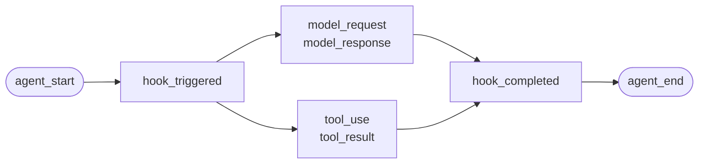
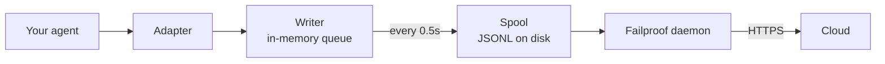

Đối với một agent mà bạn đã viết hoặc một framework mà Failproof AI không có adapter cho. Không có gì để instrument: bạn phát ra các sự kiện.

Đây là cùng một API mà bốn framework adapter gọi bên dưới. Chúng là bảng dịch lên nó.

## Cài đặt

```bash
pip install failproofai-sdk
```

Không có extras và không có phụ thuộc.

## Instrument

```python
import failproofai_sdk

failproofai_sdk.configure(environment="production")

with failproofai_sdk.session():                 # một run
    with failproofai_sdk.agent("planner"):      # một đơn vị công việc
        with failproofai_sdk.tool_call("search", input={"q": q}) as t:
            t.output = search(q)                # một lệnh gọi công cụ
```

Đọc từ trên xuống dưới và nó nói ra ý của nó:

| Bao bọc nó trong | Để nói |
| --- | --- |
| `session()` | Những sự kiện này thuộc cùng một run |
| `agent()` | Cái gì đó đang làm việc — hãy đặt tên cho nó mà bạn sẽ nhận ra trong một danh sách |
| `tool_call()` | Đây là một công cụ và đây là kết quả trả về của nó |

Và kết quả thực tế mà mỗi cái phát ra:

| Phạm vi | Phát ra | Mục đích |
| --- | --- | --- |
| `session()` | Không có gì | Ràng buộc một session id, nhóm một run |
| `agent()` | `agent_start`, `agent_end` | Đặt dấu ngoặc cho một đơn vị công việc |
| `tool_call()` | `tool_use`, `tool_result` | Đặt dấu ngoặc cho một công cụ và đo lường nó |

Mọi thứ bên trong có thể bỏ qua `session_id` và `agent_id`. Các phạm vi ràng buộc nhận dạng trên các biến ngữ cảnh và mỗi lệnh gọi sự kiện đều đọc nó trở lại, do đó bạn không bao giờ phải truyền id qua các hàm của mình.

Cả ba đều hoạt động dưới `async with` cũng như `with`.

Lồng các agent xây dựng cây. `parent_id` và độ sâu được tính toán từ ngăn xếp:

```python
with failproofai_sdk.session():
    with failproofai_sdk.agent("supervisor"):
        with failproofai_sdk.agent("researcher"):    # parent_id = "supervisor"
            ...
```

## Cách một phạm vi đóng lại

`agent()` xử lý ngoại lệ cho bạn:

| Chuyện gì đã xảy ra | Sự kiện | Kết quả |
| --- | --- | --- |
| Không có gì được raise | `agent_end` | `success` |
| `Exception` | `error`, sau đó `agent_end` | `failed` |
| `KeyboardInterrupt`, `SystemExit` | `error`, sau đó `agent_end` | `failed` |
| `CancelledError`, `GeneratorExit` | chỉ `agent_end` | `cancelled` |

Lỗi được phát ra trước `agent_end`, vì dashboard đóng span tại `agent_end` và bất kỳ thứ gì sau nó đều được ghi cho không có gì. Hủy bỏ không phải là một thất bại, do đó các run bị hủy không làm ô nhiễm bề mặt lỗi. Ngoại lệ luôn được tạo lại: một phạm vi không bao giờ nuốt chửng.

## Các phương thức sự kiện

Mười lăm phương thức trong sáu gia đình. Hầu hết đều có dạng cặp — bạn phát ra phần mở, sau đó là phần đóng, và SDK đo lường khoảng giữa chúng.

| Gia đình | Mở | Đóng | Độc lập |
| --- | --- | --- | --- |
| **Agents** | `agent_start` | `agent_end` | — |
| | `agent_pause` | `agent_resume` | — |
| **Models** | `model_request` | `model_response` | — |
| **Tools** | `tool_use` | `tool_result` | — |
| **Hooks** | `hook_triggered` | `hook_completed` | — |
| **Humans** | `human_wait` | `human_input` | `human_pause`, `human_interrupt` |
| **Failures** | — | — | `error` |

<Tip>
  Ưu tiên các phạm vi — `agent()` và `tool_call()` — ở bất cứ nơi nào chúng phù hợp. Chúng đảm bảo sự kiện đóng ngay cả khi phần thân raise. Hãy sử dụng các phương thức này trực tiếp khi dòng điều khiển của bạn không lồng nhau, chẳng hạn như lệnh gọi mô hình bên trong trợ giúp.
</Tip>

<CodeGroup>
```python Agents
failproofai_sdk.event.agent_start(agent_id="planner", goal="find the cheapest flight")
failproofai_sdk.event.agent_end(agent_id="planner", outcome="success", summary="...")
failproofai_sdk.event.agent_pause(pause_id="p1", reason="awaiting approval")
failproofai_sdk.event.agent_resume(pause_id="p1")
```

```python Models
failproofai_sdk.event.model_request(
    model="gpt-4o-mini",
    messages=[{"role": "user", "content": "..."}],
    request_id="req-1",
)
failproofai_sdk.event.model_response(
    model="gpt-4o-mini",
    content="...",
    input_tokens=139,
    output_tokens=21,
    request_id="req-1",
    duration_ms=5202,
)
```

```python Tools
failproofai_sdk.event.tool_use(tool_name="search", tool_call_id="c1", input={"q": "..."})
failproofai_sdk.event.tool_result(tool_name="search", tool_call_id="c1", output="...")
```

```python Hooks
failproofai_sdk.event.hook_triggered(hook_name="retrieve", hook_id="h1", trigger_event="node")
failproofai_sdk.event.hook_completed(hook_name="retrieve", hook_id="h1", outcome="success")
```

```python Humans
failproofai_sdk.event.human_wait(input_id="i1", prompt="Approve?", options=["yes", "no"])
failproofai_sdk.event.human_input(input_id="i1", response="yes")
failproofai_sdk.event.human_pause(reason="operator paused the run", user_id="dana")
failproofai_sdk.event.human_interrupt(reason="operator stopped the run", at_step="step_3")
```

```python Failures
failproofai_sdk.event.error(
    error_type="TimeoutError",
    message="provider timed out after 30s",
    traceback="...",
)
```
</CodeGroup>

<Note>
  **Hai gia đình con người chỉ theo các hướng ngược lại.**

  | Phương thức | Nghĩa |
  | --- | --- |
  | `human_wait` / `human_input` | **Agent yêu cầu một người** — cổng phê duyệt, câu hỏi làm rõ |
  | `human_pause` / `human_interrupt` | **Một người hoạt động trên agent** — nút dừng, tạm dừng của người điều hành |

  Không có framework nào phát tín hiệu cho cặp thứ hai, do đó nó luôn là của bạn để phát ra.
</Note>

<Warning>
  **Chuyển `request_id` khi các lệnh gọi mô hình chạy song song.** Nếu không có nó, các yêu cầu và phản hồi ghép nối theo thứ tự đến hạn trên mỗi agent — và các lệnh gọi song song bị ghép nối sai, gắn mỗi phản hồi vào yêu cầu sai.
</Warning>

## Ví dụ

Một vòng lặp gọi công cụ chống lại API OpenAI, không có agent framework:

```python
import json

import failproofai_sdk
from openai import OpenAI

failproofai_sdk.configure(environment="production")
client = OpenAI()
MODEL = "gpt-4o-mini"


def turn(messages: list):
    """Một lệnh gọi mô hình, được đặt dấu ngoặc bởi cặp."""
    failproofai_sdk.event.model_request(model=MODEL, messages=messages)
    reply = client.chat.completions.create(model=MODEL, messages=messages, tools=TOOLS)
    usage = reply.usage
    failproofai_sdk.event.model_response(
        model=MODEL,
        content=reply.choices[0].message.content or "",
        input_tokens=usage.prompt_tokens,
        output_tokens=usage.completion_tokens,
    )
    return reply.choices[0].message


with failproofai_sdk.session():
    with failproofai_sdk.agent("inventory", goal="price report"):
        for _ in range(4):          # bounded; an unbounded agent loop is its own bug
            message = turn(messages)
            if not message.tool_calls:
                break
            messages.append(message.model_dump(exclude_none=True))
            for call in message.tool_calls:
                args = json.loads(call.function.arguments or "{}")
                with failproofai_sdk.tool_call(
                    call.function.name, tool_call_id=call.id, input=args
                ) as handle:
                    handle.output = run_tool(call.function.name, args)
                messages.append({
                    "role": "tool",
                    "tool_call_id": call.id,
                    "content": str(handle.output),
                })
```

Điều đó tạo ra cùng sáu loại sự kiện mà một adapter sẽ cho bạn. Phiên bản chạy được hoàn chỉnh, với các định nghĩa công cụ, được gửi trong kho SDK dưới `docs/manual/examples/`.

## Threads và async

Các biến ngữ cảnh lan truyền vào tác vụ asyncio tự động. Chúng không lan truyền vào các thread mới, vì một thread bắt đầu với bối cảnh trống.

```python
# asyncio: không cần làm gì
async with failproofai_sdk.session():
    await asyncio.gather(worker(1), worker(2))

# threads: bao bọc callable
pool.submit(failproofai_sdk.propagate(work), x)
threading.Thread(target=failproofai_sdk.propagate(work)).start()
loop.run_in_executor(None, failproofai_sdk.propagate(work), x)
```

Nếu không có `propagate()`, các sự kiện của worker sẽ raise `TypeError` đặt tên cho bản sửa chữa thay vì hạ cánh trên không session. Điều đó là cố ý: một sự kiện không có session được bỏ qua bởi ingest và trả lời `200`, đó là lỗi yên tĩnh mà tầng nhận dạng tồn tại để ngăn chặn.

## Instrument một framework mà không có adapter

Mỗi agent framework đều cung cấp cho bạn ba chỗ điểm. Ánh xạ chúng và bạn có một dấu vết hoàn chỉnh — bốn adapter được gửi không làm gì nhiều hơn thế.

| Chỗ điểm | Cái bạn viết | Cái hạ cánh |
| --- | --- | --- |
| Run | `session()` + `agent()` | `agent_start`, `agent_end` |
| Mỗi công cụ | `tool_call()` | `tool_use`, `tool_result` |
| Mỗi lệnh gọi mô hình | Cặp `model_*` | `model_request`, `model_response` |

<Steps>
  <Step title="Đặt dấu ngoặc cho run">
    ```python
    with failproofai_sdk.session():
        with failproofai_sdk.agent(agent_name, goal=task):
            result = framework.run(task)
    ```
  </Step>
  <Step title="Đặt dấu ngoặc cho mỗi công cụ">
    Trong bất kỳ cái mà framework gọi là một bộ gói công cụ hoặc middleware.

    ```python
    with failproofai_sdk.tool_call(name, input=args) as call:
        call.output = original(**args)
    ```
  </Step>
  <Step title="Ghép nối mỗi lệnh gọi mô hình">
    ```python
    failproofai_sdk.event.model_request(model=model, messages=messages)
    reply = provider.complete(...)
    failproofai_sdk.event.model_response(
        model=model,
        content=text,
        input_tokens=usage.prompt_tokens,
        output_tokens=usage.completion_tokens,
    )
    ```
  </Step>
</Steps>

<Tip>
  **Có một node, step hoặc middleware boundary đáng nhìn?** Bao bọc nó trong một cặp hook — `hook_triggered` / `hook_completed` — không phải một `agent()` lồng nhau. `agent_id` là một facet cardinality thấp, và một entry trên mỗi node sẽ làm chìm nó. Hook span render cùng cách và cung cấp cho bạn độ trễ trên mỗi node.
</Tip>

<Note>
  **Manual và automatic kết hợp.** Một adapter chạy bên trong một phạm vi viết tay tham gia session đó và cha mẹ đó agent, do đó bạn nhận được một cây chứ không phải hai — hữu ích khi bạn instrument một framework tự mình cùng một được hỗ trợ.
</Note>

<Accordion title="Tại sao không có AutoGen adapter">
  Hai lý do, và ba chỗ điểm ở trên là câu trả lời cho cả hai:

  - `autogen-core` đã không được bảo trì kể từ tháng 9 năm 2025.
  - AG2 không expose điểm đăng ký toàn quy trình tương đương với các hook của framework khác, do đó instrument nó có nghĩa là bao bọc mỗi agent tại mỗi trang xây dựng.

  Ánh xạ các chỗ điểm bằng tay ghi lại các sự kiện tương tự, với cùng độ trung thực, như một adapter được gửi sẽ làm.
</Accordion>

## Đi sâu hơn

Cách ghi âm thực tế hoạt động. Không cần bất kỳ thứ gì trong số này để bắt đầu.

<AccordionGroup>

<Accordion title="Một bản ghi trông giống thế nào, trên mỗi framework" icon="eye">

Mỗi bản ghi đều có hình dạng tương tự: một span mở, công việc lồng nhau bên trong nó, và mỗi sự kiện mở lại nhận được một sự kiện đóng.



**Cặp** là đơn vị. Mỗi sự kiện đóng mang theo một khoảng thời gian mà SDK đo từ cái mở của nó.

Dưới đây là một run thực trên mỗi framework — được chụp từ các ví dụ được gửi với SDK, tên mô hình được chuẩn hóa. Lưu ý có bao nhiêu quay trở lại từ một lệnh gọi duy nhất.

<Tabs>
  <Tab title="LangGraph">
    ```text 14 events
     1  +0.000s  agent_start       LangGraph
     2  +0.001s    hook_triggered  agent
     3  +0.002s      model_request   gpt-4o-mini
     4  +3.023s      model_response  gpt-4o-mini · 21 out-tok
     5  +3.024s    hook_completed  agent
     6  +3.024s    hook_triggered  tools
     7  +3.025s      tool_use      word_count
     8  +3.025s      tool_result   word_count · ok
     9  +3.025s    hook_completed  tools
    10  +3.026s    hook_triggered  agent
    11  +3.027s      model_request   gpt-4o-mini
    12  +5.717s      model_response  gpt-4o-mini · 5 out-tok
    13  +5.720s    hook_completed  agent
    14  +5.721s  agent_end         LangGraph · success
    ```

    Node trở thành hook pair, do đó bạn nhận được độ trễ mỗi node mà không chúng tấn công danh sách agent.
  </Tab>

  <Tab title="CrewAI">
    ```text 10 events
     1  +0.000s  agent_start       crew
     2  +0.050s    agent_start     analyst · under crew
     3  +0.057s      model_request   gpt-4o-mini
     4  +3.475s      model_response  gpt-4o-mini · 19 out-tok
     5  +3.478s      tool_use      lookup_metric
     6  +3.478s      tool_result   lookup_metric · ok
     7  +3.486s      model_request   gpt-4o-mini
     8  +5.694s      model_response  gpt-4o-mini · 9 out-tok
     9  +5.727s    agent_end       analyst · success
    10  +5.739s  agent_end         crew · success
    ```

    `role` của mỗi agent trở thành tên span của nó, do đó độ trễ và chi phí token chia nhỏ theo role.
  </Tab>

  <Tab title="LlamaIndex">
    ```text 26 events
     1  +0.000s  agent_start       Agent
     2  +0.001s    hook_triggered  init_run
     4  +0.501s    hook_triggered  setup_agent
     6  +0.503s    hook_triggered  run_agent_step
     7  +0.505s      model_request   gpt-4o-mini
     8  +3.083s      model_response  gpt-4o-mini · 18 out-tok
    10  +3.197s    hook_triggered  parse_agent_output
    12  +3.355s    hook_triggered  call_tool
    13  +3.355s      tool_use      city_population
    14  +3.355s      tool_result   city_population · ok
    16  +3.356s    hook_triggered  aggregate_tool_results
       ...                        second iteration
    26  +7.038s  agent_end         Agent · success
    ```

    Vòng lặp agent tự nó đã hiển thị, không chỉ các lệnh gọi mô hình của nó.
  </Tab>

  <Tab title="Pydantic AI">
    ```text 8 events
    1  +0.000s  agent_start       agent
    2  +0.001s    model_request   gpt-4o-mini
    3  +4.413s    model_response  gpt-4o-mini · 17 out-tok
    4  +4.415s    tool_use        population
    5  +4.415s    tool_result     population · ok
    6  +4.416s    model_request   gpt-4o-mini
    7  +8.118s    model_response  gpt-4o-mini · 6 out-tok
    8  +8.119s  agent_end         agent · success
    ```

    Không có hook pair: Pydantic AI không có node hoặc step boundary để đặt dấu ngoặc.
  </Tab>

  <Tab title="Custom agents">
    ```text 6 events
    1  +0.000s  agent_start       main
    2  +0.000s    tool_use        population
    3  +0.000s    tool_result     population · ok
    4  +0.000s    model_request   gpt-4o-mini
    5  +0.000s    model_response  gpt-4o-mini · 3 out-tok
    6  +0.000s  agent_end         main · success
    ```

    Bạn phát ra các cái này tự mình. Cùng loại sự kiện, cùng độ trung thực — nó có giá là các trang gọi.
  </Tab>
</Tabs>

</Accordion>

<Accordion title="Cách một session bắt đầu và kết thúc" icon="circle-play">

**Không có session-end event.** Một session không phải là cái gì bạn đóng — nó là một nhóm sự kiện chia sẻ một `session_id`.

Trạng thái được rút ra từ hình dạng của dấu vết:

| Trạng thái | Khi nào |
| --- | --- |
| `ongoing` | Ít nhất một span vẫn còn mở |
| `paused` | Một `agent_pause` không có `agent_resume` phù hợp |
| `error` | Không có gì mở, và ít nhất một sự kiện thất bại |
| `done` | Không có gì mở, và không có gì thất bại |

Vì vậy một session kết thúc khi mọi cặp được đóng. Các adapter phát ra `agent_end` cho bạn, và khi tắt chúng đóng bất kỳ thứ gì vẫn còn mở và đánh dấu nó không hoàn chỉnh — một run bị crash giải quyết là `done` với một khoảng trống nhìn thấy được chứ không phải treo.

<Note>
  Đây là lý do tại sao một session có thể trải dài hai cuộc gọi. Một LangGraph `interrupt()` tạm dừng run, root span cố ý giữ mở, và cuộc gọi tiếp tục đóng nó. Cả hai cuộc gọi là một session.
</Note>

</Accordion>

<Accordion title="Nhận dạng: session_id, agent_id, và ai tạo ra chúng" icon="fingerprint">

`session_id` và `agent_id` là tùy chọn trên mỗi phương thức sự kiện. Được bỏ qua, chúng giải quyết từ phạm vi bao quanh:

```python
with failproofai_sdk.session():
    with failproofai_sdk.agent("planner"):
        failproofai_sdk.event.tool_use(tool_name="search", tool_call_id="c1")
```

Vượt qua chúng một cách rõ ràng vẫn hoạt động và có ưu tiên. Nếu không có gì bị ràng buộc và không có gì bị vượt qua, cuộc gọi sẽ raise `TypeError` đặt tên cho bản sửa chữa chứ không phát ra một sự kiện không có session, mà ingest sẽ bỏ qua trong khi trả lời `200`.

Các phạm vi ràng buộc nhận dạng trên các biến ngữ cảnh. Những cái đó lan truyền vào tác vụ asyncio tự động nhưng không vào thread mới — bao bọc một worker trong `failproofai_sdk.propagate()`.

#### Ai tạo ra id nào

| Id | Được tạo bởi | Ghi chú |
| --- | --- | --- |
| `session_id` | Bạn, hoặc SDK | `session("chat-42")` được sử dụng nguyên văn; bỏ qua, SDK tạo một `uuid4().hex` |
| `agent_id` | Bạn, hoặc framework | Từ `agent("analyst")`, một CrewAI `role`, một `FunctionAgent.name`. Một giá trị giống UUID bị từ chối và thay thế |
| `tool_call_id`, `hook_id`, `request_id` | Bạn, hoặc framework | Adapter tái sử dụng id run riêng của framework, đó là lý do tại sao các cặp sống sót qua thread hop |
| **Event id** | **Cloud, tại ingest** | SDK không phát ra bất kỳ cái nào |
| **`dedup_key`** | **Cloud, tại ingest** | Một hash của org, session, timestamp, type và payload. Đây là nhận dạng thực — nó làm cho một batch được thử lại bị sụp đổi thay vì nhân đôi |

#### Làm thế nào các adapter giải quyết `session_id`

Trận đầu tiên thắng:

1. Một tùy chọn `session_id` rõ ràng
2. Metadata mỗi cuộc gọi
3. Phạm vi `session()` bao quanh
4. Metadata framework
5. Id run riêng của framework

Nó không bao giờ được phát minh trong khi một cái đó tồn tại — một id tổng hợp sẽ chia một run thành nhiều session.

#### Giữ `agent_id` cardinality thấp

Nó là facet chính trên mọi bề mặt dashboard, và một cột `LowCardinality(String)`. Một giá trị mỗi run làm giảm chất lượng cột và lấp đầy dropdown bộ lọc bằng một entry trên mỗi run.

Các adapter bảo vệ cột đó cho bạn:

| Framework trao | Ghi lại là | Tại sao |
| --- | --- | --- |
| `3f9a1c2b-…` (một UUID) | `main` | Không có gì có thể đọc để giữ |
| Một chuỗi hex trần dài | `main` | Giống nhau |
| `agent-3f9a1c2b-…` | `agent` | Id per-run bị tước, phần có thể đọc được được giữ |
| `agent-v2` | `agent-v2` | Các phân đoạn ngắn bị bỏ lại |
| `step-3` | `step-3` | Giống nhau |

Id thực được giữ trên `fw_agent_id` / `fw_run_id`, nơi nó vẫn có thể truy vấn được mà không phải là một facet.

<Warning>
  **Cái này bảo vệ chỉ các nhãn *framework* được chọn.** Một `agent_id` bạn vượt qua chính mình — để `event.*`, hoặc để `failproofai_sdk.agent(...)` — được ghi lại chính xác như được cho. Yên tĩnh viết lại một argument rõ ràng sẽ tồi tệ hơn cardinality nó ngăn chặn, vì vậy hãy đặt tên cho span của riêng bạn cho phù hợp.
</Warning>

</Accordion>

<Accordion title="Loại sự kiện, được nhóm — và framework nào ghi lại cái gì" icon="table">

| Nhóm | Sự kiện |
| --- | --- |
| Agents | `agent_start`, `agent_end`, `agent_pause`, `agent_resume` |
| Models | `model_request`, `model_response` |
| Tools | `tool_use`, `tool_result` |
| Hooks | `hook_triggered`, `hook_completed` |
| Humans | `human_wait`, `human_input`, `human_pause`, `human_interrupt` |
| Failures | `error` |

Framework nào ghi lại cái gì, được đo từ các run ở trên:

| Sự kiện | LangGraph | CrewAI | LlamaIndex | Pydantic AI | Custom |
| --- | :--: | :--: | :--: | :--: | :--: |
| Bắt đầu và kết thúc agent | Có | Có | Có | Có | Bạn |
| Yêu cầu và phản hồi mô hình | Có | Có | Có | Có | Bạn |
| Sử dụng công cụ và kết quả | Có | Có | Có | Có | Bạn |
| Hook triggered và completed | Node | Task | Step | — | Bạn |
| Lỗi | Có | Có | Có | Có | Tự động |
| Con người chờ và nhập | Có | Có | Có | — | Bạn |
| Tạm dừng và tiếp tục agent | Có | Có | Có | — | Bạn |

Một dấu gạch ngang có nghĩa là framework không có khái niệm như vậy. `human_pause` và `human_interrupt` mô tả một *người* hoạt động trên agent, mà không có framework nào phát tín hiệu — phát ra những cái đó tự mình.

</Accordion>

<Accordion title="Cặp, tương quan và khoảng thời gian" icon="link">

Một sự kiện không bao giờ đến một mình. Một mở một span, một đóng nó, và sự kiện đóng mang theo một khoảng thời gian mà SDK đo từ cái mở của nó.

| Mở | Đóng | Sự kiện đóng mang theo |
| --- | --- | --- |
| `agent_start` | `agent_end` | `outcome`, `summary` |
| `model_request` | `model_response` | token, `stop_reason`, độ trễ |
| `tool_use` | `tool_result` | `output` hoặc `error`, khoảng thời gian |
| `hook_triggered` | `hook_completed` | `outcome`, khoảng thời gian |
| `agent_pause` | `agent_resume` | tạm dừng kéo dài bao lâu |
| `human_wait` | `human_input` | câu trả lời, và người tốn bao lâu |

<Warning>
  Một sự kiện mở mà không có sự kiện đóng là một span không bao giờ hoàn thành. Session render như vẫn đang chạy, mãi mãi, và khoảng thời gian hoạt động của nó tiếp tục tăng. Đây là chế độ thất bại để xem khi bạn instrument bằng tay.
</Warning>

#### Quy tắc tương quan

- Tái sử dụng cùng `tool_call_id`, `hook_id`, `pause_id`, hoặc `input_id` cho sự kiện hoàn thành phù hợp.
- SDK tính toán `duration_ms` cho `tool_result`, `hook_completed`, `agent_resume`, và `human_input`. Vượt qua nó cho các phương thức đó sẽ raise `ValueError`.
- `duration_ms` **được** chấp nhận trên `model_response`, vì chỉ người gọi biết độ trễ nhà cung cấp thực. Nó phải là một số nguyên — một float sẽ raise `ValueError` tại trang gọi, vì máy chủ đọc cột là một số nguyên 32-bit không dấu và sẽ lưu trữ NULL cho bất kỳ thứ gì khác.
- Kóa tương quan được định phạm vi theo loại và session, vì vậy một lệnh gọi công cụ và một hook có thể an toàn chia sẻ một id, và hai session đồng thời có thể tái sử dụng cùng id mà không va chạm. Chúng không được định phạm vi theo agent: một cặp mở dưới một agent và đóng dưới một agent khác vẫn tương quan, đây là trường hợp thông thường trong framework đa agent.
- `request_id` ghép nối `model_request` với `model_response`. Nếu không có nó, các sự kiện mô hình ghép nối theo thứ tự trên mỗi agent, vì vậy các lệnh gọi đồng thời bị ghép nối sai.
- Một cặp chia nhỏ trên các quy trình vẫn tương quan xuôi dòng, nhưng SDK không thể tính toán khoảng thời gian trong quy trình của nó.
- Bản đồ đang chờ xử lý giữ tối đa 10.000 lần bắt đầu và loại bỏ entry cũ nhất khi đầy.

</Accordion>

<Accordion title="Cái gì trong gói, và làm thế nào instrument() tìm thấy framework của bạn" icon="box">

Cài đặt `failproofai-sdk` cài đặt mọi thứ, cả bốn adapter được bao gồm. Các extras kéo vào **framework**, không phải adapter.

```python
import failproofai_sdk        # tải không có gì ngoài thư viện tiêu chuẩn
failproofai_sdk.instrument()  # nhập chỉ các adapter bạn thực sự cần
```

`import failproofai_sdk` được hợp đồng bằng không phụ thuộc, thực thi bởi một bài kiểm tra cài đặt wheel xây dựng với `--no-deps` và một cái khác chứng minh không frame framework nào đạt `sys.modules`.

<Warning>
  Không có thuộc tính `failproofai_sdk.crewai`. Các adapter cố ý không được expose trên gói cấp cao: chạm vào một cái sẽ nhập framework như một tác dụng phụ của việc truy cập thuộc tính, phá vỡ lời hứa zero-dependency. Sử dụng `instrument()`.
</Warning>

```python
failproofai_sdk.instrument()              # mỗi framework đã được nhập
failproofai_sdk.instrument("crewai")      # chính xác một, theo tên
failproofai_sdk.uninstrument("crewai")    # đặt nó trở lại
```

| Tên | Cũng chấp nhận |
| --- | --- |
| `langchain` | `langgraph`, `langchain_core` |
| `crewai` | — |
| `llama_index` | `llamaindex`, `llama-index` |
| `pydantic_ai` | `pydantic-ai`, `pydanticai` |

Phát hiện tự động đọc `sys.modules`, không phải danh sách gói được cài đặt, vì vậy một framework mà bạn có cài đặt nhưng không bao giờ nhập không được instrument và không bao giờ được nhập thay mặt bạn. Để xem cái gì được kết nối:

```python
from failproofai_sdk.integrations import active, available

available()   # ('crewai', 'langchain', 'llama_index', 'pydantic_ai')
active()      # ('langchain',)
```

<Note>
  **`instrument("crewai")` trên một máy không có CrewAI sẽ không raise.** Nó ghi lại cảnh báo và trả lại `()`, vì vậy một framework bị thiếu không bao giờ đánh bại một quy trình cũng instrument những cái khác.

  Cảnh báo mang theo `ImportError` cơ bản, và thông điệp đó đặt tên cho lệnh cài đặt chính xác — vì vậy bản sửa chữa nằm trong log của bạn, không bị ẩn.

  ```text
  ImportError: failproofai_sdk: cannot instrument 'crewai' because 'crewai.events'
  is not importable. Install it with:  pip install 'failproofai_sdk[crewai]'
  ```

  Đặt `FAILPROOFAI_SDK_STRICT=1` để có nó raise thay thế. Cái cờ đó được đọc **một lần và cached**, vì vậy xuất nó trước khi quy trình của bạn bắt đầu thay vì đặt nó giữa run.
</Note>

<Warning>
  **`instrument()` phải đến *sau* nhập framework của bạn.** Phát hiện tự động đọc `sys.modules`, vì vậy một lệnh gọi trần ở trên nhập tìm không có gì, cài đặt không có gì, và trả lại `()`.
</Warning>

<CodeGroup>
```python Sai
import failproofai_sdk
failproofai_sdk.instrument()   # sys.modules không có langchain chưa -> ()

import langchain               # quá muộn, không có gì được kết nối
```

```python Đúng
import langchain               # nhập framework trước
import failproofai_sdk

failproofai_sdk.instrument()   # tìm thấy nó -> ('langchain',)
```

```python Đúng, order-proof
import failproofai_sdk

# Đặt tên nó nhập adapter theo yêu cầu, vì vậy điều này hoạt động từ bất cứ đâu.
failproofai_sdk.instrument("langchain")
```
</CodeGroup>

Làm sai điều này và quy trình chạy với SDK được nhập, adapter rõ ràng được cài đặt, và **không một sự kiện nào được phát ra**. Nó ghi lại cảnh báo nói chính xác điều đó — vì vậy hãy kiểm tra log của bạn trước khi một run ghi lại không có gì.

</Accordion>

<Accordion title="Cách các sự kiện đạt Cloud" icon="cloud-upload">



| Giai đoạn | Công việc | Chạy trong |
| --- | --- | --- |
| Adapter | Dịch một callback framework thành một trong 15 loại sự kiện | Quy trình của bạn |
| Writer | Xếp hàng, batch, viết JSONL nguyên tử | Quy trình của bạn, thread nền |
| Spool | Handoff bền vững, sống sót qua quy trình của bạn thoát | Đĩa cục bộ |
| Daemon | Xem spool, ship batch, xóa cái nó gửi | Máy của bạn |
| Ingest | Gán một hàng id và dedup key, quảng bá các cột có thể truy vấn | Cloud |

Spool là những gì làm điều này an toàn: agent của bạn không bao giờ chặn trên mạng, và một Cloud outage có nghĩa là một thư mục phát triển thay vì các sự kiện bị mất.

Mỗi flush viết một file batch, `.tmp` trước, sau đó `fsync`, sau đó một rename nguyên tử:

```text
~/.failproofai/custom-agents/events/
  event-2026-08-20T10-15-00-123Z-48213-0.jsonl
```

Daemon chỉ nhặt `.jsonl`, vì vậy nó không bao giờ đọc một file nửa viết. Thân mác mang theo một timestamp, process id và số thứ tự, vì vậy hai quy trình flush trong cùng một mili giây không thể va chạm. Hàng đợi được cắt ở 10.000 sự kiện; quá những gì nó thả cái cũ nhất và ghi lại.

<Warning>
  **`collector.redact` mặc định `minimal` cho sự kiện SDK quá.** SDK tẩy sạch trước khi viết một batch để đĩa, và daemon lặp lại cùng một pass xác định trước khi tải lên vì vậy batch từ SDK cũ được bảo vệ.
</Warning>

Daemon đọc mỗi batch và áp dụng redaction trong bộ nhớ trước khi tải lên. Nó không viết lại file spool nó đọc.

| Sự kiện | Viết bởi | Nơi redaction tối thiểu chạy |
| --- | --- | --- |
| Phiên bản ghi session CLI | Daemon | Trước daemon viết batch |
| Hoạt động hook | Daemon | Trước daemon viết batch |
| **Mọi thứ SDK phát ra** | **Quy trình của bạn** | **Trước SDK viết batch và lại trước daemon tải lên** |

Đặt `collector.redact` để `off` chỉ khi payload nguyên văn là một yêu cầu rõ ràng; SDK và daemon cả sẽ tôn trọng cài đặt đó. Redaction tối thiểu bắt các API key chung, bearer token, JWT, và gán bí mật. Nó không thể xác định đặc biệt prose nhạy cảm.

<Tip>
  **Bạn kiểm soát payload tại nguồn, ở hai nơi:**

  - Tắt chụp nội dung trên adapter. **Tên tùy chọn khác nhau, và một adapter không có tùy chọn** — đây không phải là một công tắc phổ quát duy nhất:
    - LangChain / LangGraph, Pydantic AI — `capture_content=False`
    - LlamaIndex — `capture_messages=False`
    - CrewAI — **không công tắc nội dung nào cả**; `session_id` là tùy chọn duy nhất nó đọc, vì vậy prompt và completion luôn được ghi lại.

    `instrument()` thả các tùy chọn mà adapter không đọc, vì vậy vượt qua tên sai sẽ không raise và không thay đổi gì cả.
  - Đừng trao bí mật để `input=` ở nơi đầu tiên.

  `collector.redact` là bảo vệ sâu, không thay thế cho bất kỳ cái.
</Tip>

<Warning>
  **Một thư mục spool trống là trạng thái khoẻ mạnh.** Đừng sử dụng nó để kiểm tra giao hàng.
</Warning>

Daemon xóa mỗi batch trong mili giây gửi nó, vì vậy một `ls` đua daemon và hiển thị một phần của cái bạn phát ra — không thể phân biệt từ một SDK ghi lại không có gì.

Để xác nhận sự kiện thực sự hạ cánh, kiểm tra dashboard. Để xem spool lấp đầy, dừng daemon trước.

</Accordion>

<Accordion title="Khi instrumentation thất bại" icon="triangle-alert">

Mỗi callback chạy bên trong một bộ gói có công việc duy nhất là tạo lại, vì vậy cuộc gọi của bạn nằm trong chính xác một `try` và mọi thứ SDK làm xảy ra bên ngoài nó.

| Chuyện gì xảy ra | Kết quả |
| --- | --- |
| Một hook raise | Ghi lại một lần với traceback của nó. Cuộc gọi của bạn không bị ảnh hưởng |
| Hook tương tự raise ba lần | Cái hook đó bị vô hiệu hóa cho phần còn lại của quy trình, với một hàng lỗi |
| `FAILPROOFAI_SDK_STRICT=1` được đặt | Ngoại lệ được tạo lại thay thế |
| Một phiên bản framework nằm ngoài phạm vi được kiểm tra | Cảnh báo một lần, instrument dù sao |
| Một khả năng duy nhất bị thiếu | Cái hook đó bị vô hiệu hóa, không bao giờ toàn bộ adapter |

Mặc định là đúng ở production và sai trong khi gỡ lỗi, vì nó chỉ có thể chứng minh "nó không bị sập". Đặt `FAILPROOFAI_SDK_STRICT=1` để làm cho một thất bại nuốt chửng lớn.

</Accordion>

</AccordionGroup>

## Các vấn đề phổ biến

<AccordionGroup>
  <Accordion title="Một span không bao giờ hoàn thành">
    Một sự kiện mở không có sự kiện đóng: một `model_request` không có `model_response`, hoặc một `tool_use` không có `tool_result`. Sử dụng các phạm vi, những cái đó đảm bảo cặp ngay cả khi phần thân raise. Nếu bạn gọi các phương thức sự kiện trực tiếp, sử dụng `try` và `finally`.
  </Accordion>

  <Accordion title="Vượt qua duration_ms sẽ raise ValueError">
    Nó được đo từ sự kiện mở phù hợp, vì vậy nó bị từ chối trên `tool_result`, `hook_completed`, `agent_resume`, và `human_input`. Nó được chấp nhận trên `model_response`, vì chỉ bạn biết độ trễ nhà cung cấp thực, và nó phải là một số nguyên.
  </Accordion>

  <Accordion title="Sự kiện từ worker thread raise TypeError">
    Thread không bao giờ kế thừa bối cảnh. Bao bọc callable trong `failproofai_sdk.propagate()`. Xem [Thread và async](#threads-and-async).
  </Accordion>

  <Accordion title="Một trường bổ sung biến mất hoặc ghi đè cái gì đó">
    Các trường bổ sung hợp nhất cuối cùng, vì vậy một cái được đặt tên như một trường thực như `model` hoặc `outcome` sẽ ghi đè nó và thay đổi một cột được lưu trữ. Namespace của bạn; các adapter sử dụng một tiền tố `fw_`.
  </Accordion>

  <Accordion title="Bộ lọc agent có hàng ngàn entry">
    `agent_id` là một facet cardinality thấp và bạn đặt một run id vào nó. Sử dụng một role hoặc node name và đặt id thực vào một trường payload.
  </Accordion>
</AccordionGroup>

## Tiếp theo

<Columns cols={3}>
  <Card title="Cách nó hoạt động" icon="workflow" href="/vi/reference/custom-agents">
    Cặp, id, vòng đời session, và giao hàng.
  </Card>
  <Card title="Đọc một dấu vết" icon="route" href="/vi/sessions/read-a-trace">
    Theo causality thông qua session bạn vừa chụp.
  </Card>
  <Card title="Framework adapter" icon="plug" href="/vi/start/integrations">
    LangGraph, CrewAI, LlamaIndex, và Pydantic AI.
  </Card>
</Columns>