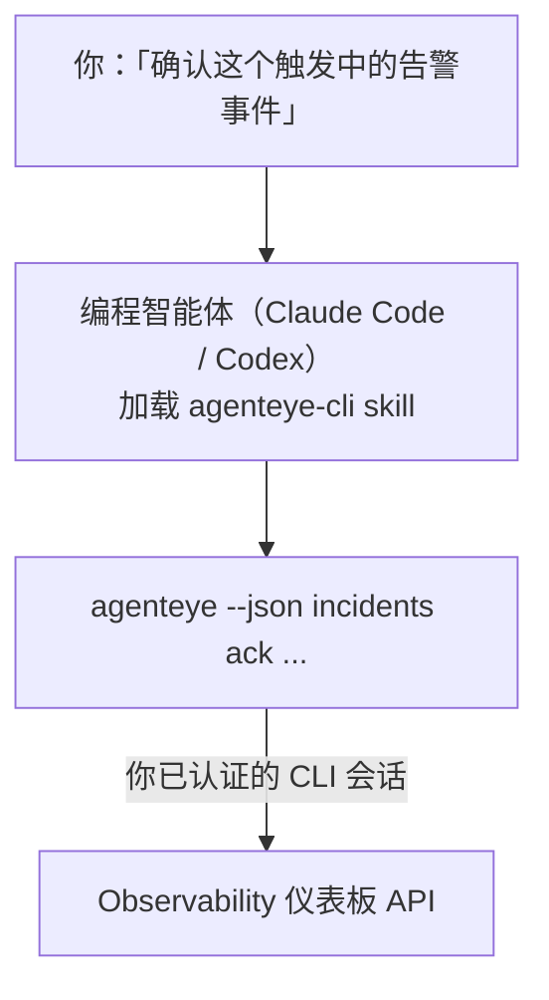

向你的编程智能体提问*「今天有什么异常吗？」*，让它从你的实时 Failproof AI Observability 数据中作答，无需记忆任何命令。**Failproof AI Observability CLI skill**（`agenteye-cli`）是一个 *Agent Skill*：一个小型指令文件夹，供 Claude Code 或 Codex 等编程智能体按需加载。它让智能体能够通过 [`agenteye` CLI](/zh/agenteye/cli) 响应自然语言请求来操作你的 Observability 部署，例如*「给 CI 创建一个只能推送事件的密钥」*或*「确认这个触发中的告警事件并分配给我」*。

它**不是**服务，也不是独立的二进制文件，无需部署任何东西。它建立在你已安装的 CLI 之上：智能体调用 `agenteye --json …`，解析干净的 JSON，然后用自然语言回答你。它能做的一切，你自己输入相同命令同样可以做到。

---

## 与其他 Failproof AI Observability 界面的关系

Failproof AI Observability 提供四种访问相同数据和控制功能的方式，它们相互补充：

| 界面 | 说明 | 运行环境 | 适用场景 |
|---|---|---|---|
| **[CLI](/zh/agenteye/cli)** | `agenteye` 的命令与参数参考 | 你的终端 | 需要运行或脚本化某个具体命令时 |
| **[CLI recipes](/zh/agenteye/cli-recipes)** | 可直接复制的 `jq`/pipeline 模式 | 你的终端 / 脚本 | 将 CLI 接入自动化流程时 |
| **CLI skill**（本文档）| CLI 的自然语言入口 | 你工作站上的编程智能体 | 想直接提问、让智能体选择命令时 |
| **[Evaluator skill](/zh/agenteye/evaluator-skill)** | 用于设计和构建评分服务的配套 skill | 你工作站上的编程智能体 | 想*生产* eval 评分而非读取时 |
| **[Python SDK skill](/zh/agenteye/python-sdk-skill)** | 用于让你的智能体生成遥测数据的配套 skill | 你工作站上的编程智能体 | 想让智能体*生成*本 skill 所读取的事件时 |
| **[仪表板内置 AI 助手](/zh/agenteye/assistant)** | 嵌入仪表板的对话界面 | 服务端（仪表板内） | 想在仪表板中对数据进行问答时 |

该 skill 本身没有任何特权，它只是将你的语言转化为以你的身份运行的 CLI 调用：



### 与仪表板内置 AI 助手的重要区别

这是两个截然不同的工具，影响范围差异显著：

- **仪表板内置 AI 助手**（[AI assistant](/zh/agenteye/assistant)）是嵌入仪表板的对话界面，由智能体服务提供支持。它**仅支持只读操作及需审批的内容创作**：可以起草已保存的查询和仪表板，但每次写入操作都会暂停等待你明确点击确认，且不会执行删除。它受 `agent:use` 权限控制，且只能查看你当前所在组织的数据。
- **CLI skill** 在*你的*工作站上运行于*你的*编程智能体内，以**你**的身份驱动 `agenteye` CLI。它可以执行 CLI 的**全部功能，包括变更操作**（创建/轮换/禁用 API 密钥、修改组织设置、解决告警事件、删除已保存查询），仅受你的 CLI 登录权限约束。请像对待自己手动运行这些命令一样谨慎地对待它。

---

## 前置条件

1. 已安装 **`agenteye` CLI** 且位于 `PATH` 中（参见 [CLI](/zh/agenteye/cli) 参考文档：`pipx install agenteye`）。
2. 已设置**仪表板 URL**（`AGENTEYE_DASHBOARD_URL`，或通过 `--base-url` 参数传入）。
3. 已有**登录会话**：请先自行运行 `agenteye login`。该 skill **无法**代替你完成邮件一次性验证码登录；如果会话不存在或已过期（CLI 退出码为 `4`），它会提示你运行 `agenteye login`。

---

## 获取方式

该 skill 发布在 Failproof AI 的公共 skills 合集中：

**[github.com/FailproofAI/skills](https://github.com/FailproofAI/skills)** → [`skills/agenteye-cli/`](https://github.com/FailproofAI/skills/tree/main/skills/agenteye-cli)

无任何访问限制——仓库是公开的，该 skill 也不需要自己的凭证，因为它只是用*你*登录的会话驱动**公开**的 `agenteye` CLI 访问*你的*仪表板。无需向任何人申请。

请注意，它作为独立文件夹发布，**不包含**在 `pipx install agenteye` 包中，请勿在那里查找。

## 安装 skill

最快捷的方式是使用 [`skills`](https://skills.sh) CLI，它会自动获取文件夹并放置到智能体的查找路径中：

```bash
# Claude Code，仅限当前项目
npx skills add FailproofAI/skills --skill agenteye-cli -a claude-code

# 所有项目（安装到 ~/.claude/skills/）
npx skills add FailproofAI/skills --skill agenteye-cli -a claude-code -g --copy

# 使用 Codex
npx skills add FailproofAI/skills --skill agenteye-cli -a codex
```

然后像管理其他 skill 一样管理它：

```bash
npx skills list -a claude-code      # 查看已安装的 skill
npx skills update agenteye-cli      # 拉取最新版本
npx skills remove agenteye-cli      # 移除 skill
```

更喜欢手动安装？Agent Skill 只是一个包含 `SKILL.md`（以及可选引用文件）的文件夹，直接复制同样有效：

- **Claude Code**：将 `agenteye-cli/` 文件夹放入 `~/.claude/skills/`（适用所有项目）或 `<你的仓库>/.claude/skills/`（仅限该仓库）。Claude Code 会自动发现它——通过 `/skills` 列表验证，或直接提一个与其描述匹配的问题即可。
- **Codex（OpenAI）**：Codex 读取相同的 `SKILL.md`。内置的 `agents/openai.yaml` 设置了 `allow_implicit_invocation: true`，因此当任务匹配时 Codex 会自动选择该 skill；否则可以通过 `$agenteye-cli` 显式调用。

---

## 安全须知：智能体运行 CLI 时变更操作不会弹出确认提示

> **警告：** 在让智能体执行变更操作之前，请务必阅读本节。

`agenteye` CLI 通常在执行破坏性操作前会询问*「你确定吗？」*。但**当它未连接到终端时（编程智能体运行它的方式正是如此），以及使用 `--json` 时，都会自动跳过该确认。** 因此，安全确认提示**不会**对智能体触发。

该 skill 在编写时已对此进行补偿：它被指示在执行任何状态变更前，先陈述将要运行的确切命令，并获得你明确的**确认**。请保持这一规范。当你通过智能体操作 Failproof AI Observability 时，*你*就是那个确认步骤。需要注意的状态变更命令如下：

- `keys create` / `update` / `disable` / `regenerate`
- `users create` / `update` / `disable` / `enable`
- `settings set`
- `alerts create` / `update` / `delete` / `test`
- 具有写入功能的 `incidents` 子命令：`ack` / `assign` / `resolve` / `open` / `comment-add` / `comment-delete` / `subscribe` / `unsubscribe`
- `query create` / `update` / `delete`
- `agent rename` / `delete`
- `orgs switch`

**Observe** 类命令（`events`、`sessions`、`evals`、`errors`、`list`、`whoami`、`orgs list/current/perms`）均为只读，不会修改任何内容。

由于智能体以**你**的身份行事，它只能执行你的登录所允许的操作；权限按**组织**解析（参见 [API keys](/zh/agenteye/api-keys)）。如果你缺少某个命令的权限，系统会返回退出码 `5` 并指明所需权限名称，因此智能体可以准确告知你需要向管理员申请什么，而不是模糊地报错。

---

## 你可以问它什么

以下是一次真实的完整交互示例——先是读取操作，然后是等待确认的变更操作：

```text
you   ▸ 最近一天有什么异常吗？

agent ▸ 正在运行：agenteye --json errors --since 24h --aggregate
        过去 24 小时内有 3 种错误类型。最多的是 TimeoutError
        （18 次，全部发生在 checkout-agent 上），其次是 RateLimited（5 次）。
        需要查看 TimeoutError 的失败会话吗？

you   ▸ 给 CI 创建一个只能推送事件的密钥。

agent ▸ 这将创建一个 API 密钥。我将运行：
          agenteye keys create ci --add events:add
        确认继续吗？

you   ▸ 确认

agent ▸ 完成。已创建密钥「ci」，仅具有 events:add 权限。
        该密钥只显示一次，请立即保存。我无法重新显示它。
```

该 skill 将每个自然语言意图映射到正确的 `agenteye` 命令，先通过 `list <kind>`、`whoami` 发现有效值以避免猜测，并在任何变更前陈述确切命令。更多示例：

- *「最近 24 小时内有什么异常或失败吗？」* → `errors --since 24h --aggregate`，然后给出详细分类。
- *「会话 `run-001` 为什么失败？」* → `events --session-id run-001 --all` + `evals --session-id run-001`。
- *「本周质量趋势如何？」* → `evals --aggregate --since 7d`，然后深入查看低分运行。
- *「给 CI 创建一个只能推送事件的密钥。」* → `keys create ci --add events:add`（陈述命令后创建，并捕获一次性密钥）。
- *「谁有访问权限？将 Dana 设为只读。」* → `users list` → `users update dana@… --permission-set read-only`（经你确认后执行）。
- *「确认这个触发中的告警事件并分配给我。」* → `incidents list --state firing` → `incidents ack <id>` / `incidents assign <id> you@…`。

有关这些操作背后的确切命令、参数和 JSON 格式，请参阅 [CLI](/zh/agenteye/cli) 参考文档和[智能体 CLI recipes](/zh/agenteye/cli-recipes)。

---

## 后续步骤

- **[CLI](/zh/agenteye/cli)**：`agenteye` 的完整命令和参数参考。
- **[智能体 CLI recipes](/zh/agenteye/cli-recipes)**：可复制的 `jq` 模式和退出码处理方法。
- **[Evaluator agent skill](/zh/agenteye/evaluator-skill)**：配套 skill，用于构建 `agenteye evals` 所读取评分的评估器。
- **[Python SDK agent skill](/zh/agenteye/python-sdk-skill)**：配套 skill，用于为智能体添加埋点，使其生成 `agenteye` 所读取的遥测数据。
- **[AI assistant](/zh/agenteye/assistant)**：仪表板内置助手（请勿与本终端 skill 混淆）。
- **[API keys](/zh/agenteye/api-keys)**：约束 skill 操作范围的按组织权限模型。