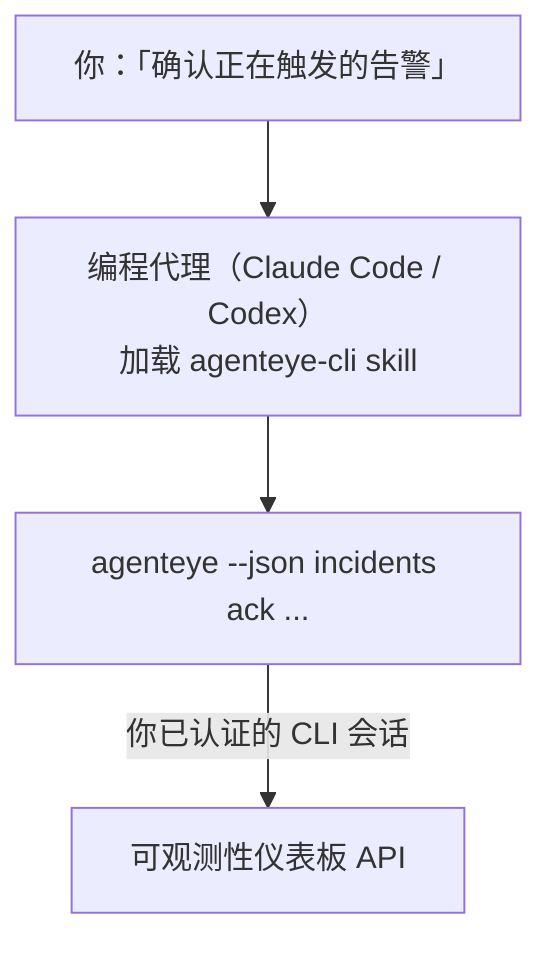

向你的编程代理询问*「今天有什么问题吗？」*，让它直接从你的实时 Failproof AI 可观测性数据中给出答案，无需记忆任何命令。**Failproof AI 可观测性 CLI skill**（`agenteye-cli`）是一个 *Agent Skill*：一个小型指令文件夹，供 Claude Code 或 Codex 等编程代理按需加载。它使代理能够通过 [`agenteye` CLI](/zh/agenteye/cli) 响应自然语言请求来操作你的可观测性部署，例如*「给 CI 创建一个只能推送事件的密钥」*或*「确认正在触发的告警并将其分配给我」*。

它**不是**服务，也不是独立的二进制文件，无需任何部署。它建立在你已安装的 CLI 之上：代理调用 `agenteye --json …`，解析整洁的 JSON，然后以自然语言回答你。它所能做的一切，你自己输入同样的命令也能实现。

---

## 与其他 Failproof AI 可观测性接口的关系

Failproof AI 可观测性提供四种方式访问相同的数据和控制功能，它们相互补充：

| 接口 | 说明 | 运行位置 | 适用场景 |
|---|---|---|---|
| **[CLI](/zh/agenteye/cli)** | `agenteye` 的命令/参数参考 | 你的终端 | 需要运行或脚本化特定命令时 |
| **[CLI 示例](/zh/agenteye/cli-recipes)** | 可复制粘贴的 `jq`/管道模式 | 你的终端 / 脚本 | 将 CLI 接入自动化流程时 |
| **CLI skill**（本文档） | CLI 的自然语言入口 | 你的编程代理，运行在你的工作站 | 只想直接提问、让代理选择命令时 |
| **[Evaluator skill](/zh/agenteye/evaluator-skill)** | 设计并构建评分服务的同类 skill | 你的编程代理，运行在你的工作站 | 需要*生成* eval 分数时 |
| **[Python SDK skill](/zh/agenteye/python-sdk-skill)** | 为你的代理添加遥测能力的同类 skill | 你的编程代理，运行在你的工作站 | 需要让代理*生成*本 skill 所读取的事件时 |
| **[仪表板内 AI 助手](/zh/agenteye/assistant)** | 嵌入仪表板的对话界面 | 服务端（在仪表板中） | 需要在仪表板内对数据进行问答时 |

该 skill 本身没有任何特权，它只是将你的话转换为以你的身份运行的 CLI 调用：



### 与仪表板内 AI 助手的重要区别

这是两个不同的工具，影响范围差异显著：

- **仪表板内 AI 助手**（[AI 助手](/zh/agenteye/assistant)）是嵌入仪表板的对话界面，由代理服务提供支持。它**只读，写操作需审批**：可以起草已保存的查询和仪表板，但每次写操作都会暂停并等待你的明确点击确认，且永远不会删除数据。它受 `agent:use` 权限控制，且仅能查看你当前所在组织的数据。
- **CLI skill** 在*你的*工作站上运行于*你的*编程代理内，以**你的身份**驱动 `agenteye` CLI。它可以执行 CLI 的**完整功能，包括变更操作**（创建/轮换/禁用 API 密钥、修改组织设置、解决告警、删除已保存的查询等），仅受你的 CLI 登录权限约束。请像对待手动输入这些命令一样谨慎对待它。

---

## 前提条件

1. 已安装 **`agenteye` CLI** 并添加到 `PATH`（参见 [CLI](/zh/agenteye/cli) 参考：`pipx install agenteye`）。
2. 已设置**仪表板 URL**（`AGENTEYE_DASHBOARD_URL`，或由代理传入 `--base-url`）。
3. 已有**登录会话**：请先自行运行 `agenteye login`。该 skill **无法**替你完成邮件验证码登录；如果会话缺失或已过期（CLI 退出码 `4`），它会提示你运行 `agenteye login`。

---

## 获取方式

该 skill 发布在 Failproof AI 的公开 skills 集合中：

**[github.com/FailproofAI/skills](https://github.com/FailproofAI/skills)** → [`skills/agenteye-cli/`](https://github.com/FailproofAI/skills/tree/main/skills/agenteye-cli)

完全无需任何审批——该仓库是公开的，skill 也不需要自己的凭证，因为它只是使用*你*登录的会话，通过**公开的** `agenteye` CLI 操作*你的*仪表板。你无需向任何人申请。

注意它以独立文件夹形式发布，**不包含**在 `pipx install agenteye` 包中，请不要在那里寻找它。

## 安装 skill

最快捷的方式是使用 [`skills`](https://skills.sh) CLI，它会自动获取文件夹并放置到代理查找的位置：

```bash
# Claude Code，仅限当前项目
npx skills add FailproofAI/skills --skill agenteye-cli -a claude-code

# 所有项目（安装到 ~/.claude/skills/）
npx skills add FailproofAI/skills --skill agenteye-cli -a claude-code -g --copy

# 使用 Codex
npx skills add FailproofAI/skills --skill agenteye-cli -a codex
```

然后像管理其他 skill 一样管理它：

```bash
npx skills list -a claude-code      # 查看已安装的 skill
npx skills update agenteye-cli      # 拉取最新版本
npx skills remove agenteye-cli      # 移除 skill
```

倾向于手动安装？Agent Skill 只是一个包含 `SKILL.md`（以及可选参考文件）的文件夹，直接复制同样有效：

- **Claude Code**：将 `agenteye-cli/` 文件夹放入 `~/.claude/skills/`（适用于所有项目）或 `<你的仓库>/.claude/skills/`（仅限该仓库）。Claude Code 会自动发现它——通过 `/skills` 列表验证，或直接提问一个符合其描述的问题。
- **Codex（OpenAI）**：Codex 读取相同的 `SKILL.md`。随附的 `agents/openai.yaml` 设置了 `allow_implicit_invocation: true`，因此当任务匹配时 Codex 会自动选择该 skill；否则可以通过 `$agenteye-cli` 显式调用。

---

## 安全注意事项：代理运行 CLI 时变更操作不会有确认提示

> **警告：** 在让代理进行任何变更之前，请先阅读本节。

`agenteye` CLI 在执行破坏性操作前通常会询问*「你确定吗？」*。但**当它未连接到终端时（这正是编程代理的运行方式），该确认会被自动跳过，`--json` 参数同样会跳过确认。**因此，对代理而言安全提示**不会**触发。

该 skill 在编写时已对此进行了补偿：它被设计为在执行任何状态变更前，先说明将要运行的确切命令，并等待你的明确**确认**。请保持这一习惯。当你通过代理操作 Failproof AI 可观测性时，*你*就是确认环节。需要关注的状态变更命令包括：

- `keys create` / `update` / `disable` / `regenerate`
- `users create` / `update` / `disable` / `enable`
- `settings set`
- `alerts create` / `update` / `delete` / `test`
- 写操作类 `incidents` 子命令：`ack` / `assign` / `resolve` / `open` / `comment-add` / `comment-delete` / `subscribe` / `unsubscribe`
- `query create` / `update` / `delete`
- `agent rename` / `delete`
- `orgs switch`

**Observe** 类命令（`events`、`sessions`、`evals`、`errors`、`list`、`whoami`、`orgs list/current/perms`）均为只读，不会改变任何状态。

由于代理以**你的身份**操作，它只能执行你的登录所允许的操作；权限按**组织**解析（参见 [API 密钥](/zh/agenteye/api-keys)）。若某个命令超出你的权限，将返回退出码 `5` 并明确说明所需权限名称，代理可以准确告知你需要向管理员申请什么，而不是给出模糊的错误。

---

## 你可以问什么

以下是一次真实的完整交互示例，先是读操作，然后是等待你确认的变更操作：

```text
你    ▸ 过去一天有什么问题吗？

代理  ▸ 正在运行：agenteye --json errors --since 24h --aggregate
        过去 24 小时内有 3 种错误类型。最多的是 TimeoutError
        （18 次，全部发生在 checkout-agent），其次是 RateLimited（5 次）。
        需要查看 TimeoutError 的失败会话吗？

你    ▸ 给 CI 创建一个只能推送事件的密钥。

代理  ▸ 这将创建一个 API 密钥。我将运行：
          agenteye keys create ci --add events:add
        确认继续吗？

你    ▸ 是

代理  ▸ 完成。已创建密钥 "ci"，仅具有 events:add 权限。
        密钥只显示一次，请立即保存。我无法再次显示它。
```

该 skill 将每种自然语言意图映射到正确的 `agenteye` 命令，先通过 `list <kind>`、`whoami` 等方式发现有效值而非猜测，并在任何变更前说明确切的命令。更多示例：

- *「过去 24 小时有什么异常/失败吗？」* → `errors --since 24h --aggregate`，然后给出详细分析。
- *「会话 `run-001` 为什么失败？」* → `events --session-id run-001 --all` + `evals --session-id run-001`。
- *「本周质量趋势如何？」* → `evals --aggregate --since 7d`，然后深入分析低分运行。
- *「给 CI 创建一个只能推送事件的密钥。」* → `keys create ci --add events:add`（说明命令后创建，并获取一次性密钥）。
- *「谁有访问权限？将 Dana 设为只读。」* → `users list` → `users update dana@… --permission-set read-only`（与你确认后执行）。
- *「确认正在触发的告警并分配给我。」* → `incidents list --state firing` → `incidents ack <id>` / `incidents assign <id> you@…`。

有关这些操作背后的确切命令、参数和 JSON 结构，请参见 [CLI](/zh/agenteye/cli) 参考和[代理 CLI 示例](/zh/agenteye/cli-recipes)。

---

## 后续步骤

- **[CLI](/zh/agenteye/cli)**：`agenteye` 完整命令和参数参考。
- **[代理 CLI 示例](/zh/agenteye/cli-recipes)**：可复制粘贴的 `jq` 模式和退出码处理。
- **[Evaluator agent skill](/zh/agenteye/evaluator-skill)**：同类 skill，用于构建 `agenteye evals` 所读取分数的评估器。
- **[Python SDK agent skill](/zh/agenteye/python-sdk-skill)**：同类 skill，用于为代理添加遥测能力，使其发出 `agenteye` 所读取的数据。
- **[AI 助手](/zh/agenteye/assistant)**：仪表板内助手（请勿与本终端 skill 混淆）。
- **[API 密钥](/zh/agenteye/api-keys)**：限定 skill 能力范围的按组织权限模型。