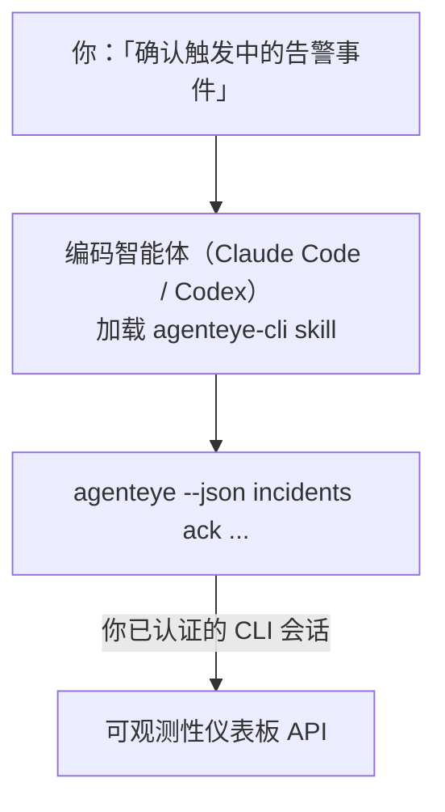

向你的编码智能体询问*「今天有什么问题吗？」*，让它直接从你的 Failproof AI 可观测性实时数据中作答，无需记忆任何命令。**Failproof AI 可观测性 CLI skill**（`agenteye-cli`）是一个 *Agent Skill*：一个小型指令文件夹，供 Claude Code 或 Codex 等编码智能体按需加载。它让智能体能够通过 [`agenteye` CLI](/zh/agenteye/cli) 响应自然语言请求来操作你的可观测性部署，例如*「给 CI 创建一个只能推送事件的密钥」*或*「确认触发中的告警事件并分配给我」*。

它**不是**服务，也不是独立的二进制文件，无需任何部署。它建立在你已安装的 CLI 之上：智能体调用 `agenteye --json …`，解析干净的 JSON，然后以文字形式回答你。它能做的一切，你自己输入相同命令也能做到。

---

## 与其他 Failproof AI 可观测性接口的关系

Failproof AI 可观测性提供四种方式访问相同的数据和控制功能，它们相互补充：

| 接口 | 简介 | 运行位置 | 适用场景 |
|---|---|---|---|
| **[CLI](/zh/agenteye/cli)** | `agenteye` 的命令/参数参考 | 你的终端 | 需要运行或脚本化特定命令时 |
| **[CLI 配方](/zh/agenteye/cli-recipes)** | 可复制粘贴的 `jq`/管道模式 | 你的终端/脚本 | 将 CLI 接入自动化流程时 |
| **CLI skill**（本文档） | 基于 CLI 的自然语言入口 | 你的编码智能体，在你的工作站上 | 想直接提问，让智能体选择命令时 |
| **[Evaluator skill](/zh/agenteye/evaluator-skill)** | 设计和构建评分服务的同类 skill | 你的编码智能体，在你的工作站上 | 想*生成*评估分数而非读取时 |
| **[Python SDK skill](/zh/agenteye/python-sdk-skill)** | 为智能体添加遥测数据上报能力的同类 skill | 你的编码智能体，在你的工作站上 | 想让你的智能体*生成*本 skill 所读取的事件时 |
| **[仪表板内置 AI 助手](/zh/agenteye/assistant)** | 嵌入仪表板的对话界面 | 服务端（仪表板中） | 想在仪表板内对数据进行问答时 |

该 skill 本身没有任何特权，它只是将你的话语转化为以你的身份运行的 CLI 调用：



### 与仪表板内置 AI 助手的重要区别

这是两种完全不同的工具，影响范围差异显著：

- **仪表板内置 AI 助手**（[AI 助手](/zh/agenteye/assistant)）是嵌入仪表板的对话界面，由智能体服务提供支持。它是**只读加审批写入**模式：可以起草已保存的查询和仪表板，但每次写入操作都会暂停等待你明确点击确认，且不会执行删除操作。它受 `agent:use` 权限控制，只能查看你当前所在组织的数据。
- **CLI skill** 在*你的*工作站上运行于*你的*编码智能体中，以**你**的身份驱动 `agenteye` CLI。它可以执行 CLI 的**完整功能，包括变更操作**（创建/轮换/禁用 API 密钥、修改组织设置、解决告警事件、删除已保存的查询），仅受你的 CLI 登录权限约束。请以与手动执行这些命令同等谨慎的态度对待它。

---

## 前置条件

1. 已安装 **`agenteye` CLI** 并添加到 `PATH`（参见 [CLI](/zh/agenteye/cli) 参考：`pipx install agenteye`）。
2. 已设置你的**仪表板 URL**（`AGENTEYE_DASHBOARD_URL`，或由智能体传入 `--base-url`）。
3. 已有**登录会话**：请先自行运行 `agenteye login`。该 skill **无法**为你完成邮件一次性验证码的登录流程；如果会话缺失或已过期（CLI 退出码 `4`），它会提示你运行 `agenteye login`。

---

## 获取方式

该 skill 发布在 Failproof AI 的公共 skills 集合中：

**[github.com/FailproofAI/skills](https://github.com/FailproofAI/skills)** → [`skills/agenteye-cli/`](https://github.com/FailproofAI/skills/tree/main/skills/agenteye-cli)

完全无门槛——仓库是公开的，该 skill 不需要任何自身凭证，因为它只是通过**公开的** `agenteye` CLI 访问*你的*仪表板，使用*你*登录的会话。你无需向任何人申请。

注意它作为独立文件夹发布，**不**包含在 `pipx install agenteye` 包中，请不要在那里寻找它。

## 安装 skill

最快捷的方式是使用 [`skills`](https://skills.sh) CLI，它会拉取文件夹并放置到智能体查找的位置：

```bash
# Claude Code，仅限本项目
npx skills add FailproofAI/skills --skill agenteye-cli -a claude-code

# 所有项目（安装到 ~/.claude/skills/）
npx skills add FailproofAI/skills --skill agenteye-cli -a claude-code -g --copy

# 使用 Codex
npx skills add FailproofAI/skills --skill agenteye-cli -a codex
```

然后像管理其他 skill 一样管理它：

```bash
npx skills list -a claude-code      # 查看已安装的 skill
npx skills update agenteye-cli      # 拉取最新版本
npx skills remove agenteye-cli      # 移除它
```

偏好手动安装？Agent Skill 只是一个包含 `SKILL.md`（以及可选参考文件）的文件夹，直接复制也可以：

- **Claude Code**：将 `agenteye-cli/` 文件夹放入 `~/.claude/skills/`（所有项目）或 `<your-repo>/.claude/skills/`（仅限该仓库）。Claude Code 会自动发现它——通过 `/skills` 列表验证，或直接提问一个与其描述匹配的问题。
- **Codex（OpenAI）**：Codex 读取相同的 `SKILL.md`。随附的 `agents/openai.yaml` 设置了 `allow_implicit_invocation: true`，因此当任务匹配时 Codex 会自动选择该 skill；否则可显式调用为 `$agenteye-cli`。

---

## 安全性：智能体运行 CLI 时变更操作不会弹出确认提示

> **警告：** 在让智能体执行变更操作前，请先阅读本节。

`agenteye` CLI 通常会在执行破坏性操作前询问*「确定吗？」*。然而，**当它未连接到终端时会自动跳过该确认（这正是编码智能体的运行方式），使用 `--json` 也会跳过它。** 因此，安全提示对智能体**不会触发**。

该 skill 在编写时对此做了补偿：它被指示在任何状态变更前先陈述将要运行的确切命令并获得你明确的**确认**。请保持这一原则。当你通过智能体操作 Failproof AI 可观测性时，*你*就是确认步骤。需要注意的变更命令包括：

- `keys create` / `update` / `disable` / `regenerate`
- `users create` / `update` / `disable` / `enable`
- `settings set`
- `alerts create` / `update` / `delete` / `test`
- 写入类 `incidents` 子命令：`ack` / `assign` / `resolve` / `open` / `comment-add` / `comment-delete` / `subscribe` / `unsubscribe`
- `query create` / `update` / `delete`
- `agent rename` / `delete`
- `orgs switch`

**Observe** 类的所有命令（`events`、`sessions`、`evals`、`errors`、`list`、`whoami`、`orgs list/current/perms`）均为只读，不会产生任何变更。

由于智能体以**你**的身份行动，它只能执行你的登录权限允许的操作；权限按**组织**解析（参见 [API 密钥](/zh/agenteye/api-keys)）。如果你没有某个命令的权限，会返回退出码 `5` 并明确指出所需权限名称，让智能体能够准确告知你需要向管理员申请什么，而不是模糊地报错。

---

## 你可以问它什么

以下是一次真实的交互示例——先是一次查询，然后是一次等待你确认的变更操作：

```text
你   ▸ 过去一天有什么问题吗？

智能体 ▸ 正在运行：agenteye --json errors --since 24h --aggregate
          过去 24 小时有 3 种错误类型。最多的是 TimeoutError
          （18 次，全部发生在 checkout-agent），其次是 RateLimited（5 次）。
          需要查看 TimeoutError 的失败会话吗？

你   ▸ 给 CI 创建一个只能推送事件的密钥。

智能体 ▸ 这将创建一个 API 密钥。我将运行：
            agenteye keys create ci --add events:add
          确认继续吗？

你   ▸ 是

智能体 ▸ 完成。已创建名为 "ci" 的密钥，仅具有 events:add 权限。
          密钥只显示一次，请立即保存。我无法再次打印它。
```

该 skill 将每种自然语言意图映射到正确的 `agenteye` 命令，首先发现有效值（`list <kind>`、`whoami`）以避免猜测，并在任何变更前陈述确切命令。更多示例：

- *「过去 24 小时有什么问题/故障吗？」* → `errors --since 24h --aggregate`，然后给出分解报告。
- *「会话 `run-001` 为什么失败？」* → `events --session-id run-001 --all` + `evals --session-id run-001`。
- *「本周质量趋势如何？」* → `evals --aggregate --since 7d`，然后深入分析低分运行。
- *「给 CI 创建一个只能推送事件的密钥。」* → `keys create ci --add events:add`（陈述命令，创建后捕获一次性密钥）。
- *「谁有访问权限？将 Dana 设为只读。」* → `users list` → `users update dana@… --permission-set read-only`（经你确认后执行）。
- *「确认触发中的告警事件并分配给我。」* → `incidents list --state firing` → `incidents ack <id>` / `incidents assign <id> you@…`。

关于这些操作背后的确切命令、参数和 JSON 格式，请参见 [CLI](/zh/agenteye/cli) 参考和[智能体 CLI 配方](/zh/agenteye/cli-recipes)。

---

## 后续步骤

- **[CLI](/zh/agenteye/cli)**：`agenteye` 的完整命令和参数参考。
- **[智能体 CLI 配方](/zh/agenteye/cli-recipes)**：可复制粘贴的 `jq` 模式和退出码处理。
- **[Evaluator agent skill](/zh/agenteye/evaluator-skill)**：同类 skill，用于构建 `agenteye evals` 读取其分数的评估器。
- **[Python SDK agent skill](/zh/agenteye/python-sdk-skill)**：同类 skill，用于为智能体添加遥测数据上报能力，使 `agenteye` 能够读取其数据。
- **[AI 助手](/zh/agenteye/assistant)**：仪表板内置助手（请勿与本终端 skill 混淆）。
- **[API 密钥](/zh/agenteye/api-keys)**：限定 skill 操作范围的按组织权限模型。