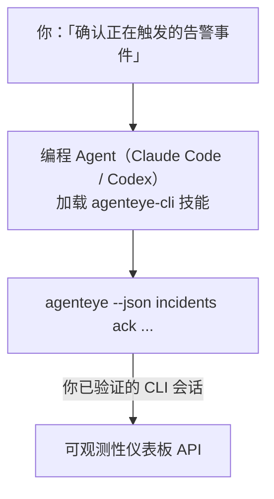

向你的编程 Agent 询问*「今天有什么故障吗？」*，让它直接从你的实时 Failproof AI 可观测性数据中给出答案，无需记忆任何命令。**Failproof AI 可观测性 CLI 技能**（`agenteye-cli`）是一个 *Agent 技能*：一个小型指令文件夹，供 Claude Code 或 Codex 等编程 Agent 按需加载。它教会 Agent 通过 [`agenteye` CLI](/zh/agenteye/cli) 来响应自然语言请求，例如*「给 CI 创建一个只能推送事件的密钥」*或*「确认正在触发的告警事件并分配给我」*。

它**不是**一项服务，也不是独立的二进制文件；无需部署任何东西。它建立在你已安装的 CLI 之上：Agent 会调用 `agenteye --json …`，解析返回的 JSON，然后用自然语言回答你。所有它能做的事，你完全可以自己输入相同的命令来完成。

---

## 与其他 Failproof AI 可观测性界面的关系

Failproof AI 可观测性提供了四种方式来访问相同的数据和控制功能，它们相互补充：

| 界面 | 说明 | 运行位置 | 适用场景 |
|---|---|---|---|
| **[CLI](/zh/agenteye/cli)** | `agenteye` 的命令与参数参考 | 你的终端 | 需要执行或编写特定命令脚本 |
| **[CLI 配方](/zh/agenteye/cli-recipes)** | 可复制粘贴的 `jq`/管道模式 | 你的终端 / 脚本 | 将 CLI 接入自动化流程 |
| **CLI 技能**（本文档） | CLI 的自然语言入口 | 你工作站上的编程 Agent | 只想直接提问，让 Agent 自行选择命令 |
| **[评估器技能](/zh/agenteye/evaluator-skill)** | 用于设计和构建评分服务的姊妹技能 | 你工作站上的编程 Agent | 需要*生成*评估分数，而非读取 |
| **[Python SDK 技能](/zh/agenteye/python-sdk-skill)** | 为你的 Agent 添加遥测埋点的姊妹技能 | 你工作站上的编程 Agent | 需要让你的 Agent *产生*本技能所读取的事件 |
| **[仪表板内置 AI 助手](/zh/agenteye/assistant)** | 嵌入仪表板的对话功能 | 服务器端（仪表板内） | 需要在仪表板中对数据进行问答 |

该技能本身没有任何特权；它只是将你的话转化为以你身份运行的 CLI 调用：



### 与仪表板内置 AI 助手的区别：重要说明

这是两个不同的工具，操作范围差异显著：

- **仪表板内置 AI 助手**（[AI 助手](/zh/agenteye/assistant)）是嵌入仪表板、由 Agent 服务支持的对话功能。它**只读，且写操作需经审批**：可以起草已保存的查询和仪表板，但每次写入都会暂停等待你的明确点击确认，且永远不会执行删除操作。它受 `agent:use` 权限控制，且只能查看你当前所在组织的数据。
- **CLI 技能**在*你的*工作站上运行，在*你的*编程 Agent 中驱动 `agenteye` CLI，以**你的身份**执行操作。它可以使用 CLI 的**完整功能，包括变更操作**（创建/轮换/禁用 API 密钥、修改组织设置、解决告警事件、删除已保存查询等），仅受你 CLI 登录权限的约束。请像对待手动输入这些命令一样谨慎对待它。

---

## 前提条件

1. 已安装 **`agenteye` CLI** 并添加到 `PATH`（参见 [CLI](/zh/agenteye/cli) 参考文档：`pipx install agenteye`）。
2. 已设置**仪表板 URL**（`AGENTEYE_DASHBOARD_URL`，或由 Agent 传入 `--base-url`）。
3. 已**登录会话**：请先自行运行 `agenteye login`。该技能**无法**替你完成邮件一次性验证码登录；如果会话缺失或已过期（CLI 退出码为 `4`），它会提示你运行 `agenteye login`。

---

## 获取方式

该技能发布在 Failproof AI 的公开技能集合中：

**[github.com/FailproofAI/skills](https://github.com/FailproofAI/skills)** → [`skills/agenteye-cli/`](https://github.com/FailproofAI/skills/tree/main/skills/agenteye-cli)

完全公开，无任何访问限制——仓库是公开的，技能本身也不需要任何凭证，因为它只是使用*你*登录的会话，通过**公开的** `agenteye` CLI 访问*你的*仪表板。无需向任何人申请。

注意：它作为独立文件夹发布，**不包含**在 `pipx install agenteye` 包中，请不要在那里查找。

## 安装技能

最快的方式是使用 [`skills`](https://skills.sh) CLI，它会拉取文件夹并放置到 Agent 的查找路径中：

```bash
# Claude Code，仅限当前项目
npx skills add FailproofAI/skills --skill agenteye-cli -a claude-code

# 所有项目（安装到 ~/.claude/skills/）
npx skills add FailproofAI/skills --skill agenteye-cli -a claude-code -g --copy

# 使用 Codex
npx skills add FailproofAI/skills --skill agenteye-cli -a codex
```

然后像管理其他技能一样进行管理：

```bash
npx skills list -a claude-code      # 查看已安装的技能
npx skills update agenteye-cli      # 拉取最新版本
npx skills remove agenteye-cli      # 删除技能
```

倾向于手动安装？Agent 技能就是一个包含 `SKILL.md`（以及可选引用文件）的文件夹，直接复制即可：

- **Claude Code**：将 `agenteye-cli/` 文件夹放入 `~/.claude/skills/`（所有项目）或 `<你的仓库>/.claude/skills/`（仅限该仓库）。Claude Code 会自动发现它——可通过 `/skills` 列表验证，或直接提问一个与其描述匹配的问题。
- **Codex（OpenAI）**：Codex 读取相同的 `SKILL.md`。内置的 `agents/openai.yaml` 设置了 `allow_implicit_invocation: true`，因此当任务匹配时 Codex 会自动选择该技能；否则可显式调用 `$agenteye-cli`。

---

## 安全须知：Agent 运行 CLI 时变更操作不会提示确认

> **警告：** 在允许 Agent 进行任何更改之前，请先阅读本节。

`agenteye` CLI 通常在执行破坏性操作前会询问*「确定吗？」*。然而，**当它未连接到终端时（编程 Agent 运行它时正是如此），以及使用 `--json` 时，都会自动跳过该确认。** 因此，安全确认提示**不会**在 Agent 运行时触发。

该技能在设计上已作出补偿：它被指示在任何状态变更前，先说明将要运行的确切命令，并获得你的明确**确认**。请保持这一规范。当你通过 Agent 操作 Failproof AI 可观测性时，*你*就是那个确认步骤。需要重点关注的变更命令包括：

- `keys create` / `update` / `disable` / `regenerate`
- `users create` / `update` / `disable` / `enable`
- `settings set`
- `alerts create` / `update` / `delete` / `test`
- 写入型 `incidents` 子命令：`ack` / `assign` / `resolve` / `open` / `comment-add` / `comment-delete` / `subscribe` / `unsubscribe`
- `query create` / `update` / `delete`
- `agent rename` / `delete`
- `orgs switch`

**观察**类操作（`events`、`sessions`、`evals`、`errors`、`list`、`whoami`、`orgs list/current/perms`）全部为只读，不会更改任何内容。

由于 Agent 以**你的身份**行事，它只能执行你的登录权限所允许的操作；权限按**每个组织**解析（参见 [API 密钥](/zh/agenteye/api-keys)）。如果某个命令超出权限范围，会返回退出码 `5` 并附上具体的权限名称，这样 Agent 可以准确告诉你需要向管理员申请什么权限，而不是给出模糊的错误。

---

## 可以提问的内容

以下是一次真实的完整交互示例——先是读取操作，然后是需要你确认的变更操作：

```text
你    ▸ 过去一天有什么故障吗？

Agent ▸ 正在运行：agenteye --json errors --since 24h --aggregate
        过去 24 小时内有 3 种错误类型。最多的是 TimeoutError
        （18 次，全部发生在 checkout-agent 上），其次是 RateLimited（5 次）。
        需要查看 TimeoutError 的失败会话吗？

你    ▸ 给 CI 创建一个只能推送事件的密钥。

Agent ▸ 这将创建一个 API 密钥。我将运行：
          agenteye keys create ci --add events:add
        确认继续？

你    ▸ 是的

Agent ▸ 完成。密钥「ci」已创建，权限仅限 events:add。
        密钥内容只显示一次，请立即保存。我无法再次打印。
```

该技能将每个自然语言意图映射到正确的 `agenteye` 命令，先通过 `list <kind>`、`whoami` 发现有效值，避免猜测，并在任何变更前说明确切命令。更多示例：

- *「过去 24 小时内有什么故障/失败吗？」* → `errors --since 24h --aggregate`，然后给出分类汇总。
- *「会话 `run-001` 为什么失败？」* → `events --session-id run-001 --all` + `evals --session-id run-001`。
- *「本周质量趋势如何？」* → `evals --aggregate --since 7d`，然后深入查看低分运行。
- *「给 CI 创建一个只能推送事件的密钥。」* → `keys create ci --add events:add`（先说明命令，确认后创建并捕获一次性密钥）。
- *「谁有访问权限？将 Dana 设为只读。」* → `users list` → `users update dana@… --permission-set read-only`（与你确认后执行）。
- *「确认正在触发的告警事件并分配给我。」* → `incidents list --state firing` → `incidents ack <id>` / `incidents assign <id> you@…`。

有关这些操作背后的确切命令、参数和 JSON 结构，请参阅 [CLI](/zh/agenteye/cli) 参考文档和[面向 Agent 的 CLI 配方](/zh/agenteye/cli-recipes)。

---

## 后续步骤

- **[CLI](/zh/agenteye/cli)**：`agenteye` 的完整命令与参数参考。
- **[面向 Agent 的 CLI 配方](/zh/agenteye/cli-recipes)**：可复制粘贴的 `jq` 模式和退出码处理。
- **[评估器 Agent 技能](/zh/agenteye/evaluator-skill)**：姊妹技能，用于构建 `agenteye evals` 所读取分数的评估器。
- **[Python SDK Agent 技能](/zh/agenteye/python-sdk-skill)**：姊妹技能，用于为 Agent 添加遥测埋点，使其能够发出 `agenteye` 所读取的遥测数据。
- **[AI 助手](/zh/agenteye/assistant)**：仪表板内置助手（与本终端技能不同）。
- **[API 密钥](/zh/agenteye/api-keys)**：限定技能操作范围的按组织权限模型。