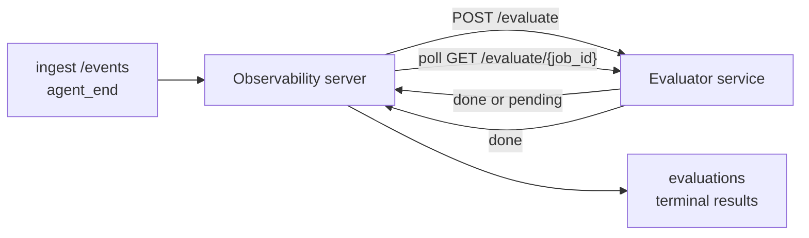

Failproof AI Observability 可以自动对每个完成的 Agent 运行进行质量评分：您只需提供一个小型评分服务，其余工作由 Observability 负责。使用它来跟踪您关心的维度（帮助性、工具效率、真实性、安全性；由您决定），及早发现回归问题，并一目了然地比较不同 Agent 或环境。评分功能为可选：在服务器上设置 `EVALUATOR_ENDPOINT` 之前，整个流水线不执行任何操作。

> **注意：** 评分维度由您自行定义。您的评估器可以返回任意数字键；Observability 会存储、趋势化并展示您返回的所有内容。

## 概览

1. **编写评分器。** 搭建一个小型 HTTP 服务，读取会话记录并返回评分。Observability 附带一个可直接复制使用的参考实现。参见[使用 SDK 编写评估器](#writing-an-evaluator-with-the-sdk)。
2. **将 Observability 指向该服务。** 在服务器进程上设置 `EVALUATOR_ENDPOINT`（以及共享的 `EVALUATOR_TOKEN`）。
3. **查看评分结果。** 每个完成的会话都会被自动评分；结果显示在会话详情页、会话列表页和已保存的仪表板上。


*配置评估器后，每个完成的运行都会被评分，结果显示在会话右侧栏：顶部为摘要，下方为带推理说明的各维度评分条。*

---

## 工作原理



当 Observability SDK 为某个会话发出 `agent_end` 事件时，服务器会调度一次评估。随后，它将完整的事件记录以 POST 请求发送给您的评估器服务，评估器可以：

- **内联返回结果**，格式为 `{"status":"done", "scores":{...}, "reasoning":{...}, "summary":"..."}`。结果会被追加到会话的评估时间线中。`reasoning` 和 `summary` 为可选字段。
- **延迟处理**，返回 `{"status":"pending", "job_id":"abc-123"}`。Observability 随后会轮询 `GET {EVALUATOR_ENDPOINT}/evaluate/abc-123`，直到评估器返回 `{"status":"done", ...}` 或 `{"status":"error", "error":"..."}`。

  轮询节奏按任务设定：`pending` 响应中可包含 `next_poll_secs` 来覆盖默认值；否则 Observability 使用 `GET /config` 返回的 `default_poll_interval_secs`；再否则服务器回退到 `EVALUATOR_POLLING_INTERVAL_SECS`（默认 10s）。所有值均限制在 [1s, 1h] 范围内。

从未发出 `agent_end` 的会话（例如，Agent 进程崩溃）也可被处理：评估器的 `GET /config` 可返回 `{"inactivity_timeout_secs": 1800}`，Observability 将对任何空闲时间超过该值的会话进行评估。将该字段设为 `null` 或省略即可禁用此回退机制。

当 `EVALUATOR_ENDPOINT` 未设置时，整个流水线完全为空操作。

一个会话可随时间**累积多个终态评估**：每个 `agent_end` 事件（以及从仪表板手动触发的重新评估）都会追加一条新的评估记录。这是对已恢复对话进行评估的推荐方式：用户结束 Agent 后，稍后返回并发送更多事件，再次结束 Agent，第二次评估将针对完整的更新后记录执行。仪表板将最新评估作为标题显示，将之前的评估作为可折叠时间线展示。当某会话的评估正在进行时，该会话后续的 `agent_end` 事件将被忽略；当前评估完成后，下一个事件将正常地将新评估加入队列。

空闲回退机制在恢复的会话上同样生效：如果在之前的终态评估之后有新事件到达，且会话随后的空闲时间超过 `inactivity_timeout_secs`，将会加入一次新的评估。

瞬态故障（5xx、429、超时、网络错误）会以指数退避方式重试，最多重试 `EVALUATOR_MAX_ATTEMPTS` 次；4xx 响应为终态。Observability 支持多个水平扩展的服务器实例安全运行；工作已分区，同一会话不会被同时分发两次。

---

## HTTP 接口规范

所有需要认证的路由均使用 **Bearer Token 认证**。两端必须配置相同的值：

- Observability 服务器：环境变量 `EVALUATOR_TOKEN`
- 评估器服务：以相同方式配置（`agenteye-evaluator` SDK 按约定读取 `EVALUATOR_TOKEN`）

如果 `EVALUATOR_TOKEN` 未设置，服务器发送请求时不携带 `Authorization` 头；评估器可接受匿名请求，这在仅内部访问的网络中是可以的，但不建议在公开互联网上使用。

### 评估器必须提供的路由

| 路由 | 请求体 / 参数 | 响应 |
|---|---|---|
| `GET /health` | 无 | `{"status":"ok"}`（开放，无需认证） |
| `GET /config` | 无 | `{"inactivity_timeout_secs": <int> \| null, "default_poll_interval_secs": <int> \| omitted}` |
| `POST /evaluate` | `EvalRequest` JSON | `{"status":"done", ...}` 或 `{"status":"pending", "job_id":"..."}` |
| `GET /evaluate/{id}` | 无 | 与 `/evaluate` 相同的响应结构 |

### 服务器发送的 `EvalRequest` 请求体

```json
{
  "schema_version": "1",
  "session_id":     "session-abc123",
  "agent_id":       "planner",
  "environment":    "production",
  "started_at":     "2026-05-10T12:00:00Z",
  "ended_at":       "2026-05-10T12:05:00Z",
  "events": [
    { "id": 1234, "ts": "...", "event_type": "agent_start", "payload": { ... } },
    ...
  ]
}
```

### 响应结构

**同步（done）：**

```json
{
  "status": "done",
  "scores": { "helpfulness": 0.85, "tool_efficiency": 0.6 },
  "reasoning": {
    "helpfulness": "answered the question directly with citations",
    "tool_efficiency": "called list_files three times when one would have done"
  },
  "summary": "strong answer quality, weak tool selection"
}
```

`reasoning`（每个评分的理由映射）和 `summary`（整体一段式叙述）均为可选字段。`reasoning` 中的键应与 `scores` 中的键对应；仪表板会在每个评分条下方内联渲染各条目。仅返回 `scores` 的旧版评估器无需修改即可继续使用；`reasoning` 和 `summary` 将读为 null，对应的 UI 元素将被省略。

**异步（延迟）：**

```json
{ "status": "pending", "job_id": "abc-123", "next_poll_secs": 30 }
```

`next_poll_secs` 为可选；如省略，服务器回退到评估器 `/config` 中的 `default_poll_interval_secs`，再回退到自身的 `EVALUATOR_POLLING_INTERVAL_SECS` 环境变量。

**评估器侧终态错误：**

```json
{ "status": "error", "error": "model service unavailable" }
```

服务器将任何其他 2xx 响应体视为协议错误，并为该会话记录终态 `error`。

---

## 使用 SDK 编写评估器

您无需手动实现 HTTP 接口规范。`agenteye-evaluator` Python 包提供了一个带类型的 FastAPI 封装，自动处理认证、路由以及请求/响应结构。

Failproof AI Observability 还附带一个**可用的参考评估器**，它根据记录的结构对 `helpfulness`、`tool_efficiency` 和 `factuality` 进行评分。您可以将其作为起点进行复制，替换为自己的逻辑：LLM 裁判、规则引擎，或任何符合您质量标准的方案。

最小可用评估器：

```python
import os
from agenteye_evaluator import Evaluator, EvalRequest, EvalResponse

app = Evaluator(token=os.environ["EVALUATOR_TOKEN"])

@app.evaluator
def run(req: EvalRequest) -> EvalResponse:
    # Inspect req.events (the full session transcript) and return scores.
    tool_calls = sum(1 for e in req.events if e.event_type == "tool_use")
    return EvalResponse(
        scores={"tool_calls": float(tool_calls)},
        reasoning={"tool_calls": f"{tool_calls} tool invocations in the transcript"},
        summary="tight tool loop" if tool_calls < 5 else "agent looped on tools",
    )
```

`app` 实例可在任何 ASGI 服务器下运行，使用 `uvicorn module:app` 即可启动。

对于需要延迟处理耗时工作的评估器，可返回 `JobPending` 并注册 `@app.job_lookup` 处理器；Observability 服务器将轮询 `GET /evaluate/{job_id}`，直到您返回终态状态或达到 `EVALUATOR_MAX_POLL_DURATION_SECS` 上限（默认 1 小时）。

完整的 API 参考、异步模式和事件模式请参阅 `agenteye-evaluator` SDK 的 README。

---

## 运行您的评估器

评估器是**您自己的服务** —— Failproof AI Observability 不提供默认评估器，因此您需要在运行自有服务的地方构建并运行它。它可在任何 ASGI 服务器下运行（例如 `uvicorn my_evaluator:app`）；按照 [HTTP 接口规范](#http-contract) 提供 `/health`、`/config` 和 `/evaluate` 路由，然后将服务器指向它（参见[配置服务器](#configuring-the-server)）。

评估器可达后，`GET /health` 将返回 `{"status":"ok"}`。Agent 端到端运行完成后，在服务器上执行 `GET /evaluations` 将返回一条 `status: "done"` 的记录以及您的评估器产生的评分。

---

## 配置服务器

在服务器进程上设置以下环境变量：

| 环境变量 | 含义 |
|---|---|
| `EVALUATOR_ENDPOINT` | 评估器的基础 URL（如 `http://evaluator:9000`）。未设置则禁用流水线。 |
| `EVALUATOR_TOKEN` | Bearer Token，必须与评估器服务配置的值相同。 |
| `EVALUATOR_WORKERS` | 每个服务器实例的工作任务数（默认 2）。 |
| `EVALUATOR_CLAIM_BATCH` | 每次工作任务节拍认领的行数（默认 4）。批次**并发**处理；评估器端点的有效并发数为 `EVALUATOR_WORKERS × EVALUATOR_CLAIM_BATCH`。 |
| `EVALUATOR_POLL_IDLE_SECS` | 无待评估任务时，工作任务在两次分发尝试之间的休眠时长（默认 2s）。 |
| `EVALUATOR_POLLING_INTERVAL_SECS` | `GET /evaluate/{id}` 轮询节奏的最终回退值，当每响应的 `next_poll_secs` 和评估器的 `default_poll_interval_secs` 均未设置时使用（默认 10s）。 |
| `EVALUATOR_REQUEST_TIMEOUT_MS` | 每次请求的超时时间（默认 30000）。 |
| `EVALUATOR_MAX_ATTEMPTS` | 瞬态故障达到此次数后，结果将记录为终态 `error`（默认 5）。 |
| `EVALUATOR_CONFIG_REFRESH_SECS` | `GET /config` 的刷新间隔（默认 300）。 |
| `EVALUATOR_MAX_POLL_DURATION_SECS` | 会话在轮询队列中停留的最长时间，超过后记录为 `timeout`（默认 3600s）。防止评估器无限返回 `pending`。 |

要开启自动评分，请在服务器上同时设置 `EVALUATOR_ENDPOINT` 和 `EVALUATOR_TOKEN`，然后重启服务器以使更改生效。未设置 `EVALUATOR_ENDPOINT` 时，流水线保持空操作状态。

上述调优参数均为可选；仅在需要覆盖默认值时，才在服务器上设置对应的环境变量。

---

## API 参考

| 方法 | 路径 | 所需权限 | 用途 |
|---|---|---|---|
| `GET` | `/evaluations` | `evaluations:read` | 查询终态结果。支持 `session_id`、`agent_id`、`environment`、`status`（`done`/`error`/`timeout`）、`ts_from`、`ts_to`、`cursor`、`limit`、`score_filters`、`latest_per_session`。`limit` 默认为 50，上限为 200（注意这与 `/events` 不同，后者上限为 1000）。`environment` 接受逗号分隔的列表（如 `environment=prod,staging`）；单个值同样有效。设置 `latest_per_session=true` 时，响应中每个 `session_id` 最多包含一条记录（按 `completed_at` 取最新），供会话列表页将会话的评估时间线折叠为当前标题使用。默认为 false（返回完整历史）。 |
| `GET` | `/evaluations/aggregate` | `evaluations:read` | 对过滤后的数据片段汇总评估健康状况：总数、done/error/timeout 分项、各评分键的统计信息（对任意 `scores` 键的 count/avg/min/max/p50），以及按时间分桶的时间线。接受与 `/evaluations` **相同的过滤参数**，另外还支持 `featured_keys`（要趋势化的评分键 CSV）和 `latest_per_session`。为仪表板功能提供数据；指标在整个匹配集上精确计算，不进行采样。 |
| `GET` | `/evaluations/environments` | `evaluations:read` | 来自 `evaluations` 表的不同环境值。用于填充评估数据范围内的筛选下拉菜单。 |
| `GET` | `/evaluation-jobs` | `evaluations:read` | 查看正在进行中的评估。支持按 `status`（`pending`/`polling`）过滤。 |
| `GET` | `/events` | `events:read` | 流式获取会话的原始事件。支持 `session_id`、`agent_id`、`event_type`（CSV）、`environment`（CSV）、`ts_from`、`ts_to`、`cursor`、`limit` 和 `order`。`order` 为 `desc`（最新优先，默认）或 `asc`（最早优先）；无法识别的值回退到 `desc`。通过响应中的 `next_cursor`（事件 id）进行游标分页：将其作为 `cursor` 传回以获取下一页；`asc` 模式下下一页为该 id 之后的事件，`desc` 模式下为该 id 之前的事件。`limit` 默认为 50，上限为 1000。 |
| `GET` | `/sessions/:session_id/export` | `events:read` | 返回评估器将收到的该会话的完整 JSON 请求体，以可下载附件形式提供，文件名为 `session-<id>.json`。适用于将生产会话离线回放到 `agenteye-evaluator` 进行测试。返回的字节与评估流水线实际发送的内容完全一致。 |
| `POST` | `/sessions/:session_id/re-evaluate` | `evaluations:trigger` | 为会话加入新的评估任务；无论之前是否存在评估都可执行。新结果将**追加**到会话的评估时间线，而非覆盖之前的记录，因此历史评分仍然可见。成功加入队列返回 `202`，会话不存在返回 `404`，评估正在进行中返回 `409`。适用于部署新评估器后，或针对从未发出 `agent_end` 的会话。 |

### 按评分范围过滤：`score_filters`

`GET /evaluations` 接受可选的 `score_filters` 参数，用于按 `scores` 对象中的数值缩小结果范围。该参数为逗号分隔的 `key:min..max` 条目列表；两端的边界均可省略。多个条目以逻辑 AND 组合。指定键不存在或非数值的行将被排除。单次请求最多可携带 20 个过滤条目；超出则返回 HTTP 400。

示例：
```text
# helpfulness 在 [0.5, 0.8] 范围内
GET /evaluations?score_filters=helpfulness:0.5..0.8

# tool_efficiency 最多为 0.3（无下限）
GET /evaluations?score_filters=tool_efficiency:..0.3

# helpfulness >= 0.5 且 factuality >= 0.9
GET /evaluations?score_filters=helpfulness:0.5..,factuality:0.9..
```

每个 `/evaluations` 响应对象包含以下字段：

| 字段 | 类型 | 说明 |
|---|---|---|
| `evaluation_id` | string（UUID） | 此终态评估的规范标识符。每个终态评估获得一个新的 UUID；单个会话可包含多个。 |
| `id` | string（UUID） | 向后兼容别名，与 `evaluation_id` 值相同。 |
| `session_id` | string | 此评估所对应的会话。一个会话可在时间线中包含多个评估。 |
| `agent_id` | string | 标识产生该会话的 Agent。 |
| `environment` | string | 从会话复制的环境标签。 |
| `status` | 枚举 | `"done"`、`"error"`、`"timeout"` 之一。 |
| `scores` | object \| null | 评估器返回的评分。 |
| `reasoning` | object \| null | 评估器返回的可选每评分理由映射。键通常与 `scores` 中的键对应。仪表板在每个评分条下方渲染各条目。 |
| `summary` | string \| null | 评估器返回的可选整体一段式叙述。仪表板将其作为评估标题，渲染在各评分分项上方。 |
| `error` | string \| null | 仅在 `"error"` / `"timeout"` 时填充。 |
| `attempt_count` | integer | 分发尝试次数（≥ 1）。 |
| `duration_ms` | integer \| null | 最后一次尝试的耗时。 |
| `completed_at` | string（ISO 8601 UTC） | 记录终态结果的时间。结果按 `completed_at` 排序（最新优先）。 |
| `created_at` | string（ISO 8601 UTC） | 与 `completed_at` 携带相同的时间戳（一次写入语义）。 |

---

## 权限

| 权限 | 授权内容 |
|---|---|
| `evaluations:read` | 列出评估结果、在仪表板中查看评分，以及加载仪表板健康指标。 |
| `evaluations:trigger` | 通过 `POST /sessions/:session_id/re-evaluate` 或仪表板的重新评估按钮，手动为会话加入评估任务。 |
| `dashboards:read` | 查看已保存的仪表板（还需要 `evaluations:read` 才能加载其指标）。 |
| `dashboards:write` | 创建和编辑仪表板。 |
| `dashboards:delete` | 删除仪表板。 |

引导管理员（`ADMIN_KEY`、`ADMIN_EMAIL`）自动获得所有这些权限。

---

## 查看结果

- **`/sessions/<id>`**：事件时间线 + 右侧栏显示会话评分及分发尝试中的错误信息。如果您的密钥具有 `evaluations:trigger` 权限，导出按钮旁会出现一个**重新评估**按钮，适用于从未发出 `agent_end` 的会话，或在部署新评估器后刷新评分。仪表板会轮询新结果，并在结果到来时更新右侧栏。
- **`/sessions`**：可过滤的会话列表；评分列一目了然地显示每个会话的评估状态和评分。
- **`/dashboards`**：已保存的评估健康视图（参见下方[仪表板](#dashboards)）。


*会话列表一目了然地显示每次运行的评估状态和评分；红/黄/绿徽章使低分一眼可见。*

---

## 仪表板

**仪表板**页面（`/dashboards`）可让您将评估过滤条件的组合保存为命名的可复用视图，并一目了然地监控该评估切片的状态。仪表板在**整个组织内共享**；所有拥有 `dashboards:read` 权限的人都能看到同一套仪表板。

每个仪表板固定以下内容：

- **过滤条件**：与会话页面相同的控件：环境、状态、Agent、滚动时间窗口和评分范围过滤（`key:min..max`）。
- **展示配置**：要突出显示的评分键、绿/黄/红健康阈值、显示哪些面板，以及是否折叠为每个会话的最新评估。

每张卡片显示匹配的会话数量、done/error/timeout 分项、每个特色评分的平均值，以及一个小趋势迷你图。打开仪表板可查看全尺寸面板；**"在会话中打开"** 将带您进入预过滤到该切片的会话页面。指标在服务端对整个匹配集精确计算（通过 `GET /evaluations/aggregate`），因此数字是精确值而非采样值。


**权限：** 查看需要同时具备 `dashboards:read` 和 `evaluations:read`；创建和编辑需要 `dashboards:write`；删除需要 `dashboards:delete`。引导管理员自动获得所有这些权限。

---

## 故障排查

**会话存在但未创建评估。** 确认服务器进程上已设置 `EVALUATOR_ENDPOINT`，服务器和评估器共享相同的 `EVALUATOR_TOKEN` 值，且评估器的 `/health` 端点可从服务器访问。未设置 `EVALUATOR_ENDPOINT` 时，流水线为空操作。

**进行中的评估堆积。** 查询 `GET /evaluation-jobs` 查看正在进行的队列。检查每行的 `attempt_count`、`next_attempt_at` 和 `last_error`。常见原因：评估器服务不可达或返回 5xx（以退避方式重试）、`EVALUATOR_TOKEN` 错误（401 为终态），或异步评估器无限返回 `pending`（见下文）。

**会话已完成但无终态评估。** 查询 `GET /evaluation-jobs?status=polling`；结果可能仍在进行中。如果某个任务卡在 `pending` 状态，说明服务器无法正常访问评估器；检查评估器是否运行正常以及 `EVALUATOR_TOKEN` 是否匹配。

**`HTTP 401 from evaluator: invalid bearer token`。** 服务器上的 `EVALUATOR_TOKEN` 与评估器服务配置的值不匹配。两者必须完全相同。

**异步评估器无限返回 `pending`。** 服务器将轮询 `GET /evaluate/{job_id}`，直到评估器返回 `done` 或 `error`，或者达到 `EVALUATOR_MAX_POLL_DURATION_SECS` 上限（默认 1 小时）。超过上限后，评估将记录为 `timeout` 并从进行中队列中移除。如果您的评估器合理地需要超过默认时间，请调大 `EVALUATOR_MAX_POLL_DURATION_SECS`。

---

## 后续步骤

- [评估器 Agent 技能](/zh/agenteye/evaluator-skill)：让编程 Agent 根据真实会话设计您的评估维度并为您构建此服务。
- [Python SDK](/zh/agenteye/python-sdk)：发出触发评分的 `agent_end` 事件。
- [API 密钥](/zh/agenteye/api-keys)：`evaluations:read` 和 `evaluations:trigger` 权限。
- [审计](/zh/agenteye/audits)：Observability 的另一个自动化质量功能，用于基于策略的审查。