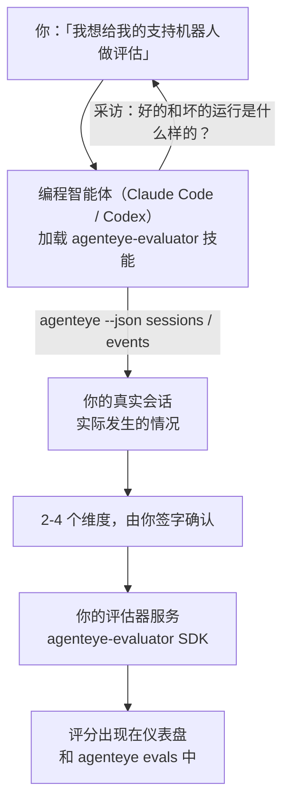

让你的编程智能体既负责决策又负责构建，从*「我觉得我们的智能体有时表现不佳」*直接到一个已部署的评分服务。**Failproof AI 可观测性评估器技能**（`agenteye-evaluator`）是一种 *Agent 技能*：一个小型指令文件夹，供 Claude Code 或 Codex 等编程智能体按需加载。它教会智能体先确定哪些质量维度值得针对*你的*智能体进行追踪，再编写、测试并部署对这些维度进行评分的[评估器服务](/zh/agenteye/evaluation-suite)。

它**并非**托管评分器、你需要上传的注册表或插件系统。你的评估器始终是运行在你自己基础设施上的 HTTP 服务，与[评估套件](/zh/agenteye/evaluation-suite)指南中所描述的完全一致。该技能只是教你的智能体将其构建得更好——它所做的一切，你自己写相同的代码也完全可以实现。

---

## 最难的地方在于决定要评分什么

SDK 接口很小——一个装饰器和两个模型——智能体仅凭[协议](/zh/agenteye/evaluation-suite#http-contract)就能写出来。这不是评估器失败的原因。评估器失败，是因为它们对错误的东西进行评分，而一个评分对象有误的评估器比没有更糟：它产出的仪表盘，最终只会让所有人学会忽视它。

因此，技能的大部分内容都在任何代码存在之前。它让智能体采访你（*「描述一次进展顺利的运行；再描述一次进展糟糕的」*），然后通过 [`agenteye` CLI](/zh/agenteye/cli) 拉取你的真实会话并逐一通读。这两部分通常会产生分歧，而分歧正是关键所在：你打算衡量什么，与你的对话记录实际能支撑什么。一个维度只有在**可从事件中计算**且**具有区分度**的前提下才能保留——如果它在你的好运行和坏运行上都打出 0.9 分，它什么也教不了，会被淘汰。

最终返回的是一份包含 2-4 个维度及其推理过程的提案，由你在写任何代码之前签字确认。



---

## 它与其他评估组件的关系

有四篇文档涵盖评分相关内容，它们按顺序相互衔接：

| 页面 | 内容 | 适用场景 |
|---|---|---|
| **[评估（Evaluations）](/zh/agenteye/evaluations)** | 功能本身：会话网格上的评分、仪表盘、重新评估 | 你想了解自动评分能带来什么 |
| **[评估套件（Evaluation suite）](/zh/agenteye/evaluation-suite)** | HTTP 协议、SDK、服务器环境变量 | 你正在自行实现或调试评估器 |
| **评估器技能（本文档）** | 以自然语言为入口，完成评分器的设计*和*构建 | 你想从「我要做评估」直接到一个运行中的服务 |
| **[CLI 技能](/zh/agenteye/cli-skill)** | 以自然语言为入口操作 `agenteye` CLI | 你想*读取*已有的评分结果 |
| **[Python SDK 技能](/zh/agenteye/python-sdk-skill)** | 以自然语言为入口对你的智能体进行埋点 | 你的智能体尚未输出会话——还没有可评分的内容 |

### 与 CLI 技能的对比：构建 vs. 读取

两个技能在设计上互不重叠，同时安装两者是正常用法——智能体根据你的请求自行选择：

- **`agenteye-evaluator`**（本文档）构建*产生*评分的东西。当评分首次落地时，它的工作就结束了。
- **[`agenteye-cli`](/zh/agenteye/cli-skill)** 读取已存在的评分（`agenteye evals`）。*「本周质量是否下降了？」*是它要回答的问题，而非本技能的职责。

---

## 前置条件

1. **已安装并登录 `agenteye` CLI**（`pipx install agenteye`，然后 `agenteye login`）。技能在两处依赖它：拉取用于设计的真实会话，以及在最后确认你的评分已成功落地。你的登录账号需要 `events:read` 权限，以及用于最终检查的 `evaluations:read` 权限。与 CLI 技能一样，它**无法**替你完成邮件一次性验证码的登录流程。
2. **评估器的存放位置。** 它会被构建成镜像并作为长期运行的服务部署，因此需要一个真实的代码仓库，而非临时文件。评估器通常有自己独立的仓库，与被评分的智能体分开——技能会查找是否已有现成的仓库，并在搭建新仓库前征询你的意见。
3. **`agenteye-evaluator` SDK wheel**——在让你的智能体开始输入 `pip` 命令之前，请先阅读下一节。

---

## 获取方式

该技能发布在 Failproof AI 的公共技能集合中：

**[github.com/FailproofAI/skills](https://github.com/FailproofAI/skills)** → [`skills/agenteye-evaluator/`](https://github.com/FailproofAI/skills/tree/main/skills/agenteye-evaluator)

该仓库是公开的，技能本身无需任何凭证——它只使用*你*登录的 `agenteye` CLI 会话来操作，并在*你的*代码仓库中编写代码。请注意，它作为独立文件夹发布，**不包含在** `pipx install agenteye` 包中，请勿在那里寻找它。

## 安装技能

最快的方式是使用 [`skills`](https://skills.sh) CLI，它会获取该文件夹并放置到你的智能体查找的位置：

```bash
# Claude Code，仅限当前项目
npx skills add FailproofAI/skills --skill agenteye-evaluator -a claude-code

# 所有项目（安装到 ~/.claude/skills/）
npx skills add FailproofAI/skills --skill agenteye-evaluator -a claude-code -g --copy

# 使用 Codex
npx skills add FailproofAI/skills --skill agenteye-evaluator -a codex
```

然后像管理其他技能一样管理它：

```bash
npx skills list -a claude-code           # 查看已安装的技能
npx skills update agenteye-evaluator     # 拉取最新版本
npx skills remove agenteye-evaluator     # 移除它
```

prefer 手动安装？Agent 技能不过是一个包含 `SKILL.md`（以及可选引用文件）的文件夹，直接复制也可以：

- **Claude Code**：将 `agenteye-evaluator/` 文件夹放入 `~/.claude/skills/`（所有项目）或 `<你的仓库>/.claude/skills/`（仅限该仓库）。Claude Code 会自动发现它——通过 `/skills` 列表验证，或者直接询问评估相关问题即可。
- **Codex（OpenAI）**：Codex 读取同一个 `SKILL.md`。附带的 `agents/openai.yaml` 设置了 `allow_implicit_invocation: true`，因此 Codex 在任务匹配时会自动选择该技能；否则可通过 `$agenteye-evaluator` 显式调用。

---

## SDK 不在公共 PyPI 上

> **警告：** 在让智能体安装 SDK 之前，请先阅读本节。

该技能是公开的；它所驱动的 SDK 则不是。`agenteye-evaluator` 仅以私有发布构件的形式提供，且与 `agenteye` 不同，该名称在公共 PyPI 上**未被占用**——因此直接执行 `pip install agenteye-evaluator` 可能会将陌生人的包安装到读取你生产环境对话记录的服务中。这是一个供应链安全问题，而非笔误。

技能了解这一点，会按安装梯序依次尝试，在第一个适用的环节停止：如果你在 AgentEye 仓库内，则使用 monorepo 源码；否则使用 GitHub Releases 上的私有发布 wheel（需要访问权限）；如果两者均不可达，它会**停下来告诉你联系 Failproof AI 联系人获取 wheel**，而不是自行发挥。

因此，如果你的智能体提议直接从公共 PyPI 执行 `pip install agenteye-evaluator`，这正说明技能从未加载成功。请停下来检查技能是否已正确安装。

---

## 你可以向它提出什么请求

一个完整的交互从模糊的请求开始，以签字确认的设计方案结束，而不是以代码结束：

```text
你    ▸ 我想给我们的支持机器人做评估。我觉得它有时表现不好。

智能体 ▸ 在我写任何东西之前：描述一次进展顺利的运行，
         以及一次进展糟糕的运行。

你    ▸ 好的：它从文档中给出答案。坏的：它编造内容，
         或者放弃并说「请联系客服」。

智能体 ▸ 正在运行：agenteye --json sessions --status error --since 7d
         读取 5 个会话，包括你会认为是糟糕的两个。

         你的描述提到了真实性和推诿。对话记录在推诿方面
         与你的描述一致（5 个中有 2 个以转接客服结束，
         在 model_response.content 中清晰可见），但真实性
         需要你的事件中没有的基准答案。

         所以我会评分三项内容：
           - deflection      规则型，成本低，能区分你的两次运行
           - tool_efficiency 规则型，能捕捉 run-004 中的重试循环
           - groundedness    LLM 裁判：每个声明是否都在它检索到的文档中？

         「真实性」需要我们没有的基准答案；groundedness
         是你的对话记录实际能支撑的最接近的替代。
         同意这三个名称吗？之后重命名会导致历史数据断裂。

你    ▸ 同意

智能体 ▸ 这个仓库中没有评估器。我应该在这里搭建一个，
         还是你在其他地方有现成的？
```

之后，它先编写基于规则的维度（免费、即时、确定性），针对真实捕获的会话（包括那些会导致朴素评估器崩溃的空会话和未完成会话）进行测试，只在主观维度上才引入 LLM 裁判。它了解[调度器的限制](/zh/agenteye/evaluation-suite#configuring-the-server)——30 秒请求超时和全局 8 个并发调用——因此如果裁判不能可靠地在时限内完成，它会使用 `JobPending` 转为异步模式，而不是让你的裁判被取消后以五倍成本重试五次。

然后它完成部署，设置两个服务器环境变量，并通过 `agenteye --json evals --session-id <id>` 确认评分确实已落地。评分落地是唯一的证明。

---

## 需要注意的事项

- **维度名称几乎是永久性的。** 评分键是任意字符串，平台会对你发送的所有内容进行趋势分析，这意味着下游没有任何机制能纠正错误的选择。之后重命名会导致历史数据断裂：旧会话保留旧键，趋势就此中断。这正是为什么技能在写代码之前需要明确签字确认——认真对待那个提示。
- **测试夹具是真实的生产对话记录。** 针对真实会话进行设计意味着需要将它们拉取到磁盘，而它们可能包含客户数据。技能在将其提交到 git 之前会征询你的意见；如有疑虑，请将 `fixtures/` 排除在仓库之外，让每位开发者自行拉取。
- **智能体会编写并部署一个读取所有对话记录的服务。** 它以你的身份行事，受限于你 CLI 登录的权限，但请像对待任何接触生产数据的代码一样审查该评估器。

---

## 下一步

- **[评估套件（Evaluation suite）](/zh/agenteye/evaluation-suite)**：HTTP 协议、SDK，以及技能所配置的服务器环境变量。
- **[评估（Evaluations）](/zh/agenteye/evaluations)**：评分落地后的展示位置。
- **[CLI 技能](/zh/agenteye/cli-skill)**：同伴技能，用于读取结果而非构建评分器。
- **[CLI](/zh/agenteye/cli)**：技能设计所依赖的会话数据背后的命令参考。