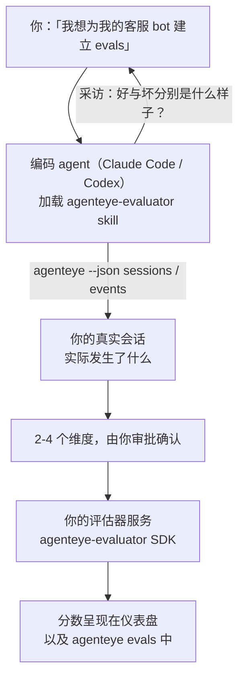

从*「我觉得我们的 agent 有时候表现不好」*到部署一个评分服务，让你的编码 agent 负责决策与构建。**Failproof AI 可观测性评估器 skill**（`agenteye-evaluator`）是一个 *Agent Skill*：一个小型指令文件夹，编码 agent（如 Claude Code 或 Codex）可以按需加载。它教会 agent 为*你的* agent 确定哪些质量维度值得追踪，然后编写、测试并部署对其进行评分的[评估器服务](/zh/agenteye/evaluation-suite)。

它**并非**托管评分器、可上传的注册中心或插件系统。你的评估器仍是你自己基础设施上的 HTTP 服务，与[评估套件](/zh/agenteye/evaluation-suite)指南中描述的完全一致。这个 skill 只是教你的 agent 如何把它构建好，因此它所做的一切，你完全可以自己编写相同代码来实现。

---

## 难点在于决定要评分什么

SDK 接口很小——一个装饰器和两个模型——agent 仅凭[协议](/zh/agenteye/evaluation-suite#http-contract)就能写出来。这不是评估器失败的原因。它们失败是因为评分了错误的东西，而评分了错误东西的评估器比没有还糟：它会产生一个让所有人都懒得看的仪表盘。

因此，这个 skill 的大部分工作发生在任何代码存在之前。它让 agent 采访你（*「描述一次进展顺利的运行；再描述一次进展糟糕的」*），然后通过 [`agenteye` CLI](/zh/agenteye/cli) 拉取你真实的会话并从头到尾阅读它们。这两部分通常会产生分歧，而差距正是关键所在：你打算测量的内容，与你的会话记录实际上能支撑的内容。一个维度只有在**可从事件计算**且**具有区分度**的情况下才能保留——如果它在你的好运行和坏运行上都打 0.9，则毫无意义，会被剔除。

最终返回的是一个包含 2-4 个维度的提案（附带推理过程），供你在编写任何代码之前审批确认。



---

## 与其他评估组件的关系

四篇文档涵盖评分内容，它们按顺序相互衔接：

| 页面 | 内容 | 适用场景 |
|---|---|---|
| **[评估（Evaluations）](/zh/agenteye/evaluations)** | 功能：会话网格上的分数、仪表盘、重新评估 | 你想了解自动评分能带来什么 |
| **[评估套件（Evaluation suite）](/zh/agenteye/evaluation-suite)** | HTTP 协议、SDK、服务器环境变量 | 你正在自行实现或调试评估器 |
| **评估器 skill**（本文档） | 设计*并*构建评分器的自然语言入口 | 你想从「我需要 evals」走到一个运行中的服务 |
| **[CLI skill](/zh/agenteye/cli-skill)** | `agenteye` CLI 的自然语言入口 | 你想*读取*已有的分数 |
| **[Python SDK skill](/zh/agenteye/python-sdk-skill)** | 为你的 agent 进行埋点的自然语言入口 | 你的 agent 尚未输出会话——没有任何内容可评分 |

### 与 CLI skill 的区别：构建 vs 读取

这两个 skill 被刻意设计为互不重叠，同时安装两个是常规做法——agent 会根据你的请求在它们之间选择：

- **`agenteye-evaluator`**（本文档）构建*产生*分数的东西。它的工作在分数第一次落地时结束。
- **[`agenteye-cli`](/zh/agenteye/cli-skill)** 读取已存在的分数（`agenteye evals`）。*「本周质量下降了吗？」*是它回答的问题，而非本 skill 的职责。

---

## 前置条件

1. **`agenteye` CLI 已安装并登录**（`pipx install agenteye`，然后 `agenteye login`）。该 skill 会用到它两次：拉取用于设计的真实会话，以及在最后确认你的分数已落地。你的登录需要 `events:read` 权限，最终检查还需要 `evaluations:read` 权限。与 CLI skill 一样，它**无法**替你完成邮件一次性验证码登录。
2. **评估器的托管位置。** 它会被构建成镜像并作为长期运行的服务启动，因此需要一个真实的代码仓库，而非临时文件。评估器通常有自己独立的仓库，与被评分的 agent 分开——该 skill 会查找已有的仓库，并在创建新仓库前询问你。
3. **`agenteye-evaluator` SDK wheel**——在让你的 agent 开始输入 `pip` 命令之前，请先阅读下一节。

---

## 获取方式

该 skill 发布在 Failproof AI 的公共 skills 合集中：

**[github.com/FailproofAI/skills](https://github.com/FailproofAI/skills)** → [`skills/agenteye-evaluator/`](https://github.com/FailproofAI/skills/tree/main/skills/agenteye-evaluator)

该仓库是公开的，skill 本身不需要任何凭证——它只使用*你*登录的 `agenteye` CLI 来驱动操作，并在*你的*仓库中编写代码。注意它作为独立文件夹发布，**不**包含在 `pipx install agenteye` 包中，请勿在那里查找。

## 安装 skill

最快捷的方式是使用 [`skills`](https://skills.sh) CLI，它会拉取文件夹并放置到你的 agent 查找的位置：

```bash
# Claude Code，仅限当前项目
npx skills add FailproofAI/skills --skill agenteye-evaluator -a claude-code

# 所有项目（安装到 ~/.claude/skills/）
npx skills add FailproofAI/skills --skill agenteye-evaluator -a claude-code -g --copy

# 使用 Codex 替代
npx skills add FailproofAI/skills --skill agenteye-evaluator -a codex
```

然后像管理其他 skill 一样管理它：

```bash
npx skills list -a claude-code           # 查看已安装的
npx skills update agenteye-evaluator     # 拉取最新版本
npx skills remove agenteye-evaluator     # 移除它
```

偏好手动安装？Agent Skill 只是一个包含 `SKILL.md`（以及可选引用文件）的文件夹，直接复制也可以：

- **Claude Code**：将 `agenteye-evaluator/` 文件夹放入 `~/.claude/skills/`（所有项目）或 `<your-repo>/.claude/skills/`（仅该仓库）。Claude Code 会自动发现它——通过 `/skills` 列表验证，或者直接询问关于 evals 的问题即可。
- **Codex（OpenAI）**：Codex 读取相同的 `SKILL.md`。捆绑的 `agents/openai.yaml` 设置了 `allow_implicit_invocation: true`，因此当任务匹配时 Codex 会自动选择该 skill；否则可显式调用 `$agenteye-evaluator`。

---

## SDK 不在公共 PyPI 上

> **警告：** 在让 agent 安装 SDK 之前请先阅读此内容。

该 skill 是公开的；它驱动的 SDK 则不是。`agenteye-evaluator` 仅作为私有发布工件提供，且与 `agenteye` 不同，该名称在公共 PyPI 上**未被占用**——因此直接执行 `pip install agenteye-evaluator` 可能会将陌生人的包安装进读取你生产环境会话记录的服务中。这是供应链风险，不是笔误。

该 skill 知晓这一点，会按顺序尝试安装方式，在第一个可用的方式处停止：如果你在 AgentEye 仓库内则使用 monorepo 源码，否则使用 GitHub Releases 中的私有发布 wheel（需要访问权限），如果两者都不可达，它会**停下来告诉你联系 Failproof AI 联系人获取 wheel**，而非自行处理。

因此，如果你的 agent 提出从公共 PyPI 执行裸 `pip install agenteye-evaluator`，这正是 skill 从未加载的信号。在此停下并检查它是否已安装。

---

## 你可以问它什么

一次真实的完整流程从模糊的请求开始，以已审批的设计结束，而非以代码结束：

```text
你   ▸ 我想为我们的客服 bot 建立 evals。我觉得它有时候表现不好。

agent ▸ 在我写任何东西之前：描述一次进展顺利的运行，
        以及一次进展糟糕的。

你   ▸ 好的情况：它从文档中给出答案。差的情况：它编造内容，
        或者放弃并说「请联系客服」。

agent ▸ 正在运行：agenteye --json sessions --status error --since 7d
        读取 5 个会话，包括两个你认为表现差的。

        你的描述提到了事实性和回避性。会话记录在回避性上
        与之吻合（5 个中有 2 个以转接客服结束，
        在 model_response.content 中清晰可见），但事实性
        需要你的事件中没有携带的基准答案。

        因此我会评分三个维度：
          - deflection      规则型，成本低，能区分你的两次运行
          - tool_efficiency 规则型，能捕捉 run-004 中的重试循环
          - groundedness    LLM 裁判：每个声明都在它检索的文档中吗？

        「事实性」需要我们没有的基准答案；groundedness
        是你的会话记录实际上能支撑的最接近的替代方案。
        这三个名称可以吗？之后重命名会导致历史分裂。

你   ▸ 可以

agent ▸ 这个仓库中没有评估器。我应该在这里创建一个，
        还是你有其他位置？
```

之后它会先编写规则型维度（免费、即时、确定性），针对包括会导致简单评估器崩溃的空会话和未完成会话在内的真实捕获会话进行测试，并仅对主观维度使用 LLM 裁判。它了解[调度器的限制](/zh/agenteye/evaluation-suite#configuring-the-server)——30 秒请求超时和全局 8 个并发调用——因此如果裁判不能可靠地在超时内完成，它会使用 `JobPending` 异步处理，而非让你的裁判被取消后以五倍成本重试五次。

然后它部署服务，设置两个服务器环境变量，并通过 `agenteye --json evals --session-id <id>` 确认分数确实已落地。分数落地是唯一的证明。

---

## 需要注意的事项

- **维度名称几乎是永久性的。** 评分键是任意字符串，平台会对你发送的任何内容进行趋势分析，这意味着下游没有任何机制能纠正错误的选择。之后重命名，历史就会分裂：旧会话保留旧键，趋势因此中断。这就是为什么 skill 在编写代码前会明确要求你审批——请认真对待这个提示。
- **测试数据是真实的生产会话记录。** 针对真实会话进行设计意味着将它们拉取到磁盘，而它们可能包含客户数据。该 skill 在将其提交到 git 前会征询你的意见；如有疑虑，请将 `fixtures/` 排除在仓库之外，让每位开发者自行拉取自己的数据。
- **agent 编写并部署一个读取所有会话记录的服务。** 它以你的身份行事，受你 CLI 登录权限的约束，但请像对待任何接触生产数据的代码一样审查评估器。

---

## 后续步骤

- **[评估套件（Evaluation suite）](/zh/agenteye/evaluation-suite)**：HTTP 协议、SDK 以及 skill 配置的服务器环境变量。
- **[评估（Evaluations）](/zh/agenteye/evaluations)**：分数落地后的展示位置。
- **[CLI skill](/zh/agenteye/cli-skill)**：姊妹 skill，用于读取结果而非构建评分器。
- **[CLI](/zh/agenteye/cli)**：该 skill 设计所依据的会话数据背后的命令参考。