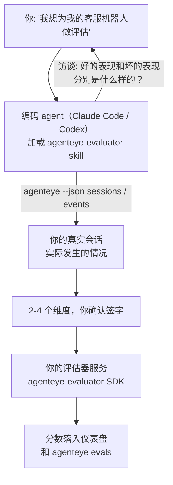

从*「我觉得我们的 agent 有时候表现很差」*到部署一个打分服务，让你的编码 agent 同时负责设计决策和代码构建。**Failproof AI 可观测性评估器 skill**（`agenteye-evaluator`）是一个 *Agent Skill*：一个小型的指令文件夹，供 Claude Code 或 Codex 等编码 agent 按需加载。它能引导 agent 梳理出哪些质量维度值得针对*你的* agent 进行追踪，然后编写、测试并部署对这些维度进行评分的[评估器服务](/zh/agenteye/evaluation-suite)。

它**不是**一个托管评分器、一个你上传的注册表，也不是一个插件系统。你的评估器始终是运行在你自己基础设施上的 HTTP 服务，完全按照[评估套件](/zh/agenteye/evaluation-suite)指南所描述的方式运行。该 skill 只是教会你的 agent 如何把它构建好，所以它所做的一切，你也完全可以自己编写同样的代码来实现。

---

## 难点在于决定评什么

SDK 接口很小——一个装饰器加两个模型——agent 仅凭[接口约定](/zh/agenteye/evaluation-suite#http-contract)就能写出来。问题不在这里。评估器失败的原因在于它们评错了东西，而评错东西的评估器比没有更糟：它产出的仪表盘，大家很快就学会了无视。

因此，这个 skill 的核心在于代码编写之前的阶段。它会让 agent 对你进行访谈（*「描述一次进展顺利的运行；再描述一次进展糟糕的」*），然后通过 [`agenteye` CLI](/zh/agenteye/cli) 拉取你真实的会话数据并从头到尾阅读。这两个部分通常会出现分歧，而这个差距正是关键所在：你*打算*衡量什么，与你的转录数据实际上*能够支持*衡量什么，两者之间的落差。一个维度只有在从事件中**可计算**且**有区分度**时才能存活下来——如果它在你好的运行和坏的运行上都打出 0.9，那它什么也教不了，就会被剔除。

最终返回的是一份包含 2-4 个维度及其推理依据的提案，供你在编写任何代码之前确认签字。



---

## 与其他评估组件的关系

四份文档涵盖了评分相关内容，它们按顺序相互衔接：

| 页面 | 内容 | 适用场景 |
|---|---|---|
| **[评估（Evaluations）](/zh/agenteye/evaluations)** | 功能：会话网格上的分数、仪表盘、重新评估 | 你想了解自动评分能带来什么 |
| **[评估套件（Evaluation suite）](/zh/agenteye/evaluation-suite)** | HTTP 协议约定、SDK、服务器环境变量 | 你正在自己实现或调试评估器 |
| **评估器 skill**（本文档） | 以自然语言为入口，设计*并*构建评分器 | 你想从「我要做评估」直接到服务跑起来 |
| **[CLI skill](/zh/agenteye/cli-skill)** | 以自然语言为入口，操作 `agenteye` CLI | 你想*读取*已有的分数 |
| **[Python SDK skill](/zh/agenteye/python-sdk-skill)** | 以自然语言为入口，对你的 agent 进行埋点 | 你的 agent 还没有输出会话数据——尚无内容可评分 |

### 与 CLI skill 的区别：构建与读取

这两个 skill 经过刻意设计，功能不重叠，同时安装两者是正常做法——agent 会根据你的问题在它们之间做出选择：

- **`agenteye-evaluator`**（本文档）构建*产生*分数的东西。它的任务在分数首次落入时结束。
- **[`agenteye-cli`](/zh/agenteye/cli-skill)** 读取已经存在的分数（`agenteye evals`）。「这周质量有没有下降？」是它的问题，不是本 skill 的。

---

## 前提条件

1. **已安装并登录 `agenteye` CLI**（`pipx install agenteye`，然后 `agenteye login`）。该 skill 会用到它两次：拉取用于设计的真实会话数据，以及在最后确认分数已成功落入。你的登录账号需要 `events:read` 权限，以及最终检查所需的 `evaluations:read` 权限。与 CLI skill 一样，它**无法**替你完成邮件一次性验证码的登录流程。
2. **评估器的运行环境。** 它会被构建成镜像并作为长期运行的服务部署，因此需要一个真实的代码仓库，而不是一个临时文件。评估器通常有自己独立的仓库，与被评分的 agent 分开——该 skill 会查找是否存在现有仓库，并在搭建新仓库之前征求你的意见。
3. **`agenteye-evaluator` SDK wheel**——在让 agent 开始输入 `pip` 命令之前，请先阅读下一节。

---

## 获取方式

该 skill 发布于 Failproof AI 的公共 skill 合集中：

**[github.com/FailproofAI/skills](https://github.com/FailproofAI/skills)** → [`skills/agenteye-evaluator/`](https://github.com/FailproofAI/skills/tree/main/skills/agenteye-evaluator)

该仓库是公开的，skill 本身无需任何凭证——它只使用*你*登录的账号来驱动 `agenteye` CLI，并在*你的*仓库中编写代码。注意它作为独立文件夹发布，**不在** `pipx install agenteye` 包内，请勿在那里查找。

## 安装 skill

最快的方式是使用 [`skills`](https://skills.sh) CLI，它会拉取对应文件夹并放置到 agent 的查找路径中：

```bash
# Claude Code，仅限当前项目
npx skills add FailproofAI/skills --skill agenteye-evaluator -a claude-code

# 所有项目（安装到 ~/.claude/skills/）
npx skills add FailproofAI/skills --skill agenteye-evaluator -a claude-code -g --copy

# 使用 Codex
npx skills add FailproofAI/skills --skill agenteye-evaluator -a codex
```

然后像管理其他 skill 一样管理它：

```bash
npx skills list -a claude-code           # 查看已安装的 skill
npx skills update agenteye-evaluator     # 拉取最新版本
npx skills remove agenteye-evaluator     # 移除它
```

偏好手动安装？Agent Skill 只是一个包含 `SKILL.md`（以及可选引用文件）的文件夹，直接复制同样可行：

- **Claude Code**：将 `agenteye-evaluator/` 文件夹放在 `~/.claude/skills/`（所有项目）或 `<your-repo>/.claude/skills/`（仅该仓库）。Claude Code 会自动发现它——通过 `/skills` 列表验证，或者直接询问评估相关问题即可。
- **Codex（OpenAI）**：Codex 读取同样的 `SKILL.md`。内置的 `agents/openai.yaml` 设置了 `allow_implicit_invocation: true`，因此当任务匹配时 Codex 会自动选择该 skill；否则可显式调用 `$agenteye-evaluator`。

---

## SDK 不在公共 PyPI 上

> **警告：** 在让 agent 安装 SDK 之前，请先阅读本节。

该 skill 是公开的；它所驱动的 SDK 则不是。`agenteye-evaluator` 仅以私有发布产物的形式提供，与 `agenteye` 不同，该名称在**公共 PyPI 上未被声明**——因此直接 `pip install agenteye-evaluator` 可能会将陌生人的包安装进读取你生产环境转录数据的服务中。这是一个供应链安全问题，而不是笔误。

该 skill 知道这一点，因此会按安装梯级依次尝试，在第一个适用的梯级停下：如果你在 AgentEye 仓库内，则使用 monorepo 源码；否则使用 GitHub Releases 上的私有发布 wheel（需要访问权限）；如果两者都无法访问，它会**停下来并告诉你向 Failproof AI 联系人索取 wheel**，而不是随意变通。

因此，如果你的 agent 提议从公共 PyPI 直接执行 `pip install agenteye-evaluator`，这就说明该 skill 从未加载。请在此停下，检查 skill 是否已正确安装。

---

## 你可以提出的问题

一次真实的完整交互从模糊的需求开始，以确认签字的设计方案结束，而不是直接生成代码：

```text
你    ▸ 我想为我们的客服机器人做评估。我觉得它有时候表现很差。

agent ▸ 在我写任何东西之前：请描述一次进展顺利的运行，
        以及一次进展糟糕的运行。

你    ▸ 好的：它能从文档中给出答案。差的：它会捏造内容，
        或者放弃并说「请联系客服」。

agent ▸ 正在执行：agenteye --json sessions --status error --since 7d
        读取 5 个会话，包括两个你认为很差的。

        你的描述提到了事实准确性和回避问题。转录数据
        对回避问题有佐证（5 个会话中有 2 个以转接客服结尾，
        在 model_response.content 中清晰可见），但事实准确性
        需要你的事件数据中没有的真实答案作为参照。

        因此我建议评估三个维度：
          - deflection      基于规则，成本低，能区分你的两次运行
          - tool_efficiency 基于规则，能捕捉 run-004 中的重试循环
          - groundedness    LLM 评判：每条声明是否都来自检索到的文档？

        「事实准确性」需要我们没有的参考答案；groundedness
        是你的转录数据实际上能够支持的最接近的替代方案。
        这三个名称可以吗？之后重命名会导致历史数据断裂。

你    ▸ 可以

agent ▸ 这个仓库中没有评估器。要在这里搭建一个，还是
        你在其他地方有现成的？
```

接下来，它会先编写基于规则的维度（免费、即时、确定性强），针对真实采集的会话进行测试——包括那些会让粗糙评估器崩溃的空会话和未完成会话，并且只在主观维度上才使用 LLM 评判器。它了解[调度器的限制](/zh/agenteye/evaluation-suite#configuring-the-server)——30 秒的请求超时和全局 8 个并发调用——因此如果评判器无法可靠地在时限内完成，它会使用 `JobPending` 进行异步处理，而不是让你的评判器被取消并以五倍成本重试五次。

然后它部署服务，设置两个服务器环境变量，并通过 `agenteye --json evals --session-id <id>` 确认分数确实已落入。分数落入是唯一的证明。

---

## 需要注意的事项

- **维度名称几乎是永久性的。** 分数键是任意字符串，平台会对你发送的任何内容进行趋势分析，这意味着下游没有任何机制会纠正一个糟糕的命名选择。之后重命名会导致历史数据断裂：旧会话保留旧键名，趋势分析就此中断。这就是为什么 skill 在编写任何代码之前会明确征求签字——请认真对待这个提示。
- **测试固件是真实的生产转录数据。** 基于真实会话进行设计意味着需要将它们拉取到磁盘，而这些数据可能包含客户信息。skill 会在将它们提交到 git 之前征求你的意见；如有疑虑，请将 `fixtures/` 排除在仓库之外，让每位开发者自行拉取。
- **agent 会编写并部署一个读取所有转录数据的服务。** 它以你的身份行事，受你的 CLI 登录权限约束，但请像对待其他接触生产数据的代码一样审查评估器。

---

## 后续步骤

- **[评估套件（Evaluation suite）](/zh/agenteye/evaluation-suite)**：skill 所配置的 HTTP 协议约定、SDK 和服务器环境变量。
- **[评估（Evaluations）](/zh/agenteye/evaluations)**：分数落入后显示的位置。
- **[CLI skill](/zh/agenteye/cli-skill)**：与本 skill 配套的兄弟 skill，用于读取结果而非构建评分器。
- **[CLI](/zh/agenteye/cli)**：skill 设计所依赖的会话数据背后的命令参考。