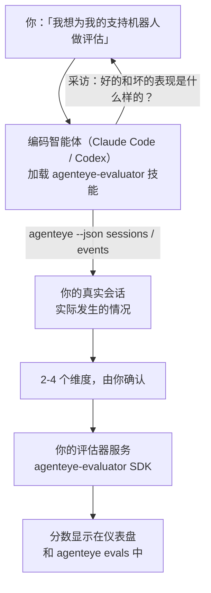

让你的编码智能体既负责决策又负责构建，帮你从*「我觉得我们的智能体有时候表现不好」*直接到一个已部署的评分服务。**Failproof AI 可观测性评估器技能**（`agenteye-evaluator`）是一项*智能体技能*：一个小型指令文件夹，供 Claude Code 或 Codex 等编码智能体按需加载。它教会智能体找出哪些质量维度值得为*你的*智能体进行追踪，然后编写、测试并部署对其进行评分的[评估器服务](/zh/agenteye/evaluation-suite)。

它**不是**一个托管评分器、一个你上传内容的注册中心，也不是一个插件系统。你的评估器始终是你自己基础设施上的 HTTP 服务，与[评估套件](/zh/agenteye/evaluation-suite)指南中描述的完全一致。该技能只是教会你的智能体把它构建好，因此它所做的一切，你都可以自己通过编写相同的代码来完成。

---

## 难点在于决定评分什么

SDK 接口很小——一个装饰器和两个模型——智能体仅凭[契约](/zh/agenteye/evaluation-suite#http-contract)就能写出来。问题不在这里。评估器失败是因为它们评分了错误的东西，而一个评分错误的评估器比没有更糟：它产出的仪表盘让所有人都学会了忽视它。

因此，该技能的大部分内容都在代码出现之前。它让智能体采访你（*「描述一次进展顺利的运行；再描述一次进展不好的」*），然后通过 [`agenteye` CLI](/zh/agenteye/cli) 拉取你的真实会话并从头到尾阅读。这两部分通常会有出入，而差距正是关键所在：你打算衡量什么，与你的对话记录实际上能支撑什么。一个维度只有在**可从事件中计算**且**具有区分性**时才能保留——如果它在你的好运行和坏运行上都打 0.9 分，它什么都说明不了，就会被剔除。

最终返回的是一个包含 2-4 个维度的提案，附带推理过程，供你在写下任何一行代码之前确认。



---

## 与其他评估组件的关系

四份文档涵盖了评分内容，它们按顺序相互衔接：

| 页面 | 内容 | 何时使用 |
|---|---|---|
| **[评估](/zh/agenteye/evaluations)** | 该功能：会话网格上的分数、仪表盘、重新评估 | 你想了解自动评分能带来什么 |
| **[评估套件](/zh/agenteye/evaluation-suite)** | HTTP 契约、SDK、服务器环境变量 | 你正在自己实现或调试评估器 |
| **评估器技能**（本文档） | 设计*并*构建评分器的自然语言入口 | 你想从「我想要评估」到一个运行中的服务 |
| **[CLI 技能](/zh/agenteye/cli-skill)** | `agenteye` CLI 的自然语言入口 | 你想*读取*已有的分数 |
| **[Python SDK 技能](/zh/agenteye/python-sdk-skill)** | 为你的智能体进行埋点的自然语言入口 | 你的智能体还没有发出会话——没有任何内容可供评分 |

### 与 CLI 技能的对比：构建与读取

这两项技能是刻意不重叠的，同时安装两者是正常的配置——智能体根据你的问题在它们之间做出选择：

- **`agenteye-evaluator`**（本文档）构建*生产*分数的东西。它的工作在分数首次落地时结束。
- **[`agenteye-cli`](/zh/agenteye/cli-skill)** 读取已存在的分数（`agenteye evals`）。*「这周质量下降了吗？」*是它的问题，而不是本技能的。

---

## 前提条件

1. **已安装并登录 `agenteye` CLI**（`pipx install agenteye`，然后 `agenteye login`）。该技能会用到它两次：一次是拉取设计所依据的真实会话，另一次是在最后确认你的分数已落地。你的登录账号需要 `events:read` 权限，以及用于最终检查的 `evaluations:read` 权限。与 CLI 技能一样，它**无法**替你完成邮件一次性验证码登录。
2. **评估器的存放位置。** 它被构建成镜像并作为长期运行的服务运行，因此需要一个真实的代码仓库，而不是临时文件。评估器通常有自己独立的仓库，与被评分的智能体分开——该技能会查找现有仓库，并在新建之前征询你的意见。
3. **`agenteye-evaluator` SDK wheel**——在你的智能体开始输入 `pip` 命令之前，请先阅读下一节。

---

## 获取方式

该技能发布在 Failproof AI 的公共技能集合中：

**[github.com/FailproofAI/skills](https://github.com/FailproofAI/skills)** → [`skills/agenteye-evaluator/`](https://github.com/FailproofAI/skills/tree/main/skills/agenteye-evaluator)

该代码库是公开的，技能本身不需要任何凭证——它只使用*你*登录的 `agenteye` CLI 来驱动操作，并在*你的*代码库中编写代码。请注意，它作为独立文件夹发布，**不在** `pipx install agenteye` 包内，请勿在那里寻找它。

## 安装技能

最快捷的方式是使用 [`skills`](https://skills.sh) CLI，它会拉取文件夹并将其放置到智能体的查找路径中：

```bash
# Claude Code，仅限当前项目
npx skills add FailproofAI/skills --skill agenteye-evaluator -a claude-code

# 所有项目（安装到 ~/.claude/skills/）
npx skills add FailproofAI/skills --skill agenteye-evaluator -a claude-code -g --copy

# 使用 Codex
npx skills add FailproofAI/skills --skill agenteye-evaluator -a codex
```

然后像管理其他技能一样管理它：

```bash
npx skills list -a claude-code           # 查看已安装的内容
npx skills update agenteye-evaluator     # 拉取最新版本
npx skills remove agenteye-evaluator     # 移除它
```

更喜欢手动安装？智能体技能只是一个包含 `SKILL.md`（以及可选引用文件）的文件夹，直接复制也可以：

- **Claude Code**：将 `agenteye-evaluator/` 文件夹放入 `~/.claude/skills/`（所有项目）或 `<你的代码库>/.claude/skills/`（仅该代码库）。Claude Code 会自动发现它——通过 `/skills` 列表验证，或者直接询问评估相关的问题即可。
- **Codex（OpenAI）**：Codex 读取相同的 `SKILL.md`。捆绑的 `agents/openai.yaml` 设置了 `allow_implicit_invocation: true`，因此当任务匹配时 Codex 会自动选择该技能；否则可以明确调用 `$agenteye-evaluator`。

---

## SDK 不在公共 PyPI 上

> **警告：** 在让智能体安装 SDK 之前，请先阅读本节。

该技能是公开的；它驱动的 SDK 不是。`agenteye-evaluator` 仅作为私有发布产物提供，与 `agenteye` 不同，该名称在公共 PyPI 上**未被占用**——因此直接 `pip install agenteye-evaluator` 可能会将某个陌生人的包安装到读取你生产环境对话记录的服务中。这是一个供应链问题，而不是笔误。

该技能了解这一点，会按安装阶梯逐步检查，在第一个适用的环节停下：如果你在 AgentEye 代码库内，则使用 monorepo 源码；否则使用 GitHub Releases 上的私有发布 wheel（需要访问权限）；如果两者都无法访问，它**会停下来告诉你向你的 Failproof AI 联系人索取 wheel**，而不是自行发挥。

因此，如果你的智能体提出从公共 PyPI 直接 `pip install agenteye-evaluator`，这就说明技能从未加载。请在此停下，检查技能是否已安装。

---

## 你可以向它提出什么请求

一次完整的交互从一个模糊的请求开始，以一个确认好的设计结束，而不是以代码结束：

```text
你    ▸ 我想为我们的支持机器人做评估。我觉得它有时候表现不好。

智能体 ▸ 在我写任何东西之前：描述一次进展顺利的运行，
         以及一次进展不好的。

你    ▸ 好的情况：它从文档中给出答案。坏的情况：它编造内容，
         或者放弃并说「请联系支持团队」。

智能体 ▸ 正在运行：agenteye --json sessions --status error --since 7d
         读取 5 个会话，包括两个你认为表现不好的。

         你的描述提到了事实性和回避性。对话记录在回避性上
         与你的判断一致（5 个中有 2 个以转交支持团队结束，
         在 model_response.content 中清晰可见），但事实性
         需要你的事件中没有的真实标注数据。

         因此我建议评分三项：
           - deflection      基于规则，代价低，能区分你的两次运行
           - tool_efficiency 基于规则，能发现 run-004 中的重试循环
           - groundedness    LLM 评判：每个声明是否都在它检索的文档中？

         「factuality」需要我们没有的真实标注数据；groundedness
         是你的对话记录实际上能支撑的最接近的替代方案。
         这三个名称可以吗？之后重命名会导致历史数据分裂。

你    ▸ 可以

智能体 ▸ 这个代码库中没有评估器。我应该在这里新建一个，
         还是你在别处有现成的？
```

从那里开始，它首先编写基于规则的维度（免费、即时、确定性），针对真实捕获的会话进行测试，包括那些会让简单评估器崩溃的空会话和未完成的会话，并且只在主观维度上才使用 LLM 评判。它了解[调度器的限制](/zh/agenteye/evaluation-suite#configuring-the-server)——30 秒请求超时和全部署范围内 8 个并发调用——因此如果评判器无法可靠地在时限内完成，它会以 `JobPending` 异步处理，而不是让你的评判器被取消后以五倍成本重试五次。

然后它完成部署，设置两个服务器环境变量，并通过 `agenteye --json evals --session-id <id>` 确认分数确实已落地。分数落地是唯一的证明。

---

## 需要注意的事项

- **维度名称近乎永久性。** 分数键是任意字符串，平台会追踪你发送的任何内容，这意味着下游没有任何机制能纠正错误的选择。之后重命名会导致历史数据分裂：旧会话保留旧键，趋势就断了。这就是为什么该技能在写代码之前会明确征求你的确认——请认真对待那个提示。
- **测试夹具是真实的生产对话记录。** 针对真实会话进行设计意味着要将它们拉取到磁盘，而它们可能包含客户数据。该技能在将其提交到 git 之前会征询意见；如有疑虑，请将 `fixtures/` 排除在代码库之外，让每位开发者自行拉取。
- **智能体编写并部署一个读取每条对话记录的服务。** 它以你的身份行事，受你的 CLI 登录权限约束，但请像对待任何接触生产数据的代码一样审查这个评估器。

---

## 后续步骤

- **[评估套件](/zh/agenteye/evaluation-suite)**：技能所配置的 HTTP 契约、SDK 和服务器环境变量。
- **[评估](/zh/agenteye/evaluations)**：分数落地后显示的位置。
- **[CLI 技能](/zh/agenteye/cli-skill)**：配套技能，用于读取结果而非构建评分器。
- **[CLI](/zh/agenteye/cli)**：技能设计所依据的会话数据背后的命令参考。