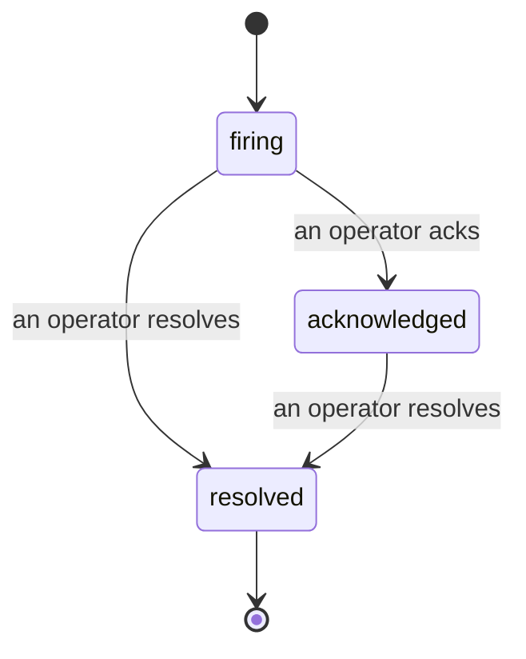

当告警触发时，第一个问题始终是："谁在处理？"事故功能给出了答案：一旦某项指标突破阈值，所有人都能立即看到事故已开启、由谁负责，以及截至目前的详细经过——并生成一份干净、有归属的记录，可直接用于事后复盘。

*收件箱按状态对开启的事故进行分组，并支持按严重程度和负责人筛选，让你第一时间看到需要人工介入的内容。*

## 一目了然，谁在跟进

不必再在聊天群里追问"有没有人在看这个？"。阈值突破后，系统自动创建事故并推送到共享收件箱，按状态分组展示。确认事故后，你的名字就会显示在上面，团队其他成员便知道有人在处理。确认操作支持多人同时进行：多名运营人员可以同时确认同一个事故，每条确认记录独立保存，因此整个"作战室"的参与者都会清晰呈现，互不干扰。可指定单一负责人负责分级处理，同时按严重程度或负责人过滤收件箱，快速锁定属于自己的任务。

## 完整经过，尽在一条时间线

事故结束后，复盘素材已经准备好了。打开任意事故，即可查看触发证据、负责人与订阅者、就地协调的评论区，以及一条只可追加、不可修改的操作时间线。

*所有发生的事，按时间顺序排列，每一行都签署了操作人的名字。*

每一个操作（开启、确认、解决等）都会写入时间线，且永不删改。每条记录都有归属：来自某位运营人员的，附上其邮箱；由 Failproof AI Observability 自动触发的（例如在阈值突破时自动开启事故），则标注为 **automated**。没有匿名操作，没有信息丢失，事后复盘因此几乎可以自动完成。

## 事故的流转方式

- **开启中（firing）：** 阈值突破后自动创建事故，并向你的渠道发送一次通知。后续重复触发将折叠到同一事故中，仅更新触发证据，不会反复通知。
- **已确认（acknowledged）：** 某位运营人员接手处理。事故保持开启状态，后续触发将静默更新证据。
- **已解决（resolved）：** 由运营人员手动关闭。目前尚未启用条件恢复后自动解决的功能，因此事故需由人工解决才会关闭——这确保了所有人对"是否真正恢复"保持清醒认知。同一告警后续可再次开启新的事故。

同一告警最多同时存在一个开启的事故，因此频繁抖动的规则不会产生大量重复事故。你也可以手动创建事故：可以是独立事故，用于告警未捕获到的情况；也可以附加到已有告警上——前提是拥有 `incidents:write` 权限。

## 如何访问

事故页面位于 `/<org-slug>/incidents`。查看需要 **`incidents:read`** 权限；手动创建事故需要 **`incidents:write`** 权限；确认、分配、评论和解决需要 **`incidents:ack`** 权限。已授予已停用的 `alerts:ack` 权限的旧密钥仍可正常使用，因为该权限会被视同 `incidents:ack` 处理，无需重新为值班轮换重新下发密钥。

## 相关内容

- [告警](/zh/agenteye/alerts)：当阈值突破时触发事故的规则。
- [错误追踪](/zh/agenteye/error-tracking)：在一处查看所有故障，并将其提升为告警。
- [审计](/zh/agenteye/audits)：定期运行的分析器，用于发现任何规则都未覆盖的故障。