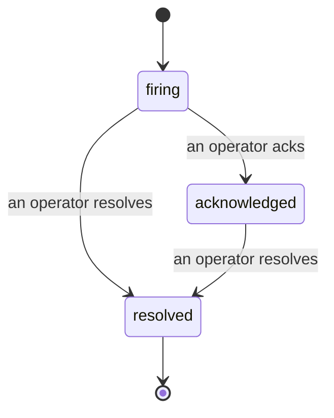

当告警触发时，第一个问题永远是"谁在处理？"事件功能给出了答案：一旦发生阈值突破，所有人都能看到事件已打开、由谁负责，以及目前发生了什么——并形成一份清晰的归因记录，可直接用于事后复盘。

*收件箱按状态对未解决事件进行分组，并支持按严重程度和负责人筛选，让你第一时间看到需要人工介入的内容。*

## 一目了然地了解谁在处理

不再需要在聊天中问"有人在看这个吗？"。阈值突破时，系统会自动创建事件并将其放入共享收件箱，按状态分组显示。确认事件后，你的名字就会出现在上面，团队其他成员知道有人在处理了。确认操作支持多人：多名运营人员可以同时确认同一事件，每次确认都会单独记录，整个应急团队的成员都会按名称显示，而不会相互覆盖。指派一名负责人进行分类处理，并按严重程度或负责人筛选收件箱，快速找到属于你的事件。

## 完整过程，尽在一条时间线

事件结束时，复盘文档也基本完成了。打开任意事件，你可以看到突破证据、负责人与订阅者、用于协调沟通的评论线程，以及一条只可追加的活动时间线。

*所有发生的事情，按时间顺序排列，每一行都标注了操作者。*

每一个动作（打开、确认、解决等）都会写入时间线，且永不被编辑删除。每条记录都有归因：运营人员的操作归因到其邮箱，而 Failproof AI Observability 自动执行的操作（如在检测到突破时打开事件）则归因为 **automated**。没有匿名操作，没有信息丢失，因此事后复盘几乎可以自动完成。

## 事件的流转方式

- **未处理（firing）：** 阈值突破时创建事件，并向你的频道发送一次通知。后续重复突破会合并到同一事件中，并刷新证据，而不会反复推送通知。
- **已确认（acknowledged）：** 某位运营人员接手处理。事件保持打开状态，后续突破会静默更新证据。
- **已解决（resolved）：** 运营人员关闭事件。目前尚未启用条件恢复正常时的自动解决功能，因此事件会一直保持打开，直到有人手动解决——这确保了大家对实际恢复情况保持严谨态度。同一告警之后可以再次创建新的事件。

同一告警同时最多只能有一个未解决事件，因此频繁抖动的规则不会产生大量重复事件。你也可以手动创建事件：可以是与任何告警无关的独立事件（用于告警未捕获到的情况），也可以是关联到现有告警的事件，前提是你拥有 `incidents:write` 权限。

## 访问路径

事件页面位于 `/<org-slug>/incidents`。查看需要 **`incidents:read`** 权限；手动创建事件需要 **`incidents:write`** 权限；确认、分配、评论和解决需要 **`incidents:ack`** 权限。已授予旧版 `alerts:ack` 权限的密钥仍然有效，因为该权限会被视为 `incidents:ack`，无需重新颁发，不影响你的值班轮换。

## 相关内容

- [告警](/zh/agenteye/alerts)：在阈值突破时触发事件的规则。
- [错误追踪](/zh/agenteye/error-tracking)：在一处查看所有故障，并将其升级为告警。
- [审计](/zh/agenteye/audits)：定期运行的分析器，发现未被任何规则监控到的故障。