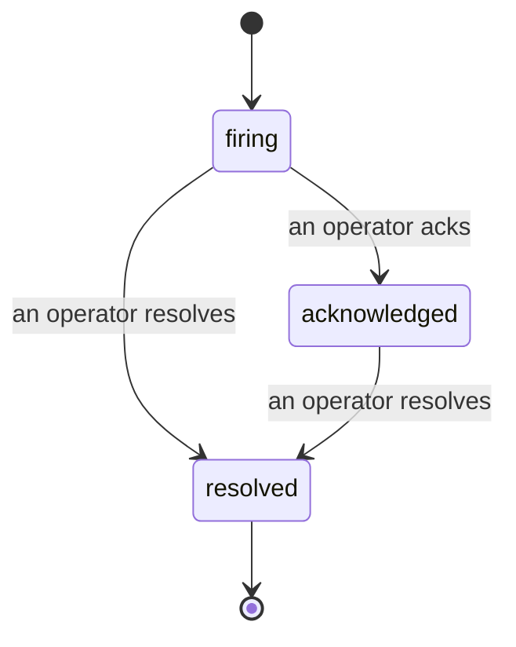

当警报触发时，第一个问题永远是"谁在处理？"事件功能给出了答案：一旦某项指标突破阈值，所有人都能看到事件已开启、由谁负责，以及目前发生了什么——并留下清晰、有归属的记录，可以直接用于事后复盘。

*收件箱按状态对未解决事件进行分组，并支持按严重程度和负责人筛选，让你第一时间看到需要人工介入的内容。*

## 一目了然，谁在负责

再也不用在群里发"有人在看这个吗？"一旦突破阈值，系统会自动创建事件并将其归入共享收件箱，按状态分组。认领事件后，你的名字会出现在上面，让团队其他成员知道有人在处理。认领状态是共享的：多名运营人员可以同时认领同一个事件，每人的认领记录单独保存，整个战时小组的成员一览无余，互不干扰。指定一名负责人进行分诊，再按严重程度或负责人筛选收件箱，快速锁定属于你的事项。

## 完整经过，一条时间线

事件结束时，复盘报告基本已经写好了。打开任意一个事件，你能看到突破阈值的证据、负责人和订阅者、用于现场协调的评论区，以及一条只增不改的活动时间线。

*所有发生过的事情，按顺序排列，每一行都标注了操作人。*

每一个操作（开启、认领、解决等）都会写入时间线，且永不删改。每条记录都有归属：标注执行操作的运营人员邮箱，或标注 **automated**（表示由 Failproof AI Observability 自动完成，例如在突破时自动开启事件）。没有任何操作是匿名的，也没有任何信息会丢失，因此事后复盘几乎可以自动完成。

## 事件的状态流转

- **开启中（firing）：** 突破阈值后开启事件，并向你的渠道发送一次通知。后续重复触发会归入同一事件并更新证据，不会反复通知。
- **已认领（acknowledged）：** 运营人员接手处理。事件保持开启，后续触发会静默更新证据。
- **已解决（resolved）：** 运营人员将其关闭。自动解决（在条件恢复后）功能已在规划中但尚未启用，因此事件会一直保持开启，直到有人手动解决——这确保了大家对实际恢复情况保持诚实。同一警报后续可以再次开启新的事件。

每个警报同时最多只有一个开启中的事件，因此频繁抖动的规则不会让你被重复事件淹没。你也可以手动开启事件：可以是与任何警报无关的独立事件（用于捕获未被规则发现的情况），也可以是关联到已有警报的事件，前提是你拥有 `incidents:write` 权限。

## 访问路径

事件功能位于 `/<org-slug>/incidents`。查看需要 **`incidents:read`** 权限；手动开启事件需要 **`incidents:write`** 权限；认领、分配、评论和解决需要 **`incidents:ack`** 权限。已停用的旧权限 `alerts:ack` 仍可正常使用，因为系统会将其等同于 `incidents:ack` 处理，无需重新签发值班轮换密钥。

## 相关内容

- [警报](/zh/agenteye/alerts)：当阈值突破时触发事件的规则。
- [错误追踪](/zh/agenteye/error-tracking)：在一处查看所有故障，并将其升级为警报。
- [审计](/zh/agenteye/audits)：定期运行的分析程序，用于发现没有规则覆盖的故障。