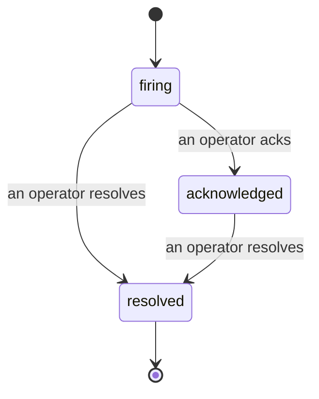

当告警触发时，第一个问题永远是"谁在处理？"事件功能给出了答案：一旦发生违规，所有人都能看到事件已开启、由谁负责，以及目前发生的一切——形成一份清晰、有归属的记录，可以直接用于事后复盘。

*收件箱按状态对未解决事件进行分组，并支持按严重级别和负责人筛选，让你第一时间看到需要人工介入的内容。*

## 一眼看清由谁负责

再也不用在聊天群里问"有人在看这个吗？"违规发生时，系统自动创建事件并将其投入共享收件箱，按状态分组。确认事件后，你的名字就会显示在上面，让团队其他成员知道有人在处理。确认操作支持共享：多名操作员可以同时确认同一事件，每人的确认都单独记录，这样整个作战室的成员都能清晰可见，互不干扰。指定一名负责人进行分类处理，并按严重级别或负责人筛选收件箱，快速找到属于你的事件。

## 完整经过，尽在一条时间线

事件结束后，复盘报告基本已经写好了。打开任意事件，你就能看到违规证据、负责人与订阅者、用于协调沟通的评论区，以及一条只可追加的活动时间线。

*所有发生的一切，按时间顺序排列，每一行都标注了操作人。*

每一个操作（开启、确认、解决等）都会写入该时间线，且永不修改。每条记录都有归属：操作人的邮箱，或在 Failproof AI Observability 自动执行的操作（如在违规时自动开启事件）上标注 **automated**。没有匿名记录，没有遗漏内容，事后复盘几乎可以自动完成。

## 事件如何流转

- **开启中（firing）：** 违规触发事件，并向你的频道发送一次通知。重复违规会并入同一事件并更新其证据，而不会反复发送通知。
- **已确认（acknowledged）：** 某位操作员接手处理。事件保持开启状态，后续违规会静默更新证据。
- **已解决（resolved）：** 某位操作员将其关闭。目前尚未启用条件清除后自动解决的功能，因此事件将保持开启状态，直到人工解决——这确保了对已真正清除的问题保持诚实。之后同一告警还可以触发新的事件。

同一告警同时最多只能有一个开启中的事件，因此频繁抖动的规则不会让你淹没在重复事件中。你也可以手动创建事件：既可以是独立事件（用于告警未捕获到的情况），也可以关联到现有告警，前提是你拥有 `incidents:write` 权限。

## 在哪里找到它

事件功能位于 `/<org-slug>/incidents`。查看需要 **`incidents:read`** 权限；手动创建事件需要 **`incidents:write`** 权限；确认、指派、评论和解决需要 **`incidents:ack`** 权限。旧密钥授予的已停用 `alerts:ack` 权限仍然有效，因为它会被识别为 `incidents:ack`，无需重新签发值班轮换的权限。

## 相关内容

- [告警](/zh/agenteye/alerts)：当阈值被突破时触发这些事件的规则。
- [错误追踪](/zh/agenteye/error-tracking)：在一个地方查看所有故障，并将其中一个提升为告警。
- [审计](/zh/agenteye/audits)：定期运行的分析程序，用于发现没有规则在监控的故障。