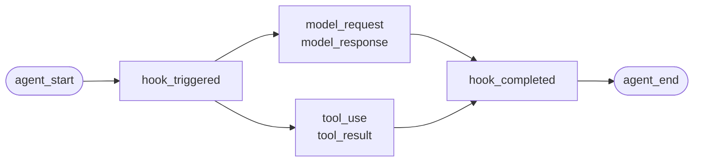

适用于自行编写的 agent，或 Failproof AI 尚无适配器的框架。无需额外配置——你只需直接发出事件。

这与四个框架适配器底层调用的 API 完全相同。适配器不过是对它的封装映射表。

## 安装

```bash
pip install failproofai-sdk
```

无额外依赖。

## 埋点

```python
import failproofai_sdk

failproofai_sdk.configure(environment="production")

with failproofai_sdk.session():                 # 一次运行
    with failproofai_sdk.agent("planner"):      # 一个工作单元
        with failproofai_sdk.tool_call("search", input={"q": q}) as t:
            t.output = search(q)                # 一次工具调用
```

从上到下读，含义一目了然：

| 包裹在 | 表示 |
| --- | --- |
| `session()` | 这些事件属于同一次运行 |
| `agent()` | 某个组件正在执行工作——给它一个在列表中能识别的名称 |
| `tool_call()` | 这是一次工具调用，以及它的返回值 |

每个作用域实际发出的事件：

| 作用域 | 发出的事件 | 用途 |
| --- | --- | --- |
| `session()` | 无 | 绑定 session id，将一次运行归组 |
| `agent()` | `agent_start`、`agent_end` | 标记一个工作单元的开始和结束 |
| `tool_call()` | `tool_use`、`tool_result` | 标记一次工具调用并计时 |

内部的所有内容都可以省略 `session_id` 和 `agent_id`。作用域将身份信息绑定在上下文变量上，每次事件调用都会自动读取，无需在函数间手动传递 id。

三者均支持 `async with` 和普通 `with`。

嵌套 agent 会构建树形结构。`parent_id` 和深度由调用栈自动计算：

```python
with failproofai_sdk.session():
    with failproofai_sdk.agent("supervisor"):
        with failproofai_sdk.agent("researcher"):    # parent_id = "supervisor"
            ...
```

## 作用域如何关闭

`agent()` 会自动处理异常：

| 发生了什么 | 发出的事件 | 结果 |
| --- | --- | --- |
| 无异常 | `agent_end` | `success` |
| `Exception` | `error`，然后 `agent_end` | `failed` |
| `KeyboardInterrupt`、`SystemExit` | `error`，然后 `agent_end` | `failed` |
| `CancelledError`、`GeneratorExit` | 仅 `agent_end` | `cancelled` |

error 事件在 `agent_end` 之前发出，因为 dashboard 在收到 `agent_end` 时关闭 span，之后的事件将无法归属。取消不是失败，因此已取消的运行不会污染错误面板。异常始终会被重新抛出——作用域永远不会吞掉异常。

## 事件方法

六个类别，共十五个方法。大多数成对出现——你发出开启事件，再发出关闭事件，SDK 会测量两者之间的时间跨度。

| 类别 | 开启 | 关闭 | 独立 |
| --- | --- | --- | --- |
| **Agents** | `agent_start` | `agent_end` | — |
| | `agent_pause` | `agent_resume` | — |
| **模型** | `model_request` | `model_response` | — |
| **工具** | `tool_use` | `tool_result` | — |
| **Hooks** | `hook_triggered` | `hook_completed` | — |
| **人工** | `human_wait` | `human_input` | `human_pause`、`human_interrupt` |
| **失败** | — | — | `error` |

<Tip>
  在适用的场景下优先使用作用域——`agent()` 和 `tool_call()`。它们能保证即使函数体抛出异常也会发出关闭事件。只有当控制流无法嵌套时（例如在辅助函数内的模型调用）才直接使用这些方法。
</Tip>

<CodeGroup>
```python Agents
failproofai_sdk.event.agent_start(agent_id="planner", goal="find the cheapest flight")
failproofai_sdk.event.agent_end(agent_id="planner", outcome="success", summary="...")
failproofai_sdk.event.agent_pause(pause_id="p1", reason="awaiting approval")
failproofai_sdk.event.agent_resume(pause_id="p1")
```

```python Models
failproofai_sdk.event.model_request(
    model="gpt-4o-mini",
    messages=[{"role": "user", "content": "..."}],
    request_id="req-1",
)
failproofai_sdk.event.model_response(
    model="gpt-4o-mini",
    content="...",
    input_tokens=139,
    output_tokens=21,
    request_id="req-1",
    duration_ms=5202,
)
```

```python Tools
failproofai_sdk.event.tool_use(tool_name="search", tool_call_id="c1", input={"q": "..."})
failproofai_sdk.event.tool_result(tool_name="search", tool_call_id="c1", output="...")
```

```python Hooks
failproofai_sdk.event.hook_triggered(hook_name="retrieve", hook_id="h1", trigger_event="node")
failproofai_sdk.event.hook_completed(hook_name="retrieve", hook_id="h1", outcome="success")
```

```python Humans
failproofai_sdk.event.human_wait(input_id="i1", prompt="Approve?", options=["yes", "no"])
failproofai_sdk.event.human_input(input_id="i1", response="yes")
failproofai_sdk.event.human_pause(reason="operator paused the run", user_id="dana")
failproofai_sdk.event.human_interrupt(reason="operator stopped the run", at_step="step_3")
```

```python Failures
failproofai_sdk.event.error(
    error_type="TimeoutError",
    message="provider timed out after 30s",
    traceback="...",
)
```
</CodeGroup>

<Note>
  **两组人工事件的方向相反。**

  | 方法 | 含义 |
  | --- | --- |
  | `human_wait` / `human_input` | **agent 向人发起请求**——审批门控、澄清问题 |
  | `human_pause` / `human_interrupt` | **人对 agent 采取了操作**——停止按钮、运维暂停 |

  没有任何框架会发出第二对事件，因此始终需要你自己发出。
</Note>

<Warning>
  **并发执行模型调用时请传入 `request_id`。** 若不传，请求和响应将按每个 agent 的到达顺序配对——并发调用会错配，将每个响应关联到错误的请求。
</Warning>

## 示例

一个基于 OpenAI API 的工具调用循环，不使用任何 agent 框架：

```python
import json

import failproofai_sdk
from openai import OpenAI

failproofai_sdk.configure(environment="production")
client = OpenAI()
MODEL = "gpt-4o-mini"


def turn(messages: list):
    """一次模型调用，由事件对包裹。"""
    failproofai_sdk.event.model_request(model=MODEL, messages=messages)
    reply = client.chat.completions.create(model=MODEL, messages=messages, tools=TOOLS)
    usage = reply.usage
    failproofai_sdk.event.model_response(
        model=MODEL,
        content=reply.choices[0].message.content or "",
        input_tokens=usage.prompt_tokens,
        output_tokens=usage.completion_tokens,
    )
    return reply.choices[0].message


with failproofai_sdk.session():
    with failproofai_sdk.agent("inventory", goal="price report"):
        for _ in range(4):          # 有界循环；无界的 agent 循环本身就是一个 bug
            message = turn(messages)
            if not message.tool_calls:
                break
            messages.append(message.model_dump(exclude_none=True))
            for call in message.tool_calls:
                args = json.loads(call.function.arguments or "{}")
                with failproofai_sdk.tool_call(
                    call.function.name, tool_call_id=call.id, input=args
                ) as handle:
                    handle.output = run_tool(call.function.name, args)
                messages.append({
                    "role": "tool",
                    "tool_call_id": call.id,
                    "content": str(handle.output),
                })
```

这将产生与适配器相同的六种事件类型。包含工具定义的完整可运行版本位于 SDK 仓库的 `docs/manual/examples/` 目录下。

## 线程与异步

上下文变量会自动传播到 asyncio 任务中，但不会传播到新线程——线程启动时上下文为空。

```python
# asyncio：无需任何操作
async with failproofai_sdk.session():
    await asyncio.gather(worker(1), worker(2))

# 线程：包裹可调用对象
pool.submit(failproofai_sdk.propagate(work), x)
threading.Thread(target=failproofai_sdk.propagate(work)).start()
loop.run_in_executor(None, failproofai_sdk.propagate(work), x)
```

不使用 `propagate()` 时，worker 的事件会抛出 `TypeError` 并提示修复方法，而不是静默地落到没有 session 的状态。这是有意为之：没有 session 的事件在摄入时会被跳过并返回 `200`，这正是身份层要防止的静默失败。

## 为没有适配器的框架添加埋点

每个 agent 框架都提供相同的三个切入点。映射它们即可获得完整的追踪——四个内置适配器也仅此而已。

| 切入点 | 你需要编写 | 产生的事件 |
| --- | --- | --- |
| 运行 | `session()` + `agent()` | `agent_start`、`agent_end` |
| 每次工具调用 | `tool_call()` | `tool_use`、`tool_result` |
| 每次模型调用 | `model_*` 事件对 | `model_request`、`model_response` |

<Steps>
  <Step title="包裹运行">
    ```python
    with failproofai_sdk.session():
        with failproofai_sdk.agent(agent_name, goal=task):
            result = framework.run(task)
    ```
  </Step>
  <Step title="包裹每次工具调用">
    在框架的工具包装器或中间件中添加。

    ```python
    with failproofai_sdk.tool_call(name, input=args) as call:
        call.output = original(**args)
    ```
  </Step>
  <Step title="配对每次模型调用">
    ```python
    failproofai_sdk.event.model_request(model=model, messages=messages)
    reply = provider.complete(...)
    failproofai_sdk.event.model_response(
        model=model,
        content=text,
        input_tokens=usage.prompt_tokens,
        output_tokens=usage.completion_tokens,
    )
    ```
  </Step>
</Steps>

<Tip>
  **有值得观测的节点、步骤或中间件边界？** 用 hook 对——`hook_triggered` / `hook_completed`——来包裹，而不是嵌套的 `agent()`。`agent_id` 是低基数维度，每个节点一个条目会使其失效。Hook span 的渲染方式相同，还能提供每节点的延迟数据。
</Tip>

<Note>
  **手动埋点与自动埋点可以组合使用。** 在手动编写的作用域内运行的适配器会加入该 session 并以该 agent 为父节点，从而形成一棵树而非两棵——当你同时对一个框架手动埋点和使用受支持的框架时非常有用。
</Note>

<Accordion title="为什么没有 AutoGen 适配器">
  原因有两点，而上述三个切入点正是对这两点的解答：

  - `autogen-core` 自 2025 年 9 月起已停止维护。
  - AG2 没有提供等同于其他框架 hook 的全局注册点，因此要对其埋点就意味着在每个构建位置包裹每个 agent。

  手动映射这三个切入点所记录的事件，与内置适配器的保真度完全相同。
</Accordion>

## 深入了解

记录机制的工作原理。入门时无需了解这些内容。

<AccordionGroup>

<Accordion title="各框架的记录内容示例" icon="eye">

每次记录的结构相同：一个 span 开启，工作嵌套在其中，每个开启事件都有对应的关闭事件。



**事件对**是基本单元。每个关闭事件携带 SDK 从对应开启事件起测量的持续时间。

以下是每个框架各一次真实运行的记录——来自 SDK 附带的示例，模型名称已统一。注意单次调用能带回多少信息。

<Tabs>
  <Tab title="LangGraph">
    ```text 14 events
     1  +0.000s  agent_start       LangGraph
     2  +0.001s    hook_triggered  agent
     3  +0.002s      model_request   gpt-4o-mini
     4  +3.023s      model_response  gpt-4o-mini · 21 out-tok
     5  +3.024s    hook_completed  agent
     6  +3.024s    hook_triggered  tools
     7  +3.025s      tool_use      word_count
     8  +3.025s      tool_result   word_count · ok
     9  +3.025s    hook_completed  tools
    10  +3.026s    hook_triggered  agent
    11  +3.027s      model_request   gpt-4o-mini
    12  +5.717s      model_response  gpt-4o-mini · 5 out-tok
    13  +5.720s    hook_completed  agent
    14  +5.721s  agent_end         LangGraph · success
    ```

    节点转换为 hook 对，因此你可以获得每节点的延迟，而不会使 agent 列表过于拥挤。
  </Tab>

  <Tab title="CrewAI">
    ```text 10 events
     1  +0.000s  agent_start       crew
     2  +0.050s    agent_start     analyst · under crew
     3  +0.057s      model_request   gpt-4o-mini
     4  +3.475s      model_response  gpt-4o-mini · 19 out-tok
     5  +3.478s      tool_use      lookup_metric
     6  +3.478s      tool_result   lookup_metric · ok
     7  +3.486s      model_request   gpt-4o-mini
     8  +5.694s      model_response  gpt-4o-mini · 9 out-tok
     9  +5.727s    agent_end       analyst · success
    10  +5.739s  agent_end         crew · success
    ```

    每个 agent 的 `role` 成为其 span 名称，因此延迟和 token 消耗可按角色分解。
  </Tab>

  <Tab title="LlamaIndex">
    ```text 26 events
     1  +0.000s  agent_start       Agent
     2  +0.001s    hook_triggered  init_run
     4  +0.501s    hook_triggered  setup_agent
     6  +0.503s    hook_triggered  run_agent_step
     7  +0.505s      model_request   gpt-4o-mini
     8  +3.083s      model_response  gpt-4o-mini · 18 out-tok
    10  +3.197s    hook_triggered  parse_agent_output
    12  +3.355s    hook_triggered  call_tool
    13  +3.355s      tool_use      city_population
    14  +3.355s      tool_result   city_population · ok
    16  +3.356s    hook_triggered  aggregate_tool_results
       ...                        第二次迭代
    26  +7.038s  agent_end         Agent · success
    ```

    agent 循环本身是可见的，不仅仅是它的模型调用。
  </Tab>

  <Tab title="Pydantic AI">
    ```text 8 events
    1  +0.000s  agent_start       agent
    2  +0.001s    model_request   gpt-4o-mini
    3  +4.413s    model_response  gpt-4o-mini · 17 out-tok
    4  +4.415s    tool_use        population
    5  +4.415s    tool_result     population · ok
    6  +4.416s    model_request   gpt-4o-mini
    7  +8.118s    model_response  gpt-4o-mini · 6 out-tok
    8  +8.119s  agent_end         agent · success
    ```

    无 hook 对：Pydantic AI 没有可供包裹的节点或步骤边界。
  </Tab>

  <Tab title="Custom agents">
    ```text 6 events
    1  +0.000s  agent_start       main
    2  +0.000s    tool_use        population
    3  +0.000s    tool_result     population · ok
    4  +0.000s    model_request   gpt-4o-mini
    5  +0.000s    model_response  gpt-4o-mini · 3 out-tok
    6  +0.000s  agent_end         main · success
    ```

    这些事件由你自己发出。事件类型相同，保真度相同——代价是需要手动添加调用点。
  </Tab>
</Tabs>

</Accordion>

<Accordion title="session 如何开始和结束" icon="circle-play">

**没有 session 结束事件。** session 不是你去关闭的东西——它是一组共享同一 `session_id` 的事件。

状态由追踪的形态推导：

| 状态 | 时机 |
| --- | --- |
| `ongoing` | 至少有一个 span 仍处于打开状态 |
| `paused` | `agent_pause` 没有对应的 `agent_resume` |
| `error` | 没有打开的 span，且至少有一个事件失败 |
| `done` | 没有打开的 span，且没有失败 |

因此，当所有事件对都关闭时，session 即结束。适配器会为你发出 `agent_end`，并在拆卸时关闭所有仍打开的 span 并标记为未完成——崩溃的运行会以 `done` 状态结算，留下一个可见的缺口，而不是永久挂起。

<Note>
  这就是为什么一个 session 可以跨两次调用。LangGraph 的 `interrupt()` 会暂停运行，根 span 故意保持打开状态，由后续恢复调用来关闭它。两次调用属于同一个 session。
</Note>

</Accordion>

<Accordion title="身份标识：session_id、agent_id 及其生成者" icon="fingerprint">

`session_id` 和 `agent_id` 在每个事件方法中都是可选的。省略时，它们从外层作用域解析：

```python
with failproofai_sdk.session():
    with failproofai_sdk.agent("planner"):
        failproofai_sdk.event.tool_use(tool_name="search", tool_call_id="c1")
```

显式传入仍然有效且优先级更高。若既没有绑定作用域也没有传入参数，调用会抛出 `TypeError` 并提示修复方法，而不是发出一个没有 session 的事件（这类事件在摄入时会被跳过并返回 `200`）。

作用域将身份信息绑定在上下文变量上。这些变量会自动传播到 asyncio 任务中，但不会传播到新线程——需要将 worker 包裹在 `failproofai_sdk.propagate()` 中。

#### 各 id 的生成者

| Id | 生成者 | 说明 |
| --- | --- | --- |
| `session_id` | 你，或 SDK | `session("chat-42")` 原样使用；省略时 SDK 生成 `uuid4().hex` |
| `agent_id` | 你，或框架 | 来自 `agent("analyst")`、CrewAI 的 `role`、`FunctionAgent.name`。看起来像 UUID 的值会被拒绝并替换 |
| `tool_call_id`、`hook_id`、`request_id` | 你，或框架 | 适配器复用框架自身的运行 id，因此事件对在线程跳转后仍能正确配对 |
| **事件 id** | **Cloud，在摄入时** | SDK 不发出此值 |
| **`dedup_key`** | **Cloud，在摄入时** | 组织、session、时间戳、类型和载荷的哈希值。这才是真正的身份标识——它让重试的批次折叠而不是重复 |

#### 适配器如何解析 `session_id`

按优先级，第一个匹配生效：

1. 显式传入的 `session_id` 选项
2. 每次调用的元数据
3. 外层的 `session()` 作用域
4. 框架元数据
5. 框架自身的运行 id

在上述任一来源存在时，绝不会凭空生成——合成的 id 会将一次运行拆分到多个 session 中。

#### 保持 `agent_id` 的低基数

它是每个 dashboard 界面的主要维度，对应一个 `LowCardinality(String)` 列。每次运行一个值会降低该列的效能，并使过滤下拉菜单中充斥着每次运行的单独条目。

适配器会为你维护这个列：

| 框架传入的值 | 记录为 | 原因 |
| --- | --- | --- |
| `3f9a1c2b-…`（UUID） | `main` | 没有可保留的可读内容 |
| 长的纯十六进制字符串 | `main` | 同上 |
| `agent-3f9a1c2b-…` | `agent` | 剥离每次运行的 id，保留可读部分 |
| `agent-v2` | `agent-v2` | 短片段保持不变 |
| `step-3` | `step-3` | 同上 |

真实 id 保存在 `fw_agent_id` / `fw_run_id` 上，在那里仍可查询，但不作为维度。

<Warning>
  **此保护仅作用于框架自动选择的标签。** 你自己传入的 `agent_id`——无论是传给 `event.*` 还是 `failproofai_sdk.agent(...)`——都会原样记录。静默改写显式参数带来的危害比它所防止的基数问题更大，因此请自行为 span 命名。
</Warning>

</Accordion>

<Accordion title="事件类型分组——以及各框架记录哪些事件" icon="table">

| 分组 | 事件 |
| --- | --- |
| Agents | `agent_start`、`agent_end`、`agent_pause`、`agent_resume` |
| 模型 | `model_request`、`model_response` |
| 工具 | `tool_use`、`tool_result` |
| Hooks | `hook_triggered`、`hook_completed` |
| 人工 | `human_wait`、`human_input`、`human_pause`、`human_interrupt` |
| 失败 | `error` |

基于上述运行数据，各框架记录的事件：

| 事件 | LangGraph | CrewAI | LlamaIndex | Pydantic AI | 自定义 |
| --- | :--: | :--: | :--: | :--: | :--: |
| Agent 开始和结束 | 是 | 是 | 是 | 是 | 你 |
| 模型请求和响应 | 是 | 是 | 是 | 是 | 你 |
| 工具使用和结果 | 是 | 是 | 是 | 是 | 你 |
| Hook 触发和完成 | 节点 | 任务 | 步骤 | — | 你 |
| 错误 | 是 | 是 | 是 | 是 | 自动 |
| 人工等待和输入 | 是 | 是 | 是 | — | 你 |
| Agent 暂停和恢复 | 是 | 是 | 是 | — | 你 |

横线表示该框架没有此概念。`human_pause` 和 `human_interrupt` 描述的是人对 agent 采取操作，没有任何框架会发出这类信号——需要你自己发出。

</Accordion>

<Accordion title="事件对、关联与持续时间" icon="link">

事件从不单独出现。一个开启，一个关闭，关闭事件携带 SDK 从开启事件起测量的持续时间。

| 开启 | 关闭 | 关闭事件携带的内容 |
| --- | --- | --- |
| `agent_start` | `agent_end` | `outcome`、`summary` |
| `model_request` | `model_response` | token 数、`stop_reason`、延迟 |
| `tool_use` | `tool_result` | `output` 或 `error`、持续时间 |
| `hook_triggered` | `hook_completed` | `outcome`、持续时间 |
| `agent_pause` | `agent_resume` | 暂停持续时长 |
| `human_wait` | `human_input` | 答复内容及人的响应时长 |

<Warning>
  有开启事件但没有对应关闭事件，意味着一个永远不会结束的 span。session 会显示为仍在运行，且活跃时长持续增长。这是手动埋点时需要注意的失败模式。
</Warning>

#### 关联规则

- 在匹配的完成事件中复用相同的 `tool_call_id`、`hook_id`、`pause_id` 或 `input_id`。
- SDK 为 `tool_result`、`hook_completed`、`agent_resume` 和 `human_input` 计算 `duration_ms`。向这些方法传入 `duration_ms` 会抛出 `ValueError`。
- `duration_ms` **可以**传给 `model_response`，因为只有调用方才知道真实的提供商延迟。它必须是整数——浮点数会在调用处抛出 `ValueError`，因为服务端将该列读取为无符号 32 位整数，其他类型会存储为 NULL。
- 关联键按类型和 session 作用域，因此工具调用和 hook 可以安全地共享 id，两个并发 session 也可以复用相同的 id 而不冲突。关联键不按 agent 作用域：在一个 agent 下开启、在另一个 agent 下关闭的事件对仍然能正确关联，这在多 agent 框架中是常见情况。
- `request_id` 将 `model_request` 与 `model_response` 配对。若不传，模型事件按每个 agent 的顺序配对，并发调用会错配。
- 跨进程拆分的事件对在下游仍能关联，但 SDK 无法计算其进程内持续时间。
- 待匹配映射最多保存 10,000 个开启事件，满后会驱逐最旧的条目。

</Accordion>

<Accordion title="包内容，以及 instrument() 如何发现你的框架" icon="box">

安装 `failproofai-sdk` 会安装全部内容，包含四个适配器。extras 拉取的是**框架**，而不是适配器。

```python
import failproofai_sdk        # 不加载标准库以外的任何内容
failproofai_sdk.instrument()  # 仅导入你实际需要的适配器
```

`import failproofai_sdk` 承诺零依赖，通过以下测试强制保证：一个在不带 `--no-deps` 的情况下安装构建 wheel 的测试，以及另一个证明没有框架进入 `sys.modules` 的测试。

<Warning>
  不存在 `failproofai_sdk.crewai` 属性。适配器故意不在顶层包上暴露：访问它会作为属性访问的副作用导入框架，破坏零依赖承诺。请使用 `instrument()`。
</Warning>

```python
failproofai_sdk.instrument()              # 所有已导入的框架
failproofai_sdk.instrument("crewai")      # 按名称指定单个框架
failproofai_sdk.uninstrument("crewai")    # 还原
```

| 名称 | 也接受 |
| --- | --- |
| `langchain` | `langgraph`、`langchain_core` |
| `crewai` | — |
| `llama_index` | `llamaindex`、`llama-index` |
| `pydantic_ai` | `pydantic-ai`、`pydanticai` |

自动检测读取 `sys.modules` 而不是已安装的包列表，因此已安装但从未导入的框架不会被埋点，也不会被代为导入。查看已连接的内容：

```python
from failproofai_sdk.integrations import active, available

available()   # ('crewai', 'langchain', 'llama_index', 'pydantic_ai')
active()      # ('langchain',)
```

<Note>
  **在没有安装 CrewAI 的机器上调用 `instrument("crewai")` 不会抛出异常。** 它会记录一条警告并返回 `()`，因此一个缺失的框架不会拖垮同时埋点其他框架的进程。

  警告中包含底层的 `ImportError`，该消息会指出确切的安装命令——修复方法在你的日志里，不会被隐藏。

  ```text
  ImportError: failproofai_sdk: cannot instrument 'crewai' because 'crewai.events'
  is not importable. Install it with:  pip install 'failproofai_sdk[crewai]'
  ```

  设置 `FAILPROOFAI_SDK_STRICT=1` 可改为抛出异常。该标志**只读取一次并缓存**，因此请在进程启动前导出它，而不是在运行途中设置。
</Note>

<Warning>
  **`instrument()` 必须在框架导入**之后**调用。** 自动检测读取 `sys.modules`，因此在导入之前的裸调用什么都找不到，不会安装任何内容，并返回 `()`。
</Warning>

<CodeGroup>
```python Wrong
import failproofai_sdk
failproofai_sdk.instrument()   # sys.modules 中还没有 langchain -> ()

import langchain               # 太晚了，什么都没被连接
```

```python Right
import langchain               # 先导入框架
import failproofai_sdk

failproofai_sdk.instrument()   # 找到了 -> ('langchain',)
```

```python Right, order-proof
import failproofai_sdk

# 按名称指定会按需导入适配器，因此在任何位置调用都有效。
failproofai_sdk.instrument("langchain")
```
</CodeGroup>

如果出错，进程会在 SDK 已导入、适配器看似已安装的情况下运行，但**不会发出任何事件**。它会记录一条明确说明此情况的警告——因此当某次运行没有记录任何内容时，请先检查日志。

</Accordion>

<Accordion title="事件如何到达 Cloud" icon="cloud-upload">


| 阶段 | 职责 | 运行位置 |
| --- | --- | --- |
| 适配器 | 将框架回调转换为 15 种事件类型之一 | 你的进程 |
| Writer | 排队、批处理、原子写入 JSONL | 你的进程，后台线程 |
| Spool | 持久交接，在你的进程退出后仍然存在 | 本地磁盘 |
| 守护进程 | 监视 spool，发送批次，删除已发送内容 | 你的机器 |
| 摄入 | 分配行 id 和去重键，提升可查询列 | Cloud |

spool 是确保安全的关键：你的 agent 永远不会因网络而阻塞，Cloud 故障只会导致目录增大，而不是事件丢失。

每次刷新写入一个批次文件，先写 `.tmp`，然后 `fsync`，再原子重命名：

```text
~/.failproofai/custom-agents/events/
  event-2026-08-20T10-15-00-123Z-48213-0.jsonl
```

守护进程只处理 `.jsonl` 文件，因此永远不会读到写入一半的文件。文件名包含时间戳、进程 id 和序列号，因此两个进程在同一毫秒内刷新也不会冲突。队列最多容纳 10,000 个事件，超出后会丢弃最旧的并记录日志。

<Warning>
  **`collector.redact` 不适用于你的 SDK 事件。** 它根本看不到这些事件。
</Warning>

守护进程**发送**你的批次。它不打开也不重写这些批次。

| 事件 | 写入者 | 是否受 `collector.redact` 处理 |
| --- | --- | --- |
| CLI 会话记录 | 守护进程 | 是 |
| Hook 活动 | 守护进程 | 是 |
| **SDK 发出的所有事件** | **你的进程** | **否** |

脱敏在守护进程**写入**自身事件的地方运行——而不是在批次**发送**的地方。因此，包含 API 密钥的 prompt 或工具参数在到达时仍然包含该密钥。

这是有意为之。这些是你自己的埋点调用，在传输过程中改写它们意味着你收到的事件与你发出的不一致。

<Tip>
  **你在源头控制载荷，有两种方式：**

  - 在适配器上关闭内容捕获。**选项名称各不相同，且有一个适配器没有此选项**——这不是一个统一的开关：
    - LangChain / LangGraph、Pydantic AI——`capture_content=False`
    - LlamaIndex——`capture_messages=False`
    - CrewAI——**完全没有内容开关**；它只读取 `session_id` 选项，因此 prompt 和补全内容始终会被记录。

    `instrument()` 会丢弃适配器不读取的选项，因此传入错误的名称不会报错，也不会有任何效果。
  - 一开始就不要将敏感信息传给 `input=`。

  `collector.redact` 不能替代上述两种方式。
</Tip>

<Warning>
  **spool 目录为空才是健康状态。** 不要用它来检查事件是否已送达。
</Warning>

守护进程在发送批次后的毫秒内就会将其删除，因此 `ls` 命令会与收集器产生竞争，只能看到你实际发出内容的一小部分——与 SDK 什么都没记录的情况无法区分。

要确认事件已成功落地，请检查 dashboard。要观察 spool 的填充过程，请先停止守护进程。

</Accordion>

<Accordion title="埋点失败时的处理" icon="triangle-alert">

每个回调都运行在一个包装器内，其唯一职责是重新抛出异常，因此你的调用恰好位于一个 `try` 中，SDK 的所有操作都在其外部进行。

| 发生了什么 | 结果 |
| --- | --- |
| 一个 hook 抛出异常 | 记录一次带有堆栈跟踪的日志。你的调用不受影响 |
| 同一个 hook 抛出三次异常 | 该 hook 在进程剩余生命周期内被禁用，记录一行错误 |
| 设置了 `FAILPROOFAI_SDK_STRICT=1` | 异常被重新抛出 |
| 框架版本不在测试范围内 | 发出一次警告，仍然进行埋点 |
| 单个功能缺失 | 仅禁用该 hook，不影响整个适配器 |

默认行为在生产环境中是正确的，在调试时是错误的，因为它只能证明"没有崩溃"。设置 `FAILPROOFAI_SDK_STRICT=1` 可让被吞掉的失败变得明显。

</Accordion>

</AccordionGroup>

## 常见问题

<AccordionGroup>
  <Accordion title="span 永远不结束">
    某个开启事件没有对应的关闭事件：`model_request` 没有 `model_response`，或 `tool_use` 没有 `tool_result`。请使用作用域，它们能保证即使函数体抛出异常也会发出事件对。如果直接调用事件方法，请使用 `try` 和 `finally`。
  </Accordion>

  <Accordion title="传入 duration_ms 抛出 ValueError">
    持续时间由对应的开启事件测量，因此在 `tool_result`、`hook_completed`、`agent_resume` 和 `human_input` 上传入 `duration_ms` 会被拒绝。在 `model_response` 上可以接受，因为只有你知道真实的提供商延迟，且必须是整数。
  </Accordion>

  <Accordion title="来自 worker 线程的事件抛出 TypeError">
    该线程从未继承上下文。请将可调用对象包裹在 `failproofai_sdk.propagate()` 中。参见[线程与异步](#threads-and-async)。
  </Accordion>

  <Accordion title="额外字段消失或覆盖了其他字段">
    额外字段最后合并，因此与真实字段（如 `model` 或 `outcome`）同名的字段会覆盖它，改变存储的列值。请为你的字段加命名空间前缀；适配器使用 `fw_` 前缀。
  </Accordion>

  <Accordion title="agent 过滤器中有数千个条目">
    `agent_id` 是低基数维度，而你在其中放入了运行 id。请使用角色或节点名称，将真实 id 放入载荷字段。
  </Accordion>
</AccordionGroup>

## 下一步

<Columns cols={3}>
  <Card title="工作原理" icon="workflow" href="/zh/reference/custom-agents">
    事件对、id、session 生命周期与事件投递。
  </Card>
  <Card title="读取追踪记录" icon="route" href="/zh/sessions/read-a-trace">
    在刚捕获的 session 中沿因果链路追溯。
  </Card>
  <Card title="框架适配器" icon="plug" href="/zh/start/integrations">
    LangGraph、CrewAI、LlamaIndex 和 Pydantic AI。
  </Card>
</Columns>