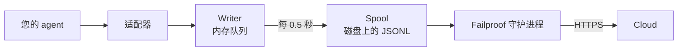

适用于您自己编写的 agent，或 Failproof AI 尚无适配器的框架。无需任何插桩操作：您只需直接发送事件即可。

这与四个框架适配器底层调用的 API 完全相同，适配器不过是对其的封装映射。

## 安装

```bash
pip install failproofai-sdk
```

无额外依赖，也无任何外部依赖项。

## 接入

```python
import failproofai_sdk

failproofai_sdk.configure(environment="production")

with failproofai_sdk.session():                 # 一次运行
    with failproofai_sdk.agent("planner"):      # 一个工作单元
        with failproofai_sdk.tool_call("search", input={"q": q}) as t:
            t.output = search(q)                # 一次工具调用
```

从上到下阅读，含义一目了然：

| 包裹在 | 表示 |
| --- | --- |
| `session()` | 这些事件属于同一次运行 |
| `agent()` | 某个组件正在执行工作——给它一个在列表中易于识别的名称 |
| `tool_call()` | 这是一次工具调用，以及它的返回结果 |

各作用域实际发送的事件：

| 作用域 | 发送事件 | 用途 |
| --- | --- | --- |
| `session()` | 无 | 绑定 session id，将一次运行分组 |
| `agent()` | `agent_start`、`agent_end` | 标记一个工作单元的起止 |
| `tool_call()` | `tool_use`、`tool_result` | 标记一次工具调用的起止并计时 |

内部的所有内容都可以省略 `session_id` 和 `agent_id`。作用域会将身份信息绑定到上下文变量中，每次事件调用都会自动读取，因此无需在函数间手动传递 id。

三者均支持 `async with` 和 `with`。

嵌套 agent 可构建调用树，`parent_id` 和深度会根据调用栈自动计算：

```python
with failproofai_sdk.session():
    with failproofai_sdk.agent("supervisor"):
        with failproofai_sdk.agent("researcher"):    # parent_id = "supervisor"
            ...
```

## 作用域如何关闭

`agent()` 会自动处理异常：

| 发生情况 | 事件 | 结果 |
| --- | --- | --- |
| 无异常 | `agent_end` | `success` |
| `Exception` | `error`，然后 `agent_end` | `failed` |
| `KeyboardInterrupt`、`SystemExit` | `error`，然后 `agent_end` | `failed` |
| `CancelledError`、`GeneratorExit` | 仅 `agent_end` | `cancelled` |

错误事件在 `agent_end` 之前发出，因为 dashboard 在 `agent_end` 时关闭 span，之后的任何内容都无法归属。取消操作不是失败，因此已取消的运行不会污染错误视图。异常始终会被重新抛出：作用域永远不会吞掉异常。

## 事件方法

六个系列，共十五个方法。大多数成对出现——发送开始事件，再发送结束事件，SDK 会自动计算两者之间的时间跨度。

| 系列 | 开始 | 结束 | 独立 |
| --- | --- | --- | --- |
| **Agents** | `agent_start` | `agent_end` | — |
| | `agent_pause` | `agent_resume` | — |
| **Models** | `model_request` | `model_response` | — |
| **Tools** | `tool_use` | `tool_result` | — |
| **Hooks** | `hook_triggered` | `hook_completed` | — |
| **Humans** | `human_wait` | `human_input` | `human_pause`、`human_interrupt` |
| **Failures** | — | — | `error` |

<Tip>
  在适用的场景下，优先使用作用域——`agent()` 和 `tool_call()`。即使主体代码抛出异常，它们也能保证关闭事件被发出。只有当控制流无法嵌套时（例如辅助函数中的模型调用），才直接使用这些方法。
</Tip>

<CodeGroup>
```python Agents
failproofai_sdk.event.agent_start(agent_id="planner", goal="find the cheapest flight")
failproofai_sdk.event.agent_end(agent_id="planner", outcome="success", summary="...")
failproofai_sdk.event.agent_pause(pause_id="p1", reason="awaiting approval")
failproofai_sdk.event.agent_resume(pause_id="p1")
```

```python Models
failproofai_sdk.event.model_request(
    model="gpt-4o-mini",
    messages=[{"role": "user", "content": "..."}],
    request_id="req-1",
)
failproofai_sdk.event.model_response(
    model="gpt-4o-mini",
    content="...",
    input_tokens=139,
    output_tokens=21,
    request_id="req-1",
    duration_ms=5202,
)
```

```python Tools
failproofai_sdk.event.tool_use(tool_name="search", tool_call_id="c1", input={"q": "..."})
failproofai_sdk.event.tool_result(tool_name="search", tool_call_id="c1", output="...")
```

```python Hooks
failproofai_sdk.event.hook_triggered(hook_name="retrieve", hook_id="h1", trigger_event="node")
failproofai_sdk.event.hook_completed(hook_name="retrieve", hook_id="h1", outcome="success")
```

```python Humans
failproofai_sdk.event.human_wait(input_id="i1", prompt="Approve?", options=["yes", "no"])
failproofai_sdk.event.human_input(input_id="i1", response="yes")
failproofai_sdk.event.human_pause(reason="operator paused the run", user_id="dana")
failproofai_sdk.event.human_interrupt(reason="operator stopped the run", at_step="step_3")
```

```python Failures
failproofai_sdk.event.error(
    error_type="TimeoutError",
    message="provider timed out after 30s",
    traceback="...",
)
```
</CodeGroup>

<Note>
  **两组人类事件方向相反。**

  | 方法 | 含义 |
  | --- | --- |
  | `human_wait` / `human_input` | **agent 询问人员**——审批门控、澄清性问题 |
  | `human_pause` / `human_interrupt` | **人员操作 agent**——停止按钮、操作员暂停 |

  没有任何框架会发出第二组事件，因此始终需要您自行发送。
</Note>

<Warning>
  **当模型调用并发执行时，请传入 `request_id`。** 如果不传，请求和响应将按每个 agent 的到达顺序配对——并发调用会错误配对，将每个响应关联到错误的请求上。
</Warning>

## 示例

直接调用 OpenAI API 的工具调用循环，不使用任何 agent 框架：

```python
import json

import failproofai_sdk
from openai import OpenAI

failproofai_sdk.configure(environment="production")
client = OpenAI()
MODEL = "gpt-4o-mini"


def turn(messages: list):
    """一次模型调用，由事件对标记起止。"""
    failproofai_sdk.event.model_request(model=MODEL, messages=messages)
    reply = client.chat.completions.create(model=MODEL, messages=messages, tools=TOOLS)
    usage = reply.usage
    failproofai_sdk.event.model_response(
        model=MODEL,
        content=reply.choices[0].message.content or "",
        input_tokens=usage.prompt_tokens,
        output_tokens=usage.completion_tokens,
    )
    return reply.choices[0].message


with failproofai_sdk.session():
    with failproofai_sdk.agent("inventory", goal="price report"):
        for _ in range(4):          # 有界循环；无界 agent 循环本身就是一个 bug
            message = turn(messages)
            if not message.tool_calls:
                break
            messages.append(message.model_dump(exclude_none=True))
            for call in message.tool_calls:
                args = json.loads(call.function.arguments or "{}")
                with failproofai_sdk.tool_call(
                    call.function.name, tool_call_id=call.id, input=args
                ) as handle:
                    handle.output = run_tool(call.function.name, args)
                messages.append({
                    "role": "tool",
                    "tool_call_id": call.id,
                    "content": str(handle.output),
                })
```

这会生成与适配器相同的六种事件类型。包含工具定义的完整可运行版本位于 SDK 仓库的 `docs/manual/examples/` 目录下。

## 线程与异步

上下文变量会自动传播到 asyncio 任务中，但不会传播到新线程，因为线程启动时上下文为空。

```python
# asyncio：无需额外操作
async with failproofai_sdk.session():
    await asyncio.gather(worker(1), worker(2))

# 线程：包裹可调用对象
pool.submit(failproofai_sdk.propagate(work), x)
threading.Thread(target=failproofai_sdk.propagate(work)).start()
loop.run_in_executor(None, failproofai_sdk.propagate(work), x)
```

不使用 `propagate()` 时，worker 的事件会抛出 `TypeError` 并提示修复方法，而不是落入无 session 的状态。这是有意为之：没有 session 的事件会被摄取层跳过并返回 `200`，而这正是身份层要防止的静默失败。

## 为没有适配器的框架接入

每个 agent 框架都提供相同的三个切入点。映射它们即可获得完整的追踪——已提供的四个适配器所做的不过如此。

| 切入点 | 您编写的内容 | 产生的事件 |
| --- | --- | --- |
| 运行 | `session()` + `agent()` | `agent_start`、`agent_end` |
| 每次工具调用 | `tool_call()` | `tool_use`、`tool_result` |
| 每次模型调用 | `model_*` 事件对 | `model_request`、`model_response` |

<Steps>
  <Step title="标记运行的起止">
    ```python
    with failproofai_sdk.session():
        with failproofai_sdk.agent(agent_name, goal=task):
            result = framework.run(task)
    ```
  </Step>
  <Step title="标记每次工具调用的起止">
    在框架中称为工具包装器或中间件的位置。

    ```python
    with failproofai_sdk.tool_call(name, input=args) as call:
        call.output = original(**args)
    ```
  </Step>
  <Step title="配对每次模型调用">
    ```python
    failproofai_sdk.event.model_request(model=model, messages=messages)
    reply = provider.complete(...)
    failproofai_sdk.event.model_response(
        model=model,
        content=text,
        input_tokens=usage.prompt_tokens,
        output_tokens=usage.completion_tokens,
    )
    ```
  </Step>
</Steps>

<Tip>
  **有值得观察的节点、步骤或中间件边界？** 用 hook 对——`hook_triggered` / `hook_completed`——来包裹，而不是嵌套 `agent()`。`agent_id` 是低基数维度，每个节点都创建一个条目会使其不可用。Hook span 的渲染方式相同，且能提供每个节点的延迟数据。
</Tip>

<Note>
  **手动接入与自动接入可以组合使用。** 在手写作用域内运行的适配器会加入该 session 并以该 agent 作为父节点，从而生成一棵统一的树，而不是两棵独立的树——当您将一个框架与已支持的框架混合接入时非常有用。
</Note>

<Accordion title="为什么没有 AutoGen 适配器">
  原因有两点，上述三个切入点就是解决方案：

  - `autogen-core` 自 2025 年 9 月起已停止维护。
  - AG2 没有提供等同于其他框架钩子的全局注册点，因此接入它意味着需要在每个构造点包裹每个 agent。

  手动映射切入点可以记录与正式适配器相同的事件，且精度相同。
</Accordion>

## 深入了解

以下是录制机制的工作原理，入门时无需阅读。

<AccordionGroup>

<Accordion title="各框架的录制内容示例" icon="eye">

每条录制的结构相同：一个 span 开始，工作嵌套其中，每个开始事件都有对应的结束事件。


**事件对**是基本单元。每个结束事件携带 SDK 从对应开始事件起计算的持续时间。

以下是每个框架的一次真实运行——来自 SDK 附带的示例，模型名称已规范化。注意单次调用能返回多少信息。

<Tabs>
  <Tab title="LangGraph">
    ```text 14 events
     1  +0.000s  agent_start       LangGraph
     2  +0.001s    hook_triggered  agent
     3  +0.002s      model_request   gpt-4o-mini
     4  +3.023s      model_response  gpt-4o-mini · 21 out-tok
     5  +3.024s    hook_completed  agent
     6  +3.024s    hook_triggered  tools
     7  +3.025s      tool_use      word_count
     8  +3.025s      tool_result   word_count · ok
     9  +3.025s    hook_completed  tools
    10  +3.026s    hook_triggered  agent
    11  +3.027s      model_request   gpt-4o-mini
    12  +5.717s      model_response  gpt-4o-mini · 5 out-tok
    13  +5.720s    hook_completed  agent
    14  +5.721s  agent_end         LangGraph · success
    ```

    节点转换为 hook 对，因此您可以获取每个节点的延迟数据，而不会让 agent 列表过于拥挤。
  </Tab>

  <Tab title="CrewAI">
    ```text 10 events
     1  +0.000s  agent_start       crew
     2  +0.050s    agent_start     analyst · under crew
     3  +0.057s      model_request   gpt-4o-mini
     4  +3.475s      model_response  gpt-4o-mini · 19 out-tok
     5  +3.478s      tool_use      lookup_metric
     6  +3.478s      tool_result   lookup_metric · ok
     7  +3.486s      model_request   gpt-4o-mini
     8  +5.694s      model_response  gpt-4o-mini · 9 out-tok
     9  +5.727s    agent_end       analyst · success
    10  +5.739s  agent_end         crew · success
    ```

    每个 agent 的 `role` 成为其 span 名称，因此延迟和 token 消耗可按角色细分。
  </Tab>

  <Tab title="LlamaIndex">
    ```text 26 events
     1  +0.000s  agent_start       Agent
     2  +0.001s    hook_triggered  init_run
     4  +0.501s    hook_triggered  setup_agent
     6  +0.503s    hook_triggered  run_agent_step
     7  +0.505s      model_request   gpt-4o-mini
     8  +3.083s      model_response  gpt-4o-mini · 18 out-tok
    10  +3.197s    hook_triggered  parse_agent_output
    12  +3.355s    hook_triggered  call_tool
    13  +3.355s      tool_use      city_population
    14  +3.355s      tool_result   city_population · ok
    16  +3.356s    hook_triggered  aggregate_tool_results
       ...                        第二次迭代
    26  +7.038s  agent_end         Agent · success
    ```

    agent 循环本身清晰可见，而不仅仅是其模型调用。
  </Tab>

  <Tab title="Pydantic AI">
    ```text 8 events
    1  +0.000s  agent_start       agent
    2  +0.001s    model_request   gpt-4o-mini
    3  +4.413s    model_response  gpt-4o-mini · 17 out-tok
    4  +4.415s    tool_use        population
    5  +4.415s    tool_result     population · ok
    6  +4.416s    model_request   gpt-4o-mini
    7  +8.118s    model_response  gpt-4o-mini · 6 out-tok
    8  +8.119s  agent_end         agent · success
    ```

    无 hook 对：Pydantic AI 没有可标记的节点或步骤边界。
  </Tab>

  <Tab title="Custom agents">
    ```text 6 events
    1  +0.000s  agent_start       main
    2  +0.000s    tool_use        population
    3  +0.000s    tool_result     population · ok
    4  +0.000s    model_request   gpt-4o-mini
    5  +0.000s    model_response  gpt-4o-mini · 3 out-tok
    6  +0.000s  agent_end         main · success
    ```

    这些事件由您自行发送。事件类型相同，精度相同——代价是需要在调用处手动添加。
  </Tab>
</Tabs>

</Accordion>

<Accordion title="Session 如何开始和结束" icon="circle-play">

**没有 session 结束事件。** Session 不是需要主动关闭的东西——它是一组共享同一 `session_id` 的事件。

状态由追踪的形态推导：

| 状态 | 条件 |
| --- | --- |
| `ongoing` | 至少有一个 span 仍处于开放状态 |
| `paused` | 存在没有对应 `agent_resume` 的 `agent_pause` |
| `error` | 没有开放的 span，且至少有一个事件失败 |
| `done` | 没有开放的 span，且没有失败 |

因此，当所有事件对都关闭时，session 就结束了。适配器会为您发出 `agent_end`，在销毁时关闭所有仍处于开放状态的内容并标记为不完整——崩溃的运行会以 `done` 状态结束，并显示一个明显的缺口，而不是永远挂起。

<Note>
  这就是为什么一个 session 可以跨越两次调用。LangGraph `interrupt()` 会暂停运行，根 span 故意保持开放，恢复调用时再将其关闭。两次调用属于同一个 session。
</Note>

</Accordion>

<Accordion title="身份标识：session_id、agent_id 及其生成方式" icon="fingerprint">

`session_id` 和 `agent_id` 在每个事件方法上都是可选的。省略时，它们从外层作用域解析：

```python
with failproofai_sdk.session():
    with failproofai_sdk.agent("planner"):
        failproofai_sdk.event.tool_use(tool_name="search", tool_call_id="c1")
```

显式传入时优先生效。如果没有绑定任何值也没有传入，调用会抛出 `TypeError` 并提示修复方法，而不是发出没有 session 的事件（摄取层会跳过该事件并返回 `200`）。

作用域将身份信息绑定到上下文变量中。这些变量会自动传播到 asyncio 任务，但不会传播到新线程——需要用 `failproofai_sdk.propagate()` 包裹 worker。

#### 各 id 的生成方

| Id | 生成方 | 说明 |
| --- | --- | --- |
| `session_id` | 您，或 SDK | `session("chat-42")` 按原样使用；省略时，SDK 生成 `uuid4().hex` |
| `agent_id` | 您，或框架 | 来自 `agent("analyst")`、CrewAI 的 `role`、`FunctionAgent.name`。看起来像 UUID 的值会被拒绝并替换 |
| `tool_call_id`、`hook_id`、`request_id` | 您，或框架 | 适配器复用框架自身的运行 id，这就是为什么事件对能在线程切换后仍能正确配对 |
| **事件 id** | **Cloud，在摄取时** | SDK 不发送 |
| **`dedup_key`** | **Cloud，在摄取时** | 组织、session、时间戳、类型和 payload 的哈希值。这是真正的身份标识——使重试的批次合并而不是重复 |

#### 适配器如何解析 `session_id`

先匹配者优先：

1. 显式传入的 `session_id` 选项
2. 每次调用的元数据
3. 外层 `session()` 作用域
4. 框架元数据
5. 框架自身的运行 id

在上述来源存在时，永远不会凭空生成——合成的 id 会将一次运行拆分为多个 session。

#### 保持 `agent_id` 低基数

它是每个 dashboard 视图的主要维度，也是 `LowCardinality(String)` 列。使用每次运行唯一的值会降低该列的效用，并在筛选下拉框中填满每次运行对应的条目。

适配器会为您维护该列：

| 框架提供的值 | 记录为 | 原因 |
| --- | --- | --- |
| `3f9a1c2b-…`（UUID） | `main` | 没有可保留的可读内容 |
| 较长的纯十六进制字符串 | `main` | 同上 |
| `agent-3f9a1c2b-…` | `agent` | 去除每次运行的 id，保留可读部分 |
| `agent-v2` | `agent-v2` | 短片段保持不变 |
| `step-3` | `step-3` | 同上 |

真实 id 保存在 `fw_agent_id` / `fw_run_id` 上，在那里仍可查询，但不会作为维度。

<Warning>
  **此保护仅针对框架自动选择的标签。** 您自行传入的 `agent_id`——无论是传给 `event.*` 还是 `failproofai_sdk.agent(...)`——都会原样记录。静默改写显式参数比它所防止的基数问题更糟糕，因此请自行为 span 命名时注意命名规范。
</Warning>

</Accordion>

<Accordion title="事件类型分组——及各框架记录的内容" icon="table">

| 分组 | 事件 |
| --- | --- |
| Agents | `agent_start`、`agent_end`、`agent_pause`、`agent_resume` |
| Models | `model_request`、`model_response` |
| Tools | `tool_use`、`tool_result` |
| Hooks | `hook_triggered`、`hook_completed` |
| Humans | `human_wait`、`human_input`、`human_pause`、`human_interrupt` |
| Failures | `error` |

各框架记录的内容（基于上述运行示例）：

| 事件 | LangGraph | CrewAI | LlamaIndex | Pydantic AI | Custom |
| --- | :--: | :--: | :--: | :--: | :--: |
| Agent 开始和结束 | 是 | 是 | 是 | 是 | 您 |
| 模型请求和响应 | 是 | 是 | 是 | 是 | 您 |
| 工具使用和结果 | 是 | 是 | 是 | 是 | 您 |
| Hook 触发和完成 | 节点 | 任务 | 步骤 | — | 您 |
| 错误 | 是 | 是 | 是 | 是 | 自动 |
| 人员等待和输入 | 是 | 是 | 是 | — | 您 |
| Agent 暂停和恢复 | 是 | 是 | 是 | — | 您 |

破折号表示该框架没有此概念。`human_pause` 和 `human_interrupt` 描述的是*人员*对 agent 的操作，没有任何框架会发出这些事件——需要您自行发送。

</Accordion>

<Accordion title="事件对、关联与持续时间" icon="link">

事件从不单独出现。一个开始，一个结束，结束事件携带 SDK 从开始事件起计算的持续时间。

| 开始 | 结束 | 结束事件携带 |
| --- | --- | --- |
| `agent_start` | `agent_end` | `outcome`、`summary` |
| `model_request` | `model_response` | token 数、`stop_reason`、延迟 |
| `tool_use` | `tool_result` | `output` 或 `error`、持续时间 |
| `hook_triggered` | `hook_completed` | `outcome`、持续时间 |
| `agent_pause` | `agent_resume` | 暂停持续时间 |
| `human_wait` | `human_input` | 答案，以及人员响应所用时间 |

<Warning>
  有开始事件但没有结束事件，就是一个永不结束的 span。Session 会一直显示为运行中，其活动时长持续增长。这是手动接入时需要特别注意的失败模式。
</Warning>

#### 关联规则

- 在对应的完成事件中复用相同的 `tool_call_id`、`hook_id`、`pause_id` 或 `input_id`。
- SDK 会自动计算 `tool_result`、`hook_completed`、`agent_resume` 和 `human_input` 的 `duration_ms`。向这些方法传入该参数会抛出 `ValueError`。
- `duration_ms` **可以**传给 `model_response`，因为只有调用方才知道真实的提供商延迟。必须为整数——浮点数会在调用处抛出 `ValueError`，因为服务器将该列读取为无符号 32 位整数，其他类型会存储 NULL。
- 关联键按类型和 session 限定范围，因此工具调用和 hook 可以安全地共用同一个 id，两个并发 session 也可以复用相同的 id 而不冲突。关联键不按 agent 限定范围：在一个 agent 下开始、在另一个 agent 下关闭的事件对仍能正确关联，这在多 agent 框架中是常见情况。
- `request_id` 用于配对 `model_request` 和 `model_response`。不传时，模型事件按每个 agent 的顺序配对，并发调用会导致错误配对。
- 跨进程的事件对在下游仍能关联，但 SDK 无法计算其进程内持续时间。
- 待处理映射最多保存 10,000 个开始事件，满时驱逐最旧的条目。

</Accordion>

<Accordion title="包的内容，以及 instrument() 如何发现您的框架" icon="box">

安装 `failproofai-sdk` 会安装所有内容，包含全部四个适配器。extras 安装的是**框架**本身，而不是适配器。

```python
import failproofai_sdk        # 不加载标准库以外的任何内容
failproofai_sdk.instrument()  # 仅导入您实际需要的适配器
```

`import failproofai_sdk` 在契约上是零依赖的，通过两个测试强制保证：一个测试使用 `--no-deps` 安装构建好的 wheel，另一个测试确认没有任何框架出现在 `sys.modules` 中。

<Warning>
  不存在 `failproofai_sdk.crewai` 属性。适配器有意不暴露在顶层包上：访问它会作为属性访问的副作用导入框架，破坏零依赖承诺。请使用 `instrument()`。
</Warning>

```python
failproofai_sdk.instrument()              # 所有已导入的框架
failproofai_sdk.instrument("crewai")      # 指定一个，按名称
failproofai_sdk.uninstrument("crewai")    # 还原
```

| 名称 | 也接受 |
| --- | --- |
| `langchain` | `langgraph`、`langchain_core` |
| `crewai` | — |
| `llama_index` | `llamaindex`、`llama-index` |
| `pydantic_ai` | `pydantic-ai`、`pydanticai` |

自动检测读取 `sys.modules`，而不是已安装的包列表，因此已安装但从未导入的框架不会被接入，也不会被代为导入。要查看当前已接入的内容：

```python
from failproofai_sdk.integrations import active, available

available()   # ('crewai', 'langchain', 'llama_index', 'pydantic_ai')
active()      # ('langchain',)
```

<Note>
  **在未安装 CrewAI 的机器上调用 `instrument("crewai")` 不会抛出异常。** 它会记录一条警告并返回 `()`，因此缺少一个框架不会导致同时接入其他框架的进程崩溃。

  警告中包含底层的 `ImportError`，该消息会给出准确的安装命令——修复方法就在您的日志中，不会被隐藏。

  ```text
  ImportError: failproofai_sdk: cannot instrument 'crewai' because 'crewai.events'
  is not importable. Install it with:  pip install 'failproofai_sdk[crewai]'
  ```

  设置 `FAILPROOFAI_SDK_STRICT=1` 可改为抛出异常。该标志**只读取一次并缓存**，因此请在进程启动前导出，而不是在运行中途设置。
</Note>

<Warning>
  **`instrument()` 必须在框架导入*之后*调用。** 自动检测读取 `sys.modules`，因此在导入之前裸调用什么也找不到，不会安装任何内容，并返回 `()`。
</Warning>

<CodeGroup>
```python Wrong
import failproofai_sdk
failproofai_sdk.instrument()   # sys.modules 中还没有 langchain -> ()

import langchain               # 太晚了，什么都没有接入
```

```python Right
import langchain               # 先导入框架
import failproofai_sdk

failproofai_sdk.instrument()   # 找到了 -> ('langchain',)
```

```python Right, order-proof
import failproofai_sdk

# 按名称指定会按需导入适配器，因此在任何位置调用都有效。
failproofai_sdk.instrument("langchain")
```
</CodeGroup>

操作有误时，进程会在 SDK 已导入、适配器看似已安装的情况下运行，但**一个事件都不会发出**。SDK 会记录一条明确说明此情况的警告——当运行没有记录任何内容时，请先检查日志。

</Accordion>

<Accordion title="事件如何到达 Cloud" icon="cloud-upload">



| 阶段 | 职责 | 运行位置 |
| --- | --- | --- |
| 适配器 | 将框架回调转换为 15 种事件类型之一 | 您的进程 |
| Writer | 队列、批处理、原子写入 JSONL | 您的进程，后台线程 |
| Spool | 持久化交接，进程退出后仍存在 | 本地磁盘 |
| 守护进程 | 监视 spool，发送批次，删除已发送内容 | 您的机器 |
| Ingest | 分配行 id 和去重键，提升可查询列 | Cloud |

Spool 是安全保障：您的 agent 永远不会因网络而阻塞，Cloud 故障只会导致目录增大，而不是事件丢失。

每次刷新写入一个批次文件，先写 `.tmp`，然后 `fsync`，最后原子重命名：

```text
~/.failproofai/custom-agents/events/
  event-2026-08-20T10-15-00-123Z-48213-0.jsonl
```

守护进程只读取 `.jsonl`，因此永远不会读到写了一半的文件。文件名包含时间戳、进程 id 和序列号，因此两个进程在同一毫秒内刷新也不会冲突。队列上限为 10,000 个事件；超过后会丢弃最旧的事件并记录日志。

<Warning>
  **`collector.redact` 对 SDK 事件也默认为 `minimal`。** SDK 在将批次写入磁盘前进行脱敏，守护进程在上传前对相同内容执行同样的确定性处理，以确保来自旧版 SDK 的批次也受到保护。
</Warning>

守护进程在内存中对每个批次进行脱敏后再上传，不会重写已读取的 spool 文件。

| 事件 | 由谁写入 | minimal 脱敏在何处执行 |
| --- | --- | --- |
| CLI 会话记录 | 守护进程 | 守护进程写入批次之前 |
| Hook 活动 | 守护进程 | 守护进程写入批次之前 |
| **SDK 发出的所有内容** | **您的进程** | **SDK 写入批次之前，以及守护进程上传之前** |

仅当明确要求原始 payload 时才将 `collector.redact` 设为 `off`；SDK 和守护进程都遵循该设置。minimal 脱敏可识别常见的 API 密钥、bearer token、JWT 和密钥赋值，但无法识别任意敏感文本。

<Tip>
  **您可以在源头控制 payload，有两种方式：**

  - 在适配器上关闭内容捕获。**选项名称各不相同，且有一个适配器没有此选项**——这不是一个通用开关：
    - LangChain / LangGraph、Pydantic AI — `capture_content=False`
    - LlamaIndex — `capture_messages=False`
    - CrewAI — **完全没有内容开关**；它只读取 `session_id` 选项，因此提示词和补全内容始终会被记录。

    `instrument()` 会忽略适配器不支持的选项，因此传入错误的名称不会报错，也不会有任何效果。
  - 一开始就不要将密钥传给 `input=`。

  `collector.redact` 是纵深防御，而不是上述两者的替代方案。
</Tip>

<Warning>
  **spool 目录为空是正常状态。** 不要用它来确认投递情况。
</Warning>

守护进程在发送后的毫秒内删除每个批次文件，因此 `ls` 会与收集器竞争，只能看到您发送内容的一小部分——与 SDK 什么都没记录的情况无法区分。

要确认事件是否真正送达，请查看 dashboard。要观察 spool 填充过程，请先停止守护进程。

</Accordion>

<Accordion title="接入失败时的情况" icon="triangle-alert">

每个回调都运行在一个包装器内，该包装器的唯一职责是重新抛出异常，因此您的调用恰好位于一个 `try` 中，SDK 所做的一切都在其外部。

| 发生情况 | 结果 |
| --- | --- |
| 某个 hook 抛出异常 | 记录一次并附带 traceback，您的调用不受影响 |
| 同一个 hook 抛出三次 | 该 hook 在进程剩余时间内被禁用，并记录一行错误 |
| 设置了 `FAILPROOFAI_SDK_STRICT=1` | 异常会被重新抛出 |
| 框架版本超出测试范围 | 警告一次，但仍继续接入 |
| 某个功能缺失 | 仅禁用该 hook，不影响整个适配器 |

默认行为在生产环境中是正确的，但在调试时是错误的，因为它只能证明"没有崩溃"。设置 `FAILPROOFAI_SDK_STRICT=1` 可让被吞掉的失败变得明显。

</Accordion>

</AccordionGroup>

## 常见问题

<AccordionGroup>
  <Accordion title="某个 span 永不结束">
    开始事件没有对应的结束事件：`model_request` 没有 `model_response`，或 `tool_use` 没有 `tool_result`。请使用作用域，即使主体代码抛出异常也能保证事件对完整。如果直接调用事件方法，请使用 `try` 和 `finally`。
  </Accordion>

  <Accordion title="传入 duration_ms 抛出 ValueError">
    持续时间由对应的开始事件起计算，因此在 `tool_result`、`hook_completed`、`agent_resume` 和 `human_input` 上传入该参数会被拒绝。在 `model_response` 上可以接受，因为只有您才知道真实的提供商延迟，且必须为整数。
  </Accordion>

  <Accordion title="worker 线程中的事件抛出 TypeError">
    该线程从未继承上下文。请用 `failproofai_sdk.propagate()` 包裹可调用对象。参见[线程与异步](#threads-and-async)。
  </Accordion>

  <Accordion title="额外字段消失或覆盖了已有内容">
    额外字段最后合并，因此与真实字段（如 `model` 或 `outcome`）同名的字段会覆盖它并改变存储列。请为您的字段加上命名空间；适配器使用 `fw_` 前缀。
  </Accordion>

  <Accordion title="agent 筛选器中有数千个条目">
    `agent_id` 是低基数维度，而您将运行 id 放入了其中。请使用角色或节点名称，将真实 id 放在 payload 字段中。
  </Accordion>
</AccordionGroup>

## 下一步

<Columns cols={3}>
  <Card title="工作原理" icon="workflow" href="/zh/reference/custom-agents">
    事件对、id、session 生命周期与投递机制。
  </Card>
  <Card title="阅读追踪" icon="route" href="/zh/sessions/read-a-trace">
    在刚捕获的 session 中跟踪因果关系。
  </Card>
  <Card title="框架适配器" icon="plug" href="/zh/start/integrations">
    LangGraph、CrewAI、LlamaIndex 和 Pydantic AI。
  </Card>
</Columns>